# API 文档

---

## 0. 阅读导引

### 0.1 项目 API 分层

PacPlay 的 API 按编译边界分为三层：

| 层 | 目录 | 可见性 |
|---|------|--------|
| 公共层 | `include/` + `src/common/`（含 `include/tui/` + `src/common/tui/`） | 服务端和客户端共享。头文件在 `include/`，实现在 `src/common/` |
| 服务端层 | `src/server/` | 仅供服务端链接。内部头文件在 `src/server/` 下 |
| 客户端层 | `src/client/` | 仅供客户端链接。内部头文件在 `src/client/` 下 |

测试代码链接所有三层（除 `main.o`），可调用任意模块的公开函数。

### 0.2 编译与运行前置依赖

- **编译器**：`clang`（默认 GNU17 方言）
- **链接库**：`libssl` + `libcrypto`（OpenSSL 3.x）、`libsqlcipher`、`libncursesw`（TUI 框架终端渲染）、`libpthread`（TUI 消息队列互斥锁）
- **静态分析**：`clang-tidy` + `run-clang-tidy`（`clang-tools` 包）
- **构建**：`make all`（自动执行分析 + 编译）
- **测试**：`make test`（编译并运行所有测试套件）

### 0.3 文档约定

- **返回值**：各模块定义自己的 `*_SUCC` / `*_FAIL` 宏，通常 `0` 为成功、`-1`（或负数）为失败
- **payload 所有权**：除明确声明外，调用者传入的 payload 不会被函数释放；函数内部分配的资源由调用者按文档释放
- **Packet 生命周期**：`packet->payload` 须在调用 `packetInit`、`packetDeserialize`、`packetRecv` 前为 `NULL`；使用后须调用 `packetClear()`
- **SQLCipher 密钥**：数据库加密密钥在 `dbClose()` / `clientCloseDB()` 中通过 `OPENSSL_cleanse` 擦除

### 0.4 推荐阅读路径

- **想理解网络协议**：先读 [1.2 Protocol](#12-protocol-通信协议)，再读 [4.3-4.6](#第四部分端到端协议与典型业务流程) 端到端流程
- **想理解认证**：先读 [1.1 Crypto](#11-crypto-密码学模块) 的密码/TOTP，再读 [2.2 Server Auth](#22-server-auth-认证模块) 和 [3.1 Client](#31-client-客户端主模块)
- **想理解数据库**：先读 [2.7 Server Database](#27-server-database-服务端数据库模块)，再读 [3.6 Client Database](#36-client-database-客户端数据库模块)
- **想理解终端 UI**：先读 [1.7 TUI](#17-tui-终端-ui-框架) 的消息系统、控件类型和事件循环
- **想调用 API**：直接看 [第五部分：可运行示例](#第五部分可运行示例)
- **想知道函数释放规则**：查 [6.2 内存所有权表](#62-内存所有权表)

---

## 第一部分：公共 API（`include/`）

本部分涵盖 `include/` 目录下所有对客户端与服务端均可见的公共接口，包括密码学、网络协议、日志、容器、通用工具及公共数据库辅助。

---

### 1.1 Crypto 密码学模块

**接口**：`include/crypto.h`
**实现**：`src/common/crypto.c`

提供与上层协议解耦的低级密码学封装，涵盖 AES-256-GCM 认证加密、ECDH（X25519）密钥协商、HKDF-SHA256 密钥派生、密码学安全随机数生成、Base32 编解码、TOTP 与密码哈希。所有实现基于 OpenSSL 3.x EVP API。

#### 1.1.1 常量与宏

| 宏 | 值 | 说明 |
|----|-----|------|
| `CRYPTO_SUCC` | `0` | 函数执行成功 |
| `CRYPTO_FAIL` | `-1` | 通用失败 |
| `CRYPTO_AUTH_FAIL` | `-2` | AES-GCM 认证标签校验失败 |
| `AES_GCM_KEY_LEN` | `32` | AES-256 对称密钥长度（字节） |
| `AES_GCM_NONCE_LEN` | `12` | GCM 模式 nonce 长度（字节） |
| `AES_GCM_TAG_LEN` | `16` | GCM 认证标签长度（字节） |
| `ECDH_SHARED_SECRET_SIZE` | `32` | X25519 ECDH 协商后的共享密钥长度（字节） |
| `ECDH_PUBLIC_KEY_SIZE` | `32` | X25519 原始公钥长度（字节） |
| `HKDF_INFO_AES_KEY` | `"PacPlay-AESKey"` | HKDF-SHA256 派生 AES 密钥时使用的固定 info 字符串 |
| `HASH_SALT_LEN` | `16` | 密码哈希 salt 长度（字节，128 位） |
| `HASH_SHA256_LEN` | `32` | SHA-256 摘要长度（字节） |
| `TOTP_STEP_SECONDS` | `30` | TOTP 时间步长（秒） |
| `TOTP_DIGITS` | `6` | TOTP 验证码位数 |
| `TOTP_WINDOW` | `1` | 允许的时间窗口偏移（±1，共 3 个窗口） |
| `TOTP_HMAC_SHA1_LEN` | `20` | SHA-1 HMAC 输出长度（字节） |
| `TOTP_CODE_RANGE` | `1000000` | 6 位验证码取模基数（10^TOTP_DIGITS） |
| `TOTP_MIN_KEY_LEN` | `16` | TOTP 共享密钥最小长度（字节，RFC 4226: ≥128 位） |

#### 1.1.2 类型定义

**AESGCMKey**

```c
typedef struct {
    uint8_t key[AES_GCM_KEY_LEN];
    uint8_t nonce[AES_GCM_NONCE_LEN];
} AESGCMKey;
```

AES-256-GCM 的完整密钥材料。`key` 为 32 字节对称密钥；`nonce` 为每次加密前须单独生成的 12 字节随机值。**禁止在任何两次加密操作中复用同一 nonce。**

**AESGCMBuffer**

```c
typedef struct {
    uint8_t *data;
    size_t capacity;
    size_t len;
} AESGCMBuffer;
```

通用字节缓冲区描述符。`data` 指向由调用者或 `aesGCMBufferInit()` 分配的内存。`encryptAESGCM()` 与 `decryptAESGCM()` 均要求调用者预先为输入/输出缓冲区分配足够内存，函数本身不执行动态分配。

**AESGCMCipher**

```c
typedef struct {
    AESGCMBuffer buffer;
    uint8_t tag[AES_GCM_TAG_LEN];
} AESGCMCipher;
```

AES-GCM 加密输出结构。`buffer.data` 存放密文，`tag` 存放 16 字节认证标签。

#### 1.1.3 缓冲区辅助函数

| 函数 | 说明 | 前置条件 | 释放责任 |
|------|------|----------|----------|
| `int aesGCMBufferInit(AESGCMBuffer *buf, size_t capacity)` | 分配 `capacity` 字节堆内存 | `buf != NULL`，`capacity > 0` | `aesGCMBufferDeinit(buf)` |
| `void aesGCMBufferDeinit(AESGCMBuffer *buf)` | 释放 `buf->data`，指针置为 NULL | `buf != NULL` | 可重复调用，NULL 安全 |

#### 1.1.4 AES-256-GCM 加密与解密

**`int encryptAESGCM(const AESGCMBuffer *plaintext, const AESGCMBuffer *aad, const AESGCMKey *key, AESGCMCipher *output)`**

- **前置条件**：`output->buffer.data` 已预分配至少 `plaintext->len` 字节
- **AAD**：可为 NULL 或零长度，用于绑定额外认证数据（如协议头字段）
- **失败原因**：参数非法、OpenSSL 内部错误
- **返回**：`CRYPTO_SUCC` 成功，`CRYPTO_FAIL` 失败

**`int decryptAESGCM(const AESGCMCipher *cipher, const AESGCMBuffer *aad, const AESGCMKey *key, AESGCMBuffer *plaintext)`**

- **前置条件**：`plaintext->data` 已预分配至少 `cipher->buffer.len` 字节
- **AAD 匹配**：必须与加密时使用的 AAD 逐字节相同，否则返回 `CRYPTO_AUTH_FAIL`
- **返回**：`CRYPTO_SUCC`（解密成功）、`CRYPTO_AUTH_FAIL`（认证失败）或 `CRYPTO_FAIL`（参数非法）
- **安全**：认证失败时不清空输出缓冲区内容，调用者不应使用认证失败的输出

#### 1.1.5 ECDH（X25519）密钥协商

| 函数 | 说明 | 释放责任 |
|------|------|----------|
| `EVP_PKEY *genECDHKeypair(void)` | 生成 X25519 临时密钥对 | 调用者 `EVP_PKEY_free()` |
| `int exportECDHPublicKey(EVP_PKEY *pkey, uint8_t pub[32])` | 提取 32 字节原始公钥，可直接网络传输 | 调用者提供 buffer |
| `EVP_PKEY *importECDHPeerPublicKey(const uint8_t pub[32])` | 将对端 32 字节公钥重构为 `EVP_PKEY *` | 调用者 `EVP_PKEY_free()` |
| `int deriveECDHSharedSecret(EVP_PKEY *localKey, EVP_PKEY *peerKey, uint8_t secret[32])` | 执行 ECDH 协商，输出 32 字节共享密钥 | 调用者提供 buffer；失败时 secret 被清零 |

#### 1.1.6 HKDF-SHA256 密钥派生

**`int deriveAESKey(const uint8_t *sharedSecret, size_t secretLen, AESGCMKey *outKey)`**

基于 HKDF（RFC 5869）将共享密钥派生为 AES-256-GCM 密钥。使用固定 info 字符串 `HKDF_INFO_AES_KEY`，空 salt（RFC 5869 §2.2 默认）。成功时 `outKey->nonce` 已清零，调用者须在每次加密前重新生成随机 nonce。

- **失败原因**：输入为 NULL、`secretLen == 0`、OpenSSL 内部错误
- **失败行为**：`outKey` 被安全清零

#### 1.1.7 安全随机数

**`int cryptoRandomBytes(uint8_t *buf, int len)`**

填充密码学安全随机字节。内部调用 OpenSSL `RAND_bytes`。

#### 1.1.8 密码哈希与验证

**`char *hashPassword(const char *password)`**

对明文密码执行 salted SHA-256 哈希。输出格式为 `"salt_hex:hash_hex"` 的堆分配字符串。调用者负责 `free()` 返回的字符串。

**`int verifyPassword(const char *password, const char *storedHash)`**

使用 `CRYPTO_memcmp` 常量时间比较校验明文密码与存储哈希。不区分"格式错误"与"密码不匹配"，统一返回 `CRYPTO_FAIL` 防止用户枚举。

#### 1.1.9 Base32 编解码（RFC 4648）

实现 RFC 4648 Base32 编码，使用标准字母表 `ABCDEFGHIJKLMNOPQRSTUVWXYZ234567`。编码输出不含 `=` 填充字符。

**`int base32Encode(const uint8_t *data, size_t len, char **outStr)`**

将 `len` 字节的原始二进制数据编码为堆分配的 NUL 终止 Base32 字符串。调用者负责 `free(*outStr)`。

**`int base32Decode(const char *encoded, uint8_t **outData, size_t *outLen)`**

将 Base32 字符串解码为原始二进制字节。大小写不敏感，自动忽略空白字符。拒绝 `=` 填充符及非法字符。调用者负责 `free(*outData)`。

#### 1.1.10 TOTP 基于时间的一次性密码（RFC 6238）

实现基于 HMAC-SHA1 的 TOTP 算法，生成 6 位数字验证码。30 秒时间步长，±1 窗口容差（共 3 个窗口）。

**`int verifyTOTPCode(const char *secret, int *code)`**

验证用户输入的 TOTP 验证码。`secret` 为 Base32 编码的共享密钥。`*code` 为输入的 6 位整数。支持 ±1 窗口容差。

**`int generateOTPAuthURI(const char *secret, const char *username, char **outURI)`**

生成 `otpauth://totp/` 格式的密钥 URI 字符串，可直接嵌入 QR 码供认证器应用扫描导入。调用者负责 `free(*outURI)`。

#### 1.1.11 密码学模块关系

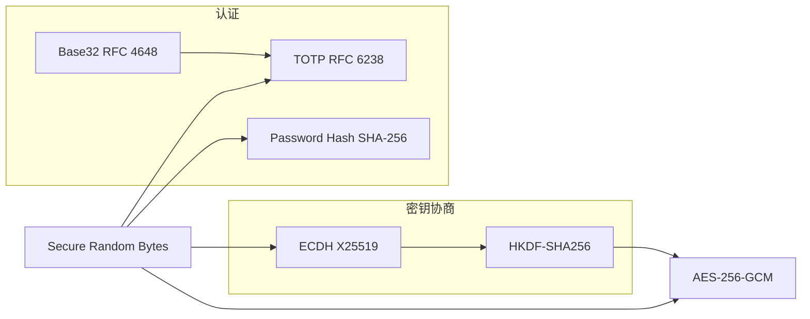

#### 1.1.12 端到端加密密钥协商推荐流程

```
Alice                              Bob
  │                                 │
  ├─ genECDHKeypair()               ├─ genECDHKeypair()
  ├─ exportECDHPublicKey() ────────►├─ importECDHPeerPublicKey()
  ├─ importECDHPeerPublicKey() ◄────├─ exportECDHPublicKey()
  │                                 │
  ├─ deriveECDHSharedSecret()       ├─ deriveECDHSharedSecret()
  ├─ deriveAESKey()                 ├─ deriveAESKey()
  │                                 │
  ▼ 握手完成，AES 密钥就绪          ▼
```

通信时的 nonce 管理：每次调用 `encryptAESGCM()` 前用 `cryptoRandomBytes()` 生成新的 12 字节 nonce，与密文一并传送。复用 nonce 将被破坏 GCM 的安全性。

---

### 1.2 Protocol 通信协议

**接口**：`include/protocol.h`
**实现**：`src/common/protocol.c`

实现 PacPlay 的二进制网络协议栈，涵盖 TCP 套接字管理、数据包序列化、AES-256-GCM 加密传输、阻塞式收发及加密收发高阶原语。

#### 1.2.1 常量与宏

| 宏 | 值 | 说明 |
|----|-----|------|
| `PROTOCOL_SUCC` | `0` | 函数执行成功 |
| `PROTOCOL_FAIL` | `-1` | 通用失败 |
| `PROTOCOL_AUTH_FAIL` | `-2` | AES-GCM 认证标签校验失败或 AAD 不匹配 |
| `MAX_PAYLOAD_LEN` | `1024` | 明文载荷最大字节数 |
| `LOGIN_USERNAME_LEN` | `32` | 用户名固定长度（NUL 终止） |
| `LOGIN_NICKNAME_LEN` | `32` | 昵称固定长度（NUL 终止） |
| `AES_PACKET_EXTRA_LEN` | `28` | 加密后额外开销：nonce(12) + tag(16) |
| `BACKLOG` | `1024` | `listen()` 连接队列长度 |
| `NULL_SOCKETFD` | `-1` | 无效套接字描述符标识 |
| `PACKET_MAGIC` | `0x5050504D` | 包魔术字，ASCII `PPPM` |
| `TOTP_SETUP_SECRET_LEN` | `33` | TOTP 设置响应中 Base32 密钥的固定长度（32 字符 + NUL） |
| `CLIENT_DB_KEY_LEN` | `32` | 每用户客户端数据库加密密钥长度（256 位） |

#### 1.2.2 类型定义

**SocketFD**

```c
typedef int SocketFD;
```

套接字文件描述符别名。取值为 `NULL_SOCKETFD` 表示无效或已关闭。

**PacketType 与 MessageType**

```c
typedef enum {
    PlaintextPacket = 1,
    AES256GCMPacket
} PacketType;

typedef enum {
    MsgKeyExchangeReq = 1, MsgKeyExchangeResp,   // 密钥交换
    MsgLoginReq, MsgLoginResp,                    // 认证
    MsgRegisterReq, MsgRegisterResp,              // 注册
    MsgTOTPSetupReq, MsgTOTPSetupResp,            // TOTP 设置
    MsgTOTPVerifyReq, MsgTOTPVerifyResp,          // TOTP 二次验证
    MsgDBKeyReq, MsgDBKeyResp,                    // 数据库密钥交换
    MsgRoomListReq, MsgRoomListResp,              // 房间管理
    MsgCreateRoom, MsgCreateRoomResp,
    MsgJoinRoom, MsgJoinRoomResp,
    MsgChat,                                       // 聊天
    MsgLogout, MsgHeartbeat,                      // 会话生命周期
    MsgGameStart, MsgGameStop                      // 游戏（预留）
} MessageType;
```

枚举值自 1 起连续递增，网络传输中存储为 `uint32_t`。

**PacketHeader（紧凑打包，无填充，20 字节）**

```c
#pragma pack(push, 1)
typedef struct {
    uint32_t magic;        // PACKET_MAGIC (0x5050504D)
    uint32_t packetType;   // PlaintextPacket 或 AES256GCMPacket
    uint32_t messageType;  // MessageType 枚举值
    uint32_t payloadLength;
    uint32_t sequenceID;   // 单调递增序列号
} PacketHeader;
#pragma pack(pop)
```

`#pragma pack(push, 1)` 确保跨平台二进制兼容。长度为 `sizeof(uint32_t) * 5 = 20` 字节。**严禁随意增删字段**，修改前必须同步更新所有序列化逻辑和大小相关测试。

**Packet**

```c
typedef struct {
    PacketHeader header;
    uint8_t *payload;
} Packet;
```

完整数据包结构。`header` 与 `payload` 内存不连续，`payload` 由 `packetInit()` 或 `packetRecv()` / `packetDeserialize()` 动态分配。

#### 1.2.3 载荷结构

**KeyExchangePacketPayload**

```c
#pragma pack(push, 1)
typedef struct {
    uint8_t publicKey[ECDH_PUBLIC_KEY_SIZE]; // 32 字节 X25519 公钥
} KeyExchangePacketPayload;
#pragma pack(pop)
```

**LoginRequestPayload**（`MsgLoginReq` 专用）

```c
#pragma pack(push, 1)
typedef struct {
    char username[LOGIN_USERNAME_LEN];  // 32 字节，NUL 终止
    char password[];                    // FAM，长度 = payloadLength - 32
} LoginRequestPayload;
#pragma pack(pop)
```

**RegisterRequestPayload**（`MsgRegisterReq` 专用）

```c
#pragma pack(push, 1)
typedef struct {
    char username[LOGIN_USERNAME_LEN];  // 32 字节
    char nickname[LOGIN_NICKNAME_LEN];  // 32 字节
    char password[];                    // FAM，长度 = payloadLength - 64
} RegisterRequestPayload;
#pragma pack(pop)
```

**LoginResponsePayload**（`MsgLoginResp` 专用）

```c
#pragma pack(push, 1)
typedef struct {
    uint32_t uid;                        // 服务器分配的 UID (0 = 失败)
    char username[LOGIN_USERNAME_LEN];   // 用户名
    char nickname[LOGIN_NICKNAME_LEN];   // 昵称
    uint8_t totpEnabled;                 // 0 = 未登记 TOTP, 1 = 已登记
} LoginResponsePayload;
#pragma pack(pop)
```

**TOTPSetupRespPayload**（`MsgTOTPSetupResp` 专用）

```c
#pragma pack(push, 1)
typedef struct {
    char secret[TOTP_SETUP_SECRET_LEN];  // 32 字符 Base32 + NUL
} TOTPSetupRespPayload;
#pragma pack(pop)
```

**TOTPVerifyPayload**（`MsgTOTPVerifyResp` 专用）

```c
#pragma pack(push, 1)
typedef struct {
    uint32_t code;  // 6 位 TOTP 验证码
} TOTPVerifyPayload;
#pragma pack(pop)
```

**DBKeyRespPayload**（`MsgDBKeyResp` 专用）

```c
#pragma pack(push, 1)
typedef struct {
    uint8_t cdbkey[CLIENT_DB_KEY_LEN];  // 256 位 CDBKey
} DBKeyRespPayload;
#pragma pack(pop)
```

**ChatPacketPayload**（客户端→服务端聊天消息）

```c
#pragma pack(push, 1)
typedef struct {
    int64_t timestamp;       // UTC UNIX 时间戳
    uint8_t message[];       // FAM
} ChatPacketPayload;
#pragma pack(pop)
```

**ChatBroadcastPayload**（服务端→房间成员广播）

```c
#pragma pack(push, 1)
typedef struct {
    uint32_t uid;       // 发送者 UID
    uint64_t msgId;     // 全局唯一消息 ID
    int64_t timestamp;  // UTC UNIX 时间戳
    uint8_t message[];  // FAM
} ChatBroadcastPayload;
#pragma pack(pop)
```

#### 1.2.4 网络连接管理

| 函数 | 说明 | 失败原因 |
|------|------|----------|
| `SocketFD serverSetup(uint16_t port)` | 在指定端口创建 TCP 监听套接字 | 端口占用、socket/bind/listen 失败 |
| `SocketFD clientSetup(const char *addr, uint16_t port)` | 创建 TCP 客户端套接字并连接 | 地址解析失败、连接拒绝、超时 |
| `void socketClose(SocketFD *socketFD)` | 关闭套接字并重置为 `NULL_SOCKETFD` | 重复调用安全 |

#### 1.2.5 数据包序列化与反序列化

**`int packetSerialize(const Packet *packet, uint8_t *buffer, size_t bufferSize, size_t *serializedSize)`**

- **前置条件**：`bufferSize >= sizeof(PacketHeader) + packet->header.payloadLength`
- **输出**：`*serializedSize` 为实际写入字节数
- **注意**：不执行加密——若需加密须先调用 `packetAESEncrypt()`

**`int packetDeserialize(const uint8_t *buffer, size_t bufferSize, Packet *packet)`**

- **前置条件**：`packet->payload == NULL`（否则返回 `PROTOCOL_FAIL`）
- **行为**：校验魔术字 → 校验长度 → 为 payload 动态分配内存
- **释放**：成功后须调用 `packetClear()`

#### 1.2.6 数据包加密与解密

**`int packetAESEncrypt(Packet *packet, uint8_t key[AES_GCM_KEY_LEN])`**

- **前置条件**：`packet->packetType == PlaintextPacket`，`packet->payload != NULL`
- **行为**：原地加密。生成 12 字节随机 nonce，构造 AAD 为 64 位值 `(payloadLength << 32) | sequenceID`，替换 payload 为 `nonce(12B) || ciphertext || tag(16B)`，设 `packetType = AES256GCMPacket`
- **失败时**：原 payload 保留不释放

**`int packetAESDecrypt(Packet *packet, uint8_t key[AES_GCM_KEY_LEN])`**

- **前置条件**：`packet->packetType == AES256GCMPacket`
- **行为**：解析 nonce、ciphertext、tag → 解密 → AAD 二次校验
- **返回**：`PROTOCOL_SUCC`、`PROTOCOL_AUTH_FAIL`（认证失败，payload 已清除）或 `PROTOCOL_FAIL`
- **注意**：AAD 比较防止重放攻击（sequenceID 和 payloadLength 必须匹配）

#### 1.2.7 数据包生命周期管理

**`int packetInit(Packet *packet, MessageType msgType, uint32_t seqID, PacketType pktType, const void *data, size_t dataLen)`**

- **前置条件**：`packet->payload == NULL`，`dataLen <= MAX_PAYLOAD_LEN`
- **行为**：为 payload 分配内存并复制 `data`（`data` 为 NULL 且 `dataLen > 0` 时失败）
- **释放**：成功后须调用 `packetClear()`

**`void packetClear(Packet *packet)`**

释放 `packet->payload` 指向的动态内存并将其置为 NULL。对同一 Packet 重复调用安全（double-free 安全）。

#### 1.2.8 网络收发

| 函数 | 说明 | 前置条件 |
|------|------|----------|
| `int packetSend(Packet *packet, SocketFD socketFD)` | 分两次发送 header 与 payload，处理部分写 | `packet->payload != NULL` |
| `int packetRecv(Packet *dest, SocketFD socketFD)` | 阻塞接收，先收 header（校验 magic 与长度），再收 payload | `dest->payload == NULL` |

#### 1.2.9 加密收发高阶原语

**`int packetSendEncrypted(SocketFD fd, MessageType mt, uint32_t *seqID, uint8_t key[AES_GCM_KEY_LEN], const void *data, size_t dataLen)`**

组合 `packetInit` → `packetAESEncrypt` → 递增 `*seqID` → `packetSend` → `packetClear` 的完整加密发送流程。调用者持有 `seqID`，函数仅在成功路径递增。

**`int packetRecvEncrypted(SocketFD fd, Packet *out, uint8_t key[AES_GCM_KEY_LEN])`**

组合 `packetRecv` → 校验 `AES256GCMPacket` → `packetAESDecrypt`。失败时自动清理 payload。这是服务端与客户端通信模块的底层基元。

#### 1.2.10 数据包布局

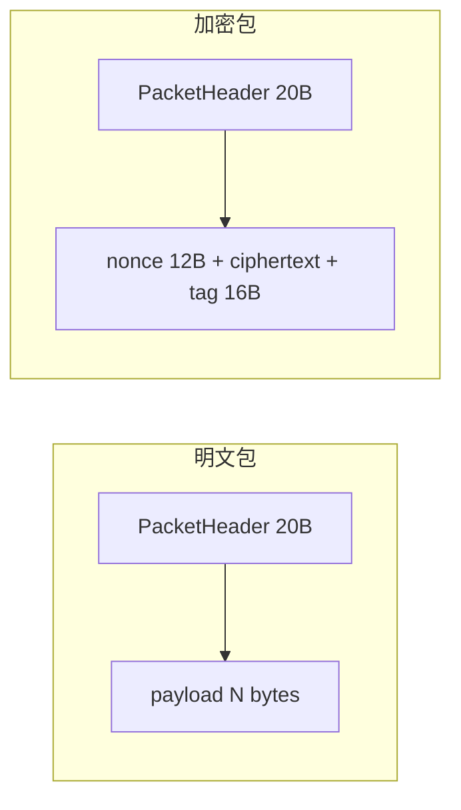

加密流程：

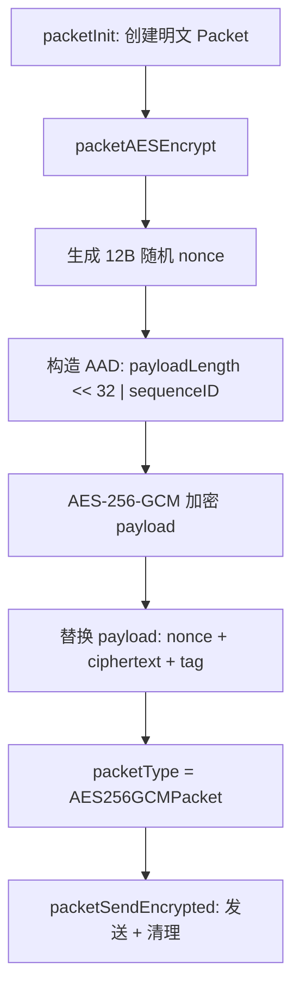

#### 1.2.11 协议数据流总览

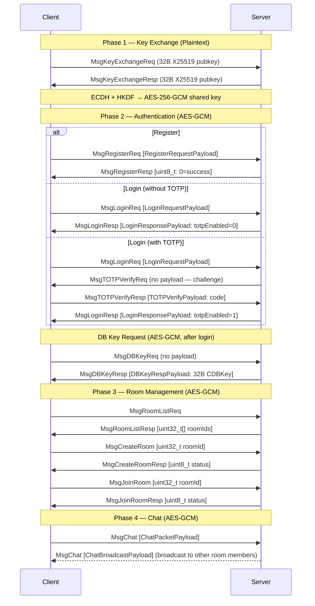

---

### 1.3 Log 日志模块

**接口**：`include/log.h`
**实现**：`src/common/log.c`

轻量日志库，修改自 [rxi/log.c](https://github.com/rxi/log.c)。**这是 vendored 第三方代码，不应随意修改。** 全部日志输出使用 `LOG_TRACE`…`LOG_FATAL` 宏，禁止使用 `printf`。

#### 1.3.1 日志级别

`LogLevelTrace < LogLevelDebug < LogLevelInfo < LogLevelWarn < LogLevelError < LogLevelFatal`

低于全局阈值的消息直接丢弃。默认阈值 `LogLevelTrace`（全部输出）。

#### 1.3.2 便捷宏

| 宏 | 等价展开 |
|----|----------|
| `LOG_TRACE(fmt, ...)` | `logLog(LogLevelTrace, __FILE__, __LINE__, fmt, ...)` |
| `LOG_DEBUG(fmt, ...)` | `logLog(LogLevelDebug, __FILE__, __LINE__, fmt, ...)` |
| `LOG_INFO(fmt, ...)` | `logLog(LogLevelInfo, __FILE__, __LINE__, fmt, ...)` |
| `LOG_WARN(fmt, ...)` | `logLog(LogLevelWarn, __FILE__, __LINE__, fmt, ...)` |
| `LOG_ERROR(fmt, ...)` | `logLog(LogLevelError, __FILE__, __LINE__, fmt, ...)` |
| `LOG_FATAL(fmt, ...)` | `logLog(LogLevelFatal, __FILE__, __LINE__, fmt, ...)` |

所有宏自动捕获 `__FILE__` 和 `__LINE__`，输出至 `stderr`，格式：`HH:MM:SS LEVEL file.c:line: message`。

#### 1.3.3 配置函数

| 函数 | 作用 |
|------|------|
| `void logSetLevel(LogLevel level)` | 设置全局最低输出级别 |
| `void logSetQuiet(bool enable)` | `true` 关闭 stderr 输出，不影响回调 |
| `int logAddFp(FILE *fp, LogLevel level)` | 添加文件输出（带完整日期格式），最多 32 个回调槽 |

#### 1.3.4 线程安全

库内部无锁。多线程场景须通过 `logSetLock()` 注册锁回调。

---

### 1.4 Container 容器模块

**接口**：`include/container.h`

提供泛型环形缓冲区（QueueT）与泛型动态数组（ArrayT）。所有函数均为 `static inline`，通过 `QUEUE_DEFINE(T)` 或 `ARRAY_DEFINE(T)` 在编译期生成，无需单独的 `.c` 实现文件。

#### 1.4.1 常量与宏

| 宏 | 值 | 说明 |
|----|-----|------|
| `QUEUE_DEFAULT_CAPACITY` | `8` | Queue 默认初始容量（`Init()` 参数为 `USE_DEFAULT_CAPACITY(0)` 时使用） |
| `ARRAY_DEFAULT_CAPACITY` | `8` | Array 默认初始容量（`Init()` 参数为 `USE_DEFAULT_CAPACITY(0)` 时使用） |
| `USE_DEFAULT_CAPACITY` | `0` | `Init()` 哨兵值，传入后回退至对应容器的默认容量 |

#### 1.4.2 类型定义

**ContainerRes**

```c
typedef enum { ContainerSucc = 0, ContainerFail = -1 } ContainerRes;
```

所有容器函数的返回类型。`ContainerSucc`（0）表示成功，`ContainerFail`（-1）表示失败（越界、分配失败、空容器访问等）。

#### 1.4.3 泛型环形缓冲区（QueueT）

通过 `QUEUE_DEFINE(T)` 单步预处理器宏为任意数据类型生成类型安全的循环队列实现。

**命名规则**：`##` 拼接运算符将类型名 `T` 直接拼入标识符：

| 宏调用 | 结构体名 | Init 函数名 | Push 函数名 |
|--------|----------|-------------|-------------|
| `QUEUE_DEFINE(Int)` | `QueueInt` | `queueIntInit` | `queueIntPush` |
| `QUEUE_DEFINE(Packet)` | `QueuePacket` | `queuePacketInit` | `queuePacketPush` |

**公开 API**：

| 函数 | 签名 | 说明 |
|------|------|------|
| `queueTInit` | `ContainerRes queueTInit(QueueT *self, size_t capacity)` | 分配堆内存，初始化队列。`capacity=USE_DEFAULT_CAPACITY(0)` 时取默认值 8 |
| `queueTDeinit` | `void queueTDeinit(QueueT *self)` | 释放 buf，NULL 安全 |
| `queueTFront` | `ContainerRes queueTFront(QueueT *self, T *result)` | 拷贝队首至 `*result` |
| `queueTPush` | `ContainerRes queueTPush(QueueT *self, T data)` | 写入队尾，满时自动扩容 |
| `queueTPop` | `ContainerRes queueTPop(QueueT *self)` | 队首指针前进，不返回值 |
| `queueTIsEmpty` | `bool queueTIsEmpty(QueueT *self)` | 队空返回 `true` |

**注意**：`queueTPop` 不返回被弹出元素的值。需先 `Front` 后 `Pop`。

#### 1.4.4 泛型动态数组（ArrayT）

通过 `ARRAY_DEFINE(T)` 为任意数据类型生成类型安全的动态数组实现，支持 O(1) 随机访问。

**命名规则**：

| 宏调用 | 结构体名 | Init 函数名 | PushBack 函数名 |
|--------|----------|-------------|------------------|
| `ARRAY_DEFINE(Int)` | `ArrayInt` | `arrayIntInit` | `arrayIntPushBack` |
| `ARRAY_DEFINE(Packet)` | `ArrayPacket` | `arrayPacketInit` | `arrayPacketPushBack` |

**公开 API**：

| 函数 | 签名 | 说明 |
|------|------|------|
| `arrayTInit` | `ContainerRes arrayTInit(ArrayT *self, size_t capacity)` | 分配堆内存，初始化数组。`capacity=USE_DEFAULT_CAPACITY(0)` 时取默认值 8 |
| `arrayTDeinit` | `void arrayTDeinit(ArrayT *self)` | 释放 buf，NULL 安全 |
| `arrayTSet` | `ContainerRes arrayTSet(ArrayT *self, size_t index, T data)` | 写 `buf[index]`，`index >= size` 拒绝 |
| `arrayTGet` | `ContainerRes arrayTGet(ArrayT *self, size_t index, T *dest)` | 读 `buf[index]` 至 `*dest`（值拷贝） |
| `arrayTIndex` | `ContainerRes arrayTIndex(ArrayT *self, size_t index, T **dest)` | 返回 `buf[index]` 的指针引用至 `*dest`（非值拷贝），O(1)。`index >= size` 拒绝 |
| `arrayTPushBack` | `ContainerRes arrayTPushBack(ArrayT *self, T data)` | 追加至尾部，满时自动扩容（2x） |
| `arrayTPopBack` | `ContainerRes arrayTPopBack(ArrayT *self)` | size 递减，不返回值 |
| `arrayTSize` | `size_t arrayTSize(const ArrayT *self)` | 返回当前元素个数 |

#### 1.4.5 队列与数组的对比

| 特性 | QueueT（环形缓冲区） | ArrayT（动态数组） |
|------|---------------------|-------------------|
| 存储结构 | 环形，head/tail 双指针 | 连续存储，按索引直接访问 |
| 扩容方式 | malloc 新缓冲 + 逐元素拷贝 | realloc（可原地扩展） |
| 随机访问 | 不支持 | 支持 O(1) `Set`/`Get`/`Index`（指针引用） |
| 适用场景 | FIFO 消息队列、生产者-消费者 | 动态集合、随机存取缓存 |

---

### 1.5 Utils 工具模块

**接口**：`include/utils.h`
**实现**：`src/common/utils.c`

提供通用辅助宏、跨平台工具函数与十六进制字符转换。

**通用宏**

```c
#define MAX(a, b) ((a) > (b) ? (a) : (b))
#define MIN(a, b) ((a) < (b) ? (a) : (b))
```

**跨平台目录创建**

```c
#ifdef _WIN32
#define PLATFORM_MKDIR(path, mode) _mkdir(path)
#else
#define PLATFORM_MKDIR(path, mode) mkdir(path, mode)
#endif
```

被服务端与客户端数据库模块共享使用，消除重复宏定义。

**十六进制字符转换**

```c
int hexCharToNibble(char c);
```

将单个十六进制字符（`0-9`、`a-f`、`A-F`）转换为其 4 位半字节值（0-15），非法字符返回 -1。被 MK 解析、测试及 `crypto.c` 内部共享使用。

**时间戳**

```c
time_t getCurrentTimestamp(void);
```

获取当前 UTC UNIX 时间戳（秒）。内部调用 ISO C `time()` 函数。失败返回 `(time_t)-1`。

**密码读入**

```c
size_t readPasswordMasked(char *buf, size_t bufsize);
```

从 stdin 读取密码并显示 `*` 掩码。当 stdin 为终端时禁用 echo，处理退格键。非终端时退化为普通 `fgets()`。

---

### 1.6 Database 公共数据库辅助模块

**接口**：`include/db.h`
**实现**：`src/common/db.c`

为服务端与客户端数据库模块提供共享的 SQLite statement 辅助函数。`src/common/db.c` 在构建时分别编译进 `build/server/common/` 与 `build/client/common/`，两端独立链接。

**`int dbExec(sqlite3 *dbHandle, const char *sql, const char *context)`**

一次性执行 SQL 语句（prepare → step → finalize）。context 用于错误日志标识。成功返回 `DB_EXEC_SUCC`（0），失败返回 `DB_EXEC_FAIL`（-1）。

**`void dbFinalize(sqlite3_stmt **stmt)`**

Finalize 非 NULL 缓存的 prepared statement 并将其置为 NULL。NULL 输入安全。
---

### 1.7 TUI 终端 UI 框架

**接口**：`include/tui/tuiapp.h`、`include/tui/control.h`、`include/tui/tuimsg.h`、`include/tui/ncurses_wrapper.h`
**实现**：`src/common/tui/tuiapp.c`、`src/common/tui/control.c`

基于 ncurses 宽字符库（`libncursesw`）的保留模式终端 GUI 框架，提供消息驱动的事件循环、控件继承体系和页面导航机制。TUI 模块位于 `src/common/` 下，编译时双方独立链接，供服务端管理面板与客户端交互界面共用。当前框架已完整实现，但 `client.c` / `server.c` 尚未集成 API。

#### 1.7.1 常量与宏

| 宏 | 值 | 说明 |
|----|-----|------|
| `BTN_LABEL_MAXLEN` | `20` | 按钮标签文本最大字符数（含 NUL） |
| `INPUTBOX_BUF_MAX_LEN` | `128` | 输入框内部缓冲区最大字符数 |
| `LABEL_TEXT_MAXLEN` | `128` | 标签文本最大字符数 |
| `NCURSES_WIDECHAR` | `1` | 启用 ncurses 宽字符支持（`ncurses_wrapper.h` 内部定义） |

#### 1.7.2 消息系统

**接口**：`include/tui/tuimsg.h`

TUI 框架采用消息传递架构，所有用户输入和系统事件均封装为 `TuiMsg` 结构体，经线程安全的消息队列统一分发至各控件的虚表回调。

**MsgType**

```c
typedef enum {
    MsgCursorPrev = 1, MsgCursorNext,   // Tab / Shift-Tab 焦点导航
    MsgFocusEnter, MsgFocusLeave,       // 控件焦点获得 / 失去
    MsgInput,                            // 键盘输入（arg1.input 含字符码）
    MsgResize,                           // 终端尺寸变更
    MsgFetch,                            // 容器请求子控件指针（arg1.fetchRecv 回调）
    MsgRefresh                           // 触发控件重绘
} MsgType;
```

枚举值自 1 起连续递增，仅用于进程内消息分发，不涉及网络传输。

**MsgArg**

```c
typedef union {
    size_t index;                                    // 导航 / 索引参数
    int input;                                       // 输入字符码（MsgInput 专用）
    void (*fetchRecv)(void *self, void *child);      // MsgFetch 回调
} MsgArg;
```

**TuiMsg**

```c
typedef struct {
    MsgType type;
    MsgArg arg1;
    MsgArg arg2;
} TuiMsg;
```

消息队列通过 `QUEUE_DEFINE(TuiMsg)` 实例化为 `QueueTuiMsg`。

#### 1.7.3 控件类型

**接口**：`include/tui/control.h`

控件体系采用 C 语言手动虚表多态：所有控件共享 `Control` 基类，派生类型通过首字段嵌入 `Control` 实现向上转型。

**ControlVTable** — 控件虚表

```c
struct ControlVTable {
    void (*destruct)(void *self);                      // 析构回调：释放控件私有资源
    void (*draw)(void *self);                          // 绘制回调：渲染至 ncurses 窗口
    void (*msgHandler)(void *self, TuiMsg msg);        // 消息处理回调
};
```

**ControlCommonMsgHandlers** — 通用消息回调

```c
struct ControlCommonMsgHandlers {
    void (*resize)(void *self);    // 终端尺寸变更时的重布局回调
    void (*refresh)(void *self);   // 触发控件刷新（#undef refresh 避免宏冲突）
};
```

**Control** — 基类控件

```c
struct Control {
    ControlVTable vtable;                       // 虚表
    WINDOW *windowHandler;                      // ncurses 窗口句柄
    ControlCommonHandlers commonMsgHandlers;    // resize / refresh 回调
    size_t index;         // 控件注册索引（自 1 起，0 为根节点保留）
    bool isPage;          // 是否为页面（顶层容器，控制可见性与页面切换）
    int x, y;             // 控件在父窗口内的相对坐标
    int width, height;    // 控件尺寸
    bool focusable;       // 是否可获取焦点
    bool focused;         // 当前是否持有焦点
    bool isContainer;     // 是否可包含子控件
    size_t childCount;    // 已注册子控件数量
    bool takeOverInput;   // 是否拦截键盘输入（聚焦时不向上冒泡）
    bool visible;         // 是否可见（不可见时跳过渲染和焦点导航）
};
```

`ControlPage` 为 `Control` 的类型别名（`isPage = true`），作为页面树的根节点。

**GridLayoutMethod**

```c
typedef enum { LayoutVertical = 1, LayoutHorizontal } GridLayoutMethod;
```

**ControlButton** — 按钮

```c
struct ControlButton {
    Control base;                                // 基类
    char *text;                                  // 标签文本（≤ BTN_LABEL_MAXLEN）
    void (*onClick)(ControlButton *self);        // 点击回调
};
```

**ControlGrid** — 网格布局容器

```c
struct ControlGrid {
    Control base;                    // 基类（isContainer = true）
    GridLayoutMethod layoutMethod;   // 垂直或水平流式布局方向
    struct {
        size_t vertical;
        size_t horizontal;
    } margin;                        // 子控件间距（行/列方向）
    size_t layoutCounter;            // 已布局子控件计数
    size_t layoutAccCol;             // 累计列宽（水平布局用）
    size_t layoutAccRow;             // 累计行高（垂直布局用）
    void (*layout)(void *self, void *child) // 布局方式（若为 NULL 则使用默认布局方式）
};
```

子控件加入后按布局方向自动排列；终端 resize 时触发重新布局。

**ControlLabel** — 标签

```c
struct ControlLabel {
    Control base;      // 基类
    char *text;        // 显示文本（≤ LABEL_TEXT_MAXLEN）
};
```

**ControlInputBox** — 输入框

```c
struct ControlInputBox {
    Control base;                      // 基类（takeOverInput = true）
    char *buf;                         // 内部缓冲区（≤ INPUTBOX_BUF_MAX_LEN）
    size_t curLen;                     // 当前已输入字符数
    size_t viewBegin;                  // 可视区域起始偏移（水平滚动）
    size_t curLoc;                     // 光标位置（字符索引）
    void (*submit)(ControlInputBox *self);  // 回车提交回调
};
```

支持退格删除、光标移动和水平滚动。Enter（`\n`）、`\r`、小键盘 Enter（`KEY_ENTER`）均触发 `submit` 回调并释放输入焦点（`takeOverInput = false`）；Esc（`\e`）仅释放焦点不提交。

#### 1.7.4 应用生命周期 API

**接口**：`include/tui/tuiapp.h`

| 函数 | 说明 | 前置条件 |
|------|------|----------|
| `void tuiAppInit(void)` | 初始化 ncurses（`initscr`、cbreak、noecho、keypad、`curs_set(0)`）、消息队列和控件注册表 | 仅可调用一次，失败时 `endwin()` 后退出 |
| `void tuiAppControlRegister(Control *entry, Control *parent)` | 将控件注册到全局控件树的指定父节点下。`parent=NULL` 注册为根节点的直接子节点 | `tuiAppInit` 已调用；注册顺序决定 DFS 渲染顺序 |
| `void tuiAppStart(ControlPage *orgPage)` | 以 `orgPage` 为初始页面启动事件循环（阻塞）。循环捕获键盘输入与 SIGWINCH 信号，封装为 `TuiMsg` 统一分发 | 控件树已构建完成 |
| `void tuiAppStop(void)` | 退出事件循环，释放 ncurses 环境（`endwin`） | 仅事件循环内有效；线程安全 |
| `void tuiAppChangePage(ControlPage *entry)` | 切换当前页面。销毁旧页面树的所有 ncurses 窗口，实例化新页面树，重建导航链。`entry=NULL` 回到 `stdscr` | 仅事件循环内调用 |
| `void tuiAppPushMessage(TuiMsg msg)` | 将消息推入全局消息队列 | 线程安全（`pthread_mutex_t` 保护） |
| `void tuiAppRefresh(void)` | 立即触发全量重绘（推送 `MsgRefresh`） | 可在任意上下文调用 |

#### 1.7.5 控件构造函数

**接口**：`include/tui/control.h`

所有构造函数的 `draw`、`resize`、`refresh` 参数均可传入对应类型的默认实现（见 §1.7.7），也可传入自定义函数指针。`onClick`（按钮）和 `submit`（输入框）为**必须**提供的业务回调。

| 函数 | 签名 | 关键参数 |
|------|------|----------|
| `controlPageConstruct` | `void controlPageConstruct(ControlPage *self)` | 设置 `isPage=true`、`isContainer=true`、`visible=false`（切换至页面后自动设为 true） |
| `controlButtonConstruct` | `void controlButtonConstruct(ControlButton *self, int height, int width, int y, int x, const char *text, void (*draw)(...), void (*onClick)(...), void (*resize)(...), void (*refresh)(...))` | `text` 为按钮显示文字，`focusable=true` |
| `controlGridConstruct` | `void controlGridConstruct(ControlGrid *self, int height, int width, int y, int x, GridLayoutMethod layoutMethod, size_t hmargin, size_t vmargin, void (*draw)(...), void (*resize)(...), void (*refresh)(...), void(*layout)(...))` | `isContainer=true`、`focusable=false`，`layoutMethod` 决定子控件排列方向 |
| `controlLabelConstruct` | `void controlLabelConstruct(ControlLabel *self, const char *text, int y, int x, void (*draw)(...), void (*resize)(...), void (*refresh)(...))` | `text` 为显示内容，`focusable=false` |
| `controlInputBoxConstruct` | `void controlInputBoxConstruct(ControlInputBox *self, int width, int y, int x, void (*draw)(...), void (*resize)(...), void (*submit)(...), void (*refresh)(...))` | `focusable=true`、`takeOverInput=false`（获得焦点时自动设为 true）。`submit` 为回车提交回调。`width < 3` 时自动钳位为 3 |

**内存分配**：`text`（Button / Label）通过内部 `strdup` 分配，`buf`（InputBox）通过内部 `malloc` 分配，均在 `controlDeinstantiate` → `vtable.destruct` 中释放。调用者不负责释放这些资源。

#### 1.7.6 控件生命周期函数

**接口**：`include/tui/control.h`

| 函数 | 说明 | 释放责任 |
|------|------|----------|
| `void controlInstantiate(Control *self, Control *parent)` | 创建 ncurses `WINDOW`（`derwin` / `newwin`），调用 `tuiAppControlRegister` 注册进控件树，向父节点转发 `MsgFocusEnter` / `MsgFocusLeave` | `controlDeinstantiate(self)` |
| `void controlDeinstantiate(Control *self)` | 销毁 ncurses 窗口（`delwin`），从注册表移除，调用 `vtable.destruct` 释放私有资源（`strdup` 的 text、`malloc` 的 buf 等） | 不可重复调用 |

#### 1.7.7 默认绘制函数

**接口**：`include/tui/control.h`

所有默认绘制函数签名为 `void (*)(void *self)`，通过虚表 `draw` 指针间接调用，内部强制转换为对应控件类型。

| 函数 | 说明 |
|------|------|
| `controlButtonDraw(void *self)` | 居中绘制标签文本。获取焦点时反色显示 |
| `controlGridDraw(void *self)` | 绘制网格边框（`wborder`）。子控件数为 0 时显示 `"No items"` 占位文本 |
| `controlLabelDraw(void *self)` | 在控件窗口左上角绘制标签文本 |
| `controlInputBoxDraw(void *self)` | 绘制输入框边框，展示 `buf` 中 `viewBegin` 起始的可见段，在 `curLoc` 位置显示块状光标 |

#### 1.7.8 架构与消息流

**控件继承树**

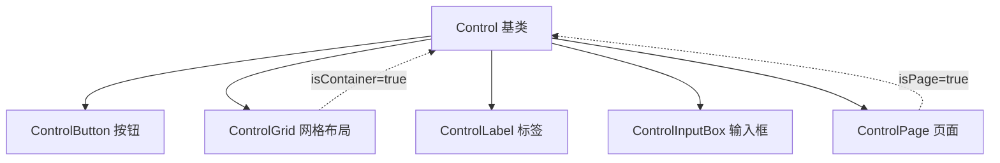

**消息流与渲染循环**

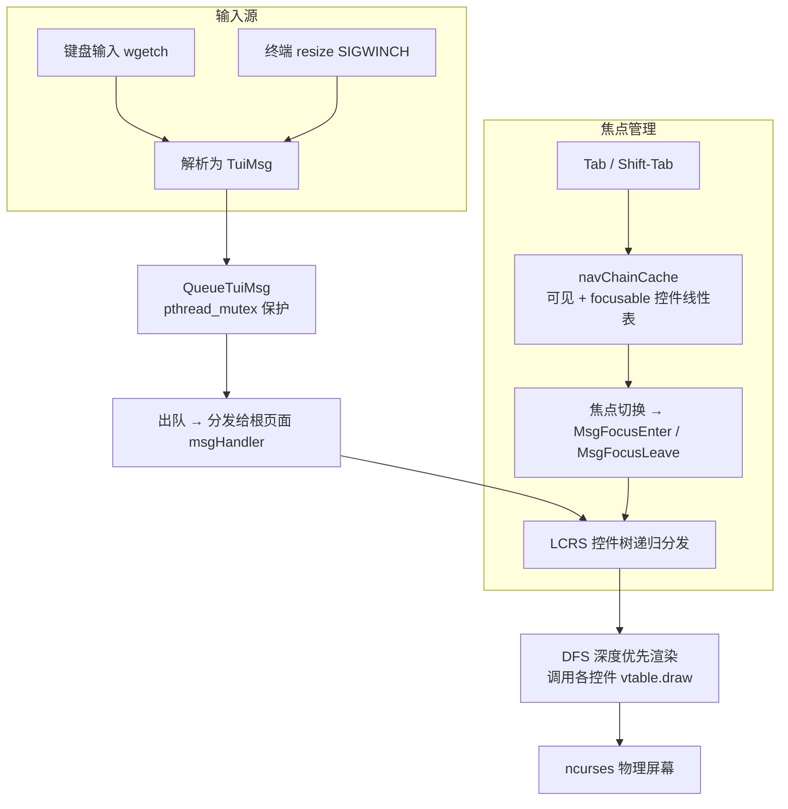

**运行模型**：

1. **注册阶段**：`tuiAppControlRegister()` 将控件以 LCRS（左孩子右兄弟）树结构注册，`index` 自 1 递增分配，0 为根节点保留
2. **事件循环**：`tuiAppStart()` 进入阻塞循环，`wgetch(stdscr)` 捕获键盘输入，`SIGWINCH` 信号触发 resize 消息
3. **消息分发**：所有事件封装为 `TuiMsg` 推入 `QueueTuiMsg`（`pthread_mutex_t` 保护出入队），主循环逐条出队并分发给当前根页面的 `vtable.msgHandler`
4. **DFS 渲染**：页面 `msgHandler` 深度优先递归控件树，调用各控件的 `vtable.draw` 将内容写入 ncurses 窗口缓冲区
5. **焦点导航**：Tab / Shift-Tab 遍历 `navChainCache`（仅包含 `visible=true` 且 `focusable=true` 的控件），循环切换焦点
6. **页面切换**：`tuiAppChangePage()` 销毁旧页面树的所有窗口和私有资源，实例化新页面树，重建导航链并触发全量重绘

**线程安全**：消息队列的入队/出队操作通过 `pthread_mutex_t` 保护，允许其他线程通过 `tuiAppPushMessage()` 安全投递消息。其他全局状态（控件注册表、事件循环）不具备线程安全性。

**当前集成状态**：TUI 框架已完整编译于服务端与客户端二进制中（Makefile 自动链接 `-lncursesw -lpthread`），但 `client.c` 和 `server.c` 尚未调用其 API。框架可通过独立链接的测试程序或 TUI 专用入口直接使用。

---

## 第二部分：服务端 API（`src/server/`）

服务端采用模块化架构，各领域功能拆分为独立模块。`server.c` 仅负责生命周期、事件循环与顶层调配。

### 架构总览

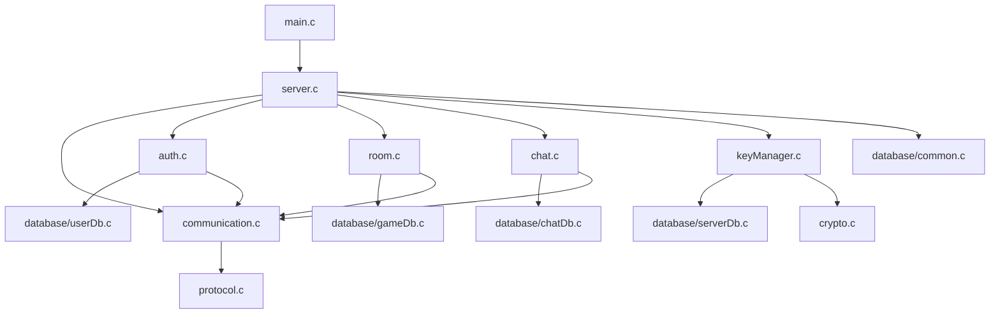

---

### 2.1 Server 服务端主模块

**接口**：`src/server/server.h`
**实现**：`src/server/server.c`

实现 `select()` 驱动的单线程事件循环，管理客户端连接生命周期与顶层请求分派。业务处理委托给各领域模块（auth、room、chat）。

#### 2.1.1 常量

| 宏 | 值 | 说明 |
|----|-----|------|
| `USERNAME_MAX_LEN` | `32` | 用户名最大长度（含 NUL），与 `LOGIN_USERNAME_LEN` 通过 `_Static_assert` 强制同步 |
| `NICKNAME_MAX_LEN` | `32` | 昵称最大长度（含 NUL），与 `LOGIN_NICKNAME_LEN` 强制同步 |
| `MAX_CLIENTS_PER_ROOM` | `10` | 单个房间最大客户端数 |
| `SERVER_INITIAL_CAPACITY` | `16` | 动态 session / room 数组初始容量 |
| `SERVER_SELECT_TIMEOUT_US` | `16000` | `select()` 超时时间（微秒，约 60 Hz） |
| `DB_ENC_KEY_LEN` | `32` | 每数据库 SQLCipher 加密密钥长度（256 位） |
| `SERVER_SUCC` | `0` | 操作成功 |
| `SERVER_FAIL` | `-1` | 操作失败 |

#### 2.1.2 类型定义

**User**

```c
typedef struct {
    char username[USERNAME_MAX_LEN];
    char nickname[NICKNAME_MAX_LEN];
    uint32_t uid;
    char *password;    // 明文密码（内部哈希后存储）
    char *totpSecret;  // Base32 编码的 TOTP 共享密钥，或 NULL
} User;
```

**SessionState**

```c
typedef enum {
    SessionKeyExchange = 0,
    SessionLogin,
    SessionTOTPVerify,
    SessionRoom,
    SessionChat
} SessionState;
```

**ClientSession**

```c
typedef struct {
    SocketFD fd;
    SessionState state;
    AESGCMKey aesKey;
    User currentUser;
    uint32_t currentRoomId;  // 0 表示不在任何房间
    uint32_t seqID;
} ClientSession;
```

**ActiveRoom**

```c
typedef struct {
    uint32_t roomId;
    ClientSession *members[MAX_CLIENTS_PER_ROOM];
    int memberCount;
} ActiveRoom;
```

**Server**

```c
typedef struct {
    SocketFD listenFd;
    ClientSession **clients;
    int clientCount;
    int clientCapacity;
    ActiveRoom **activeRooms;
    int activeRoomCount;
    int activeRoomCapacity;
    struct DB *userDB;
    struct DB *chatDB;
    struct DB *gameDB;
    struct DB *serverDB;
    bool freshKeysGenerated;
    uint8_t dekKey[AES_GCM_KEY_LEN];
    uint8_t userDbEncKey[DB_ENC_KEY_LEN];
    uint8_t chatDbEncKey[DB_ENC_KEY_LEN];
    uint8_t gameDbEncKey[DB_ENC_KEY_LEN];
} Server;
```

#### 2.1.3 服务端状态机

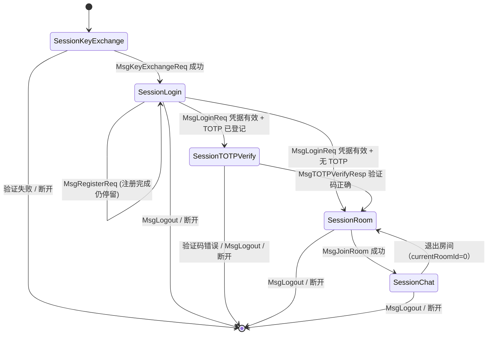

#### 2.1.4 公开 API

| 函数 | 说明 | 失败原因 |
|------|------|----------|
| `int serverInit(Server *s, uint16_t port)` | 创建监听套接字，打开 ServerDB，调 `serverInitKeys` 加载/生成密钥，打开加密数据库 | 端口占用、MK 错误、DB 损坏 |
| `int serverInitKeys(Server *s)` | 首次生成 MK/DEK/DBKeys 信封加密存入 ServerDB；已有则提示 MK 解密加载 | MK 输入错误、信封损坏 |
| `void serverRun(Server *s)` | 进入 `select()` 事件循环：accept → 分派 → disconnect | — |
| `void serverCleanup(Server *s)` | 断开所有客户端、释放 session/room、关闭数据库、安全擦除所有密钥 | — |

#### 2.1.5 请求分派逻辑

`processClient()` 负责接收和解密数据包，然后按 `SessionState` + `MessageType` 分派到各领域模块：

| 状态 | 允许的消息类型 | 分派目标 |
|------|---------------|----------|
| `SessionKeyExchange` | `MsgKeyExchangeReq` | `serverExchangeAESKey()` → `communication.c` |
| `SessionLogin` | `MsgLoginReq` | `serverHandleLogin()` → `auth.c` |
| `SessionLogin` | `MsgRegisterReq` | `serverHandleRegister()` → `auth.c` |
| `SessionLogin` | `MsgLogout` | `handleLogout()` → `server.c` |
| `SessionTOTPVerify` | `MsgTOTPVerifyResp` | `serverHandleTOTPVerify()` → `auth.c` |
| `SessionTOTPVerify` | `MsgLogout` | `handleLogout()` → `server.c` |
| `SessionRoom` | `MsgRoomListReq` | `serverHandleRoomList()` → `room.c` |
| `SessionRoom` | `MsgCreateRoom` | `serverHandleRoomCreate()` → `room.c` |
| `SessionRoom` | `MsgJoinRoom` | `serverHandleRoomJoin()` → `room.c` |
| `SessionRoom` | `MsgTOTPSetupReq` | `serverHandleTOTPSetup()` → `auth.c` |
| `SessionRoom` | `MsgDBKeyReq` | `serverHandleDBKeyReq()` → `auth.c` |
| `SessionRoom` | `MsgLogout` | `handleLogout()` → `server.c` |
| `SessionChat` | `MsgChat` | `serverHandleChatMessage()` → `chat.c` |
| `SessionChat` | `MsgHeartbeat` | `handleHeartbeat()` → `server.c` |
| `SessionChat` | `MsgTOTPSetupReq` | `serverHandleTOTPSetup()` → `auth.c` |
| `SessionChat` | `MsgDBKeyReq` | `serverHandleDBKeyReq()` → `auth.c` |
| `SessionChat` | `MsgLogout` | `handleLogout()` → `server.c` |

**协议违规**：在任何状态下接收到非预期的消息类型，服务端记录警告并断开该客户端。密钥交换完成后，所有数据包必须为 `AES256GCMPacket` 类型。

---

### 2.2 Server Auth 认证模块

**接口**：`src/server/auth.h`
**实现**：`src/server/auth.c`

封装服务端登录、注册、TOTP 设置/验证及 DB 密钥请求的全部业务逻辑。

#### 2.2.1 公开 API

| 函数 | 说明 | 前置条件 | 失败时行为 |
|------|------|----------|-----------|
| `int serverHandleLogin(Server *s, ClientSession *cs, const Packet *pkt)` | 解析 `MsgLoginReq` → `verifyUser` → TOTP 挑战/登录响应 | `cs->state == SessionLogin` | 发送状态 1 响应，不断开连接 |
| `int serverHandleRegister(Server *s, ClientSession *cs, const Packet *pkt)` | 解析 `MsgRegisterReq` → `createUser` → 状态响应 | `cs->state == SessionLogin` | 发送状态 1 响应 |
| `int serverHandleTOTPSetup(Server *s, ClientSession *cs)` | 生成随机 TOTP 密钥 → Base32 编码 → DEK 加密存库 → 返回客户端 | TOTP 尚未设置 | 已设置时返回空 secret |
| `int serverHandleTOTPVerify(Server *s, ClientSession *cs, const Packet *pkt)` | 验证 TOTP 验证码，正确则发出 `MsgLoginResp` 完成登录 | `cs->state == SessionTOTPVerify` | 验证码错误关闭连接 |
| `int serverHandleDBKeyReq(Server *s, ClientSession *cs)` | 从 UserDB 读取并解密 CDBKey，通过 `MsgDBKeyResp` 返回 | 用户已登录 | 连接失败 |

#### 2.2.2 认证流程图

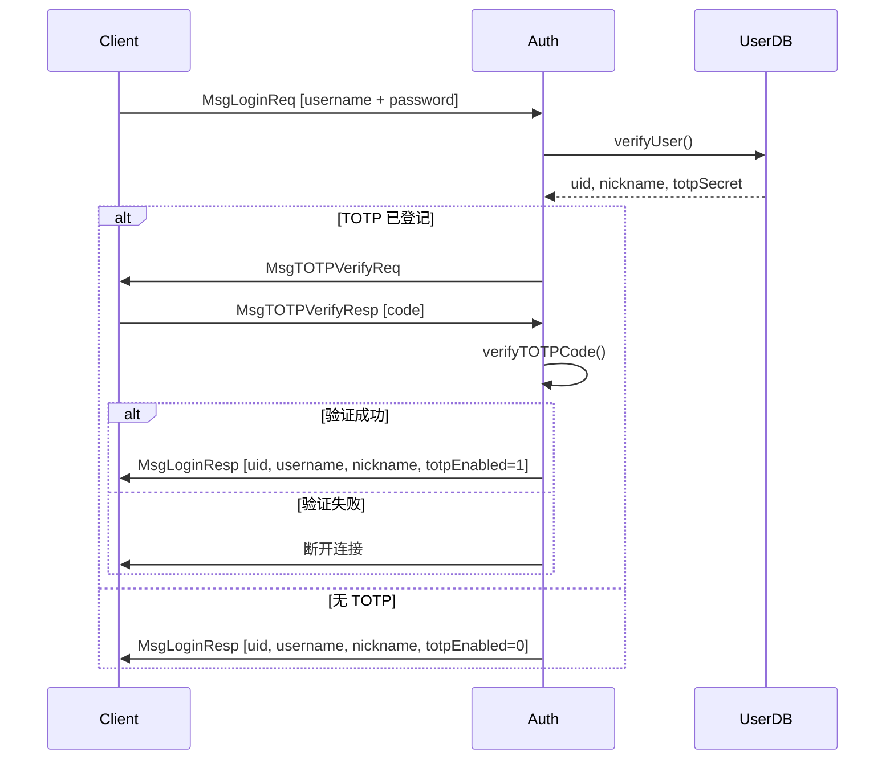

---

### 2.3 Server Room 房间模块

**接口**：`src/server/room.h`
**实现**：`src/server/room.c`

管理服务端活动房间生命周期与房间相关协议处理。

#### 2.3.1 房间辅助函数

| 函数 | 说明 | 备注 |
|------|------|------|
| `ActiveRoom *serverFindActiveRoom(const Server *s, uint32_t id)` | 按 roomId 线性搜索 | 返回 NULL 表示未激活（房间可能存在于 DB 但无成员） |
| `ActiveRoom *serverGetOrCreateActiveRoom(Server *s, uint32_t id)` | 查找或分配新 ActiveRoom，支持动态扩容 | 返回 NULL 表示分配失败 |
| `void serverRemoveActiveRoom(Server *s, uint32_t id)` | 释放房间并压缩数组 | 无成员的空房间不必手动调用，由 removeClientFromRoom 自动处理 |
| `void serverRemoveClientFromRoom(Server *s, ClientSession *cs)` | 从房间移除成员，空房间自动删除 | `currentRoomId == 0` 时 no-op |

#### 2.3.2 房间 Handler

| 函数 | 说明 | 前置条件 | 失败原因 |
|------|------|----------|----------|
| `int serverHandleRoomList(Server *s, ClientSession *cs)` | 从 GameDB 读取房间列表并返回 | GameDB 已打开 | DB 错误 |
| `int serverHandleRoomCreate(Server *s, ClientSession *cs, const Packet *pkt)` | 写入 GameDB 创建房间 | payload 为 uint32_t roomId | roomId 已存在、DB 错误 |
| `int serverHandleRoomJoin(Server *s, ClientSession *cs, const Packet *pkt)` | 校验房间存在 → 加入 ActiveRoom → 切换 SessionChat | payload 为 uint32_t roomId | 房间不存在、房间满员(10 人)、DB 错误 |

**满房间处理**：当 `ActiveRoom.memberCount >= MAX_CLIENTS_PER_ROOM` 时，`serverHandleRoomJoin` 拒绝加入并返回失败状态码。

---

### 2.4 Server Chat 聊天模块

**接口**：`src/server/chat.h`
**实现**：`src/server/chat.c`

封装聊天消息的验证、持久化存储与房间内广播。

#### 2.4.1 公开 API

**`int serverHandleChatMessage(Server *s, ClientSession *cs, const Packet *pkt)`**

完整的聊天消息处理流水线：

1. 校验 payload 长度（至少含 8 字节 timestamp）
2. 确保消息内容 NUL 终止于载荷边界内
3. 构造 `Chat` 结构体并调用 `storeChat()` 存入 ChatHistoryDB（msgId 由数据库生成并回填）
4. 构造 `ChatBroadcastPayload` 并向房间内除发送者外所有成员广播

聊天模块不直接调用 `packetInit`、`packetAESEncrypt` 或 `packetSend`。广播通过 `serverSendEncryptedPacket()`（communication 模块）完成。

#### 2.4.2 聊天流程图

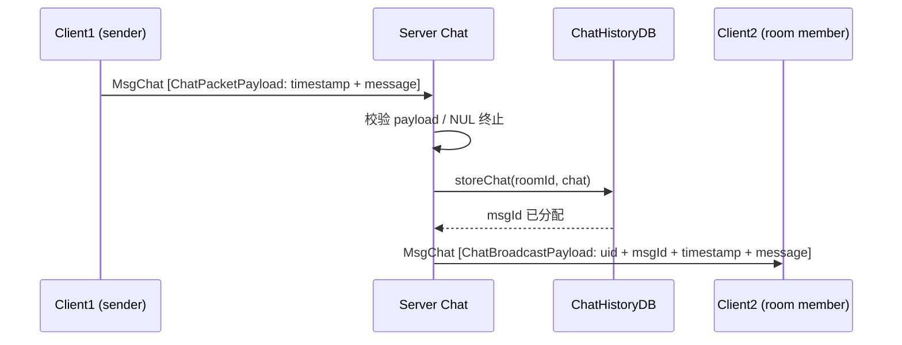

---

### 2.5 Server Key Manager 密钥管理模块

**接口**：`src/server/keyManager.h`
**实现**：`src/server/keyManager.c`

实现服务端信封加密密钥体系：主密钥（MK）生成、密钥派生、信封加密存储及启动解密加载。

#### 2.5.1 密钥体系图

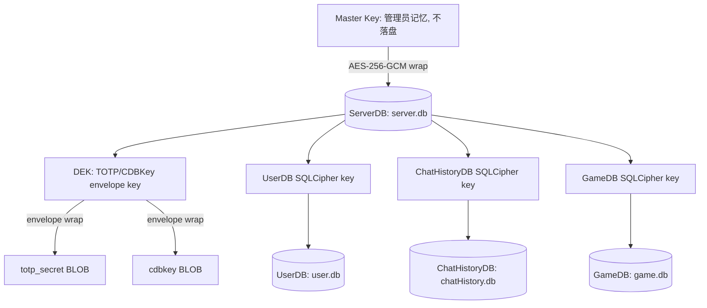

#### 2.5.2 公开 API

**`int serverInitKeys(Server *s)`**

首次运行路径：
1. `cryptoRandomBytes()` 生成 MK、DEK、UserDBKey、ChatHistoryDBKey、GameDBKey（各 32 字节）
2. 用 MK 经 AES-256-GCM 分别信封加密后四个密钥，存入 ServerDB
3. 载入明文密钥至 `Server` 结构体
4. 一次性十六进制显示 MK 给管理员，随后 `OPENSSL_cleanse` 擦除

已有运行路径：
1. 从 ServerDB 读取全部四个 envelope，逐一校验完整性
2. 提示管理员输入 MK（64 字符十六进制），经 `hexCharToNibble()` 转为二进制
3. 逐一解密 envelope，校验长度（60 字节 = nonce(12) + key(32) + tag(16)）及 AES-GCM 认证标签
4. 载入明文密钥至 `Server` 结构体

内部 helper `encryptAndStoreKey()` 与 `decryptAndLoadKey()` 为 `static` 函数，不对外暴露。

---

### 2.6 Server Communication 服务端通信模块

**接口**：`src/server/communication.h`
**实现**：`src/server/communication.c`

封装服务端侧的 ECDH+HKDF 密钥协商及面向 `ClientSession` 的加密收发。

#### 2.6.1 公开 API

**`int serverExchangeAESKey(SocketFD clientFD, Packet *reqPacket, AESGCMKey *outKey)`**

完成服务端侧的密钥交换。对客户端发来的 `reqPacket` 执行零信任校验（消息类型、包类型、载荷长度），拒绝反射攻击。生成临时 X25519 密钥对，ECDH 协商后 HKDF-SHA256 派生 AES 密钥。成功时 `outKey->nonce` 已清零。

- **安全措施**：校验失败时 `reqPacket->payload` 被清零，防止密钥材料泄漏

**`int serverSendEncryptedPacket(ClientSession *cs, MessageType mt, const void *data, size_t dataLen)`**

从 `cs` 读取 socket、AES 密钥和序列号，调用 `packetSendEncrypted()` 完成加密发送。

**`int serverRecvEncryptedPacket(ClientSession *cs, Packet *out)`**

接收并解密一个 AES-256-GCM 数据包。用于 `processClient()` 中非密钥交换状态的收包。

**`int serverSendStatusResponse(ClientSession *cs, MessageType mt, uint8_t status)`**

发送单字节状态响应（0 = 成功，1 = 失败）。认证与房间模块通过此统一接口返回操作结果。

---

### 2.7 Server Database 服务端数据库模块

**接口**：`src/server/database.h`
**实现**：`src/server/database/{common,userDb,chatDb,gameDb,serverDb}.c`

提供基于 SQLCipher 的持久化数据层。公共接口头文件位于 `src/server/database.h`，实现在 `src/server/database/` 子目录：

```
src/server/
├── database.h       ← 公共接口头文件（DB handle、所有 CRUD 声明）
└── database/
    ├── common.c     → dbInit / dbClose 生命周期管理
    ├── userDb.c     → 用户表 CRUD (createUser, deleteUser, verifyUser 等)
    ├── chatDb.c     → 聊天记录 CRUD (storeChat, queryChatByTimeRange 等)
    ├── gameDb.c     → 游戏房间 CRUD (createRoom, listRooms 等)
    ├── serverDb.c   → 服务器密钥 CRUD (setServerKey, getServerKey)
    └── internal.h   → 内部共享常量和函数声明
```

#### 2.7.1 常量与宏

| 宏 | 值 | 说明 |
|----|-----|------|
| `DB_SUCC` | `0` | 操作成功 |
| `DB_FAIL` | `-1` | 操作失败 |
| `USER_DB_PATH` | `"./db/user.db"` | 用户数据库文件路径 |
| `CHAT_HISTORY_DB_PATH` | `"./db/chatHistory.db"` | 聊天记录数据库文件路径 |
| `GAME_DB_PATH` | `"./db/game.db"` | 游戏房间数据库文件路径 |
| `SERVER_DB_PATH` | `"./db/server.db"` | 服务器密钥数据库文件路径 |
| `DB_DIRECTORY` | `"./db"` | 数据库文件所在目录 |
| `ROOM_STMT_BUCKETS` | `32` | Room 语句缓存哈希表桶数 |

#### 2.7.2 类型定义

**DBType**

```c
typedef enum { UserDB = 1, ChatHistoryDB, GameDB, ServerDB } DBType;
```

**Chat**

```c
typedef struct {
    uint32_t uid;
    uint64_t msgId;
    char *message;
    time_t timestamp;
} Chat;
```

**DB**

```c
typedef struct DB {
    sqlite3 *handle;
    DBType type;
    // UserDB cached statements
    sqlite3_stmt *stmtInsert, *stmtDelete, *stmtSelect;
    sqlite3_stmt *stmtRoomExists, *stmtUidCheck;
    sqlite3_stmt *stmtSetTotpSecret, *stmtGetTOTPSecret, *stmtGetCDBKey;
    // ChatHistoryDB cached statements
    sqlite3_stmt *stmtSeq;
    RoomStmtCache *roomCache;
    // ServerDB cached statements
    sqlite3_stmt *stmtSetKey, *stmtGetKey;
    // Key material
    uint8_t dekKey[AES_GCM_KEY_LEN];
    uint8_t dbEncKey[DB_ENC_KEY_LEN];
} DB;
```

#### 2.7.3 数据库 Schema

**UserDB**（`db/user.db`）

```sql
CREATE TABLE IF NOT EXISTS users (
    uid INTEGER PRIMARY KEY,
    username TEXT UNIQUE NOT NULL,
    nickname TEXT NOT NULL,
    password TEXT NOT NULL,       -- salt_hex:hash_hex
    totp_secret BLOB,             -- AES-256-GCM envelope (DEK-wrapped)
    cdbkey BLOB                   -- AES-256-GCM envelope (DEK-wrapped)
);
```

**ChatHistoryDB**（`db/chatHistory.db`）

```sql
CREATE TABLE IF NOT EXISTS msg_sequence (
    id INTEGER PRIMARY KEY AUTOINCREMENT
);
-- Per-room tables created on demand:
CREATE TABLE IF NOT EXISTS room_<roomId> (
    msgId INTEGER PRIMARY KEY,
    uid INTEGER NOT NULL,
    message TEXT NOT NULL,
    timestamp INTEGER NOT NULL
);
```

`msg_sequence` 表提供全局唯一、单调递增的消息 ID。每次 `storeChat` 插入一行后，通过 `last_insert_rowid()` 获取新 msgId。

**GameDB**（`db/game.db`）

```sql
CREATE TABLE IF NOT EXISTS rooms (
    roomId INTEGER PRIMARY KEY,
    creatorUid INTEGER NOT NULL,
    createdAt INTEGER NOT NULL
);
```

**ServerDB**（`db/server.db`）

通过 `setServerKey` / `getServerKey` 的键值对模型管理 envelope 数据，内部 schema 为 `server_keys(key_name TEXT PRIMARY KEY, key_value BLOB, created_at INTEGER)`。

#### 2.7.4 生命周期与密钥管理

| 函数 | 说明 | 释放责任 |
|------|------|----------|
| `DB *dbInit(DBType dbType, const uint8_t *encKey)` | 打开/创建数据库，自动建 `db/` 目录，WAL 模式。encKey 非 NULL 时调用 `sqlite3_key()` 启用 SQLCipher | `dbClose()` |
| `void dbClose(DB *database)` | 关闭连接、finalize 所有 stmt、释放资源、`OPENSSL_cleanse` 擦除密钥 | NULL 安全 |
| `void dbSetDekKey(DB *database, const uint8_t *dekKey)` | 注入 DEK 至 DB 句柄（TOTP 信封加密用） | NULL 清零 |
| `void dbSetDbEncKey(DB *database, const uint8_t *key)` | 注入数据库加密密钥至 DB 句柄 | NULL 清零 |

#### 2.7.5 用户操作

| 函数 | 说明 | 内存释放 |
|------|------|----------|
| `int createUser(DB *database, User *user)` | 创建用户：随机生成 UID、`hashPassword`、生成 CDBKey 并由 DEK 加密存储 | 调用者持有 `User` |
| `int deleteUser(DB *database, User *user)` | 按 uid 删除用户 | 调用者持有 `User` |
| `int verifyUser(DB *database, User *user)` | 按 username 验证凭据，常量时间比较防枚举，回填 uid/nickname/totpSecret | `user->totpSecret` 为 `strdup` 分配，调用者 `free()` |
| `int getCDBKey(DB *database, uint32_t uid, uint8_t outKey[32])` | 解密并返回每用户 CDBKey | 调用者提供 buffer |

#### 2.7.6 TOTP 密钥与 ServerDB 操作

| 函数 | 说明 | 内存释放 |
|------|------|----------|
| `int setTOTPSecret(DB *database, User *user, const char *secret)` | DEK 信封加密后存入 totp_secret 列 | secret 为 NULL/"" 时清除 |
| `char *getTOTPSecret(DB *database, User *user)` | 解密并返回 TOTP 明文字符串 | 调用者 `free()` |
| `int setServerKey(DB *database, const char *keyName, const uint8_t *value, size_t valueLen)` | INSERT OR REPLACE 键值对 | — |
| `int getServerKey(DB *database, const char *keyName, uint8_t **outValue, size_t *outLen)` | 按 key_name 查询，返回堆分配副本。不存在时返回 SUCC 且 `*outValue=NULL, *outLen=0` | 调用者 `free(*outValue)` |

#### 2.7.7 聊天记录与 GameDB 操作

| 函数 | 说明 | 内存释放 |
|------|------|----------|
| `int storeChat(DB *database, uint32_t roomId, Chat *chat)` | 存储聊天消息，msgId 由数据库生成并回填 | — |
| `int queryChatByMsgId(DB *database, uint32_t roomId, uint64_t msgId, Chat *out)` | 按全局 msgId 查询单条 | `free(out->message)` |
| `int queryChatByTimeRange(DB *, uint32_t roomId, uint32_t uid, time_t start, time_t end, Chat **out, size_t *count)` | 时间范围查询 | 逐条 `free(out[i].message)` 后 `free(out)` |
| `int queryChatByUserAllRooms(DB *, uint32_t uid, time_t start, time_t end, Chat **out, size_t *count)` | 跨所有房间查询用户消息 | 逐条 `free(out[i].message)` 后 `free(out)` |
| `int createRoom(DB *database, uint32_t roomId, uint32_t creatorUid)` | 创建房间 | — |
| `int deleteRoom(DB *database, uint32_t roomId)` | 删除房间 | 不存在时返回 FAIL |
| `int listRooms(DB *database, uint32_t **outRoomIds, size_t *count)` | 列出所有房间 ID。空库返回 SUCC 且 `*outRoomIds=NULL, *count=0` | `free(*outRoomIds)` |
| `int roomExists(DB *database, uint32_t roomId)` | 检查房间存在性 | — |

#### 2.7.8 数据库加密（SQLCipher）与密钥体系

PacPlay 服务端所有业务数据库通过 SQLCipher 的 AES-256-CBC 页级加密保护。密钥体系分三层：

```
Layer 1: MK (Master Key) — 256-bit
   仅存于管理员记忆，永不在磁盘持久化
           │ AES-256-GCM 信封加密
           ▼
Layer 2: Envelopes 存储于 server.db (ServerDB)
   nonce(12) ‖ AES-256-GCM(key) ‖ tag(16)
           │ 管理员输入 MK → decryptAESGCM
           ▼
Layer 3: 明文密钥驻留内存 (Server.dekKey / *dbEncKey)
   DEK → TOTP/CDBKey 信封加密
   UserDBKey → user.db SQLCipher
   ChatDBKey → chatHistory.db SQLCipher
   GameDBKey → game.db SQLCipher
```

MK 永不落盘，仅在首次启动时以十六进制一次性显示。DEK 与 DB 密钥在 `serverCleanup()` 和 `dbClose()` 中通过 `OPENSSL_cleanse` 双份擦除。

---

## 第三部分：客户端 API（`src/client/`）

客户端采用分层架构：`client.c` 仅负责连接建立/拆除与顶层流程控制，认证、房间与聊天逻辑拆入独立模块。

### 架构总览

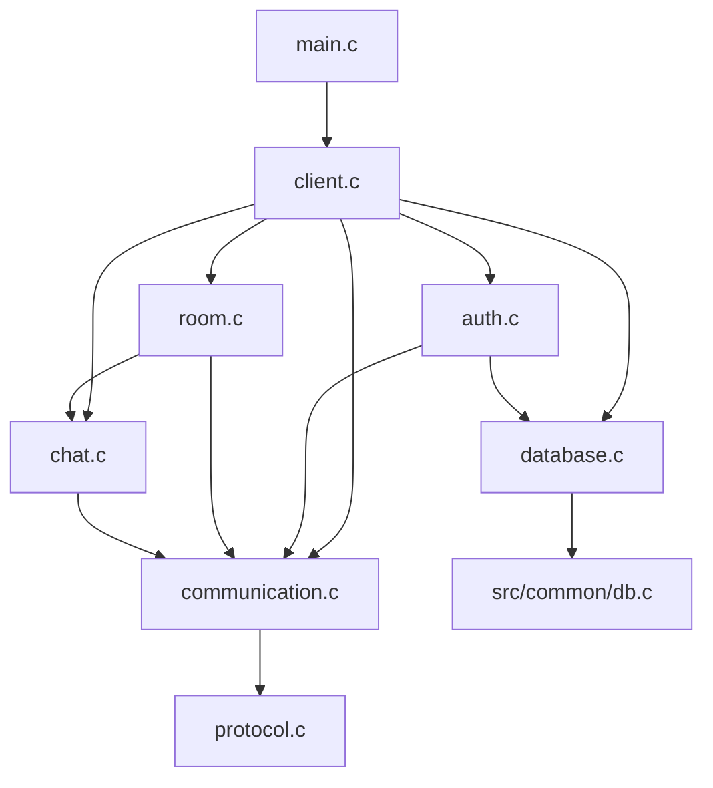

---

### 3.1 Client 客户端主模块

**接口**：`src/client/client.h`
**实现**：`src/client/client.c`

实现交互式 CLI 客户端的高层流程管理。

#### 3.1.1 常量

| 宏 | 值 | 说明 |
|----|-----|------|
| `CLIENT_SUCC` | `0` | 操作成功 |
| `CLIENT_FAIL` | `-1` | 操作失败 |

#### 3.1.2 类型定义

```c
typedef struct Client {
    SocketFD fd;
    AESGCMKey aesKey;
    uint32_t uid;
    uint32_t currentRoomId;
    uint32_t seqID;
    uint8_t cdbkey[CLIENT_DB_KEY_LEN];  // 每用户 CDBKey，登录后从服务端获取
    struct ClientDB *db;                 // 加密客户端数据库句柄
} Client;
```

#### 3.1.3 客户端生命周期

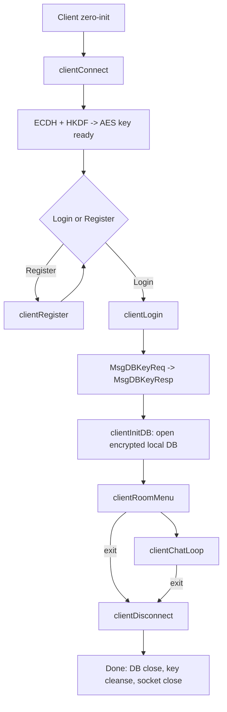

#### 3.1.4 公开 API

| 函数 | 说明 | 前置条件 | 失败行为 |
|------|------|----------|----------|
| `int clientConnect(Client *c, const char *addr, uint16_t port)` | 建立 TCP 连接并执行 ECDH+HKDF 密钥交换 | `c` 零初始化 | `c->fd = NULL_SOCKETFD` |
| `int clientLogin(Client *c)` | 交互式登录：输入凭据 → login → TOTP(可选) → CDBKey 获取 → 本地 DB 初始化 | `c` 已 connect | 返回 CLIENT_FAIL，连接保持 |
| `int clientRegister(Client *c)` | 交互式注册：输入 username/nickname/password → MsgRegisterReq | `c` 已 connect | 返回 CLIENT_FAIL |
| `int clientTOTPSetup(Client *c)` | 发送 MsgTOTPSetupReq → 接收 Base32 secret → 显示 otpauth:// URI | `c` 已登录(`c->uid != 0`) | TOTP 已启用时不视为错误 |
| `int clientRoomMenu(Client *c)` | 拉取房间列表、交互式创建/加入 | `c` 已登录 | `/exit` 退出 |
| `int clientChatLoop(Client *c)` | 使用 `select(stdin, socket)` 实现聊天循环 | `c` 已在房间内 | `/exit` 退出 |
| `void clientDisconnect(Client *c)` | 关闭本地 DB、`OPENSSL_cleanse` 擦除 aesKey 和 cdbkey、关闭套接字 | — | NULL 安全 |

**注意**：`clientLogin()` 中 `cdbkey` 的清除发生在 `clientDisconnect()` 中，而非登录后立即清除。`cdbkey` 在 `Client` 结构体中保留至连接断开，用于 `clientInitDB()` 及后续数据库操作。

#### 3.1.5 聊天命令

| 命令 | 行为 |
|------|------|
| `/exit` | 发送 `MsgLogout`，退出聊天循环 |
| `/help` | 显示可用命令列表 |

---

### 3.2 Client Auth 客户端认证模块

**接口**：`src/client/auth.h`
**实现**：`src/client/auth.c`

`auth.h` 仅包含 `client.h`，作为模块边界头存在，不声明额外公开函数。所有认证 API（`clientLogin`、`clientRegister`、`clientTOTPSetup`）均在 `client.h` 中声明。

内部实现从 `client.c` 拆分出登录、注册与 TOTP 设置逻辑。所有认证操作通过 `Client` 结构体读写 socket 与密钥状态。

---

### 3.3 Client Room 客户端房间模块

**接口**：`src/client/room.h`
**实现**：`src/client/room.c`

`room.h` 仅包含 `client.h`，作为模块边界头存在，不声明额外公开函数。所有房间 API（`clientRoomMenu`）在 `client.h` 中声明。

内部提供交互式房间列表展示、创建与加入功能。用户输入解析沿用 `fgets`/`strtoul` 模式。

---

### 3.4 Client Chat 客户端聊天模块

**接口**：`src/client/chat.h`
**实现**：`src/client/chat.c`

封装聊天消息的构造与解析，将聊天业务逻辑从 UI loop 中解耦。

#### 3.4.1 公开 API

**`int clientChatSend(Client *client, const char *message, int64_t timestamp)`**

- **行为**：构造 `ChatPacketPayload`（timestamp + message），分配临时堆缓冲区，通过 `clientSendEncryptedPacket()` 发送 `MsgChat`，发送后释放缓冲区
- **前置条件**：`message` 为 NUL 终止字符串，`timestamp` 为 UTC 时间戳
- **失败原因**：分配失败、发送失败

**`int clientChatParseBroadcast(const Packet *pkt, ChatBroadcastPayload *out, size_t *outLen)`**

- **行为**：从 `pkt->payload` 解析 `ChatBroadcastPayload` 结构，提取 uid、msgId、timestamp 和消息体起始指针
- **输出**：`*outLen` 为消息体的实际字节长度（不含 NUL）
- **注意**：`out` 中的 message 指针直接指向 `pkt->payload` 内部，不分配新内存——调用者不应释放，且 `out` 仅在 `pkt` 有效期间可用

---

### 3.5 Client Communication 客户端通信模块

**接口**：`src/client/communication.h`
**实现**：`src/client/communication.c`

封装客户端侧的 ECDH+HKDF 密钥协商及面向 `Client` 结构体的加密收发。

#### 3.5.1 公开 API

**`int clientExchangeAESKey(SocketFD socketFD, AESGCMKey *outKey)`**

完成客户端侧的密钥交换。生成临时 X25519 密钥对，发送公钥，接收服务端公钥，ECDH 协商后 HKDF-SHA256 派生 AES 密钥。成功时 `outKey->nonce` 已清零。返回 `PROTOCOL_SUCC` / `PROTOCOL_FAIL`。

**`int clientSendEncryptedPacket(Client *client, MessageType mt, const void *data, size_t dataLen)`**

从 `client` 读取 socket、AES 密钥和序列号，调用 `packetSendEncrypted()`。返回 `PROTOCOL_SUCC` / `PROTOCOL_FAIL`。

**`int clientRecvEncryptedPacket(Client *client, Packet *out)`**

接收并解密一个 AES-256-GCM 数据包。返回 `PROTOCOL_SUCC` / `PROTOCOL_FAIL` / `PROTOCOL_AUTH_FAIL`。

**`int clientRecvStatusResponse(Client *client, MessageType expectedMt)`**

接收指定类型的服务器状态响应（单字节 payload），返回状态值 0-255，失败返回 -1。

---

### 3.6 Client Database 客户端数据库模块

**接口**：`src/client/database.h`
**实现**：`src/client/database.c`

提供基于 SQLCipher 的加密本地游戏库，密钥为登录后从服务端获取的每用户 CDBKey（256-bit）。所有操作通过缓存的 prepared statement 执行，杜绝 SQL 注入。

#### 3.6.1 常量与宏

| 宏 | 值 | 说明 |
|----|-----|------|
| `CLIENT_DB_PATH` | `"./db/client.db"` | 客户端数据库文件路径 |
| `CLIENT_DB_DIR` | `"./db"` | 数据库文件所在目录 |
| `CLIENT_DB_SUCC` | `0` | 操作成功 |
| `CLIENT_DB_FAIL` | `-1` | 操作失败 |

#### 3.6.2 类型定义

**GameRecord**

```c
typedef struct {
    uint32_t gameId;
    char *gameName;    // 堆分配，调用者 free()
    char *gamePath;    // 堆分配，调用者 free()
    uint64_t playTime; // 累计游玩时间（秒）
} GameRecord;
```

**ClientDB**

```c
typedef struct ClientDB {
    sqlite3 *handle;
    sqlite3_stmt *stmtInsert;
    sqlite3_stmt *stmtSelectAll;
    sqlite3_stmt *stmtSelectById;
    sqlite3_stmt *stmtDelete;
    sqlite3_stmt *stmtUpdatePlayTime;
    uint8_t dbEncKey[CLIENT_DB_KEY_LEN];
} ClientDB;
```

#### 3.6.3 数据库 Schema

```sql
CREATE TABLE IF NOT EXISTS gameList (
    gameId INTEGER PRIMARY KEY,
    gameName TEXT NOT NULL,
    gamePath TEXT NOT NULL,
    playTime INTEGER NOT NULL DEFAULT 0
);
```

#### 3.6.4 生命周期与 CRUD

| 函数 | 说明 | 释放责任 |
|------|------|----------|
| `int clientInitDB(Client *client)` | 打开/创建加密客户端数据库，启用 WAL。密钥从 `client->cdbkey` 拷贝至 `ClientDB` | `clientCloseDB(client)` |
| `void clientCloseDB(Client *client)` | 关闭连接、finalize stmt、`OPENSSL_cleanse` 擦除 encKey | NULL 安全 |
| `int addGame(Client *client, uint32_t gameId, const char *gameName, const char *gamePath)` | 插入游戏记录，playTime 初始为 0 | — |
| `int listGames(Client *client, GameRecord ***outRecords, size_t *count)` | 列出所有游戏，按 gameName ASC 排序。空库返回 SUCC 且 `*count=0, *outRecords=NULL` | 逐条 `free(r->gameName)`, `free(r->gamePath)`, `free(r)`, 再 `free(*outRecords)` |
| `int deleteGame(Client *client, uint32_t gameId)` | 按 gameId 删除。不存在时返回 FAIL | — |
| `int updatePlayTime(Client *client, uint32_t gameId, uint64_t playTime)` | **覆盖**累计游玩时间（秒），非增量加法 | — |

**`listGames()` 释放示例**：

```c
GameRecord **records = NULL;
size_t count = 0;
if (listGames(client, &records, &count) == CLIENT_DB_SUCC) {
    for (size_t i = 0; i < count; i++) {
        free(records[i]->gameName);
        free(records[i]->gamePath);
        free(records[i]);
    }
    free(records);
}
```

#### 3.6.5 多用户运行约束

`CLIENT_DB_PATH` 固定为 `./db/client.db`，多用户共用同一工作目录时依赖不同 CDBKey 做 SQLCipher 页级加密隔离。**不同用户的数据库文件会互相覆盖**——生产环境中应确保每个用户具有独立的工作目录或数据库路径。

---

## 第四部分：端到端协议与典型业务流程

### 4.1 首次服务端启动流程

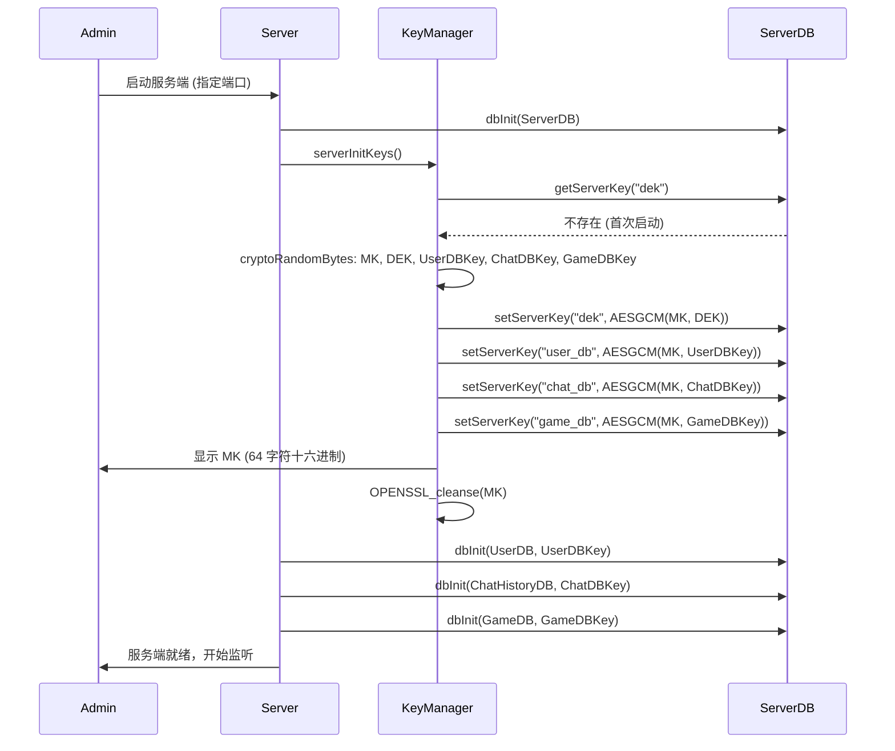

管理员必须保存 MK，后续启动需要输入该密钥。

### 4.2 后续服务端启动流程

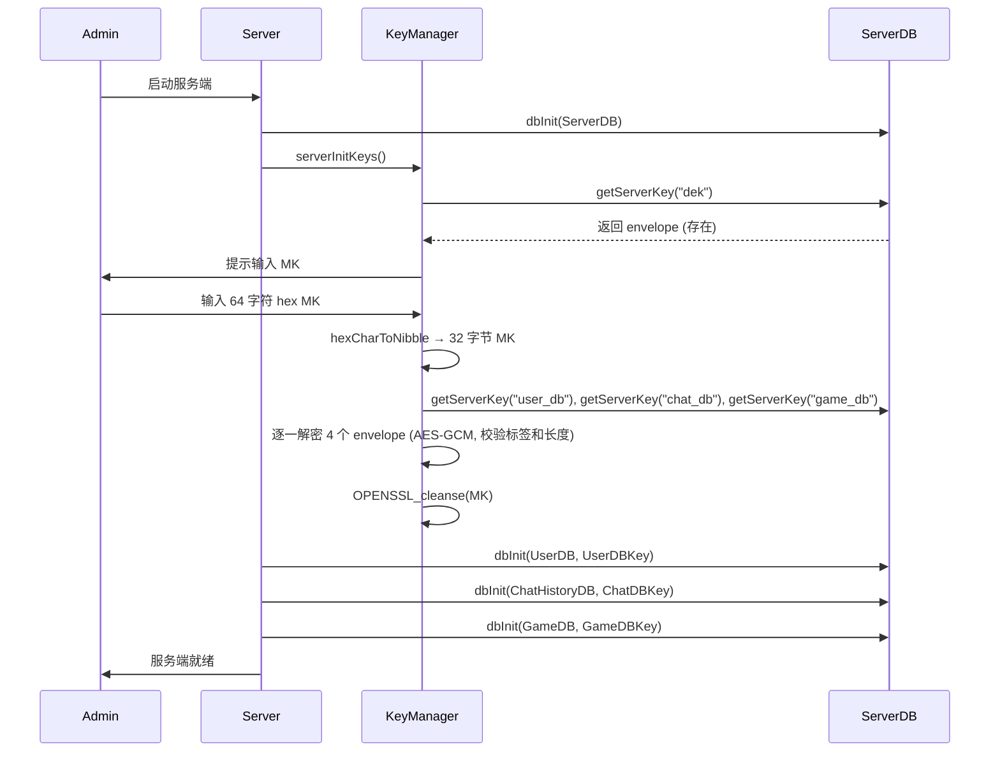

DK 输入错误时，envelope 解密返回 `CRYPTO_AUTH_FAIL` 或长度不匹配，服务端退出。

### 4.3 注册流程

1. 客户端 `clientConnect()` 完成 ECDH+HKDF 密钥交换
2. 客户端调用 `clientRegister()`：
   - 提示输入 username、nickname、password
   - 构造 `RegisterRequestPayload`（username[32] + nickname[32] + password[N]）
   - 发送 `MsgRegisterReq`（加密）
3. 服务端 `serverHandleRegister()`：
   - 解析 payload → `hashPassword()` → `createUser()`（生成 UID 和 CDBKey，DEK envelope 加密存入）
   - 返回单字节状态：0 = 成功，1 = 用户名已存在

### 4.4 登录流程

1. 客户端 `clientLogin()`：
   - 提示输入 username、password
   - 构造 `LoginRequestPayload`（username[32] + password[N]）
   - 发送 `MsgLoginReq`（加密）
   - 等待服务端响应

2. 服务端 `serverHandleLogin()`：
   - `verifyUser()` 校验凭据
   - **无 TOTP**：直接发送 `MsgLoginResp`，`cs->state = SessionRoom`
   - **有 TOTP**：发送 `MsgTOTPVerifyReq`（空 payload），`cs->state = SessionTOTPVerify`

3. TOTP 路径：
   - 客户端收到 `MsgTOTPVerifyReq`，提示输入 6 位验证码
   - 客户端发送 `MsgTOTPVerifyResp [TOTPVerifyPayload: code]`
   - 服务端 `serverHandleTOTPVerify()` → `verifyTOTPCode()` → 正确则发送 `MsgLoginResp`，`cs->state = SessionRoom`

4. 登录成功后：
   - 客户端解析 `LoginResponsePayload`：uid, username, nickname, totpEnabled
   - 客户端发送 `MsgDBKeyReq`（空 payload）
   - 服务端返回 `MsgDBKeyResp [DBKeyRespPayload: 32B CDBKey]`
   - 客户端将 CDBKey 存入 `client->cdbkey`
   - 客户端调用 `clientInitDB()` 打开加密本地数据库

### 4.5 房间流程

**列出房间**：
1. 客户端发送 `MsgRoomListReq`
2. 服务端 `serverHandleRoomList()` → `listRooms()` 查询 GameDB → 返回 `uint32_t[]` 房间 ID 数组

**创建房间**：
1. 客户端发送 `MsgCreateRoom [uint32_t roomId]`
2. 服务端 `serverHandleRoomCreate()` → `createRoom()` → 返回状态字节

**加入房间**：
1. 客户端发送 `MsgJoinRoom [uint32_t roomId]`
2. 服务端 `serverHandleRoomJoin()`：
   - `roomExists()` 校验
   - 检查房间人数 < `MAX_CLIENTS_PER_ROOM` (10)
   - 满员时拒绝加入
   - `serverGetOrCreateActiveRoom()` → 加入 ActiveRoom
   - `cs->state = SessionChat`

### 4.6 聊天流程

1. 客户端 `clientChatLoop()` 使用 `select(stdin, socket)` 循环：
   - **stdin 有输入**：`clientChatSend()` 构造 `ChatPacketPayload` → `clientSendEncryptedPacket(MsgChat)`
   - **socket 有数据**：接收 `MsgChat` 广播 → `clientChatParseBroadcast()` 解析 → 显示消息
   - **`/exit`**：发送 `MsgLogout`，退出循环

2. 服务端 `serverHandleChatMessage()`：
   - 校验 payload（≥8B timestamp + NUL 终止的消息）
   - `storeChat()` 写入 ChatHistoryDB，msgId 由 `msg_sequence` 生成
   - 构造 `ChatBroadcastPayload` → 遍历房间成员（除发送者）→ `serverSendEncryptedPacket()` 广播

### 4.7 命令行运行方式

**服务端**：
```bash
make server
./bin/server/server 7777
```

首次启动会显示 64 字符十六进制 MK，后续启动需输入该 MK。

**客户端**：
```bash
make client
./bin/client/client 127.0.0.1 7777
```

---

## 第五部分：可运行示例

以下示例均为**可直接编译运行的独立程序**。每个示例标注了编译命令和预期行为。

---

### 5.1 AES-GCM 加解密 roundtrip

**文件**：保存为 `example_aes.c`

```c
#include "crypto.h"
#include <stdio.h>
#include <string.h>

enum { BufSize = 64 };

int main(void) {
    // 1. 生成随机密钥和 nonce
    AESGCMKey key;
    cryptoRandomBytes(key.key, AES_GCM_KEY_LEN);
    cryptoRandomBytes(key.nonce, AES_GCM_NONCE_LEN);

    // 2. 准备明文
    const char *msg = "Hello, PacPlay AES-GCM!";
    size_t msgLen = strlen(msg);

    AESGCMBuffer plainIn = { .data = (uint8_t *)msg,
                              .capacity = msgLen,
                              .len = msgLen };

    // 3. 分配密文输出
    AESGCMCipher cipher;
    aesGCMBufferInit(&cipher.buffer, msgLen);
    cipher.buffer.len = msgLen;

    // 4. 加密
    encryptAESGCM(&plainIn, NULL, &key, &cipher);

    // 5. 解密
    AESGCMBuffer plainOut;
    aesGCMBufferInit(&plainOut, msgLen);
    plainOut.len = msgLen;
    int rc = decryptAESGCM(&cipher, NULL, &key, &plainOut);

    // 6. 验证
    plainOut.data[msgLen] = '\0'; // for safe printing
    if (rc == CRYPTO_SUCC && memcmp(plainIn.data, plainOut.data, msgLen) == 0) {
        printf("Roundtrip OK: %s\n", plainOut.data);
    } else {
        printf("Roundtrip FAILED (rc=%d)\n", rc);
    }

    // 7. 释放
    aesGCMBufferDeinit(&cipher.buffer);
    aesGCMBufferDeinit(&plainOut);
    return (rc == CRYPTO_SUCC) ? 0 : 1;
}
```

**编译与运行**：
```bash
clang -Iinclude -Isrc -Wall -Wextra -Werror -g \
      -o example_aes example_aes.c src/common/crypto.c src/common/log.c \
      -lssl -lcrypto
./example_aes
# 预期输出：Roundtrip OK: Hello, PacPlay AES-GCM!
```

---

### 5.2 ECDH + HKDF 双端派生同一 AES 密钥

**文件**：保存为 `example_ecdh.c`

```c
#include "crypto.h"
#include <stdio.h>
#include <string.h>

int main(void) {
    // Alice
    EVP_PKEY *aliceKey = genECDHKeypair();
    uint8_t alicePub[ECDH_PUBLIC_KEY_SIZE];
    exportECDHPublicKey(aliceKey, alicePub);

    // Bob
    EVP_PKEY *bobKey = genECDHKeypair();
    uint8_t bobPub[ECDH_PUBLIC_KEY_SIZE];
    exportECDHPublicKey(bobKey, bobPub);

    // Exchange: import peer public keys
    EVP_PKEY *alicePeer = importECDHPeerPublicKey(bobPub);
    EVP_PKEY *bobPeer = importECDHPeerPublicKey(alicePub);

    // Derive shared secrets
    uint8_t aliceSecret[ECDH_SHARED_SECRET_SIZE];
    uint8_t bobSecret[ECDH_SHARED_SECRET_SIZE];
    deriveECDHSharedSecret(aliceKey, alicePeer, aliceSecret);
    deriveECDHSharedSecret(bobKey, bobPeer, bobSecret);

    // Verify shared secrets match
    if (memcmp(aliceSecret, bobSecret, ECDH_SHARED_SECRET_SIZE) != 0) {
        printf("FAIL: shared secrets differ\n");
        return 1;
    }

    // Derive AES keys via HKDF
    AESGCMKey aliceAES, bobAES;
    deriveAESKey(aliceSecret, ECDH_SHARED_SECRET_SIZE, &aliceAES);
    deriveAESKey(bobSecret, ECDH_SHARED_SECRET_SIZE, &bobAES);

    // Verify AES keys match
    if (memcmp(aliceAES.key, bobAES.key, AES_GCM_KEY_LEN) == 0) {
        printf("OK: AES-256 keys match (HKDF consistent)\n");
    } else {
        printf("FAIL: AES keys differ\n");
    }

    // Cleanup
    EVP_PKEY_free(aliceKey);
    EVP_PKEY_free(bobKey);
    EVP_PKEY_free(alicePeer);
    EVP_PKEY_free(bobPeer);
    OPENSSL_cleanse(aliceSecret, sizeof(aliceSecret));
    OPENSSL_cleanse(bobSecret, sizeof(bobSecret));
    return 0;
}
```

**编译与运行**：
```bash
clang -Iinclude -Isrc -Wall -Wextra -Werror -g \
      -o example_ecdh example_ecdh.c src/common/crypto.c src/common/log.c \
      -lssl -lcrypto
./example_ecdh
# 预期输出：OK: AES-256 keys match (HKDF consistent)
```

---

### 5.3 Protocol 序列化/反序列化

**文件**：保存为 `example_packet.c`

```c
#include "protocol.h"
#include <stdio.h>
#include <string.h>

enum { BufSize = 2048 };

int main(void) {
    const char *testMsg = "Hello";
    size_t msgLen = strlen(testMsg);

    // 1. packetInit
    Packet pkt = {0};
    packetInit(&pkt, MsgChat, 1, PlaintextPacket, testMsg, msgLen);

    // 2. packetSerialize
    uint8_t buf[BufSize];
    size_t serLen = 0;
    packetSerialize(&pkt, buf, sizeof(buf), &serLen);

    // 3. packetDeserialize
    Packet pkt2 = {0};
    if (packetDeserialize(buf, serLen, &pkt2) != PROTOCOL_SUCC) {
        printf("FAIL: deserialize\n");
        return 1;
    }

    // 4. Verify
    int ok = (pkt2.header.messageType == MsgChat &&
              pkt2.header.payloadLength == msgLen &&
              memcmp(pkt2.payload, testMsg, msgLen) == 0);
    printf("%s: header and payload match after serialize→deserialize\n",
           ok ? "OK" : "FAIL");

    // 5. packetClear twice (verify double-free safety)
    packetClear(&pkt);
    packetClear(&pkt);  // safe
    packetClear(&pkt2);
    packetClear(&pkt2); // safe

    return ok ? 0 : 1;
}
```

**编译与运行**：
```bash
clang -Iinclude -Isrc -Wall -Wextra -Werror -g \
      -o example_packet example_packet.c src/common/protocol.c src/common/crypto.c src/common/log.c \
      -lssl -lcrypto
./example_packet
# 预期输出：OK: header and payload match after serialize→deserialize
```

---

### 5.4 Packet 加密传输

**文件**：保存为 `example_encrypt.c`

```c
#include "protocol.h"
#include <stdio.h>
#include <string.h>

int main(void) {
    const char *testMsg = "Secret message";
    size_t msgLen = strlen(testMsg);

    // 1. 创建明文包
    Packet pkt = {0};
    packetInit(&pkt, MsgChat, 42, PlaintextPacket, testMsg, msgLen);

    // 2. 生成随机 AES 密钥
    uint8_t aesKey[AES_GCM_KEY_LEN];
    cryptoRandomBytes(aesKey, sizeof(aesKey));

    // 3. 加密
    if (packetAESEncrypt(&pkt, aesKey) != PROTOCOL_SUCC) {
        printf("FAIL: encrypt\n");
        return 1;
    }

    // 4. 解密
    if (packetAESDecrypt(&pkt, aesKey) != PROTOCOL_SUCC) {
        printf("FAIL: decrypt\n");
        return 1;
    }

    // 5. 验证
    int ok = (pkt.header.packetType == PlaintextPacket &&
              pkt.header.payloadLength == msgLen &&
              memcmp(pkt.payload, testMsg, msgLen) == 0);
    printf("%s: encrypt→decrypt roundtrip\n", ok ? "OK" : "FAIL");

    packetClear(&pkt);
    return ok ? 0 : 1;
}
```

**编译与运行**：
```bash
clang -Iinclude -Isrc -Wall -Wextra -Werror -g \
      -o example_encrypt example_encrypt.c src/common/protocol.c src/common/crypto.c src/common/log.c \
      -lssl -lcrypto
./example_encrypt
# 预期输出：OK: encrypt→decrypt roundtrip
```

---

### 5.5 Container Queue/Array 示例

```c
/* QUEUE_DEFINE(int) 和 ARRAY_DEFINE(int) 生成类型安全的 int 容器 */
#include "container.h"
#include <stdio.h>

QUEUE_DEFINE(int)
ARRAY_DEFINE(int)

int main(void) {
    // Queue
    Queueint q;
    queueintInit(&q, 4);
    queueintPush(&q, 10);
    queueintPush(&q, 20);
    int frontVal = 0;
    queueintFront(&q, &frontVal);
    printf("Queue front: %d\n", frontVal); // 10
    queueintPop(&q);
    queueintFront(&q, &frontVal);
    printf("After pop, front: %d\n", frontVal); // 20
    queueintDeinit(&q);

    // Array
    Arrayint arr;
    arrayintInit(&arr, 4);
    arrayintPushBack(&arr, 100);
    arrayintPushBack(&arr, 200);
    int val = 0;
    arrayintGet(&arr, 0, &val);
    printf("Array[0]: %d\n", val); // 100
    arrayintGet(&arr, 1, &val);
    printf("Array[1]: %d\n", val); // 200
    printf("Size: %zu\n", arrayintSize(&arr)); // 2
    arrayintDeinit(&arr);

    return 0;
}
```

**编译与运行**：
```bash
clang -Iinclude -Isrc -Wall -Wextra -Werror -g \
      -o example_container example_container.c
./example_container
```

---

### 5.6 服务端数据库基本操作

以下示例展示 UserDB、ChatHistoryDB、GameDB 的创建/查询流程。**注意**：此示例需要 SQLCipher 和临时工作目录。

```c
#include "server/database.h"
#include "server/server.h"
#include "crypto.h"
#include <inttypes.h>
#include <stdio.h>
#include <string.h>
#include <sys/stat.h>

int main(void) {
    // 0. 确保 db/ 目录存在
    PLATFORM_MKDIR("db", 0755);

    // 1. 生成测试密钥
    uint8_t dek[AES_GCM_KEY_LEN], userDbKey[DB_ENC_KEY_LEN];
    uint8_t chatDbKey[DB_ENC_KEY_LEN], gameDbKey[DB_ENC_KEY_LEN];
    cryptoRandomBytes(dek, sizeof(dek));
    cryptoRandomBytes(userDbKey, sizeof(userDbKey));
    cryptoRandomBytes(chatDbKey, sizeof(chatDbKey));
    cryptoRandomBytes(gameDbKey, sizeof(gameDbKey));

    // 2. 打开 UserDB
    DB *userDB = dbInit(UserDB, userDbKey);
    dbSetDekKey(userDB, dek);
    dbSetDbEncKey(userDB, userDbKey);
    if (userDB == NULL) { printf("FAIL: dbInit UserDB\n"); return 1; }

    // 3. 创建用户
    User u = { .username = "alice", .nickname = "Alice",
               .password = "testpass", .totpSecret = NULL };
    if (createUser(userDB, &u) == DB_SUCC) {
        printf("User created: uid=%u\n", u.uid);
    }

    // 4. 验证用户
    User loginU = { .username = "alice", .password = "testpass" };
    if (verifyUser(userDB, &loginU) == DB_SUCC) {
        printf("Login OK: uid=%u, nickname=%s\n", loginU.uid, loginU.nickname);
        free(loginU.totpSecret);
    }

    // 5. 打开 ChatHistoryDB 并存储消息
    DB *chatDB = dbInit(ChatHistoryDB, chatDbKey);
    dbSetDbEncKey(chatDB, chatDbKey);
    Chat chat = { .uid = u.uid, .message = "Hello World",
                  .timestamp = getCurrentTimestamp() };
    if (storeChat(chatDB, 100, &chat) == DB_SUCC) {
        printf("Chat stored: msgId=%" PRIu64 "\n", chat.msgId);
    }

    // 6. 打开 GameDB 并创建房间
    DB *gameDB = dbInit(GameDB, gameDbKey);
    dbSetDbEncKey(gameDB, gameDbKey);
    createRoom(gameDB, 100, u.uid);
    printf("Room 100 created\n");

    // 7. 查询并释放聊天记录
    Chat *results = NULL;
    size_t count = 0;
    queryChatByTimeRange(chatDB, 100, 0, 0, getCurrentTimestamp(), &results, &count);
    for (size_t i = 0; i < count; i++) {
        printf("  msgId=%" PRIu64 ": %s\n", results[i].msgId, results[i].message);
        free(results[i].message);
    }
    free(results);

    // 8. 清理
    dbClose(userDB);
    dbClose(chatDB);
    dbClose(gameDB);
    printf("All DBs closed (keys cleansed)\n");
    return 0;
}
```

**编译与运行**：
```bash
clang -Iinclude -Isrc -Wall -Wextra -Werror -g \
      -o example_server_db example_server_db.c \
      src/server/database/common.c src/server/database/userDb.c \
      src/server/database/chatDb.c src/server/database/gameDb.c \
      src/server/database/serverDb.c src/common/db.c src/common/crypto.c \
      src/common/log.c src/common/utils.c \
      -lsqlcipher -lssl -lcrypto
./example_server_db
```

**注意**：此示例在当前目录下创建 `db/` 目录和数据库文件。建议在临时目录下运行以避免污染项目目录。

---

### 5.7 客户端数据库 CRUD

```c
#include "client/database.h"
#include "client/client.h"
#include "crypto.h"
#include <stdio.h>

int main(void) {
    // 1. 构造 client 结构体（填入测试 CDBKey）
    Client client = {0};
    cryptoRandomBytes(client.cdbkey, sizeof(client.cdbkey));

    // 2. 打开加密数据库
    clientInitDB(&client);

    // 3. 添加游戏
    addGame(&client, 1, "Test Game", "/usr/bin/test");
    addGame(&client, 2, "Another Game", "/usr/local/bin/another");

    // 4. 列出游戏
    GameRecord **records = NULL;
    size_t count = 0;
    listGames(&client, &records, &count);
    for (size_t i = 0; i < count; i++) {
        printf("[%u] %s (%s) playtime=%lu s\n",
               records[i]->gameId, records[i]->gameName,
               records[i]->gamePath, (unsigned long)records[i]->playTime);
    }

    // 5. 更新游玩时间（覆盖累计值）
    updatePlayTime(&client, 1, 3600);

    // 6. 释放 listGames 结果
    for (size_t i = 0; i < count; i++) {
        free(records[i]->gameName);
        free(records[i]->gamePath);
        free(records[i]);
    }
    free(records);

    // 7. 删除游戏
    deleteGame(&client, 2);

    // 8. 关闭（擦除密钥）
    clientCloseDB(&client);
    printf("Client DB closed\n");
    return 0;
}
```

**编译与运行**：
```bash
clang -Iinclude -Isrc -Wall -Wextra -Werror -g \
      -o example_client_db example_client_db.c \
      src/client/database.c src/common/db.c src/common/crypto.c \
      src/common/log.c src/common/utils.c \
      -lsqlcipher -lssl -lcrypto
./example_client_db
```

---

## 第六部分：错误码、内存所有权与维护注意事项

### 6.1 错误码总表

| 模块 | 成功 | 通用失败 | 认证失败 |
|------|------|----------|----------|
| Crypto | `CRYPTO_SUCC` (0) | `CRYPTO_FAIL` (-1) | `CRYPTO_AUTH_FAIL` (-2) |
| Protocol | `PROTOCOL_SUCC` (0) | `PROTOCOL_FAIL` (-1) | `PROTOCOL_AUTH_FAIL` (-2) |
| Server | `SERVER_SUCC` (0) | `SERVER_FAIL` (-1) | — |
| Server DB | `DB_SUCC` (0) | `DB_FAIL` (-1) | — |
| Client | `CLIENT_SUCC` (0) | `CLIENT_FAIL` (-1) | — |
| Client DB | `CLIENT_DB_SUCC` (0) | `CLIENT_DB_FAIL` (-1) | — |

### 6.2 内存所有权表

| API | 分配者 | 释放者 | 释放方式 |
|-----|--------|--------|----------|
| `hashPassword()` | 函数内部 | 调用者 | `free()` |
| `base32Encode()` | 函数内部 | 调用者 | `free(*outStr)` |
| `base32Decode()` | 函数内部 | 调用者 | `free(*outData)` |
| `generateOTPAuthURI()` | 函数内部 | 调用者 | `free(*outURI)` |
| `packetInit()` | 函数内部 | 调用者 | `packetClear()` |
| `packetDeserialize()` | 函数内部 | 调用者 | `packetClear()` |
| `packetRecv()` | 函数内部 | 调用者 | `packetClear()` |
| `packetRecvEncrypted()` | 成功时函数内部分配；失败时自动清除 | 调用者 | `packetClear()` |
| `genECDHKeypair()` | 函数内部 | 调用者 | `EVP_PKEY_free()` |
| `importECDHPeerPublicKey()` | 函数内部 | 调用者 | `EVP_PKEY_free()` |
| `getTOTPSecret()` | 函数内部 | 调用者 | `free()` |
| `getServerKey()` | 函数内部 | 调用者 | `free(*outValue)` |
| `verifyUser()` (totpSecret) | `strdup` | 调用者 | `free(user->totpSecret)` |
| `listGames()` | 逐 record 的 strdup + 数组 malloc | 调用者 | `free(r->gameName)`, `free(r->gamePath)`, `free(r)`, `free(array)` |
| `queryChatByTimeRange()` | 函数内部逐条分配 | 调用者 | 逐条 `free(out[i].message)` 后 `free(out)` |
| `queryChatByUserAllRooms()` | 函数内部逐条分配 | 调用者 | 逐条 `free(out[i].message)` 后 `free(out)` |
| `queryChatByMsgId()` | `strdup(out->message)` | 调用者 | `free(out->message)` |
| `listRooms()` | 函数内部 `malloc` | 调用者 | `free(*outRoomIds)` |
| `clientInitDB()` | 函数内部 `calloc(ClientDB)` | 调用者 | `clientCloseDB(client)` |
| `aesGCMBufferInit()` | `malloc` | 调用者 | `aesGCMBufferDeinit()` |

### 6.3 项目整体依赖架构

PacPlay 按编译边界分为三层——公共层、服务端层、客户端层。公共层（`include/` + `src/common/`）提供两边共用的密码学、协议、日志、容器、TUI 终端框架和数据库辅助，并支撑上层模块。服务端和客户端各拥有独立的通信、认证、房间、聊天和数据库模块，两边模块结构镜像但实现独立编译。`★ log.c` 是 vendored 第三方日志库（rxi/log.c），被全项目所有 `.c` 文件链接使用，图中省略逐条连线以保持清晰。数据库层按类型进一步拆分为独立文件，由 `server.c` 仅通过 `database/common.c` 做生命周期管理。

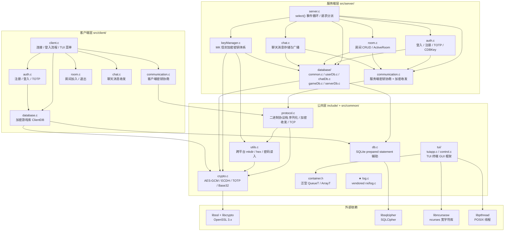

**图例说明**：
- 实线箭头 `→` 表示编译或链接依赖（`#include` 头文件或链接 `.o`）
- `★ log.c` 被图中所有模块链接使用，省略逐个连线以保持可读性
- 服务端 `database/` 子树在 [2.7](#27-server-database-服务端数据库模块) 中有完整展开图
- `container.h` 为 header-only 模板库，通过预处理器宏生成类型安全的泛型队列与数组
- `tui/` 为终端 GUI 框架，依赖 `container.h` 的泛型队列/数组管理消息队列和控件注册表

### 6.4 维护注意事项

**协议与数据格式**：
- `PacketHeader` 是 wire format，使用 `#pragma pack(push, 1)` 消除填充，**严禁随意增删字段**。修改前必须同步更新所有序列化逻辑和 `sizeof(PacketHeader)` 相关测试
- `MAX_PAYLOAD_LEN`（1024）影响加密和反序列化边界，修改需同步调整所有 payload 结构体设计
- `AES_PACKET_EXTRA_LEN`（28 = nonce 12 + tag 16）是加密开销，收包时 `payloadLength` 校验必须考虑此差值

**密码学安全**：
- **AES-GCM nonce 不能复用**——每次加密前必须 `cryptoRandomBytes()` 生成新的 12 字节 nonce。nonce 复用将彻底破坏 GCM 安全性
- AAD（`(payloadLength << 32) | sequenceID`）提供重放保护：解密时 AAD 不匹配返回 `PROTOCOL_AUTH_FAIL`
- `hashPassword()` 与 `verifyPassword()` 使用 `OPENSSL_cleanse` 清理中间值，`verifyPassword` 使用常量时间比较防 timing attack

**数据库与密钥**：
- SQLCipher 数据库密钥必须通过 `OPENSSL_cleanse` 擦除，不能仅 `memset`（编译器可能优化掉）
- `dbClose()` 和 `clientCloseDB()` 内部已实现密钥擦除，调用者无需额外操作
- ServerDB 中 envelope 长度为 60 字节（nonce 12 + key 32 + tag 16），任何不匹配均视为损坏

**内存安全**：
- `packet->payload` 进入 `packetDeserialize()`、`packetRecv()`、`packetRecvEncrypted()` 前**必须为 NULL**，否则返回失败
- `packetClear()` 可重复调用（double-free 安全）
- `listGames()` 返回的 `GameRecord **` 数组有三级释放：`gameName` → `gamePath` → `record` → `array`

**服务端状态机**：
- 任何状态下的非预期消息类型会导致客户端被断开连接
- 密钥交换完成后所有数据包必须为 `AES256GCMPacket`
- `SessionRoom` 和 `SessionChat` 都允许 `MsgTOTPSetupReq` 和 `MsgDBKeyReq`
- 客户端断开连接时自动清理其 ActiveRoom 成员资格，空房间自动删除

**第三方代码**：
- `src/common/log.c` 和 `include/log.h` 是 vendored 第三方代码（rxi/log.c），**不应随意修改**
- 所有日志输出使用 `LOG_TRACE`…`LOG_FATAL` 宏，禁止 `printf`

**运行约束**：
- `CLIENT_DB_PATH` 固定为 `./db/client.db`，多用户共用工作目录时会产生文件冲突
- 服务端首次启动显示的 MK 必须妥善保存，丢失则所有 envelope 无法解密
- `updatePlayTime()` 是**覆盖**累计值，非增量加法

### 6.5 测试与验证

**运行全部测试**：
```bash
make test
```

**运行单个测试**：
```bash
./bin/tests/test_protocol
./bin/tests/test_crypto
./bin/tests/test_server
./bin/tests/test_server_database
./bin/tests/test_client_database
./bin/tests/test_container
./bin/tests/test_communication
./bin/tests/test_client_chat
./bin/tests/test_tui_control
./bin/tests/test_utils
```

**测试框架**：自定义轻量宏框架（`tests/test_utils.h`），提供 `ASSERT_INT_EQ`、`ASSERT_UINT_EQ`、`ASSERT_TRUE`、`ASSERT_FALSE`、`ASSERT_MEM_EQ`、`ASSERT_STR_EQ`、`ASSERT_NULL`、`ASSERT_NOT_NULL`、`RUN_TEST`、`TEST_REPORT`。

**TUI 测试覆盖**：`tests/test_tui_control.c` 覆盖控件构造、vtable 正确性及 InputBox 文本操作逻辑（19 用例），不依赖 ncurses 终端。应用级测试（`tuiAppInit` 等）因需终端交互暂未覆盖。

**新增测试文件后**：须执行 `make json` 更新 `compile_commands.json`，确保 `clang-tidy` 能分析新文件。

### 6.6 典型调用顺序

**服务端调用顺序**：
```
serverInit()          → 创建监听、打开 ServerDB、密钥初始化、打开加密 DB
  ├─ serverInitKeys() → 首次生成 envelope / 已有则输入 MK 解密
  ├─ dbInit(UserDB, userDbEncKey)
  ├─ dbInit(ChatHistoryDB, chatDbEncKey)
  └─ dbInit(GameDB, gameDbEncKey)
serverRun()           → 事件循环（阻塞）
serverCleanup()       → 释放所有资源、密钥擦除
```

**客户端调用顺序**：
```
clientConnect()       → TCP + ECDH + HKDF
clientLogin() 或 clientRegister()
  ├─ 登录成功 → clientInitDB()
  ├─ 可选 clientTOTPSetup()
  └─ clientRoomMenu()
       └─ clientChatLoop()
clientDisconnect()    → clientCloseDB() → OPENSSL_cleanse → socketClose()
```

**可选 TUI 初始化流程**（当前未集成到客户端/服务端主流程中）：
```
tuiAppInit()           → 初始化 ncurses 环境 + 消息队列
  ├─ controlPageConstruct()              → 创建页面根节点
  ├─ controlGridConstruct()              → 创建布局容器
  ├─ controlButtonConstruct() / controlLabelConstruct() / controlInputBoxConstruct()
  │                                       → 创建子控件
  ├─ controlInstantiate(ctrl, parent)    → 为各控件创建 ncurses 窗口并注册到控件树
  └─ tuiAppStart(page)                   → 启动事件循环（阻塞，等待 wgetch / SIGWINCH）
tuiAppStop()           → 退出循环 → endwin
