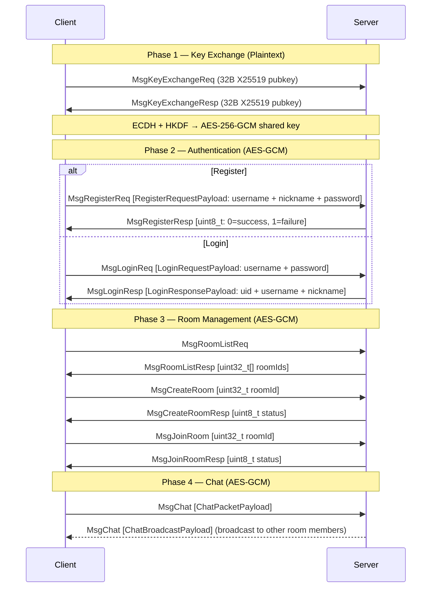
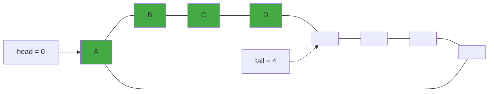
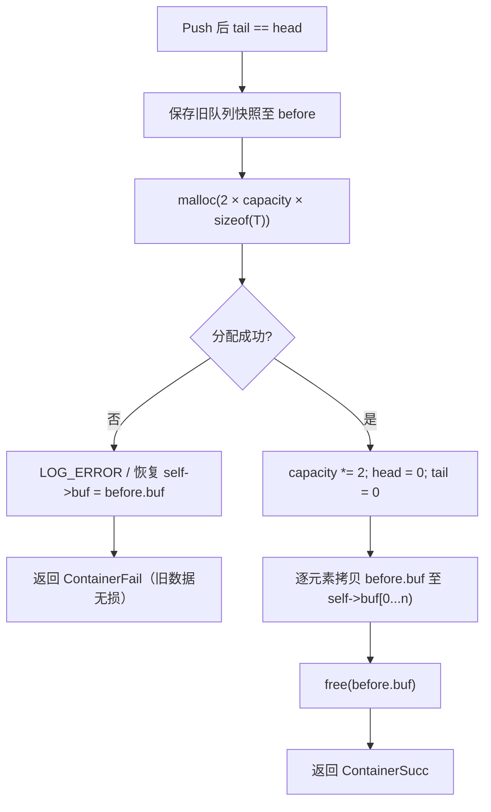
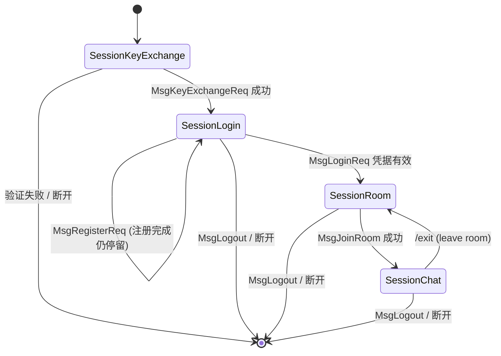
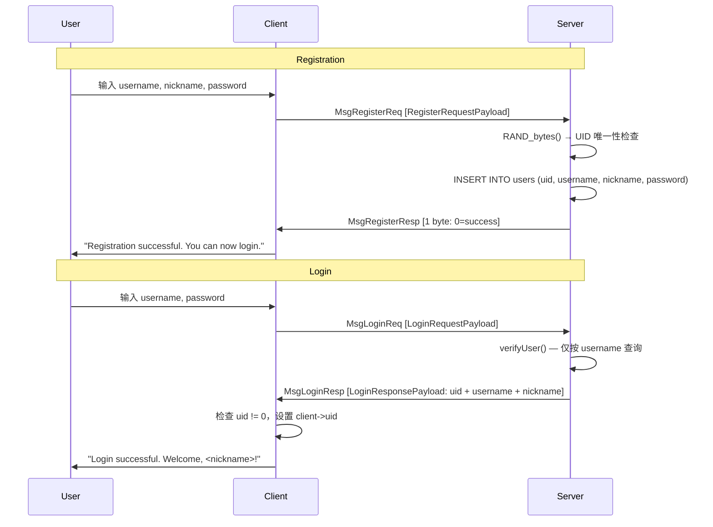

# API 文档

---

## 第一部分：公共 API（`include/`）

本部分涵盖 `include/` 目录下所有对客户端与服务端均可见的公共接口，包括密码学、网络协议、日志及通用工具。

---

### 1.1 Crypto 密码学模块

**接口**：`include/crypto.h`
**实现**：`src/common/crypto.c`

提供与上层协议解耦的低级密码学封装，涵盖 AES-256-GCM 认证加密、ECDH（X25519）密钥协商、HKDF-SHA256 密钥派生及密码学安全随机数生成。所有实现基于 OpenSSL 3.x EVP API，符合 C17 标准。

#### 1.1.1 常量与宏

| 宏                          | 值                   | 说明                                              |
| --------------------------- | -------------------- | ------------------------------------------------- |
| `CRYPTO_SUCC`             | `0`                | 函数执行成功                                      |
| `CRYPTO_FAIL`             | `-1`               | 通用失败                                          |
| `CRYPTO_AUTH_FAIL`        | `-2`               | AES-GCM 认证标签校验失败                          |
| `AES_GCM_KEY_LEN`         | `32`               | AES-256 对称密钥长度（字节）                      |
| `AES_GCM_NONCE_LEN`       | `12`               | GCM 模式 nonce 长度（字节）                       |
| `AES_GCM_TAG_LEN`         | `16`               | GCM 认证标签长度（字节）                          |
| `ECDH_SHARED_SECRET_SIZE` | `32`               | X25519 ECDH 协商后的共享密钥长度（字节）          |
| `ECDH_PUBLIC_KEY_SIZE`    | `32`               | X25519 原始公钥长度（字节）                       |
| `HKDF_INFO_AES_KEY`       | `"PacPlay-AESKey"` | HKDF-SHA256 派生 AES 密钥时使用的固定 info 字符串 |

#### 1.1.2 类型定义

**AESGCMKey**

```c
typedef struct {
    uint8_t key[AES_GCM_KEY_LEN];
    uint8_t nonce[AES_GCM_NONCE_LEN];
} AESGCMKey;
```

AES-256-GCM 的完整密钥材料。`key` 为 32 字节对称密钥；`nonce` 为每次加密前须单独生成的 12 字节随机值。禁止在任何两次加密操作中复用同一 nonce。

**AESGCMBuffer**

```c
typedef struct {
    uint8_t *data;
    size_t capacity;
    size_t len;
} AESGCMBuffer;
```

通用字节缓冲区描述符。`data` 指向由调用者或 `aesGCMBufferInit()` 分配的内存。`encryptAESGCM()` 与 `decryptAESGCM()` 均要求调用者预先为输入/输出缓冲区分配足够内存，函数本身不执行动态分配。

**AESGCMCipher**

```c
typedef struct {
    AESGCMBuffer buffer;
    uint8_t tag[AES_GCM_TAG_LEN];
} AESGCMCipher;
```

AES-GCM 加密输出结构。`buffer.data` 存放密文，`tag` 存放 16 字节认证标签。

#### 1.1.3 缓冲区辅助函数

| 函数                                                         | 说明                                               |
| ------------------------------------------------------------ | -------------------------------------------------- |
| `int aesGCMBufferInit(AESGCMBuffer *buf, size_t capacity)` | 分配 `capacity` 字节堆内存，初始化 `buf->data` |
| `void aesGCMBufferDeinit(AESGCMBuffer *buf)`               | 释放 `buf->data`，指针置为 NULL（可重复调用）    |

调用 `aesGCMBufferInit()` 后须显式调用 `aesGCMBufferDeinit()` 释放，防止内存泄漏。

#### 1.1.4 AES-256-GCM 加密与解密

**`int encryptAESGCM(const AESGCMBuffer *plaintext, const AESGCMBuffer *aad, const AESGCMKey *key, AESGCMCipher *output)`**

对给定明文执行 AES-256-GCM 加密。`aad` 可为 NULL 或零长度。`output->buffer.data` 须由调用者预先分配，且 `output->buffer.capacity >= plaintext->len`。成功返回 `CRYPTO_SUCC`，`output->buffer.len` 为密文长度，`output->tag` 有效。

**`int decryptAESGCM(const AESGCMCipher *cipher, const AESGCMBuffer *aad, const AESGCMKey *key, AESGCMBuffer *plaintext)`**

对给定密文执行 AES-256-GCM 解密并校验认证标签。`aad` 必须与加密时完全一致。返回 `CRYPTO_SUCC`（解密成功）、`CRYPTO_AUTH_FAIL`（认证失败，密文被篡改）或 `CRYPTO_FAIL`（参数非法）。收到 `CRYPTO_AUTH_FAIL` 时不得信任 `plaintext->data` 中的任何内容。

#### 1.1.5 ECDH（X25519）密钥协商

| 函数                                                                                      | 说明                                                                             |
| ----------------------------------------------------------------------------------------- | -------------------------------------------------------------------------------- |
| `EVP_PKEY *genECDHKeypair(void)`                                                        | 生成 X25519 临时密钥对，返回 `EVP_PKEY *`，调用者须以 `EVP_PKEY_free()` 释放 |
| `int exportECDHPublicKey(EVP_PKEY *pkey, uint8_t pub[32])`                              | 提取 32 字节原始公钥，可直接网络传输                                             |
| `EVP_PKEY *importECDHPeerPublicKey(const uint8_t pub[32])`                              | 将对端 32 字节公钥重构为 `EVP_PKEY *`                                          |
| `int deriveECDHSharedSecret(EVP_PKEY *localKey, EVP_PKEY *peerKey, uint8_t secret[32])` | 执行 ECDH 协商，输出 32 字节共享密钥。失败时用 `OPENSSL_cleanse` 清零输出      |

#### 1.1.6 HKDF-SHA256 密钥派生

**`int deriveAESKey(const uint8_t *sharedSecret, size_t secretLen, AESGCMKey *outKey)`**

基于 HKDF（RFC 5869）将 32 字节共享密钥派生为 AES-256-GCM 密钥。使用 SHA-256 摘要，Info 字符串为 `"PacPlay-AESKey"`。成功时 `outKey->key` 包含 32 字节 AES 密钥，`outKey->nonce` 已清零（调用者须在每次加密前用 `cryptoRandomBytes()` 重新生成随机 nonce）。

#### 1.1.7 安全随机数

**`int cryptoRandomBytes(uint8_t *buf, int len)`**

填充密码学安全随机字节。内部调用 OpenSSL `RAND_bytes`。`buf` 不得为 NULL，`len` 须大于 0。

#### 1.1.8 端到端加密密钥协商推荐流程

```
Alice                              Bob
  │                                 │
  ├─ genECDHKeypair()               ├─ genECDHKeypair()
  ├─ exportECDHPublicKey() ────────►├─ importECDHPeerPublicKey()
  ├─ importECDHPeerPublicKey() ◄────├─ exportECDHPublicKey()
  │                                 │
  ├─ deriveECDHSharedSecret()       ├─ deriveECDHSharedSecret()
  ├─ deriveAESKey()                 ├─ deriveAESKey()
  │                                 │
  ▼ 握手完成，AES 密钥就绪          ▼
```

密钥协商完成后，应安全清理临时材料：

```c
OPENSSL_cleanse(sharedSecret, sizeof(sharedSecret));
EVP_PKEY_free(myKeypair);
EVP_PKEY_free(peerKey);
```

通信时的 nonce 管理：每次调用 `encryptAESGCM()` 前用 `cryptoRandomBytes()` 生成新的 12 字节 nonce，与密文一并传送。复用 nonce 将破坏 GCM 的安全性。

---

### 1.2 Protocol 通信协议

**接口**：`include/protocol.h`
**实现**：`src/common/protocol.c`

实现 PacPlay 的二进制网络协议栈，涵盖 TCP 套接字管理、数据包序列化、AES-256-GCM 加密传输及阻塞式收发。`protocol.h` 通过 `#include "crypto.h"` 引入密码学模块的全部类型与常量。

#### 1.2.1 常量与宏

| 宏                       | 值             | 说明                                  |
| ------------------------ | -------------- | ------------------------------------- |
| `PROTOCOL_SUCC`        | `0`          | 函数执行成功                          |
| `PROTOCOL_FAIL`        | `-1`         | 通用失败                              |
| `PROTOCOL_AUTH_FAIL`   | `-2`         | AES-GCM 认证标签校验失败或 AAD 不匹配 |
| `MAX_PAYLOAD_LEN`      | `1024`       | 明文载荷最大字节数                    |
| `LOGIN_USERNAME_LEN`   | `32`         | 用户名固定长度（NUL 终止）            |
| `LOGIN_NICKNAME_LEN`   | `32`         | 昵称固定长度（NUL 终止）              |
| `AES_PACKET_EXTRA_LEN` | `28`         | 加密后额外开销：nonce(12) + tag(16)   |
| `BACKLOG`              | `1024`       | `listen()` 连接队列长度             |
| `NULL_SOCKETFD`        | `-1`         | 无效套接字描述符标识                  |
| `PACKET_MAGIC`         | `0x5050504D` | 包魔术字，ASCII `PPPM`              |

#### 1.2.2 类型定义

**SocketFD**

```c
typedef int SocketFD;
```

套接字文件描述符别名。取值为 `NULL_SOCKETFD` 表示无效或已关闭。

**PacketType 与 MessageType**

```c
typedef enum {
    PlaintextPacket = 1,
    AES256GCMPacket
} PacketType;

typedef enum {
    MsgKeyExchangeReq = 1, MsgKeyExchangeResp,   // Phase 1: 密钥交换
    MsgLoginReq, MsgLoginResp,                    // Phase 2: 认证
    MsgRegisterReq, MsgRegisterResp,              // Phase 2: 注册
    MsgRoomListReq, MsgRoomListResp,              // Phase 3: 房间管理
    MsgCreateRoom, MsgCreateRoomResp,
    MsgJoinRoom, MsgJoinRoomResp,
    MsgChat,                                       // Phase 4: 聊天
    MsgLogout, MsgHeartbeat,                      // 会话生命周期
    MsgGameStart, MsgGameStop                      // Phase 5: 游戏（预留）
} MessageType;
```

`MessageType` 按协议阶段重新排列，值自 1 起连续递增。枚举仅用于命名常量，网络传输中存储为 `uint32_t` 以确保跨平台宽度一致。

**PacketHeader（紧凑打包，无填充）**

```c
#pragma pack(push, 1)
typedef struct {
    uint32_t magic;        // PACKET_MAGIC (0x5050504D)
    uint32_t packetType;   // PlaintextPacket 或 AES256GCMPacket
    uint32_t messageType;  // MessageType 枚举值
    uint32_t payloadLength; // 载荷字节数
    uint32_t sequenceID;    // 单调递增序列号
} PacketHeader;
#pragma pack(pop)
```

`#pragma pack(push, 1)` 消除结构体内存填充，确保 wire format 与内存布局完全一致。所有字段使用 `uint32_t` 定长类型以使平台无关。接收端必须校验 `magic == PACKET_MAGIC`。

**Packet**

```c
typedef struct {
    PacketHeader header;
    uint8_t *payload;
} Packet;
```

完整数据包结构。`header` 与 `payload` 内存**不连续**，`payload` 由调用者或接收函数动态分配。Packet 本身不序列化（header 与 payload 分别传输），故无需 `#pragma pack`。

#### 1.2.3 载荷结构

**KeyExchangePacketPayload**（密钥交换阶段）

```c
#pragma pack(push, 1)
typedef struct {
    uint8_t publicKey[ECDH_PUBLIC_KEY_SIZE]; // 32 字节 X25519 公钥
} KeyExchangePacketPayload;
#pragma pack(pop)
```

**LoginRequestPayload**（登录请求，`MsgLoginReq` 专用）

```c
#pragma pack(push, 1)
typedef struct {
    char username[LOGIN_USERNAME_LEN];  // 32 字节，NUL 终止
    char password[];                    // FAM，长度 = payloadLength - 32
} LoginRequestPayload;
#pragma pack(pop)
```

U6D 不在登录请求中传输 — UID 由服务器在注册时分配，登录时通过 `LoginResponsePayload` 返回给客户端。`username` 为定长 NUL 终止数组；`password` 为柔性数组成员，调用者须确保其 NUL 终止于总载荷内。

**RegisterRequestPayload**（注册请求，`MsgRegisterReq` 专用）

```c
#pragma pack(push, 1)
typedef struct {
    char username[LOGIN_USERNAME_LEN];  // 32 字节，NUL 终止
    char nickname[LOGIN_NICKNAME_LEN];  // 32 字节，NUL 终止
    char password[];                    // FAM，长度 = payloadLength - 64
} RegisterRequestPayload;
#pragma pack(pop)
```

客户端不发送 UID — 服务器利用 `RAND_bytes` 生成随机唯一 UID 并在 `createUser()` 中回填。

**LoginResponsePayload**（登录响应，`MsgLoginResp` 专用）

```c
#pragma pack(push, 1)
typedef struct {
    uint32_t uid;                        // 服务器分配的 UID (0 = 失败)
    char username[LOGIN_USERNAME_LEN];   // 用户名
    char nickname[LOGIN_NICKNAME_LEN];   // 昵称
} LoginResponsePayload;
#pragma pack(pop)
```

服务端在验证成功后返回完整的 `User` 记录（包括 UID、username、nickname）。若验证失败，`uid` 为 0，字符串字段为零填充。客户端须通过检查 `uid != 0` 判定登录是否成功。固定大小 68 字节。

**ChatPacketPayload**（客户端→服务端聊天消息）

```c
#pragma pack(push, 1)
typedef struct {
    int64_t timestamp;       // UTC UNIX 时间戳
    uint8_t message[];       // FAM
} ChatPacketPayload;
#pragma pack(pop)
```

**ChatBroadcastPayload**（服务端→房间成员广播）

```c
#pragma pack(push, 1)
typedef struct {
    uint32_t uid;       // 发送者 UID
    uint64_t msgId;     // 全局唯一消息 ID
    int64_t timestamp;  // UTC UNIX 时间戳
    uint8_t message[];  // FAM
} ChatBroadcastPayload;
#pragma pack(pop)
```

#### 1.2.4 网络连接管理

| 函数                                                      | 说明                                                                                                   |
| --------------------------------------------------------- | ------------------------------------------------------------------------------------------------------ |
| `SocketFD serverSetup(uint16_t port)`                   | 在指定端口创建 TCP 监听套接字，绑定 `INADDR_ANY`，队列长度为 `BACKLOG`。失败返回 `NULL_SOCKETFD` |
| `SocketFD clientSetup(const char *addr, uint16_t port)` | 创建 TCP 客户端套接字并连接。`addr` 须为 IPv4 点分十进制字符串。失败返回 `NULL_SOCKETFD`           |
| `void socketClose(SocketFD *socketFD)`                  | 关闭套接字并重置为 `NULL_SOCKETFD`。重复调用安全                                                     |

#### 1.2.5 数据包序列化与反序列化

**`int packetSerialize(const Packet *packet, uint8_t *buffer, size_t bufferSize, size_t *serializedSize)`**

将 `Packet` 写入连续字节缓冲区，输出顺序为 `PacketHeader` 后紧跟 `payload`。不执行加密 — 若需加密须先调用 `packetAESEncrypt()`。`serializedSize` 输出实际写入字节数（`sizeof(PacketHeader) + payloadLength`）。返回 `PROTOCOL_SUCC` 或 `PROTOCOL_FAIL`。

**`int packetDeserialize(const uint8_t *buffer, size_t bufferSize, Packet *packet)`**

从字节缓冲区解析 `PacketHeader`，校验魔术字，随后为 `payload` 动态分配内存。调用前须保证 `packet->payload == NULL`。成功时 `packet->payload` 由 `malloc` 分配，调用者须以 `packetClear()` 释放。

#### 1.2.6 数据包加密与解密

Protocol 层的加密与解密通过 `crypto` 模块提供的 `encryptAESGCM()` 与 `decryptAESGCM()` 实现。Protocol 模块负责数据包的上下文封装：构造 AAD、管理 nonce/ciphertext/tag 的拼接与解析，以及 Packet 结构的状态转换。

**`int packetAESEncrypt(Packet *packet, uint8_t key[AES_GCM_KEY_LEN])`**

对明文数据包执行原地 AES-256-GCM 加密。

前置条件：`packet->header.packetType == PlaintextPacket`，`payloadLength <= MAX_PAYLOAD_LEN`。

加密流程：

1. 调用 `cryptoRandomBytes()` 生成 12 字节随机 nonce。
2. 构造 AAD 为 `uint64_t` 值 `(payloadLength << 32) | sequenceID`，同时绑定载荷长度与序列号。
3. 调用 `encryptAESGCM()` 加密明文，获得密文与 16 字节 tag。
4. 分配新 payload 内存，按顺序拼接 `nonce(12B) || ciphertext || tag(16B)`。
5. 更新 `packetType = AES256GCMPacket`，`payloadLength` 同步更新为新长度。
6. 释放旧 payload 及临时密文缓冲区。

失败时 packet 的原有状态保持不变（旧 payload 不释放，`packetType` 与 `payloadLength` 不修改），调用者可安全重试。

**`int packetAESDecrypt(Packet *packet, uint8_t key[AES_GCM_KEY_LEN])`**

对加密数据包执行原地 AES-256-GCM 解密。

前置条件：`packet->header.packetType == AES256GCMPacket`，`payloadLength >= AES_PACKET_EXTRA_LEN`。

解密流程：

1. 从载荷前端提取 nonce（12 字节），末端提取 tag（16 字节），中间段为 ciphertext。
2. 重建 AAD 为 `uint64_t` 值 `((payloadLength - AES_PACKET_EXTRA_LEN) << 32) | sequenceID`。
3. 调用 `decryptAESGCM()` 解密 ciphertext 并校验 tag。
4. 解密成功后执行二次 AAD 校验（防御性检查）。
5. 更新 `packetType = PlaintextPacket`，`payloadLength` 恢复为明文长度。

返回：`PROTOCOL_SUCC`（成功）、`PROTOCOL_AUTH_FAIL`（认证失败，数据被篡改）或 `PROTOCOL_FAIL`（参数/格式/内存错误）。

#### 1.2.7 数据包生命周期管理

**`int packetInit(Packet *packet, MessageType msgType, uint32_t seqID, PacketType pktType, const void *data, size_t dataLen)`**

构造完整的 `Packet` 对象，是创建数据包的**唯一推荐入口**。函数内部分配堆内存拷贝 `data` 中的 `dataLen` 字节作为载荷，并设置所有头部字段（包括魔术字 `PACKET_MAGIC`）。

调用前须确保 `packet->payload == NULL`。`dataLen` 必须 `<= MAX_PAYLOAD_LEN`；`dataLen > 0` 时 `data` 不得为 NULL。

区别于 `packetDeserialize()`（从字节流恢复）与 `packetRecv()`（从套接字接收），本函数用于在本地构造待发送的数据包。使用后须调用 `packetClear()` 释放载荷。

**`void packetClear(Packet *packet)`**

释放 `packet->payload` 指向的动态内存并将其置为 NULL。对同一 Packet 重复调用安全。所有通过 `packetDeserialize()`、`packetRecv()` 或 `packetInit()` 获得载荷的 Packet 对象，在生命周期结束前必须调用此函数。

#### 1.2.8 网络收发

| 函数                                                  | 说明                                                                                                                        |
| ----------------------------------------------------- | --------------------------------------------------------------------------------------------------------------------------- |
| `int packetSend(Packet *packet, SocketFD socketFD)` | 分两次发送完 header 与 payload，使用 `sendAll` 循环处理部分写                                                             |
| `int packetRecv(Packet *dest, SocketFD socketFD)`   | 阻塞接收完整数据包，先收 header（校验 magic 与长度），再收 payload。加密包限额为 `MAX_PAYLOAD_LEN + AES_PACKET_EXTRA_LEN` |

#### 1.2.9 协议使用要点

1. **内存所有权**：凡导致 `payload` 非 NULL 的 API（`packetDeserialize`、`packetRecv`、`packetInit`），后续必须配对 `packetClear()`。
2. **加密顺序**：发送加密包应先 `packetAESEncrypt()` 再 `packetSend()`。接收后应先 `packetRecv()` 再 `packetAESDecrypt()`。
3. **AAD 完整性**：AAD 绑定 `(payloadLength << 32) | sequenceID`，任何对 header 的篡改均导致 `PROTOCOL_AUTH_FAIL`。
4. **序列号**：`sequenceID` 为每个会话独立的单调递增计数器，由调用者维护。Protocol 模块不自动递增序列号。

#### 1.2.10 协议数据流总览



---

### 1.3 Log 日志模块

**接口**：`include/log.h`
**实现**：`src/common/log.c`

轻量日志库，修改自 [rxi/log.c](https://github.com/rxi/log.c)。

#### 1.3.1 日志级别

`LogLevelTrace < LogLevelDebug < LogLevelInfo < LogLevelWarn < LogLevelError < LogLevelFatal`

低于全局阈值的消息直接丢弃。默认阈值 `LogLevelTrace`（全部输出）。

#### 1.3.2 便捷宏

| 宏                      | 等价展开                                                |
| ----------------------- | ------------------------------------------------------- |
| `LOG_TRACE(fmt, ...)` | `logLog(LogLevelTrace, __FILE__, __LINE__, fmt, ...)` |
| `LOG_DEBUG(fmt, ...)` | `logLog(LogLevelDebug, __FILE__, __LINE__, fmt, ...)` |
| `LOG_INFO(fmt, ...)`  | `logLog(LogLevelInfo, __FILE__, __LINE__, fmt, ...)`  |
| `LOG_WARN(fmt, ...)`  | `logLog(LogLevelWarn, __FILE__, __LINE__, fmt, ...)`  |
| `LOG_ERROR(fmt, ...)` | `logLog(LogLevelError, __FILE__, __LINE__, fmt, ...)` |
| `LOG_FATAL(fmt, ...)` | `logLog(LogLevelFatal, __FILE__, __LINE__, fmt, ...)` |

所有宏自动捕获 `__FILE__` 和 `__LINE__`，输出至 `stderr`，格式：`HH:MM:SS LEVEL file.c:line: message`。参数与 `printf` 语义一致。

#### 1.3.3 配置函数

| 函数                                                             | 作用                                             |
| ---------------------------------------------------------------- | ------------------------------------------------ |
| `void logSetLevel(LogLevel level)`                             | 设置全局最低输出级别                             |
| `void logSetQuiet(bool enable)`                                | `true` 关闭 stderr 输出，不影响回调            |
| `void logSetLock(LogLockFn fn, void *udata)`                   | 注册加锁回调，多线程必须设置                     |
| `int logAddFp(FILE *fp, LogLevel level)`                       | 添加文件输出（带完整日期格式），最多 32 个回调槽 |
| `int logAddCallback(LogLogFn fn, void *udata, LogLevel level)` | 注册自定义日志后端                               |

#### 1.3.4 线程安全

库内部无锁。多线程场景须通过 `logSetLock()` 注册锁回调：

```c
static pthread_mutex_t mu = PTHREAD_MUTEX_INITIALIZER;
void lockFn(bool lock, void *udata) {
    lock ? pthread_mutex_lock(&mu) : pthread_mutex_unlock(&mu);
}
logSetLock(lockFn, NULL);
```

---

### 1.4 Container 容器模块

**接口**：`include/container.h`
**实现**：`src/common/container.c`

提供泛型数据容器，为服务端与客户端提供通用数据结构支持。当前包含泛型环形缓冲区。

#### 1.4.1 泛型环形缓冲区（QueueT）

通过 `QUEUE_DECLARE(T)` / `QUEUE_IMPLEMENT(T)` 两步预处理器宏模拟 C++ 模板，在编译期为任意数据类型生成类型安全的循环队列（环形缓冲区）实现，支持自动扩容、O(1) 推入/弹出及完整生命周期管理。

##### 常量与宏

| 宏                         | 值    | 说明                                                                              |
| -------------------------- | ----- | --------------------------------------------------------------------------------- |
| `QUEUE_DEFAULT_CAPACITY` | `8` | 队列初始容量（槽位数）。当 `Init` 传入容量为 `0` 时自动采用此默认值           |
| `QUEUE_DECLARE(T)`       | —    | 为类型 `T` 声明队列结构体及函数原型。放置于头文件                               |
| `QUEUE_IMPLEMENT(T)`     | —    | 为类型 `T` 生成所有函数实现。每种类型在**唯一一个** `.c` 文件中调用一次 |

##### 类型定义

**ContainerRes**

```c
typedef enum { ContainerSucc = 0, ContainerFail = -1 } ContainerRes;
```

所有容器函数的统一返回值。`ContainerSucc` 表示操作成功，`ContainerFail` 表示失败（队空、内存不足等）。

**QueueT**（由 `QUEUE_DECLARE(T)` 展开）

以 `T = int` 为例，`QUEUE_DECLARE(int)` 展开后生成如下结构体：

```c
typedef struct {
    int *buf;         // 环形缓冲区，动态分配于堆上
    size_t capacity;  // 当前容量（槽位数，以 sizeof(T) 为单位）
    size_t head;      // 队首索引（下一出队位置）
    size_t tail;      // 队尾索引（下一入队位置）
} Queueint;
```

环形缓冲区的核心不变式：

- **空队列**：`head == tail`
- **满队列**：`tail` 追上 `head`（`Push` 写入后若 `tail == head` 立即触发扩容）
- 有效元素个数（推导值）：`(tail - head + capacity) % capacity`

下图为容量为 8、已存储 4 个元素的环形缓冲区内存布局（绿色槽位为已占用，虚线箭头表示首尾回环）：



Push 操作将元素写入 `buf[tail]` 后 `tail = (tail + 1) % capacity`；Pop 操作 `head = (head + 1) % capacity`（不释放元素内存）。两指针均按模容量循环推进，实现 O(1) 入队/出队。

##### 命名规则

`##` 拼接运算符将类型名 `T` 直接拼入标识符。调用者传入的类型名大小写决定最终函数名：

| 宏调用                    | 结构体名        | Init 函数名         | Push 函数名         |
| ------------------------- | --------------- | ------------------- | ------------------- |
| `QUEUE_DECLARE(int)`    | `Queueint`    | `queueintInit`    | `queueintPush`    |
| `QUEUE_DECLARE(Packet)` | `QueuePacket` | `queuePacketInit` | `queuePacketPush` |

**推荐使用 `typedef` 别名**统一命名风格（参见下方完整使用示例）。

##### 公开 API

| 函数              | 签名                                                       | 返回                                  | 说明                                                                                                                                               |
| ----------------- | ---------------------------------------------------------- | ------------------------------------- | -------------------------------------------------------------------------------------------------------------------------------------------------- |
| `queueTInit`    | `ContainerRes queueTInit(QueueT *self, size_t capacity)` | `ContainerSucc` / `ContainerFail` | 分配 `capacity * sizeof(T)` 字节堆内存并初始化各字段。`capacity == 0` 时使用 `QUEUE_DEFAULT_CAPACITY`。`malloc` 失败返回 `ContainerFail` |
| `queueTDeinit`  | `void queueTDeinit(QueueT *self)`                        | void                                  | 释放 `self->buf` 并置 NULL。传入 NULL 安全返回。对同一 Queue 重复调用安全（double-free 安全）                                                    |
| `queueTFront`   | `ContainerRes queueTFront(QueueT *self, T *result)`      | `ContainerSucc` / `ContainerFail` | 将队首元素**拷贝**至 `*result`。队空时返回 `ContainerFail`，`*result` 不变                                                             |
| `queueTPush`    | `ContainerRes queueTPush(QueueT *self, T data)`          | `ContainerSucc` / `ContainerFail` | 将 `data` 写入队尾，尾指针前进。写后若 `tail == head` 自动调用内部 `Reserve` 扩容为 2 倍。扩容 OOM 时返回 `ContainerFail`，旧数据无损      |
| `queueTPop`     | `ContainerRes queueTPop(QueueT *self)`                   | `ContainerSucc` / `ContainerFail` | 队首指针前进一位，**不返回弹出元素**。队空时返回 `ContainerFail`                                                                           |
| `queueTIsEmpty` | `bool queueTIsEmpty(QueueT *self)`                       | `true` / `false`                  | `head == tail` 时返回 `true`                                                                                                                   |

**注意**：`queueTPop` 不返回被弹出元素的值。如需获取后弹出，先调用 `queueTFront` 后 `queueTPop`。

##### 内部扩容机制（`queueTReserve`）

`Reserve` 为 `static` 函数，对外不可见，仅在队满时由 `Push` 自动触发。扩容流程：



关键保证：

- **原子性**：分配失败时完整恢复 `self->buf` 指向旧缓冲区，队列状态与扩容前完全一致。
- **线性化**：旧环形缓冲区中的元素按 `head → tail` 顺序被拷贝到新缓冲区的连续区间 `[0, n)`，`head` 与 `tail` 重置为 `0` 和 `n`。
- **触发时机**：仅在 `Push` 导致 `(tail + 1) % capacity == head`（即 `tail` 追上 `head`）时触发，而非预判式扩容。

##### 容量语义

```
容量 = 可用槽位数。Push N 次后，若 N ≤ capacity，无需扩容。
若 N > capacity，扩容为 2 × capacity，可容纳至多 2N 个元素。
```

`capacity == 0` 是非法的——容量为 0 的队列没有存储槽位，Push 后 `tail == head`（队满），触发 `Reserve` 时 `0 × 2 = 0` 导致死循环。因此，本模块将 `capacity == 0` 作为"使用默认值"的哨兵：

```c
Queueint q;
queueintInit(&q, 0);   // 等价于 queueintInit(&q, 8)
queueintInit(&q, 256); // 显式指定 256 槽位
```

##### 完整使用示例

以 `uint32_t` 为例演示声明、实现及使用的完整流程：

**第一步 — 头文件中声明（如 `my_queue.h`）**

```c
#include "container.h"

QUEUE_DECLARE(uint32_t)
```

**第二步 — 源文件中实现（如 `my_queue.c`，仅此一处）**

```c
#include "my_queue.h"

QUEUE_IMPLEMENT(uint32_t)
```

**第三步 — 业务代码中使用**

```c
#include "my_queue.h"

void example(void) {
    Queueuint32_t q;

    // 初始化（使用默认容量 8）
    if (queueuint32_tInit(&q, 0) == ContainerFail) {
        LOG_ERROR("OOM");
        return;
    }

    // 推入
    for (uint32_t i = 1; i <= 100; i++) {
        if (queueuint32_tPush(&q, i) == ContainerFail) {
            LOG_ERROR("Push failed at %u", i);
            break;
        }
    }

    // 依次取出并处理
    uint32_t val;
    while (!queueuint32_tIsEmpty(&q)) {
        queueuint32_tFront(&q, &val); // 获取队首
        queueuint32_tPop(&q);         // 弹出
        printf("%u\n", val);
    }

    // 释放
    queueuint32_tDeinit(&q);
}
```

此例中首次扩容发生在第 9 次 Push（容量 8 → 16），后续依次 16 → 32 → 64 → 128。最终队列容纳全部 100 个元素后，容量为 128。

##### 使用要点

1. **声明与实现的分离**：`QUEUE_DECLARE(T)` 可放入头文件供多个翻译单元使用，但 `QUEUE_IMPLEMENT(T)` **必须在唯一一个 `.c` 文件中调用一次**，否则链接时产生多重定义错误。这与 C++ 模板的隐式实例化不同，需显式管理。
2. **内存所有权**：`Init` 在堆上分配 `buf`，`Deinit` 释放之。若 `T` 本身包含指向堆内存的指针（如 `char *`），`Deinit` **仅释放 `buf` 数组本身**，不递归释放 `T` 内部的指针。调用者须在 `Deinit` 前手动遍历释放每个元素的嵌套内存。
3. **`Pop` 不返回元素**：`Pop` 仅移动 `head` 指针，不返回弹出值。获取队首值须先调用 `Front`。对于大型结构体，可避免不必要的数据拷贝。
4. **非线程安全**：所有函数未加锁。多线程环境下须由调用者在外部施加同步（如 `pthread_mutex_t`）。
5. **元素拷贝语义**：`Push` 和 `Front` 均为**值拷贝**（浅拷贝），通过 `=` 赋值完成。对于包含指针成员的复杂类型，需注意浅拷贝导致的悬挂指针问题。
6. **无 `queueTSize` 接口**：未提供直接获取当前元素个数的函数。若需计数，调用者须自行维护外部计数器，或通过推导公式 `(tail - head + capacity) % capacity` 计算（需访问内部字段，破坏封装）。
7. **哨兵容量值**：`Init` 的 `capacity` 参数取 `0` 时使用默认容量 8。`0` 不被视为合法容量，传入非零值则将严格使用该值（无最小值保护——传入 `1` 则仅分配 1 个槽位）。

##### Packet 类型特化风险

`QueuePacket`（通过 `QUEUE_DECLARE(Packet)` 声明）在实际使用中需特别注意，因为 `Packet` 结构体内部含有堆分配指针 `payload`，而队列的所有操作均为**浅拷贝**。以下逐一说明风险场景及正确用法。

**8. 浅拷贝与 payload 所有权**

`Push` 执行 `self->buf[self->tail] = data`（结构体赋值），`Front` 执行 `*result = self->buf[self->head]`。两者均为浅拷贝——仅拷贝 `PacketHeader` 字段和 `payload` **指针值**，不复制 `payload` 指向的堆内存。结果：队列内的 `Packet` 副本与调用方持有的 `Packet` 副本**共享**同一块 `payload` 内存。

若任一方调用 `packetClear` 释放 `payload`，其他副本中的 `payload` 立即成为悬挂指针。因此，将 `Packet` 推入队列后，**原所有者的 `payload` 所有权已转移至队列**，原所有者不应再单独释放该 `Packet`。

**9. `Pop` 不释放 payload → 内存泄漏**

`Pop` 仅将 `head` 指针前移一位，不调用 `packetClear`。这意味着：

- 若在 `Pop` 之前未通过 `Front` 取出元素并手动 `packetClear`，该元素的 `payload` 将永久泄漏。
- 正确用法：先 `Front` 取出队首，处理完毕后 `packetClear(&front)`，然后 `Pop`。示例：

```c
Packet front;
while (!queuePacketIsEmpty(&q)) {
    queuePacketFront(&q, &front);
    // ... 处理 front ...
    packetClear(&front);   // 释放 payload，防止泄漏
    queuePacketPop(&q);    // 仅移动 head 指针
}
```

**10. `Deinit` 前必须清空队列**

`Deinit` 只执行 `free(self->buf)` 释放 `Packet` 结构体数组，**不遍历**调用每个元素的 `packetClear`。若队列中仍残留未弹出的 `Packet`（`payload != NULL`），它们将随 `Deinit` 永久泄漏。正确清理流程：

```c
// 1. 清空队列（逐个弹出并释放）
while (!queuePacketIsEmpty(&q)) {
    Packet pkt;
    queuePacketFront(&q, &pkt);
    packetClear(&pkt);
    queuePacketPop(&q);
}
// 2. 释放队列缓冲区
queuePacketDeinit(&q);
```

**11. Double-Init 导致旧缓冲区泄漏**

`Init` **不检查**队列是否已初始化。对同一 `QueuePacket` 调用两次 `Init`（中间未调用 `Deinit`），第一次分配的缓冲区将被覆盖且无法追踪，导致永久内存泄漏：

```c
QueuePacket q;
queuePacketInit(&q, 4);   // 分配 buf A
queuePacketInit(&q, 8);   // 分配 buf B，覆盖 buf A 指针 → buf A 泄漏
queuePacketDeinit(&q);    // 仅释放 buf B
```

**防范**：(a) 在首次 `Init` 前用 `memset(&q, 0, sizeof(q))` 零初始化，或 (b) `Init` → `Deinit` → `Init` 成对调用。

**12. `Reserve` 扩容时的所有权转移**

当队列满触发 `Reserve` 扩容时，旧缓冲区中的 `Packet` 通过浅拷贝转移至新缓冲区，旧缓冲区随后被 `free`。`payload` 指针在此过程中被正确转移（未被重复释放），因此扩容不会导致 payload 泄漏。所有元素在扩容后仍保持有效。

---

### 1.5 Utils 工具模块

**接口**：`include/utils.h`
**实现**：`src/common/utils.c`

提供通用辅助宏与跨平台工具函数。

**通用宏**

```c
#define MAX(a, b) ((a) > (b) ? (a) : (b))
#define MIN(a, b) ((a) < (b) ? (a) : (b))
```

**时间戳**

```c
time_t getCurrentTimestamp(void);
```

获取当前 UTC UNIX 时间戳（秒）。内部调用 ISO C `time()` 函数，跨平台（POSIX / Windows / macOS）。失败返回 `(time_t)-1`。

**密码读入**

```c
size_t readPasswordMasked(char *buf, size_t bufsize);
```

从 stdin 读取密码并显示 `*` 掩码。当 stdin 为终端时禁用 echo，读取至多 `bufsize - 1` 个字符，处理退格键，完成后恢复终端设置。当 stdin 为非终端时退化为普通 `fgets()`（不掩码）。缓冲区始终 NUL 终止，尾随换行符已消费但不存入。返回实际读取的密码长度（不含 NUL），EOF 或错误返回 0。调用者应在之后 `printf("\n")` 以推进光标。

---

## 第二部分：服务端 API（`src/server/`）

本部分涵盖服务端专属的模块，包括事件循环与会话管理、数据库持久化及服务端密钥协商。

---

### 2.1 Server 服务端模块

**接口**：`src/server/server.h`
**实现**：`src/server/server.c`

实现 `select()` 驱动的单线程事件循环，管理客户端会话生命周期（KeyExchange → Login → Room → Chat）、房间成员追踪及消息广播。

#### 2.1.1 常量

| 宏                           | 值        | 说明                                                         |
| ---------------------------- | --------- | ------------------------------------------------------------ |
| `USERNAME_MAX_LEN`         | `32`    | 用户名最大长度（含 NUL），与 `LOGIN_USERNAME_LEN` 保持同步 |
| `NICKNAME_MAX_LEN`         | `32`    | 昵称最大长度（含 NUL），与 `LOGIN_NICKNAME_LEN` 保持同步   |
| `MAX_CLIENTS_PER_ROOM`     | `10`    | 单个房间最大客户端数                                         |
| `SERVER_INITIAL_CAPACITY`  | `16`    | 动态 session / room 数组初始容量                             |
| `SERVER_SELECT_TIMEOUT_US` | `16000` | `select()` 超时时间（微秒，约 60 Hz）                      |
| `SERVER_SUCC`              | `0`     | 操作成功                                                     |
| `SERVER_FAIL`              | `-1`    | 操作失败                                                     |

#### 2.1.2 服务端状态机



#### 2.1.3 类型定义

**User**

```c
typedef struct {
    char username[USERNAME_MAX_LEN];  // NUL 终止
    char nickname[NICKNAME_MAX_LEN];  // NUL 终止
    uint32_t uid;                     // 服务器分配的唯一标识符
    char *password;                   // 明文密码（存储前哈希处理）
} User;
```

`User` 结构体用于数据库注册/验证及 `ClientSession.currentUser`。`password` 指针为明文（调用者所有），数据库内部通过 `hashPassword()` 计算 salted hash 后存储。登录成功后 `currentUser.password` 设为 NULL。

**SessionState**

```c
typedef enum {
    SessionKeyExchange = 0,  // 等待 MsgKeyExchangeReq
    SessionLogin,           // 等待 MsgLoginReq / MsgRegisterReq
    SessionRoom,            // 大厅 — 可列出/创建/加入房间
    SessionChat             // 房间内 — 可聊天及心跳
} SessionState;
```

**ClientSession**

```c
typedef struct {
    SocketFD fd;
    SessionState state;
    AESGCMKey aesKey;
    User currentUser;        // 登录成功后填充
    uint32_t currentRoomId;  // 0 = 未加入房间
    uint32_t seqID;          // 每客户端单调递增序列号
} ClientSession;
```

**ActiveRoom**

```c
typedef struct {
    uint32_t roomId;
    ClientSession *members[MAX_CLIENTS_PER_ROOM];
    int memberCount;
} ActiveRoom;
```

仅追踪在线成员，用于广播。房间持久化由 GameDB 管理。

**Server**

```c
typedef struct {
    SocketFD listenFd;
    ClientSession **clients;    // 动态数组
    int clientCount;
    int clientCapacity;
    ActiveRoom **activeRooms;   // 动态数组
    int activeRoomCount;
    int activeRoomCapacity;
    struct DB *userDB;
    struct DB *chatDB;
    struct DB *gameDB;
} Server;
```

#### 2.1.4 公开 API

| 函数                                         | 说明                                                                           |
| -------------------------------------------- | ------------------------------------------------------------------------------ |
| `int serverInit(Server *s, uint16_t port)` | 创建监听套接字，打开 userDB / chatDB / gameDB。须传入零初始化的 `Server`     |
| `void serverRun(Server *s)`                | 进入 `select()` 事件循环（阻塞直至进程终止）。16ms 超时为后续 game tick 预留 |
| `void serverCleanup(Server *s)`            | 断开所有客户端、释放 session/room、关闭数据库                                  |

#### 2.1.5 Handler 处理逻辑

| 阶段        | 接收包                | 处理行为                                                                                                                                                                                                             |
| ----------- | --------------------- | -------------------------------------------------------------------------------------------------------------------------------------------------------------------------------------------------------------------- |
| KeyExchange | `MsgKeyExchangeReq` | 调用 `serverExchangeAESKey()` → 状态切至 `SessionLogin`                                                                                                                                                         |
| Login       | `MsgLoginReq`       | 解析 `LoginRequestPayload`（username + password），调用 `verifyUser()`。成功则发送 `LoginResponsePayload`（uid + username + nickname），状态切至 `SessionRoom`；失败则发送 uid=0 的 `LoginResponsePayload` |
| Login       | `MsgRegisterReq`    | 解析 `RegisterRequestPayload`（username + nickname + password），调用 `createUser()`（服务器自动生成 UID），发送单字节状态响应。注册后不自动登录，客户端须另行发送 `MsgLoginReq`                               |
| Login       | `MsgLogout`         | 断开连接                                                                                                                                                                                                             |
| Room        | `MsgRoomListReq`    | 查询 GameDB → 发送房间 ID 数组                                                                                                                                                                                      |
| Room        | `MsgCreateRoom`     | 写入 GameDB →`MsgCreateRoomResp`（0/1）                                                                                                                                                                           |
| Room        | `MsgJoinRoom`       | 检查 GameDB 存在性 → 加入 ActiveRoom →`MsgJoinRoomResp`（0/1）→ 状态切至 `SessionChat`                                                                                                                        |
| Room        | `MsgLogout`         | 断开连接                                                                                                                                                                                                             |
| Chat        | `MsgChat`           | 存入 ChatHistoryDB → 广播 `ChatBroadcastPayload` 给同房间其他成员                                                                                                                                                 |
| Chat        | `MsgHeartbeat`      | 回显 `MsgHeartbeat`                                                                                                                                                                                                |
| Chat        | `MsgLogout`         | 断开连接                                                                                                                                                                                                             |

#### 2.1.6 协议违规

在任何状态下接收到非预期的消息类型（如 `SessionLogin` 状态收到 `MsgChat`），服务端记录警告并断开该客户端。密钥交换完成后，所有数据包必须为 `AES256GCMPacket` 类型，明文包将被拒绝并导致断开。

---

### 2.2 Database 数据库模块

**接口**：`src/server/database.h`
**实现**：`src/server/database.c`

提供基于 SQLite3 的持久化数据层，涵盖用户管理（注册、删除、验证）、聊天记录存储/查询及游戏房间持久化。数据库采用三个独立文件：`db/user.db`（用户库）、`db/chatHistory.db`（聊天记录库）和 `db/game.db`（游戏房间库）。

#### 2.2.1 常量与宏

| 宏                       | 值                      | 说明                    |
| ------------------------ | ----------------------- | ----------------------- |
| `DB_SUCC`              | `0`                   | 操作成功                |
| `DB_FAIL`              | `-1`                  | 操作失败                |
| `USER_DB_PATH`         | `"db/user.db"`        | 用户数据库文件路径      |
| `CHAT_HISTORY_DB_PATH` | `"db/chatHistory.db"` | 聊天记录数据库文件路径  |
| `GAME_DB_PATH`         | `"db/game.db"`        | 游戏房间数据库文件路径  |
| `DB_DIRECTORY`         | `"db"`                | 数据库文件所在目录      |
| `ROOM_STMT_BUCKETS`    | `32`                  | Room 语句缓存哈希表桶数 |

#### 2.2.2 类型定义

**DBType**

```c
typedef enum { UserDB = 1, ChatHistoryDB, GameDB } DBType;
```

标识数据库类型。`dbInit()` 据此确定文件路径和 schema 初始化策略。

**Chat**

```c
typedef struct {
    uint32_t uid;
    uint64_t msgId;    // 全局唯一递增 ID，存入时忽略，存入后由数据库回填
    char *message;     // 查询返回时由 strdup 分配，调用者须 free
    time_t timestamp;  // UTC 秒级 UNIX 时间
} Chat;
```

**RoomStmtCache**

```c
typedef struct {
    RoomStmtEntry *buckets[ROOM_STMT_BUCKETS];
} RoomStmtCache;
```

按 `roomId % 32` 索引的链式哈希表，存放每个聊天室缓存的 4 条 prepared statement（INSERT、SELECT-by-id、SELECT-by-time-uid、SELECT-by-time-all）。

**DB**

```c
typedef struct DB {
    sqlite3 *handle;
    DBType type;
    sqlite3_stmt *stmtInsert;      // INSERT (UserDB / GameDB)
    sqlite3_stmt *stmtDelete;      // DELETE (UserDB / GameDB)
    sqlite3_stmt *stmtSelect;      // SELECT (UserDB / GameDB)
    sqlite3_stmt *stmtRoomExists;  // SELECT 1 FROM rooms WHERE roomId=? (GameDB)
    sqlite3_stmt *stmtUidCheck;    // SELECT 1 FROM users WHERE uid=? (UserDB)
    sqlite3_stmt *stmtSeq;         // Global msg sequence INSERT (ChatHistoryDB)
    RoomStmtCache *roomCache;      // Per-room statement cache (ChatHistoryDB)
} DB;
```

#### 2.2.3 数据库 Schema

**UserDB (`db/user.db`)**

```sql
CREATE TABLE IF NOT EXISTS users (
    uid INTEGER PRIMARY KEY,      -- 服务器随机生成，数据库唯一性约束
    username TEXT UNIQUE NOT NULL,
    nickname TEXT NOT NULL,
    password TEXT NOT NULL         -- 格式: "<salt_hex>:<hash_hex>"
);
```

`password` 字段存储 `hashPassword()` 的输出（SHA-256 + 128-bit 随机 salt），而非明文。

**ChatHistoryDB (`db/chatHistory.db`)**

全局序列表（初始化时创建）：

```sql
CREATE TABLE IF NOT EXISTS msg_sequence (
    id INTEGER PRIMARY KEY AUTOINCREMENT
);
```

每次插入消息前向此表 INSERT 一行，取 `last_insert_rowid()` 作为全局唯一 msgId。

Room 表（首次访问时按需创建）：

```sql
CREATE TABLE IF NOT EXISTS room_<roomId> (
    msgId INTEGER PRIMARY KEY,
    uid INTEGER NOT NULL,
    message TEXT NOT NULL,
    timestamp INTEGER NOT NULL
);
CREATE INDEX IF NOT EXISTS idx_<roomId>_ts ON room_<roomId>(timestamp);
CREATE INDEX IF NOT EXISTS idx_<roomId>_uid_ts ON room_<roomId>(uid, timestamp);
```

**GameDB (`db/game.db`)**

```sql
CREATE TABLE IF NOT EXISTS rooms (
    roomId INTEGER PRIMARY KEY,
    creatorUid INTEGER NOT NULL,
    createdAt INTEGER NOT NULL
);
```

#### 2.2.4 生命周期管理

| 函数                           | 说明                                                                                                                        |
| ------------------------------ | --------------------------------------------------------------------------------------------------------------------------- |
| `DB *dbInit(DBType dbType)`  | 打开（或创建）指定类型数据库。自动创建 `db/` 目录，启用 WAL journal 模式及外键约束。失败返回 NULL，所有已分配资源正确释放 |
| `void dbClose(DB *database)` | 关闭数据库连接并释放所有关联资源。`dbClose(NULL)` 为安全的 no-op                                                          |

#### 2.2.5 用户操作

**`int createUser(DB *database, User *user)`**

创建新用户。`user->uid` 字段在调用前被忽略，函数内部通过以下流程生成唯一 UID：

1. 校验参数（非空 username/nickname/password，数据库类型为 UserDB）。
2. **UID 生成循环**（最多 10 次尝试）：
   - 调用 `RAND_bytes()` 生成 32 位随机值。
   - 跳过零值（0 保留为 sentinel）。
   - 通过缓存的 `stmtUidCheck` 查询 `SELECT 1 FROM users WHERE uid = ?` 进行唯一性检查。
   - 若该 UID 不存在，赋值给 `user->uid` 并跳出循环。
   - 若 10 次尝试均失败，返回 `DB_FAIL`。
3. 调用 `hashPassword()` 生成 `"salt_hex:hash_hex"` 格式的哈希字符串。
4. 通过缓存的 `stmtInsert` 执行 INSERT。
5. 用 `OPENSSL_cleanse` 安全擦除哈希字符串内存后释放。

返回 `DB_SUCC`（成功）或 `DB_FAIL`（参数非法、UID 生成失败、用户名已存在、密码哈希失败、SQLite 错误）。

**`int deleteUser(DB *database, User *user)`**

按 uid 删除用户。严格模式：uid 不存在时返回 `DB_FAIL`。

**`int verifyUser(DB *database, User *user)`**

验证用户凭据。身份认证仅依赖 username + password — **UID 不再参与认证**，客户端在首次登录前不知道自己的 UID。

1. 以 username 为条件查询 `SELECT uid, nickname, password FROM users WHERE username = ?`（仅绑定 username，不绑定 uid）。
2. 若用户存在，提取 `user->uid`（从数据库列 0）、`user->nickname`（从列 1）和 stored hash（从列 2）。
3. 调用 `verifyPassword()`（SHA-256 常量时间比较）校验密码。
4. 若密码匹配，`user->uid` 与 `user->nickname` 已被填充（从数据库恢复为规范值）。

安全设计：函数不区分"用户不存在"与"密码错误"，统一返回 `DB_FAIL`，防止用户枚举攻击。密码比较使用 `CRYPTO_memcmp` 常量时间算法。

#### 2.2.6 聊天记录操作

| 函数                                                                                                                                   | 说明                                                                                                                                                                   |
| -------------------------------------------------------------------------------------------------------------------------------------- | ---------------------------------------------------------------------------------------------------------------------------------------------------------------------- |
| `int storeChat(DB *database, uint32_t roomId, Chat *chat)`                                                                           | 存入一条聊天消息，msgId 由数据库生成并回填                                                                                                                             |
| `int queryChatByMsgId(DB *database, uint32_t roomId, uint64_t msgId, Chat *out)`                                                     | 按全局唯一 msgId 查询单条记录，`out->message` 须 `free`                                                                                                            |
| `int queryChatByTimeRange(DB *database, uint32_t roomId, uint32_t uid, time_t startTime, time_t endTime, Chat **out, size_t *count)` | 查询指定房间时间范围闭区间 `[startTime, endTime]` 内的消息。`uid == 0` 查询所有用户。结果按 msgId ASC 排序。调用者须 `free` 每个 `out[i].message` 及数组本身   |
| `int queryChatByUserAllRooms(DB *database, uint32_t uid, time_t startTime, time_t endTime, Chat **out, size_t *count)`               | 跨所有房间查询指定用户的消息，按全局 msgId ASC 排序返回。通过 `sqlite_master` 发现所有 room 表，使用缓存的 `stmtSelectByTimeUid` 逐表查询，最后 `qsort` 合并排序 |

所有函数通过 `getOrCreateRoomStmts()` 在首次访问某 room 时自动创建表、索引并缓存 prepared statement，后续访问直接命中缓存。结果上限 100000 条以防范 OOM。所有用户输入通过参数绑定（`?` 占位符），不存在 SQL 注入风险。

#### 2.2.7 GameDB — 游戏房间持久化

| 函数                                                                   | 说明                                                                                              |
| ---------------------------------------------------------------------- | ------------------------------------------------------------------------------------------------- |
| `int createRoom(DB *database, uint32_t roomId, uint32_t creatorUid)` | 创建房间记录，`createdAt` 由 `time(NULL)` 填充。`roomId` 不得为 0，重复创建返回 `DB_FAIL` |
| `int deleteRoom(DB *database, uint32_t roomId)`                      | 删除房间。严格模式：不存在则返回 `DB_FAIL`                                                      |
| `int listRooms(DB *database, uint32_t **outRoomIds, size_t *count)`  | 列出所有房间 ID，按 `roomId ASC` 排序。调用者须 `free(*outRoomIds)`                           |
| `int roomExists(DB *database, uint32_t roomId)`                      | 检查房间是否存在，用于 `handleRoomJoin` 验证                                                    |

#### 2.2.8 Prepared Statement 缓存机制

本模块的核心设计理念是"编译一次、复用多次"：

- **UserDB**：5 条固定 stmt（INSERT、DELETE、SELECT、UID check、Room exists）在 `dbInit` 时编译，通过 `sqlite3_reset` + `sqlite3_clear_bindings` 重复使用。
- **ChatHistoryDB**：由于表名包含动态 roomId，采用按需缓存策略 — 首次访问某 room 时创建表和索引、编译 4 条 stmt 并存入哈希表（冲突以链表解决），`dbClose` 时遍历哈希表统一 finalize。

---

### 2.3 Server Communication 服务端通信模块

**接口**：`src/server/communication.h`
**实现**：`src/server/communication.c`

封装服务端侧的 ECDH+HKDF 密钥协商流程。

#### 2.3.1 常量

| 宏            | 值     | 说明     |
| ------------- | ------ | -------- |
| `COMM_SUCC` | `0`  | 操作成功 |
| `COMM_FAIL` | `-1` | 操作失败 |

#### 2.3.2 `int serverExchangeAESKey(SocketFD clientFD, Packet *reqPacket, AESGCMKey *outKey)`

完成服务端侧的密钥交换。

完整流程：

1. 对 `reqPacket`（调用方事先通过 `packetRecv` 接收）执行零信任校验：
   - 消息类型必须为 `MsgKeyExchangeReq`。
   - 包类型必须为 `PlaintextPacket`。
   - 载荷长度必须精确等于 `ECDH_PUBLIC_KEY_SIZE`（32 字节）。
   - 拒绝对方发回的己方公钥（反射/自环攻击防御）。
2. 生成临时 X25519 密钥对，导出己方公钥。
3. 提取客户端公钥后以 `OPENSSL_cleanse` 清零 `reqPacket->payload` 中的公钥数据。
4. 将服务端公钥填入 `MsgKeyExchangeResp` 包发送给客户端。
5. 导入客户端公钥，执行 ECDH 协商得到 32 字节共享密钥。
6. 通过 HKDF-SHA256 派生为 32 字节 AES-256-GCM 密钥。
7. 清零所有敏感缓冲，释放临时 EVP_PKEY 对象。

返回后 `reqPacket->payload` 已清零但**未被释放**，调用者须随后调用 `packetClear(reqPacket)`。

---

## 第三部分：客户端 API（`src/client/`）

本部分涵盖客户端专属的模块，包括 CLI 状态机与会话管理及客户端密钥协商。

---

### 3.1 Client 客户端模块

**接口**：`src/client/client.h`
**实现**：`src/client/client.c`

实现交互式 CLI 客户端，支持连接、密钥交换、注册、登录、房间管理及实时聊天。

#### 3.1.1 常量

| 宏              | 值     | 说明     |
| --------------- | ------ | -------- |
| `CLIENT_SUCC` | `0`  | 操作成功 |
| `CLIENT_FAIL` | `-1` | 操作失败 |

#### 3.1.2 类型定义

```c
typedef struct {
    SocketFD fd;
    AESGCMKey aesKey;
    uint32_t uid;           // 由服务器在登录成功时分配
    uint32_t currentRoomId;
    uint32_t seqID;         // 单调递增序列号
} Client;
```

#### 3.1.3 公开 API

| 函数                                                              | 说明                                                                                                                                                                                                                                                  |
| ----------------------------------------------------------------- | ----------------------------------------------------------------------------------------------------------------------------------------------------------------------------------------------------------------------------------------------------- |
| `int clientConnect(Client *c, const char *addr, uint16_t port)` | 建立 TCP 连接并执行 ECDH+HKDF 密钥交换。成功时 `c->aesKey` 已就绪                                                                                                                                                                                   |
| `int clientLogin(Client *c)`                                    | 从 stdin 交互式读入 username 和 password（密码掩码显示），发送 `MsgLoginReq`（`LoginRequestPayload`），接收 `MsgLoginResp`（`LoginResponsePayload`），通过 `resp->uid != 0` 判定成功。成功时 `c->uid` 被设置，显示欢迎信息（含 nickname） |
| `int clientRegister(Client *c)`                                 | 从 stdin 交互式读入 username、nickname 和 password，发送 `MsgRegisterReq`（`RegisterRequestPayload`）。UID 由服务器自动分配，注册成功后可另行登录获取                                                                                             |
| `int clientRoomMenu(Client *c)`                                 | 拉取房间列表，提供交互式 `[c]reate room`、`[j]oin room`、`[r]efresh`、`[q]uit` 菜单                                                                                                                                                           |
| `int clientChatLoop(Client *c)`                                 | 进入房间聊天循环：使用 `select(stdin, socket)` 同时监听键盘输入和网络消息。stdin 输入以 `MsgChat` 发送；收到的 `ChatBroadcastPayload` 格式化显示。支持 `/exit`（登出）和 `/help` 命令                                                       |
| `void clientDisconnect(Client *c)`                              | 安全擦除 AES 密钥并关闭套接字                                                                                                                                                                                                                         |

#### 3.1.4 注册与登录流程



#### 3.1.5 聊天命令

| 命令      | 行为                             |
| --------- | -------------------------------- |
| `/exit` | 发送 `MsgLogout`，退出聊天循环 |
| `/help` | 显示可用命令列表                 |

---

### 3.2 Client Communication 客户端通信模块

**接口**：`src/client/communication.h`
**实现**：`src/client/communication.c`

封装客户端侧的 ECDH+HKDF 密钥协商流程。

#### 3.2.1 常量

| 宏            | 值     | 说明     |
| ------------- | ------ | -------- |
| `COMM_SUCC` | `0`  | 操作成功 |
| `COMM_FAIL` | `-1` | 操作失败 |

#### 3.2.2 `int clientExchangeAESKey(SocketFD socketFD, AESGCMKey *outKey)`

完成客户端侧的密钥交换。

完整流程：

1. 生成临时 X25519 密钥对，导出己方 32 字节公钥。
2. 通过 `packetInit` 构造 `MsgKeyExchangeReq` 包，通过 `packetSend` 发送。
3. 阻塞接收服务端 `MsgKeyExchangeResp` 包。
4. 对接收包执行零信任校验（消息类型、包类型、载荷长度），拒绝反射攻击。
5. 提取服务端公钥并导入。
6. 执行 ECDH 协商 + HKDF-SHA256 派生 → 32 字节 AES-256-GCM 密钥。
7. 清零所有敏感缓冲，释放临时 EVP_PKEY 对象。

成功时 `outKey->nonce` 已清零，调用者须在每次加密前通过 `cryptoRandomBytes()` 生成新的随机 nonce。
