# API 文档

---

## 0. 阅读导引

### 0.1 项目 API 分层

PacPlay 的 API 按编译边界分为三层：

| 层       | 目录                                                                        | 可见性                                                            |
| -------- | --------------------------------------------------------------------------- | ----------------------------------------------------------------- |
| 公共层   | `include/` + `src/common/` （含 `include/tui/` + `src/common/tui/` ） | 服务端和客户端共享。头文件在 `include/` ，实现在 `src/common/` |
| 服务端层 | `src/server/` | 仅供服务端链接。内部头文件在 `src/server/` 下                   |
| 客户端层 | `src/client/` | 仅供客户端链接。内部头文件在 `src/client/` 下                   |

测试代码链接所有三层（除 `main.o` ），可调用任意模块的公开函数。

### 0.2 编译与运行前置依赖

* **编译器**：`clang`（默认 GNU17 方言）
* **链接库**：`libssl` + `libcrypto`（OpenSSL 3.x）、`libsqlcipher`、`libncursesw`（TUI 框架终端渲染）、`libpthread`（线程同步）、`libz-ng`（zlib-ng 日志压缩）
* **静态分析**：`clang-tidy` + `run-clang-tidy`（`clang-tools` 包）
* **构建**：`make all`（自动执行分析 + 编译）
* **测试**：`make test`（编译并运行所有测试套件）

### 0.3 文档约定

* **返回值**：各模块定义自己的 `*_SUCC` / `*_FAIL` 宏，通常 `0` 为成功、`-1`（或负数）为失败
* **payload 所有权**：除明确声明外，调用者传入的 payload 不会被函数释放；函数内部分配的资源由调用者按文档释放
* **Packet 生命周期**：`packet->payload` 须在调用 `packetInit`、`packetDeserialize`、`packetRecv` 前为 `NULL`；使用后须调用 `packetClear()`
* **SQLCipher 密钥**：数据库加密密钥在 `dbClose()` / `clientCloseDB()` 中通过 `OPENSSL_cleanse` 擦除

### 0.4 推荐阅读路径

* **想理解网络协议**：先读 [1.2 Protocol](#12-protocol-通信协议)，再读 [4.3-4.6](#第四部分端到端协议与典型业务流程) 端到端流程
* **想理解认证**：先读 [1.1 Crypto](#11-crypto-密码学模块) 的密码/TOTP，再读 [2.2 Server Auth](#22-server-auth-认证模块) 和 [3.1 Client](#31-client-客户端主模块)
* **想理解数据库**：先读 [2.7 Server Database](#27-server-database-服务端数据库模块)，再读 [3.6 Client Database](#36-client-database-客户端数据库模块)
* **想理解社交系统**：先读 [2.11-2.15 Server Social](#211-server-friend-好友模块) 和 [3.8-3.10 Client Social](#38-client-social-社交逻辑模块)，再读 [4.7 社交流程](#47-社交系统端到端流程)
* **想理解终端 UI**：先读 [1.7 TUI](#17-tui-终端-ui-框架) 的消息系统、控件类型和事件循环，再读 [2.10 Server TUI](#210-server-tui-服务端管理面板) 和 [3.7 Client TUI](#37-client-tui-客户端界面系统) 的页面导航
* **想理解游戏管理**：先读 [2.9 Server GameDB](#29-server-gamedb-游戏元数据模块)，再读 [3.6 Client Database](#36-client-database-客户端数据库模块)
* **想理解剪贴板与 QR 码**：读 [1.8 Clipboard](#18-clipboard-剪贴板模块) 和 [1.9 QR Code](#19-qr-code-二维码生成模块)
* **想调用 API**：直接看 [第五部分：可运行示例](#第五部分可运行示例)
* **想知道函数释放规则**：查 [6.2 内存所有权表](#62-内存所有权表)

---

## 第一部分：公共 API（ `include/` ）

本部分涵盖 `include/` 目录下所有对客户端与服务端均可见的公共接口，包括密码学、网络协议、日志、容器、通用工具、公共数据库辅助、TUI 终端 UI 框架、剪贴板工具及二维码生成。

---

### 1.1 Crypto 密码学模块

**接口**： `include/crypto.h`

**实现**： `src/common/crypto.c`

提供与上层协议解耦的低级密码学封装，涵盖 AES-256-GCM 认证加密、ECDH（X25519）密钥协商、HKDF-SHA256 密钥派生、密码学安全随机数生成、Base32 编解码、TOTP 与密码哈希。所有实现基于 OpenSSL 3.x EVP API。

#### 1.1.1 常量与宏

| 宏                          | 值                   | 说明                                              |
| --------------------------- | -------------------- | ------------------------------------------------- |
| `CRYPTO_SUCC` | `0` | 函数执行成功                                      |
| `CRYPTO_FAIL` | `-1` | 通用失败                                          |
| `CRYPTO_AUTH_FAIL` | `-2` | AES-GCM 认证标签校验失败                          |
| `AES_GCM_KEY_LEN` | `32` | AES-256 对称密钥长度（字节）                      |
| `AES_GCM_NONCE_LEN` | `12` | GCM 模式 nonce 长度（字节）                       |
| `AES_GCM_TAG_LEN` | `16` | GCM 认证标签长度（字节）                          |
| `ECDH_SHARED_SECRET_SIZE` | `32` | X25519 ECDH 协商后的共享密钥长度（字节）          |
| `ECDH_PUBLIC_KEY_SIZE` | `32` | X25519 原始公钥长度（字节）                       |
| `HKDF_INFO_AES_KEY` | `"PacPlay-AESKey"` | HKDF-SHA256 派生 AES 密钥时使用的固定 info 字符串 |
| `HASH_SALT_LEN` | `16` | 密码哈希 salt 长度（字节，128 位）                |
| `HASH_SHA256_LEN` | `32` | SHA-256 摘要长度（字节）                          |
| `TOTP_STEP_SECONDS` | `30` | TOTP 时间步长（秒）                               |
| `TOTP_DIGITS` | `6` | TOTP 验证码位数                                   |
| `TOTP_WINDOW` | `1` | 允许的时间窗口偏移（±1，共 3 个窗口）            |
| `TOTP_HMAC_SHA1_LEN` | `20` | SHA-1 HMAC 输出长度（字节）                       |
| `TOTP_CODE_RANGE` | `1000000` | 6 位验证码取模基数（10^TOTP_DIGITS）              |
| `TOTP_MIN_KEY_LEN` | `16` | TOTP 共享密钥最小长度（字节，RFC 4226: ≥128 位） |

#### 1.1.2 类型定义

**AESGCMKey**

```c
typedef struct {
    uint8_t key[AES_GCM_KEY_LEN];
    uint8_t nonce[AES_GCM_NONCE_LEN];
} AESGCMKey;
```

AES-256-GCM 的完整密钥材料。 `key` 为 32 字节对称密钥； `nonce` 为每次加密前须单独生成的 12 字节随机值。**禁止在任何两次加密操作中复用同一 nonce。**

**AESGCMBuffer**

```c
typedef struct {
    uint8_t *data;
    size_t capacity;
    size_t len;
} AESGCMBuffer;
```

通用字节缓冲区描述符。 `data` 指向由调用者或 `aesGCMBufferInit()` 分配的内存。 `encryptAESGCM()` 与 `decryptAESGCM()` 均要求调用者预先为输入/输出缓冲区分配足够内存，函数本身不执行动态分配。

**AESGCMCipher**

```c
typedef struct {
    AESGCMBuffer buffer;
    uint8_t tag[AES_GCM_TAG_LEN];
} AESGCMCipher;
```

AES-GCM 加密输出结构。 `buffer.data` 存放密文， `tag` 存放 16 字节认证标签。

#### 1.1.3 缓冲区辅助函数

| 函数                                                         | 说明                              | 前置条件                          | 释放责任                    |
| ------------------------------------------------------------ | --------------------------------- | --------------------------------- | --------------------------- |
| `int aesGCMBufferInit(AESGCMBuffer *buf, size_t capacity)` | 分配 `capacity` 字节堆内存      | `buf != NULL` ， `capacity >= 0`（capacity = 0 时分配 1 字节最小缓冲） | `aesGCMBufferDeinit(buf)` |
| `void aesGCMBufferDeinit(AESGCMBuffer *buf)` | 释放 `buf->data` ，指针置为 NULL | `buf != NULL` | 可重复调用，NULL 安全       |

#### 1.1.4 AES-256-GCM 加密与解密

**`int encryptAESGCM(const AESGCMBuffer *plaintext, const AESGCMBuffer *aad, const AESGCMKey *key, AESGCMCipher *output)`**

* **前置条件**：`output->buffer.data` 已预分配至少 `plaintext->len` 字节
* **AAD**：可为 NULL 或零长度，用于绑定额外认证数据（如协议头字段）
* **失败原因**：参数非法、OpenSSL 内部错误
* **返回**：`CRYPTO_SUCC` 成功，`CRYPTO_FAIL` 失败

**`int decryptAESGCM(const AESGCMCipher *cipher, const AESGCMBuffer *aad, const AESGCMKey *key, AESGCMBuffer *plaintext)`**

* **前置条件**：`plaintext->data` 已预分配至少 `cipher->buffer.len` 字节
* **AAD 匹配**：必须与加密时使用的 AAD 逐字节相同，否则返回 `CRYPTO_AUTH_FAIL`
* **返回**：`CRYPTO_SUCC`（解密成功）、`CRYPTO_AUTH_FAIL`（认证失败）或 `CRYPTO_FAIL`（参数非法）
* **安全**：认证失败时不清空输出缓冲区内容，调用者不应使用认证失败的输出

#### 1.1.5 ECDH（X25519）密钥协商

| 函数                                                                                      | 说明                                    | 释放责任                                |
| ----------------------------------------------------------------------------------------- | --------------------------------------- | --------------------------------------- |
| `EVP_PKEY *genECDHKeypair(void)` | 生成 X25519 临时密钥对                  | 调用者 `EVP_PKEY_free()` |
| `int exportECDHPublicKey(EVP_PKEY *pkey, uint8_t pub[32])` | 提取 32 字节原始公钥，可直接网络传输    | 调用者提供 buffer                       |
| `EVP_PKEY *importECDHPeerPublicKey(const uint8_t pub[32])` | 将对端 32 字节公钥重构为 `EVP_PKEY *` | 调用者 `EVP_PKEY_free()` |
| `int deriveECDHSharedSecret(EVP_PKEY *localKey, EVP_PKEY *peerKey, uint8_t secret[32])` | 执行 ECDH 协商，输出 32 字节共享密钥    | 调用者提供 buffer；失败时 secret 被清零 |

#### 1.1.6 HKDF-SHA256 密钥派生

**`int deriveAESKey(const uint8_t *sharedSecret, size_t secretLen, AESGCMKey *outKey)`**

基于 HKDF（RFC 5869）将共享密钥派生为 AES-256-GCM 密钥。使用固定 info 字符串 `HKDF_INFO_AES_KEY` ，空 salt（RFC 5869 §2.2 默认）。成功时 `outKey->nonce` 已清零，调用者须在每次加密前重新生成随机 nonce。

* **失败原因**：输入为 NULL、`secretLen == 0`、OpenSSL 内部错误
* **失败行为**：`outKey` 被安全清零

#### 1.1.7 安全随机数

**`int cryptoRandomBytes(uint8_t *buf, int len)`**

填充密码学安全随机字节。内部调用 OpenSSL `RAND_bytes` 。

#### 1.1.8 密码哈希与验证

**`char *hashPassword(const char *password)`**

对明文密码执行 salted SHA-256 哈希。输出格式为 `"salt_hex:hash_hex"` 的堆分配字符串。调用者负责 `free()` 返回的字符串。

**`int verifyPassword(const char *password, const char *storedHash)`**

使用 `CRYPTO_memcmp` 常量时间比较校验明文密码与存储哈希。不区分"格式错误"与"密码不匹配"，统一返回 `CRYPTO_FAIL` 防止用户枚举。

#### 1.1.9 Base32 编解码（RFC 4648）

实现 RFC 4648 Base32 编码，使用标准字母表 `ABCDEFGHIJKLMNOPQRSTUVWXYZ234567` 。编码输出不含 `=` 填充字符。

**`int base32Encode(const uint8_t *data, size_t len, char **outStr)`**

将 `len` 字节的原始二进制数据编码为堆分配的 NUL 终止 Base32 字符串。调用者负责 `free(*outStr)` 。

**`int base32Decode(const char *encoded, uint8_t **outData, size_t *outLen)`**

将 Base32 字符串解码为原始二进制字节。大小写不敏感，自动忽略空白字符。拒绝 `=` 填充符及非法字符。调用者负责 `free(*outData)` 。

#### 1.1.10 TOTP 基于时间的一次性密码（RFC 6238）

实现基于 HMAC-SHA1 的 TOTP 算法，生成 6 位数字验证码。30 秒时间步长，±1 窗口容差（共 3 个窗口）。

**`int verifyTOTPCode(const char *secret, int *code)`**

验证用户输入的 TOTP 验证码。 `secret` 为 Base32 编码的共享密钥。 `*code` 为输入的 6 位整数。支持 ±1 窗口容差。

**`int generateOTPAuthURI(const char *secret, const char *username, char **outURI)`**

生成 `otpauth://totp/` 格式的密钥 URI 字符串，可直接嵌入 QR 码供认证器应用扫描导入。调用者负责 `free(*outURI)` 。

#### 1.1.11 密码学模块关系

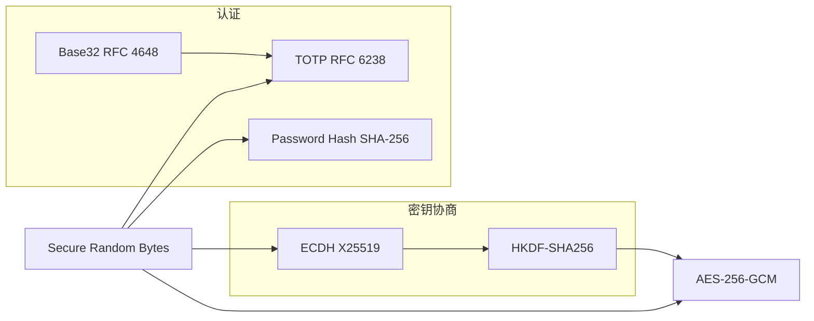

#### 1.1.12 端到端加密密钥协商推荐流程

```
Alice                              Bob
  │                                 │
  ├─ genECDHKeypair()               ├─ genECDHKeypair()
  ├─ exportECDHPublicKey() ────────►├─ importECDHPeerPublicKey()
  ├─ importECDHPeerPublicKey() ◄────├─ exportECDHPublicKey()
  │                                 │
  ├─ deriveECDHSharedSecret()       ├─ deriveECDHSharedSecret()
  ├─ deriveAESKey()                 ├─ deriveAESKey()
  │                                 │
  ▼ 握手完成，AES 密钥就绪          ▼
```

通信时的 nonce 管理：每次调用 `encryptAESGCM()` 前用 `cryptoRandomBytes()` 生成新的 12 字节 nonce，与密文一并传送。复用 nonce 将被破坏 GCM 的安全性。

---

### 1.2 Protocol 通信协议

**接口**： `include/protocol.h`

**实现**： `src/common/protocol.c`

实现 PacPlay 的二进制网络协议栈，涵盖 TCP 套接字管理、数据包序列化、AES-256-GCM 加密传输、阻塞式收发及加密收发高阶原语。

#### 1.2.1 常量与宏

| 宏                        | 值             | 说明                                                   |
| ------------------------- | -------------- | ------------------------------------------------------ |
| `PROTOCOL_SUCC` | `0` | 函数执行成功                                           |
| `PROTOCOL_FAIL` | `-1` | 通用失败                                               |
| `PROTOCOL_AUTH_FAIL` | `-2` | AES-GCM 认证标签校验失败或 AAD 不匹配                  |
| `MAX_PAYLOAD_LEN` | `131072` | 明文载荷最大字节数（GAME_CHUNK_SIZE × 2）              |
| `LOGIN_USERNAME_LEN` | `32` | 用户名固定长度（NUL 终止）                             |
| `LOGIN_NICKNAME_LEN` | `32` | 昵称固定长度（NUL 终止）                               |
| `AES_PACKET_EXTRA_LEN` | `28` | 加密后额外开销：nonce(12) + tag(16)                    |
| `BACKLOG` | `1024` | `listen()` 连接队列长度                              |
| `NULL_SOCKETFD` | `-1` | 无效套接字描述符标识                                   |
| `PACKET_MAGIC` | `0x5050504D` | 包魔术字，ASCII `PPPM` |
| `TOTP_SETUP_SECRET_LEN` | `33` | TOTP 设置响应中 Base32 密钥的固定长度（32 字符 + NUL） |
| `CLIENT_DB_KEY_LEN` | `32` | 每用户客户端数据库加密密钥长度（256 位）               |

#### 1.2.2 类型定义

**SocketFD**

```c
typedef int SocketFD;
```

套接字文件描述符别名。取值为 `NULL_SOCKETFD` 表示无效或已关闭。

**PacketType 与 MessageType**

```c
typedef enum {
    PlaintextPacket = 1,
    AES256GCMPacket
} PacketType;

typedef enum {
    MsgKeyExchangeReq = 1, MsgKeyExchangeResp,
    MsgLoginReq, MsgLoginResp,
    MsgRegisterReq, MsgRegisterResp,
    MsgTOTPSetupReq, MsgTOTPSetupResp,
    MsgTOTPVerifyReq, MsgTOTPVerifyResp,
    MsgDBKeyReq, MsgDBKeyResp,
    MsgRoomListReq, MsgRoomListResp,
    MsgCreateRoom, MsgCreateRoomResp,
    MsgJoinRoom, MsgJoinRoomResp,
    MsgQuitRoom,
    MsgChat,
    MsgLogout, MsgHeartbeat,
    MsgGameListReq, MsgGameListResp,
    MsgGameDownloadReq, MsgGameDownloadResp,
    MsgGameDownloadCancel,
    MsgDataAuth, MsgDataAuthResp,
    MsgGameMetadata,
    MsgGameChunk, MsgGameChunkAck,
    MsgGameDownloadDone,
    MsgGamePayload,
    MsgGameStartReq, MsgGameStartResp,
    MsgGameRoomListReq = 41, MsgGameRoomListResp,
    MsgGameRoomCreate, MsgGameRoomCreateResp,
    MsgGameRoomJoin, MsgGameRoomJoinResp,
    MsgGameRoomQuit, MsgGameRoomQuitResp,
    MsgGameRoomStart, MsgGameRoomStartResp,
    MsgGameRoomPlayData,
    MsgGameRoomMemberList,
    MsgGameRoomMemberJoin, MsgGameRoomMemberQuit
} MessageType;
```

枚举值自 1 起连续递增，网络传输中存储为 `uint32_t` 。

**PacketHeader（紧凑打包，无填充，20 字节）**

```c
#pragma pack(push, 1)
typedef struct {
    uint32_t magic;        // PACKET_MAGIC (0x5050504D)
    uint32_t packetType;   // PlaintextPacket 或 AES256GCMPacket
    uint32_t messageType;  // MessageType 枚举值
    uint32_t payloadLength;
    uint32_t sequenceID;   // 单调递增序列号
} PacketHeader;
#pragma pack(pop)
```

`#pragma pack(push, 1)` 确保跨平台二进制兼容。长度为 `sizeof(uint32_t) * 5 = 20` 字节。**严禁随意增删字段**，修改前必须同步更新所有序列化逻辑和大小相关测试。

**Packet**

```c
typedef struct {
    PacketHeader header;
    uint8_t *payload;
} Packet;
```

完整数据包结构。 `header` 与 `payload` 内存不连续， `payload` 由 `packetInit()` 或 `packetRecv()` / `packetDeserialize()` 动态分配。

#### 1.2.3 载荷结构

**KeyExchangePacketPayload**

```c
#pragma pack(push, 1)
typedef struct {
    uint8_t publicKey[ECDH_PUBLIC_KEY_SIZE]; // 32 字节 X25519 公钥
} KeyExchangePacketPayload;
#pragma pack(pop)
```

**LoginRequestPayload**（ `MsgLoginReq` 专用）

```c
#pragma pack(push, 1)
typedef struct {
    char username[LOGIN_USERNAME_LEN];  // 32 字节，NUL 终止
    char password[];                    // FAM，长度 = payloadLength - 32
} LoginRequestPayload;
#pragma pack(pop)
```

**RegisterRequestPayload**（ `MsgRegisterReq` 专用）

```c
#pragma pack(push, 1)
typedef struct {
    char username[LOGIN_USERNAME_LEN];  // 32 字节
    char nickname[LOGIN_NICKNAME_LEN];  // 32 字节
    char password[];                    // FAM，长度 = payloadLength - 64
} RegisterRequestPayload;
#pragma pack(pop)
```

**LoginResponsePayload**（ `MsgLoginResp` 专用）

```c
#pragma pack(push, 1)
typedef struct {
    uint32_t uid;                        // 服务器分配的 UID (0 = 失败)
    char username[LOGIN_USERNAME_LEN];   // 用户名
    char nickname[LOGIN_NICKNAME_LEN];   // 昵称
    uint8_t totpEnabled;                 // 0 = 未登记 TOTP, 1 = 已登记
} LoginResponsePayload;
#pragma pack(pop)
```

**TOTPSetupRespPayload**（ `MsgTOTPSetupResp` 专用）

```c
#pragma pack(push, 1)
typedef struct {
    char secret[TOTP_SETUP_SECRET_LEN];  // 32 字符 Base32 + NUL
} TOTPSetupRespPayload;
#pragma pack(pop)
```

**TOTPVerifyPayload**（ `MsgTOTPVerifyResp` 专用）

```c
#pragma pack(push, 1)
typedef struct {
    uint32_t code;  // 6 位 TOTP 验证码
} TOTPVerifyPayload;
#pragma pack(pop)
```

**DBKeyRespPayload**（ `MsgDBKeyResp` 专用）

```c
#pragma pack(push, 1)
typedef struct {
    uint8_t cdbkey[CLIENT_DB_KEY_LEN];  // 256 位 CDBKey
} DBKeyRespPayload;
#pragma pack(pop)
```

**ChatPacketPayload**（客户端→服务端聊天消息）

```c
#pragma pack(push, 1)
typedef struct {
    int64_t timestamp;       // UTC UNIX 时间戳
    uint8_t message[];       // FAM
} ChatPacketPayload;
#pragma pack(pop)
```

**ChatBroadcastPayload**（服务端→房间成员广播）

```c
#pragma pack(push, 1)
typedef struct {
    uint32_t uid;       // 发送者 UID
    uint64_t msgId;     // 全局唯一消息 ID
    int64_t timestamp;  // UTC UNIX 时间戳
    uint8_t message[];  // FAM
} ChatBroadcastPayload;
#pragma pack(pop)
```

#### 1.2.4 网络连接管理

| 函数                                                      | 说明                                 | 失败原因                          |
| --------------------------------------------------------- | ------------------------------------ | --------------------------------- |
| `SocketFD serverSetup(uint16_t port)` | 在指定端口创建 TCP 监听套接字        | 端口占用、socket/bind/listen 失败 |
| `SocketFD clientSetup(const char *addr, uint16_t port)` | 创建 TCP 客户端套接字并连接          | 地址解析失败、连接拒绝、超时      |
| `void socketClose(SocketFD *socketFD)` | 关闭套接字并重置为 `NULL_SOCKETFD` | 重复调用安全                      |

#### 1.2.5 数据包序列化与反序列化

**`int packetSerialize(const Packet *packet, uint8_t *buffer, size_t bufferSize, size_t *serializedSize)`**

* **前置条件**：`bufferSize >= sizeof(PacketHeader) + packet->header.payloadLength`
* **输出**：`*serializedSize` 为实际写入字节数
* **注意**：不执行加密——若需加密须先调用 `packetAESEncrypt()`

**`int packetDeserialize(const uint8_t *buffer, size_t bufferSize, Packet *packet)`**

* **前置条件**：`packet->payload == NULL`（否则返回 `PROTOCOL_FAIL`）
* **行为**：校验魔术字 → 校验长度 → 为 payload 动态分配内存
* **释放**：成功后须调用 `packetClear()`

#### 1.2.6 数据包加密与解密

**`int packetAESEncrypt(Packet *packet, uint8_t key[AES_GCM_KEY_LEN])`**

* **前置条件**：`packet->packetType == PlaintextPacket`；payload 为 NULL 时 payloadLength 必须为 0
* **行为**：原地加密。生成 12 字节随机 nonce，构造 AAD 为 64 位值 `(payloadLength << 32) | sequenceID`，替换 payload 为 `nonce(12B) || ciphertext || tag(16B)`，设 `packetType = AES256GCMPacket`
* **失败时**：原 payload 保留不释放

**`int packetAESDecrypt(Packet *packet, uint8_t key[AES_GCM_KEY_LEN])`**

* **前置条件**：`packet->packetType == AES256GCMPacket`
* **行为**：解析 nonce、ciphertext、tag → 解密 → AAD 二次校验
* **返回**：`PROTOCOL_SUCC`、`PROTOCOL_AUTH_FAIL`（认证失败，payload 已清除）或 `PROTOCOL_FAIL`
* **注意**：AAD 比较防止重放攻击（sequenceID 和 payloadLength 必须匹配）

#### 1.2.7 数据包生命周期管理

**`int packetInit(Packet *packet, MessageType msgType, uint32_t seqID, PacketType pktType, const void *data, size_t dataLen)`**

* **前置条件**：`packet->payload == NULL`，`dataLen <= MAX_PAYLOAD_LEN`
* **行为**：为 payload 分配内存并复制 `data`（`data` 为 NULL 且 `dataLen > 0` 时失败）
* **释放**：成功后须调用 `packetClear()`

**`void packetClear(Packet *packet)`**

释放 `packet->payload` 指向的动态内存并将其置为 NULL。对同一 Packet 重复调用安全（double-free 安全）。

#### 1.2.8 网络收发

| 函数                                                  | 说明                                                     | 前置条件                    |
| ----------------------------------------------------- | -------------------------------------------------------- | --------------------------- |
| `int packetSend(Packet *packet, SocketFD socketFD)` | 分两次发送 header 与 payload，处理部分写                 | `payload != NULL`（payloadLength > 0 时） |
| `int packetRecv(Packet *dest, SocketFD socketFD)` | 阻塞接收，先收 header（校验 magic 与长度），再收 payload | `dest->payload == NULL` |

#### 1.2.9 加密收发高阶原语

**`int packetSendEncrypted(SocketFD fd, MessageType mt, uint32_t *seqID, uint8_t key[AES_GCM_KEY_LEN], const void *data, size_t dataLen)`**

组合 `packetInit` → `packetAESEncrypt` → 递增 `*seqID` → `packetSend` → `packetClear` 的完整加密发送流程。调用者持有 `seqID` ，函数仅在成功路径递增。

**`int packetRecvEncrypted(SocketFD fd, Packet *out, uint8_t key[AES_GCM_KEY_LEN])`**

组合 `packetRecv` → 校验 `AES256GCMPacket` → `packetAESDecrypt` 。失败时自动清理 payload。这是服务端与客户端通信模块的底层基元。

#### 1.2.10 数据包布局

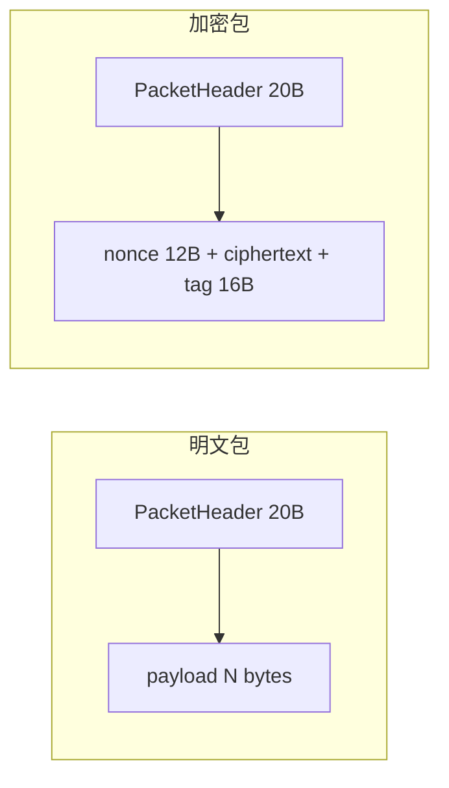

加密流程：

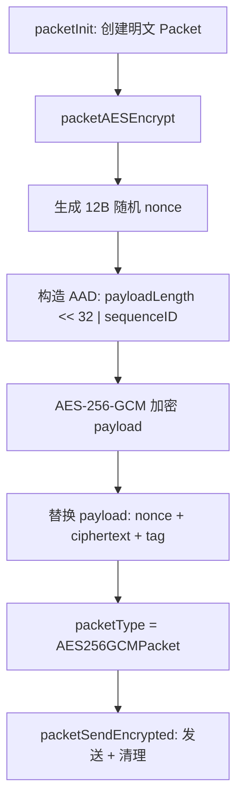

#### 1.2.11 协议数据流总览

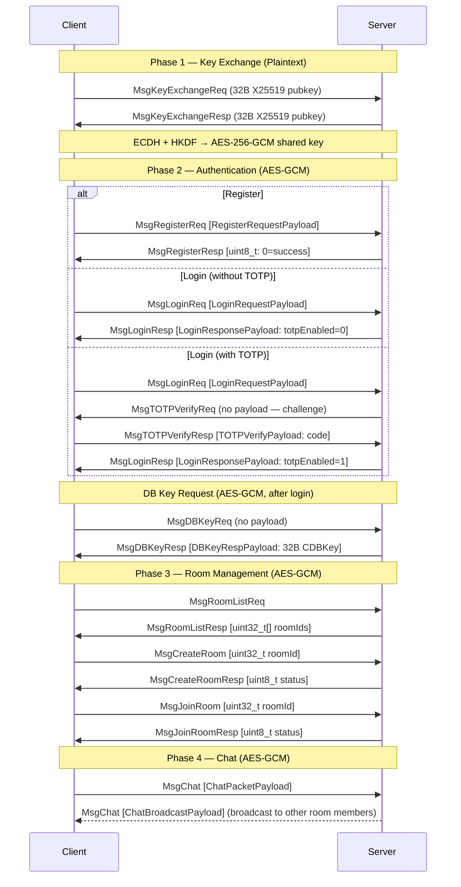

---

### 1.3 Log 日志模块

**接口**： `include/log.h`

**实现**： `src/common/log.c`

轻量日志库，修改自 [rxi/log.c](https://github.com/rxi/log.c)。**这是 vendored 第三方代码，不应随意修改。** 全部日志输出使用 `LOG_TRACE` … `LOG_FATAL` 宏，禁止使用 `printf` 。

#### 1.3.1 日志级别

 `LogLevelTrace < LogLevelDebug < LogLevelInfo < LogLevelWarn < LogLevelError < LogLevelFatal`

低于全局阈值的消息直接丢弃。默认阈值 `LogLevelTrace` （全部输出）。

#### 1.3.2 便捷宏

| 宏                      | 等价展开                                                |
| ----------------------- | ------------------------------------------------------- |
| `LOG_TRACE(fmt, ...)` | `logLog(LogLevelTrace, __FILE__, __LINE__, fmt, ...)` |
| `LOG_DEBUG(fmt, ...)` | `logLog(LogLevelDebug, __FILE__, __LINE__, fmt, ...)` |
| `LOG_INFO(fmt, ...)` | `logLog(LogLevelInfo, __FILE__, __LINE__, fmt, ...)` |
| `LOG_WARN(fmt, ...)` | `logLog(LogLevelWarn, __FILE__, __LINE__, fmt, ...)` |
| `LOG_ERROR(fmt, ...)` | `logLog(LogLevelError, __FILE__, __LINE__, fmt, ...)` |
| `LOG_FATAL(fmt, ...)` | `logLog(LogLevelFatal, __FILE__, __LINE__, fmt, ...)` |

所有宏自动捕获 `__FILE__` 和 `__LINE__` ，输出至 `stderr` ，格式： `HH:MM:SS LEVEL file.c:line: message` 。

#### 1.3.3 配置函数

| 函数                                       | 作用                                             |
| ------------------------------------------ | ------------------------------------------------ |
| `void logSetLevel(LogLevel level)` | 设置全局最低输出级别                             |
| `void logSetQuiet(bool enable)` | `true` 关闭 stderr 输出，不影响回调            |
| `int logAddFp(FILE *fp, LogLevel level)` | 添加文件输出（带完整日期格式），最多 32 个回调槽 |

#### 1.3.4 线程安全

库内部无锁。多线程场景须通过 `logSetLock()` 注册锁回调。

**生产环境推荐**：服务端日志子系统（`serverLog.h`，见 [2.8 Server Log](#28-server-log-服务端日志子系统)）在 `log.h` 之上提供了完整的线程安全封装——包含专用日志写入线程、防阻塞环形缓冲区、UTC 午夜文件自动转档、后台日志压缩及面向 TUI 的日志获取 API。服务端代码应通过 `LOG_*` 宏直接输出，无需手动管理锁或文件句柄。

---

### 1.4 Container 容器模块

**接口**： `include/container.h`

提供泛型环形缓冲区（QueueT）与泛型动态数组（ArrayT）。所有函数均为 `static inline` ，通过 `QUEUE_DEFINE(T)` 或 `ARRAY_DEFINE(T)` 在编译期生成，无需单独的 `.c` 实现文件。

#### 1.4.1 常量与宏

| 宏                         | 值    | 说明                                                                       |
| -------------------------- | ----- | -------------------------------------------------------------------------- |
| `QUEUE_DEFAULT_CAPACITY` | `8` | Queue 默认初始容量（ `Init()` 参数为 `USE_DEFAULT_CAPACITY(0)` 时使用） |
| `ARRAY_DEFAULT_CAPACITY` | `8` | Array 默认初始容量（ `Init()` 参数为 `USE_DEFAULT_CAPACITY(0)` 时使用） |
| `USE_DEFAULT_CAPACITY` | `0` | `Init()` 哨兵值，传入后回退至对应容器的默认容量                          |

#### 1.4.2 类型定义

**ContainerRes**

```c
typedef enum { ContainerSucc = 0, ContainerFail = -1 } ContainerRes;
```

所有容器函数的返回类型。 `ContainerSucc` （0）表示成功， `ContainerFail` （-1）表示失败（越界、分配失败、空容器访问等）。

#### 1.4.3 泛型环形缓冲区（QueueT）

通过 `QUEUE_DEFINE(T)` 单步预处理器宏为任意数据类型生成类型安全的循环队列实现。

**命名规则**： `##` 拼接运算符将类型名 `T` 直接拼入标识符：

| 宏调用                   | 结构体名        | Init 函数名         | Push 函数名         |
| ------------------------ | --------------- | ------------------- | ------------------- |
| `QUEUE_DEFINE(Int)` | `QueueInt` | `queueIntInit` | `queueIntPush` |
| `QUEUE_DEFINE(Packet)` | `QueuePacket` | `queuePacketInit` | `queuePacketPush` |

**公开 API**：

| 函数              | 签名                                                       | 说明                                                                      |
| ----------------- | ---------------------------------------------------------- | ------------------------------------------------------------------------- |
| `queueTInit` | `ContainerRes queueTInit(QueueT *self, size_t capacity)` | 分配堆内存，初始化队列。 `capacity=USE_DEFAULT_CAPACITY(0)` 时取默认值 8 |
| `queueTDeinit` | `void queueTDeinit(QueueT *self)` | 释放 buf，NULL 安全                                                       |
| `queueTFront` | `ContainerRes queueTFront(QueueT *self, T *result)` | 拷贝队首至 `*result` |
| `queueTPush` | `ContainerRes queueTPush(QueueT *self, T data)` | 写入队尾，满时自动扩容                                                    |
| `queueTPop` | `ContainerRes queueTPop(QueueT *self)` | 队首指针前进，不返回值                                                    |
| `queueTIsEmpty` | `bool queueTIsEmpty(QueueT *self)` | 队空返回 `true` |

**注意**： `queueTPop` 不返回被弹出元素的值。需先 `Front` 后 `Pop` 。

#### 1.4.4 泛型动态数组（ArrayT）

通过 `ARRAY_DEFINE(T)` 为任意数据类型生成类型安全的动态数组实现，支持 O(1) 随机访问。

**命名规则**：

| 宏调用                   | 结构体名        | Init 函数名         | PushBack 函数名         |
| ------------------------ | --------------- | ------------------- | ----------------------- |
| `ARRAY_DEFINE(Int)` | `ArrayInt` | `arrayIntInit` | `arrayIntPushBack` |
| `ARRAY_DEFINE(Packet)` | `ArrayPacket` | `arrayPacketInit` | `arrayPacketPushBack` |

**公开 API**：

| 函数               | 签名                                                               | 说明                                                                                 |
| ------------------ | ------------------------------------------------------------------ | ------------------------------------------------------------------------------------ |
| `arrayTInit` | `ContainerRes arrayTInit(ArrayT *self, size_t capacity)` | 分配堆内存，初始化数组。 `capacity=USE_DEFAULT_CAPACITY(0)` 时取默认值 8            |
| `arrayTDeinit` | `void arrayTDeinit(ArrayT *self)` | 释放 buf，NULL 安全                                                                  |
| `arrayTSet` | `ContainerRes arrayTSet(ArrayT *self, size_t index, T data)` | 写 `buf[index]` ， `index >= size` 拒绝                                            |
| `arrayTGet` | `ContainerRes arrayTGet(ArrayT *self, size_t index, T *dest)` | 读 `buf[index]` 至 `*dest` （值拷贝）                                             |
| `arrayTIndex` | `ContainerRes arrayTIndex(ArrayT *self, size_t index, T **dest)` | 返回 `buf[index]` 的指针引用至 `*dest` （非值拷贝），O(1)。 `index >= size` 拒绝 |
| `arrayTPushBack` | `ContainerRes arrayTPushBack(ArrayT *self, T data)` | 追加至尾部，满时自动扩容（2x）                                                       |
| `arrayTPopBack` | `ContainerRes arrayTPopBack(ArrayT *self)` | size 递减，不返回值                                                                  |
| `arrayTSize` | `size_t arrayTSize(const ArrayT *self)` | 返回当前元素个数                                                                     |

#### 1.4.5 队列与数组的对比

| 特性     | QueueT（环形缓冲区）         | ArrayT（动态数组）                             |
| -------- | ---------------------------- | ---------------------------------------------- |
| 存储结构 | 环形，head/tail 双指针       | 连续存储，按索引直接访问                       |
| 扩容方式 | malloc 新缓冲 + 逐元素拷贝   | realloc（可原地扩展）                          |
| 随机访问 | 不支持                       | 支持 O(1) `Set` / `Get` / `Index` （指针引用） |
| 适用场景 | FIFO 消息队列、生产者-消费者 | 动态集合、随机存取缓存                         |

---

### 1.5 Utils 工具模块

**接口**： `include/utils.h`

**实现**： `src/common/utils.c`

提供通用辅助宏、跨平台工具函数与十六进制字符转换。

**通用宏**

```c
#define MAX(a, b) ((a) > (b) ? (a) : (b))
#define MIN(a, b) ((a) < (b) ? (a) : (b))
```

**跨平台目录创建**

```c
#ifdef _WIN32
#define PLATFORM_MKDIR(path, mode) _mkdir(path)
#else
#define PLATFORM_MKDIR(path, mode) mkdir(path, mode)
#endif
```

被服务端与客户端数据库模块共享使用，消除重复宏定义。

**十六进制字符转换**

```c
int hexCharToNibble(char c);
```

将单个十六进制字符（ `0-9` 、 `a-f` 、 `A-F` ）转换为其 4 位半字节值（0-15），非法字符返回 -1。被 MK 解析、测试及 `crypto.c` 内部共享使用。

**时间戳**

```c
time_t getCurrentTimestamp(void);
```

获取当前 UTC UNIX 时间戳（秒）。内部调用 ISO C `time()` 函数。失败返回 `(time_t)-1` 。

**密码读入**

```c
size_t readPasswordMasked(char *buf, size_t bufsize);
```

从 stdin 读取密码并显示 `*` 掩码。当 stdin 为终端时禁用 echo，处理退格键。非终端时退化为普通 `fgets()` 。

---

### 1.6 Database 公共数据库辅助模块

**接口**： `include/db.h`

**实现**： `src/common/db.c`

为服务端与客户端数据库模块提供共享的 SQLite statement 辅助函数。 `src/common/db.c` 在构建时分别编译进 `build/server/common/` 与 `build/client/common/` ，两端独立链接。

**`int dbExec(sqlite3 *dbHandle, const char *sql, const char *context)`**

一次性执行 SQL 语句（prepare → step → finalize）。context 用于错误日志标识。成功返回 `DB_EXEC_SUCC` （0），失败返回 `DB_EXEC_FAIL` （-1）。

**`void dbFinalize(sqlite3_stmt **stmt)`**

Finalize 非 NULL 缓存的 prepared statement 并将其置为 NULL。NULL 输入安全。

---

### 1.7 TUI 终端 UI 框架

**接口**： `include/tui/tuiapp.h` 、 `include/tui/control.h` 、 `include/tui/tuimsg.h` 、 `include/tui/ncurses_wrapper.h`

**实现**： `src/common/tui/tuiapp.c` 、 `src/common/tui/control.c`

基于 ncurses 宽字符库（ `libncursesw` ）的保留模式终端 GUI 框架，提供消息驱动的事件循环、控件继承体系和页面导航机制。TUI 模块位于 `src/common/` 下，编译时双方独立链接，供服务端管理面板与客户端交互界面共用。

#### 1.7.1 常量与宏

| 宏                       | 值      | 说明                                                      |
| ------------------------ | ------- | --------------------------------------------------------- |
| `BTN_LABEL_MAXLEN` | `20` | 按钮标签文本最大字符数（含 NUL）                          |
| `INPUTBOX_BUF_MAX_LEN` | `128` | 输入框内部缓冲区最大字符数                                |
| `LABEL_TEXT_MAXLEN` | `128` | 标签文本最大字符数                                        |
| `NCURSES_WIDECHAR` | `1` | 启用 ncurses 宽字符支持（ `ncurses_wrapper.h` 内部定义） |

#### 1.7.2 消息系统

**接口**： `include/tui/tuimsg.h`

TUI 框架采用消息传递架构，所有用户输入和系统事件均封装为 `TuiMsg` 结构体，经线程安全的消息队列统一分发至各控件的虚表回调。

**MsgType**

```c
typedef enum {
    MsgCursorPrev = 1, MsgCursorNext,   // Tab / Shift-Tab 焦点导航
    MsgFocusEnter, MsgFocusLeave,       // 控件焦点获得 / 失去
    MsgInput,                            // 键盘输入（arg1.input 含字符码）
    MsgResize,                           // 终端尺寸变更
    MsgFetch,                            // 容器请求子控件指针（arg1.fetchRecv 回调）
    MsgRefresh                           // 触发控件重绘
} MsgType;
```

枚举值自 1 起连续递增，仅用于进程内消息分发，不涉及网络传输。

**MsgArg**

```c
typedef union {
    size_t index;                                    // 导航 / 索引参数
    int input;                                       // 输入字符码（MsgInput 专用）
    void (*fetchRecv)(void *self, void *child);      // MsgFetch 回调
} MsgArg;
```

**TuiMsg**

```c
typedef struct {
    MsgType type;
    MsgArg arg1;
    MsgArg arg2;
} TuiMsg;
```

消息队列通过 `QUEUE_DEFINE(TuiMsg)` 实例化为 `QueueTuiMsg` 。

#### 1.7.3 控件类型

**接口**： `include/tui/control.h`

控件体系采用 C 语言手动虚表多态：所有控件共享 `Control` 基类，派生类型通过首字段嵌入 `Control` 实现向上转型。

**ControlVTable** — 控件虚表

```c
struct ControlVTable {
    void (*destruct)(void *self);                      // 析构回调：释放控件私有资源
    void (*draw)(void *self);                          // 绘制回调：渲染至 ncurses 窗口
    void (*msgHandler)(void *self, TuiMsg msg);        // 消息处理回调
};
```

**ControlCommonMsgHandlers** — 通用消息回调

```c
struct ControlCommonMsgHandlers {
    void (*resize)(void *self);    // 终端尺寸变更时的重布局回调
    void (*refresh)(void *self);   // 触发控件刷新（#undef refresh 避免宏冲突）
};
```

**Control** — 基类控件

```c
struct Control {
    ControlVTable vtable;                       // 虚表
    WINDOW *windowHandler;                      // ncurses 窗口句柄
    ControlCommonHandlers commonMsgHandlers;    // resize / refresh 回调
    size_t index;         // 控件注册索引（自 1 起，0 为根节点保留）
    bool isPage;          // 是否为页面（顶层容器，控制可见性与页面切换）
    int x, y;             // 控件在父窗口内的相对坐标
    int width, height;    // 控件尺寸
    bool focusable;       // 是否可获取焦点
    bool focused;         // 当前是否持有焦点
    bool isContainer;     // 是否可包含子控件
    size_t childCount;    // 已注册子控件数量
    bool takeOverInput;   // 是否拦截键盘输入（聚焦时不向上冒泡）
    bool visible;         // 是否可见（不可见时跳过渲染和焦点导航）
};
```

`ControlPage` 为 `Control` 的类型别名（ `isPage = true` ），作为页面树的根节点。

**GridLayoutMethod**

```c
typedef enum { LayoutVertical = 1, LayoutHorizontal, LayoutNone } GridLayoutMethod;
```

**ControlButton** — 按钮

```c
struct ControlButton {
    Control base;                                // 基类
    char *text;                                  // 标签文本（≤ BTN_LABEL_MAXLEN）
    void (*onClick)(ControlButton *self);        // 点击回调
};
```

**ControlGrid** — 网格布局容器

```c
struct ControlGrid {
    Control base;                    // 基类（isContainer = true）
    GridLayoutMethod layoutMethod;   // 垂直或水平流式布局方向
    struct {
        size_t vertical;
        size_t horizontal;
    } margin;                        // 子控件间距（行/列方向）
    size_t layoutCounter;            // 已布局子控件计数
    size_t layoutAccCol;             // 累计列宽（水平布局用）
    size_t layoutAccRow;             // 累计行高（垂直布局用）
    void (*layout)(void *self, void *child) // 布局方式（若为 NULL 则使用默认布局方式）
};
```

子控件加入后按 `layoutMethod` 决定排列方式。 `LayoutVertical` 垂直流式排列， `LayoutHorizontal` 水平流式排列， `LayoutNone` 不进行自动布局（交由自定义 `layout` 回调处理）。若 `layout` 参数为 `NULL` ，使用默认流式布局；传入自定义回调可完全接管子控件坐标计算。终端 resize 时触发重新布局。

**ControlLabel** — 标签

```c
struct ControlLabel {
    Control base;      // 基类
    char *text;        // 显示文本（≤ LABEL_TEXT_MAXLEN）
};
```

**ControlInputBox** — 输入框

```c
struct ControlInputBox {
    Control base;                      // 基类（takeOverInput = true）
    char *buf;                         // 内部缓冲区（≤ INPUTBOX_BUF_MAX_LEN）
    size_t curLen;                     // 当前已输入字符数
    size_t viewBegin;                  // 可视区域起始偏移（水平滚动）
    size_t curLoc;                     // 光标位置（字符索引）
    bool hideContent;                  // 是否隐藏输入内容（用符号 '*' 代替）
    void (*submit)(ControlInputBox *self);  // 回车提交回调
};
```

支持退格删除（ `KEY_BACKSPACE` ）、Delete 删除（ `KEY_DC` ）、光标移动（ `KEY_LEFT` / `KEY_RIGHT` / `KEY_HOME` / `KEY_END` ）和水平滚动。 `KEY_UP` 映射为 Home（光标跳至行首）， `KEY_DOWN` 映射为 End（光标跳至行尾）。仅接受可打印字符（ `' '` ~ `'~'` ），控制字符和非 ASCII 字符被静默忽略。Enter（ `\n` ）、 `\r` 、小键盘 Enter（ `KEY_ENTER` ）均触发 `submit` 回调并释放输入焦点（ `takeOverInput = false` ）；Esc（ `\e` ）仅释放焦点不提交。 `hideContent` 为 `true` 时显示内容替换为 `*` 。

**ControlTextBox** — 只读文本框

```c
struct ControlTextBox {
    Control base;        // 基类
    char *text;          // 显示文本（堆分配）
    size_t textLen;      // 文本字节长度
    size_t viewBegin;    // 可视区域起始偏移（垂直滚动）
};
```

只读多行文本显示区域，支持通过 `KEY_UP` / `KEY_DOWN` 垂直滚动。文本在构造时通过 `strdup` 复制。

**ControlScrollTextBox** — 可追加滚动文本框

```c
struct ControlScrollTextBox {
    ControlTextBox base;    // 继承自 ControlTextBox
    size_t maxLines;        // 最大保留行数
};
```

继承 `ControlTextBox` ，额外支持通过 `controlScrollTextBoxAppend()` 动态追加文本。超过 `maxLines` 时自动裁剪最旧行。适用于日志查看器、聊天消息滚动窗口等场景。

**ControlListBox** — 列表选择框

```c
struct ControlListBox {
    Control base;                           // 基类
    ArrayControlListBoxEntry list;          // 条目动态数组
    size_t entryCnt;                        // 当前条目数
    size_t viewBegin;                       // 可视区域起始偏移
    size_t curLine;                         // 当前选中行
};
```

**ControlListBoxEntry** — 列表条目

```c
typedef struct {
    char *disp;         // 显示文本（堆分配）。多行条目可内含 \n 分隔符
    size_t id;          // 条目标识（可用于关联业务 ID）
    uint8_t height;     // 条目占用行数（1 = 单行，2 = 双行）。控制 draw/nav/mouse 坐标计算
} ControlListBoxEntry;
```

可滚动的列表选择框。通过 `controlListBoxAppend()` 添加单行条目，通过 `controlListBoxAppendMulti()` 添加变高条目（如游戏名+描述的双行展示）。 `KEY_UP` / `KEY_DOWN` 切换选中行，当前选中行以反色高亮（多行条目时高亮覆盖所有行）。鼠标点击和 PageUp/PageDown 均按累积条目高度计算。 `list` 通过 `ARRAY_DEFINE(ControlListBoxEntry)` 实例化。

#### 1.7.4 应用生命周期 API

**接口**： `include/tui/tuiapp.h`

| 函数                                                            | 说明                                                                                                        | 前置条件                                         |
| --------------------------------------------------------------- | ----------------------------------------------------------------------------------------------------------- | ------------------------------------------------ |
| `void tuiAppInit(void)` | 初始化 ncurses（ `initscr` 、cbreak、noecho、keypad、 `curs_set(0)` ）、消息队列和控件注册表                | 仅可调用一次，失败时 `endwin()` 后退出         |
| `void tuiAppControlRegister(Control *entry, Control *parent)` | 将控件注册到全局控件树的指定父节点下。 `parent=NULL` 注册为根节点的直接子节点                              | `tuiAppInit` 已调用；注册顺序决定 DFS 渲染顺序 |
| `void tuiAppStart(ControlPage *orgPage)` | 以 `orgPage` 为初始页面启动事件循环（阻塞）。循环捕获键盘输入与 SIGWINCH 信号，封装为 `TuiMsg` 统一分发 | 控件树已构建完成                                 |
| `void tuiAppStop(void)` | 退出事件循环，释放 ncurses 环境（ `endwin` ）                                                               | 仅事件循环内有效；线程安全                       |
| `void tuiAppChangePage(ControlPage *entry)` | 切换当前页面。销毁旧页面树的所有 ncurses 窗口，实例化新页面树，重建导航链。 `entry=NULL` 回到 `stdscr` | 仅事件循环内调用                                 |
| `void tuiAppPushMessage(TuiMsg msg)` | 将消息推入全局消息队列                                                                                      | 线程安全（ `pthread_mutex_t` 保护）             |
| `void tuiAppRefresh(void)` | 立即触发全量重绘（推送 `MsgRefresh` ）                                                                     | 可在任意上下文调用                               |

#### 1.7.5 控件构造函数

**接口**： `include/tui/control.h`

所有构造函数的 `draw` 、 `resize` 、 `refresh` 参数均可传入对应类型的默认实现（见 §1.7.7），也可传入自定义函数指针。 `onClick` （按钮）和 `submit` （输入框）为**必须**提供的业务回调。

| 函数                         | 签名                                                                                                                                                                                                                                   | 关键参数                                                                                                                                                                             |
| ---------------------------- | -------------------------------------------------------------------------------------------------------------------------------------------------------------------------------------------------------------------------------------- | ------------------------------------------------------------------------------------------------------------------------------------------------------------------------------------ |
| `controlPageConstruct` | `void controlPageConstruct(ControlPage *self)` | 设置 `isPage=true` 、 `isContainer=true` 、 `visible=true` |
| `controlButtonConstruct` | `void controlButtonConstruct(ControlButton *self, int height, int width, int y, int x, const char *text, void (*draw)(...), void (*onClick)(...), void (*resize)(...), void (*refresh)(...))` | `text` 为按钮显示文字， `focusable=true` |
| `controlGridConstruct` | `void controlGridConstruct(ControlGrid *self, int height, int width, int y, int x, GridLayoutMethod layoutMethod, size_t hmargin, size_t vmargin, void (*draw)(...), void (*resize)(...), void (*refresh)(...), void(*layout)(...))` | `isContainer=true` 、 `focusable=false` ， `layoutMethod` 决定子控件排列方向                                                                                                       |
| `controlLabelConstruct` | `void controlLabelConstruct(ControlLabel *self, const char *text, int y, int x, void (*draw)(...), void (*resize)(...), void (*refresh)(...))` | `text` 为显示内容， `focusable=false` |
| `controlInputBoxConstruct` | `void controlInputBoxConstruct(ControlInputBox *self, int width, int y, int x, bool hideContent, void (*draw)(...), void (*resize)(...), void (*submit)(...), void (*refresh)(...))` | `focusable=true` 、 `takeOverInput=false` （获得焦点时自动设为 true）。 `hideContent` 为 `true` 时输入内容以 `*` 显示。 `submit` 为回车提交回调。 `width < 3` 时自动钳位为 3 |
| `controlTextBoxConstruct` | `void controlTextBoxConstruct(ControlTextBox *self, int height, int width, int y, int x, const char *text, void (*draw)(...), void (*resize)(...), void (*refresh)(...), void (*update)(...))` | `text` 为初始显示文本（内部 `strdup` ），`focusable=true` ，`takeOverInput=true` |
| `controlScrollTextBoxConstruct` | `void controlScrollTextBoxConstruct(ControlScrollTextBox *self, int height, int width, int y, int x, size_t maxLines, void (*draw)(...), void (*resize)(...), void (*refresh)(...), void (*update)(...))` | 继承 TextBox，`maxLines` 限制最大保留行数，初始文本为空 |
| `controlListBoxConstruct` | `void controlListBoxConstruct(ControlListBox *self, int height, int width, int y, int x, void (*draw)(...), void (*resize)(...), void (*refresh)(...), void (*update)(...))` | `focusable=true` ，初始条目列表为空，通过 `controlListBoxAppend()` 添加 |

**内存分配**： `text` （Button / Label / TextBox）通过内部 `strdup` 分配， `buf` （InputBox）通过内部 `malloc` 分配， `list` （ListBox）通过 `ARRAY_DEFINE` 管理，均在 `controlDeinstantiate` → `vtable.destruct` 中释放。调用者不负责释放这些资源。

#### 1.7.6 控件生命周期函数

**接口**： `include/tui/control.h`

| 函数                                                        | 说明                                                                                                                                                     | 释放责任                       |
| ----------------------------------------------------------- | -------------------------------------------------------------------------------------------------------------------------------------------------------- | ------------------------------ |
| `void controlInstantiate(Control *self, Control *parent)` | 创建 ncurses `WINDOW` （ `parent=NULL` 时使用 `subwin(stdscr)` ，否则使用 `derwin` ）。注册与焦点管理由 `tuiAppControlRegister` 和事件循环统一处理 | `controlDeinstantiate(self)` |
| `void controlDeinstantiate(Control *self)` | 销毁 ncurses 窗口（ `delwin` ），从注册表移除，调用 `vtable.destruct` 释放私有资源（ `strdup` 的 text、 `malloc` 的 buf 等）                         | 不可重复调用                   |

#### 1.7.7 默认绘制函数

**接口**： `include/tui/control.h`

所有默认绘制函数签名为 `void (*)(void *self)` ，通过虚表 `draw` 指针间接调用，内部强制转换为对应控件类型。

| 函数                                | 说明                                                                                                                                                                                                        |
| ----------------------------------- | ----------------------------------------------------------------------------------------------------------------------------------------------------------------------------------------------------------- |
| `controlButtonDraw(void *self)` | 居中绘制标签文本。获取焦点时采用双线边框（ `DOUBLE_BOX` ），未聚焦时采用普通边框（ `box` ）                                                                                                                 |
| `controlGridDraw(void *self)` | 绘制网格边框（ `box` ）。子控件由各自 `draw` 回调独立渲染                                                                                                                                                 |
| `controlLabelDraw(void *self)` | 在控件窗口左上角绘制标签文本                                                                                                                                                                                |
| `controlInputBoxDraw(void *self)` | 绘制输入框边框（聚焦+编辑中为双线框，聚焦未编辑为虚线框，未聚焦为普通框）。展示 `buf` 中 `viewBegin` 起始的可见段，在 `curLoc` 位置显示反色块状光标。 `hideContent` 为 `true` 时将字符替换为 `*` |
| `controlTextBoxDraw(void *self)` | 绘制只读文本框边框，按行渲染 `text` 中 `viewBegin` 起始的可见段。支持垂直滚动 |
| `controlListBoxDraw(void *self)` | 绘制列表框边框，逐行渲染 `list` 中 `viewBegin` 起始的可见条目。当前选中行 `curLine` 以反色高亮 |

**辅助函数**

| 函数                                                            | 说明                                                                                                   |
| --------------------------------------------------------------- | ------------------------------------------------------------------------------------------------------ |
| `void controlScrollTextBoxAppend(ControlScrollTextBox *self, const char *text)` | 向滚动文本框追加文本。超过 `maxLines` 时裁剪最旧行。追加后自动滚动至底部 |
| `void controlListBoxAppend(ControlListBox *self, const char *disp, size_t id)` | 向列表框追加一条单行条目。 `disp` 通过内部 `strdup` 复制， `id` 用于关联业务标识。 `height` 设为 1 |
| `void controlListBoxAppendMulti(ControlListBox *self, const char *disp, size_t id, uint8_t height)` | 向列表框追加一条变高条目。 `height=1` 等价于 `controlListBoxAppend`；`height=2` 用于双行展示（ `disp` 内含 `\n` 分隔两行） |
| `void controlListBoxClear(ControlListBox *self)` | 清空列表框所有条目（释放 `disp` 字符串） |
| `bool controlSelectionHandleMouse(Control *self, TuiMsg msg)` | 处理鼠标点击选择逻辑。检查点击坐标是否落入控件区域，若命中则将该控件设为选中状态并返回 `true` |

#### 1.7.8 架构与消息流

**控件继承树**

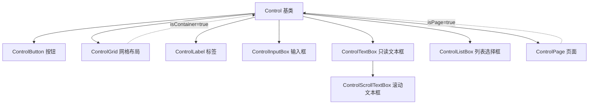

**消息流与渲染循环**

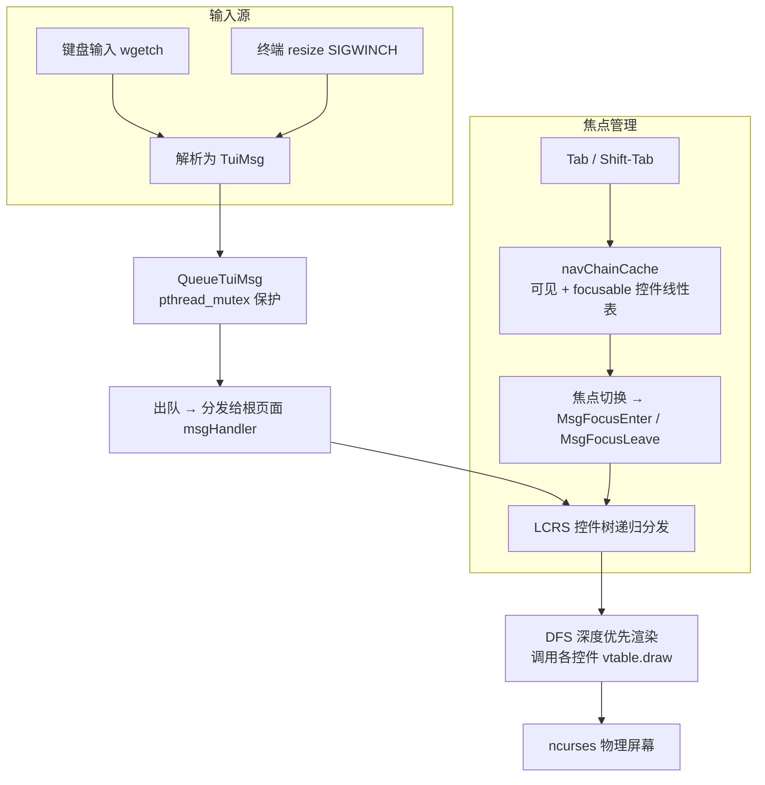

**运行模型**：

1. **注册阶段**：`tuiAppControlRegister()` 将控件以 LCRS（左孩子右兄弟）树结构注册，`index` 自 1 递增分配，0 为根节点保留
2. **事件循环**：`tuiAppStart()` 进入阻塞循环，`wgetch(stdscr)` 捕获键盘输入，`SIGWINCH` 信号触发 resize 消息
3. **消息分发**：所有事件封装为 `TuiMsg` 推入 `QueueTuiMsg`（`pthread_mutex_t` 保护出入队），主循环逐条出队并分发给当前根页面的 `vtable.msgHandler`
4. **DFS 渲染**：页面 `msgHandler` 深度优先递归控件树，调用各控件的 `vtable.draw` 将内容写入 ncurses 窗口缓冲区
5. **焦点导航**：Tab / Shift-Tab 遍历 `navChainCache`（仅包含 `visible=true` 且 `focusable=true` 的控件），循环切换焦点
6. **页面切换**：`tuiAppChangePage()` 销毁旧页面树的所有窗口和私有资源，实例化新页面树，重建导航链并触发全量重绘

**线程安全**：消息队列的入队/出队操作通过 `pthread_mutex_t` 保护，允许其他线程通过 `tuiAppPushMessage()` 安全投递消息。其他全局状态（控件注册表、事件循环）不具备线程安全性。

**当前集成状态**：TUI 框架已完整集成至服务端与客户端主流程。服务端通过 `tuiServerEntry()` 提供 MK 管理和实时日志面板（见 [2.10](#210-server-tui-服务端管理面板)）；客户端通过 `tuiClientEntry()` 驱动连接、登录/注册、主页等全部交互（见 [3.7](#37-client-tui-客户端界面系统)）。

---

### 1.8 Clipboard 剪贴板模块

**接口**： `include/clipboard.h`

**实现**： `src/common/clipboard.c`

提供基于 OSC 52 终端转义序列的系统剪贴板写入能力。OSC 52 是一种终端标准转义序列，允许终端应用通过 stdout 将文本复制到宿主系统的剪贴板，无需依赖平台特定的剪贴板工具。被客户端 TOTP 设置流程（复制 `otpauth://` URI）和 TUI 控件的文本选择复制功能使用。

#### 1.8.1 公开 API

| 函数                                   | 说明                                                                                                | 前置条件             | 释放责任            |
| -------------------------------------- | --------------------------------------------------------------------------------------------------- | -------------------- | ------------------- |
| `bool clipboardInit(void)`           | 打开 `/dev/tty` 句柄用于 OSC 52 输出。成功返回 `true` ，失败（如无终端）返回 `false`            | —                   | `clipboardDeinit()` |
| `void clipboardDeinit(void)`         | 关闭 `/dev/tty` 句柄。NULL 安全                                                                   | —                   | 可重复调用          |
| `void clipboardCopy(const char *text)` | 将 `text` 经 Base64 编码后通过 OSC 52 转义序列（ `\033]52;c;<base64>\a` ）写入终端剪贴板 | `clipboardInit` 已调用 | —                  |
| `void clipboardWriteRaw(const char *data)` | 直接将 `data` 作为原始转义序列写入终端                                                        | `clipboardInit` 已调用 | —                  |

#### 1.8.2 OSC 52 剪贴板写入流程


**终端兼容性**：OSC 52 支持取决于终端仿真器。主流终端（xterm、iTerm2、Alacritty、Windows Terminal、kitty、foot）均支持，但部分终端（如 GNOME Terminal）默认禁用，需手动启用。

---

### 1.9 QR Code 二维码生成模块

**接口**： `include/qrcodegen.h`

**实现**： `src/common/qrcodegen.c`

Vendored 第三方库，源自 [Project Nayuki](https://www.nayuki.io/page/qr-code-generator-library)（MIT 许可证）。**不应随意修改此代码。**

该库实现 QR Code Model 2 标准（版本 1-40），支持数字、字母数字、字节和 ECI 编码模式，以及四种纠错等级（L/M/Q/H）。

#### 1.9.1 项目内使用方式

PacPlay 仅在客户端 TOTP 设置流程中使用 QR 码生成：

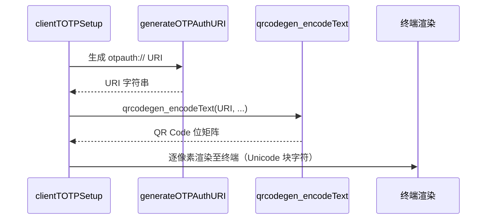

调用者将 `otpauth://` URI 传入 `qrcodegen_encodeText()` ，获得位矩阵后使用 Unicode 块字符（如 `█` 与空格）在终端中渲染二维码，供认证器应用扫描导入。

**关键 API**（完整参考见 `include/qrcodegen.h` 内 Doxygen 注释）：

| 函数                                   | 说明                                                  |
| -------------------------------------- | ----------------------------------------------------- |
| `qrcodegen_encodeText(text, ...)` | 将 UTF-8 文本编码为 QR Code 位矩阵                   |
| `qrcodegen_getSize(qrcode)` | 返回 QR Code 边长（像素）                             |
| `qrcodegen_getModule(qrcode, x, y)` | 返回 `(x, y)` 处的模块颜色（ `true` 为黑色） |

### 1.10 Archive 压缩归档模块

**接口**： `include/archive.h`

**实现**： `src/common/archive.c`

提供 `.tar.gz` 压缩归档的创建与解压功能。底层依赖 zlib-ng 处理 gzip 压缩层，依赖 vendored microtar 库处理 tar 文件格式，使用 `platformMkdirp()` 创建中间目录。包含路径遍历防护。

#### 1.10.1 常量与宏

| 宏 | 值 | 说明 |
|---|---|---|
| `ARCHIVE_SUCC` | `0` | 操作成功 |
| `ARCHIVE_FAIL` | `-1` | 操作失败 |

#### 1.10.2 公开 API

| 函数 | 说明 | 前置条件 | 释放责任 |
|---|---|---|---|
| `int extractTarGz(const char *tarGzPath, const char *destDir)` | 将 `.tar.gz` 文件解压至目标目录。依次解压 gzip 层→提取 tar 条目（目录/常规文件），自动创建中间目录。内建路径遍历检测（拒绝含 `..` 的条目名） | `tarGzPath` 与 `destDir` 均非 NULL，`destDir` 已存在 | 无。成功时所有文件写入磁盘；失败时清理已创建的临时文件 |
| `int createTarGz(const char *sourceDir, const char *destPath)` | 递归遍历 `sourceDir`，将所有文件与子目录打包为 `.tar.gz` 写入 `destPath` | `sourceDir` 与 `destPath` 均非 NULL | 无。失败时清理已创建的临时文件 |

**返回值**：成功返回 `ARCHIVE_SUCC`（0），失败返回 `ARCHIVE_FAIL`（-1）。

---

### 1.11 Platform 平台工具模块

**接口**： `include/platform.h`

**实现**： `src/common/platform.c`

提供跨平台（Linux/Windows）文件系统工具函数，包括临时目录创建、文件大小查询、递归目录创建与递归删除。

#### 1.11.1 常量与宏

| 宏 | 值 | 说明 |
|---|---|---|
| `PLATFORM_SUCC` | `0` | 操作成功 |
| `PLATFORM_FAIL` | `-1` | 操作失败 |

#### 1.11.2 公开 API

| 函数 | 说明 | 前置条件 | 释放责任 |
|---|---|---|---|
| `int platformMkdtemp(char *tmpl, size_t tmplSize)` | 创建唯一的临时目录。Linux 调用 POSIX `mkdtemp()`，Windows 使用 `GetTempPathA()` + 随机后缀 | `tmpl` 非 NULL 且以 `XXXXXX` 结尾（Linux）；`tmplSize` 指示缓冲区大小 | 调用者负责删除创建的临时目录 |
| `int platformFileSize(const char *path, uint64_t *outSize)` | 查询文件大小（字节），写入 `*outSize` | `path` 与 `outSize` 均非 NULL | 无 |
| `int platformMkdirp(const char *path)` | 递归创建路径中所有缺失的目录（类似 `mkdir -p`）。内部对每个路径组件逐一创建，忽略 `EEXIST` | `path` 非 NULL 且非空字符串 | 无 |
| `int platformRmrf(const char *path)` | 递归删除目录树（类似 `rm -rf`）。Linux 使用 `opendir`/`readdir` 递归遍历；Windows 使用 `_findfirst`/`_findnext` | `path` 非 NULL 且非空字符串 | 无 |

---

## 第二部分：服务端 API（ `src/server/` ）

服务端采用模块化架构，各领域功能拆分为独立模块。 `server.c` 仅负责生命周期、事件循环与顶层调配。

### 架构总览

```mermaid
graph TD
    main.c --> server.c
    server.c --> communication.c
    server.c --> auth.c
    server.c --> room.c
    server.c --> chat.c
    server.c --> keyManager.c
    server.c --> serverLog.c
    server.c --> database/common.c
    server.c --> tui/serverTUI.c
    keyManager.c --> database/serverDb.c
    keyManager.c --> crypto.c
    auth.c --> database/userDb.c
    room.c --> database/roomDb.c (DEPRECATED)
    chat.c --> database/chatDb.c (DEPRECATED)
    database/common.c --> database/gameDb.c
    communication.c --> protocol.c
    chat.c --> communication.c
    auth.c --> communication.c
    room.c --> communication.c
    tui/serverTUI.c --> keyManager.c
    tui/serverTUI.c --> serverLog.c
    server.c --> gameRoom.c
    server.c --> gameRunner.c
    server.c --> gameDistribution.c
    server.c --> downloadPool.c
    gameRoom.c --> gameRunner.c
    gameRoom.c --> database/gameRoomDb.c
    gameDistribution.c --> downloadPool.c
    gameDistribution.c --> database/gameDb.c
```

---

### 2.1 Server 服务端主模块

**接口**： `src/server/server.h`

**实现**： `src/server/server.c`

实现 `select()` 驱动的单线程事件循环，管理客户端连接生命周期与顶层请求分派。业务处理委托给各领域模块（auth、friend、privateChat、group、gameRoom、gameDistribution）。

#### 2.1.1 常量

| 宏                           | 值        | 说明                                                                                 |
| ---------------------------- | --------- | ------------------------------------------------------------------------------------ |
| `USERNAME_MAX_LEN` | `32` | 用户名最大长度（含 NUL），与 `LOGIN_USERNAME_LEN` 通过 `_Static_assert` 强制同步 |
| `NICKNAME_MAX_LEN` | `32` | 昵称最大长度（含 NUL），与 `LOGIN_NICKNAME_LEN` 强制同步                           |
| `MAX_CLIENTS_PER_ROOM` | `10` | 单个房间最大客户端数                                                                 |
| `SERVER_INITIAL_CAPACITY` | `16` | 动态 session / room 数组初始容量                                                     |
| `SERVER_SELECT_TIMEOUT_US` | `16000` | `select()` 超时时间（微秒，约 60 Hz）                                              |
| `DB_ENC_KEY_LEN` | `32` | 每数据库 SQLCipher 加密密钥长度（256 位）                                            |
| `SERVER_SUCC` | `0` | 操作成功                                                                             |
| `SERVER_FAIL` | `-1` | 操作失败                                                                             |

#### 2.1.2 类型定义

**User**

```c
typedef struct {
    char username[USERNAME_MAX_LEN];
    char nickname[NICKNAME_MAX_LEN];
    uint32_t uid;
    char *password;    // 明文密码（内部哈希后存储）
    char *totpSecret;  // Base32 编码的 TOTP 共享密钥，或 NULL
} User;
```

**GameInfo**

```c
typedef struct {
    uint32_t gameId;
    char *name;       // 游戏名称（堆分配，调用者通过 gameInfoFree 释放）
    char *version;    // 版本号
    char *hash;       // 校验哈希
    char *path;       // 可执行文件路径
    time_t createdAt; // 注册时间（UNIX 时间戳）
    time_t updatedAt; // 最后更新时间
} GameInfo;
```

平台注册游戏的元数据记录。所有字符串字段由数据库查询函数通过 `strdup` 分配，调用者须通过 `gameInfoFree()` 释放（见 [2.9](#29-server-gamedb-游戏元数据模块)）。

**SessionState**

```c
typedef enum {
    SessionKeyExchange = 0,
    SessionLogin,
    SessionTOTPVerify,
    SessionLobby,
    SessionGameRoomLobby,
    SessionGameRoomPlay
} SessionState;
```

**ClientSession**

```c
typedef struct {
    SocketFD fd;
    SessionState state;
    AESGCMKey aesKey;
    User currentUser;
    uint32_t currentGroupId;      // 0 表示不在任何群组
    uint32_t currentGameRoomId;  // 0 表示不在任何游戏房间
    uint32_t seqID;
} ClientSession;
```

**ActiveRoom** (DEPRECATED)

> **已废弃**：`ActiveRoom` 结构体已从源码中删除，社交功能由 [2.11 Server Friend](#211-server-friend-好友模块)、[2.12 Server PrivateChat](#212-server-privatechat-私聊模块) 和 [2.13 Server Group](#213-server-group-群组模块) 替代。

**ActiveGameRoom**

```c
typedef struct {
    uint32_t gameRoomId;
    uint32_t gameId;
    uint32_t hostUid;
    ClientSession *members[MAX_CLIENTS_PER_ROOM];
    int memberCount;
    enum { GameRoomLobby, GameRoomPlaying } state;
    void *gameHandle;
    struct PacPlaySDK *sdk;
    pthread_t gameThread;
    volatile bool gameRunning;
} ActiveGameRoom;
```

**Server**

```c
typedef struct {
    SocketFD listenFd;
    ClientSession **clients;
    int clientCount;
    int clientCapacity;
    ActiveGameRoom **activeGameRooms;
    int activeGameRoomCount;
    int activeGameRoomCapacity;
    struct DB *userDB;
    struct DB *gameDB;
    struct DB *gameRoomDB;
    struct DB *serverDB;
    struct DB *friendDB;
    struct DB *privateChatDB;
    struct DB *groupDB;
    struct OnlineTracker *onlineTrk;
    struct DownloadPool *downloadPool;
    uint16_t port;
    bool freshKeysGenerated;
    volatile bool running;
    pthread_t serverThread;
    time_t startTime;
    uint8_t dekKey[AES_GCM_KEY_LEN];
    uint8_t userDbEncKey[DB_ENC_KEY_LEN];
    uint8_t gameDbEncKey[DB_ENC_KEY_LEN];
    uint8_t gameRoomDbEncKey[DB_ENC_KEY_LEN];
    uint8_t friendDbEncKey[DB_ENC_KEY_LEN];
    uint8_t privateChatDbEncKey[DB_ENC_KEY_LEN];
    uint8_t groupDbEncKey[DB_ENC_KEY_LEN];
} Server;
```

#### 2.1.3 服务端状态机

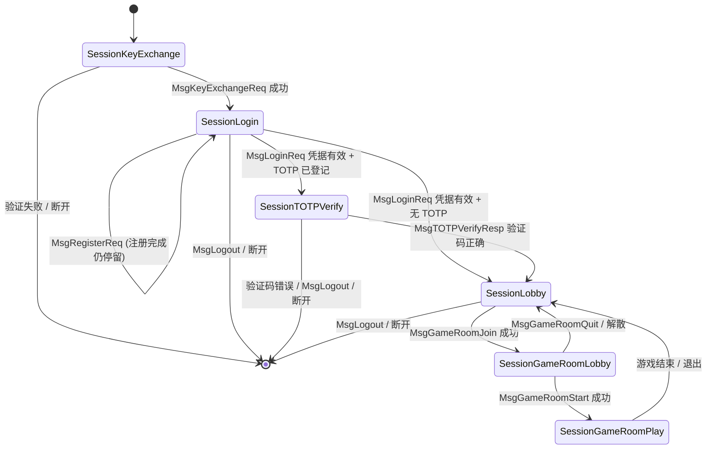

#### 2.1.4 公开 API

| 函数                                         | 说明                                                                               | 失败原因                   |
| -------------------------------------------- | ---------------------------------------------------------------------------------- | -------------------------- |
| `int serverInit(Server *s, uint16_t port)` | 创建监听套接字，**初始化日志子系统**（`serverLogInit()`），打开 ServerDB，经 TUI 完成 MK 解锁阶段（阻塞） | 端口占用、MK 错误、DB 损坏 |
| `int serverLaunch(Server *s)` | 打开加密数据库（UserDB/FriendDB/PrivateChatDB/GroupDB/GameDB/GameRoomDB），分配 session/room 数组，创建 OnlineTracker，安装信号处理器，**在后台线程中启动 `select()` 事件循环** | DB 打开失败、线程创建失败  |
| `void serverShutdown(Server *s)` | 将 `running` 标志设为 `false` ，等待后台事件循环线程退出（ `pthread_join` ） | —                         |
| `void serverRun(Server *s)` | 调用 `serverLaunch()` 在后台启动事件循环，然后进入 TUI 主页面（阻塞）。用户 `exit` 时内部调用 `serverShutdown()` | —                         |
| `void serverCleanup(Server *s)` | 断开所有客户端、释放 session/room、关闭数据库、安全擦除所有密钥、**调用 `serverLogClose()` 停止日志子系统** | —                         |

**服务端生命周期图**

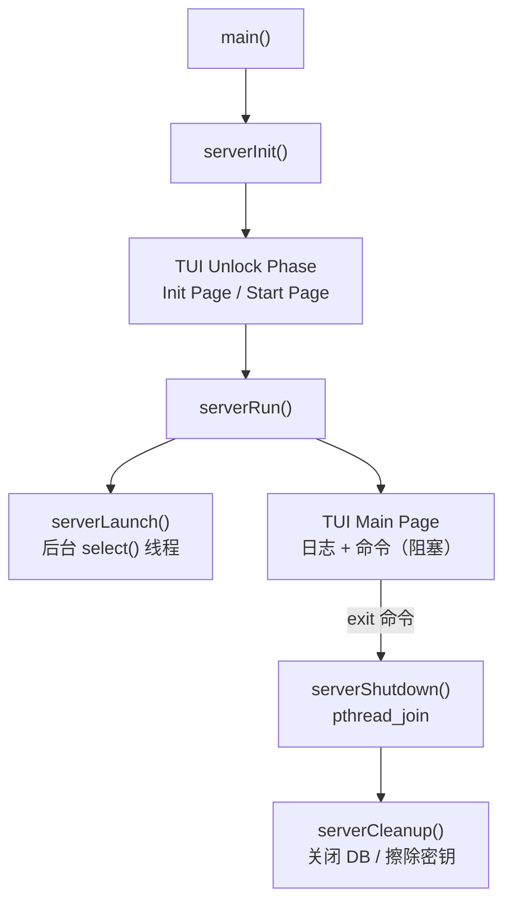

#### 2.1.5 请求分派逻辑

`processClient()` 负责接收和解密数据包，然后按 `SessionState` + `MessageType` 分派到各领域模块：

| 状态                   | 允许的消息类型        | 分派目标                                          |
| ---------------------- | --------------------- | ------------------------------------------------- |
| `SessionKeyExchange` | `MsgKeyExchangeReq` | `serverExchangeAESKey()` → `communication.c` |
| `SessionLogin` | `MsgLoginReq` | `serverHandleLogin()` → `auth.c` |
| `SessionLogin` | `MsgRegisterReq` | `serverHandleRegister()` → `auth.c` |
| `SessionLogin` | `MsgLogout` | `handleLogout()` → `server.c` |
| `SessionTOTPVerify` | `MsgTOTPVerifyResp` | `serverHandleTOTPVerify()` → `auth.c` |
| `SessionTOTPVerify` | `MsgLogout` | `handleLogout()` → `server.c` |
| `SessionLobby` | `MsgFriendRequest` | `serverHandleFriendRequest()` → `friend.c` |
| `SessionLobby` | `MsgFriendAccept` | `serverHandleFriendAccept()` → `friend.c` |
| `SessionLobby` | `MsgFriendReject` | `serverHandleFriendReject()` → `friend.c` |
| `SessionLobby` | `MsgFriendDelete` | `serverHandleFriendDelete()` → `friend.c` |
| `SessionLobby` | `MsgFriendListReq` | `serverHandleFriendList()` → `friend.c` |
| `SessionLobby` | `MsgPrivateChat` | `serverHandlePrivateChatSend()` → `privateChat.c` |
| `SessionLobby` | `MsgPrivateChatHistoryReq` | `serverHandlePrivateChatHistory()` → `privateChat.c` |
| `SessionLobby` | `MsgGroupCreate` | `serverHandleGroupCreate()` → `group.c` |
| `SessionLobby` | `MsgGroupJoin` | `serverHandleGroupJoin()` → `group.c` |
| `SessionLobby` | `MsgGroupQuit` | `serverHandleGroupQuit()` → `group.c` |
| `SessionLobby` | `MsgGroupListReq` | `serverHandleGroupList()` → `group.c` |
| `SessionLobby` | `MsgGroupChat` | `serverHandleGroupChat()` → `group.c` |
| `SessionLobby` | `MsgGroupKick` | `serverHandleGroupKick()` → `group.c` |
| `SessionLobby` | `MsgGroupDisband` | `serverHandleGroupDisband()` → `group.c` |
| `SessionLobby` | `MsgGroupChatHistoryReq` | `serverHandleGroupChatHistory()` → `group.c` |
| `SessionLobby` | `MsgGameListReq` | `serverHandleGameList()` → `gameDistribution.c` |
| `SessionLobby` | `MsgGameDownloadReq` | `serverHandleGameDownload()` → `gameDistribution.c` |
| `SessionLobby` | `MsgGameDownloadCancel` | `serverHandleGameDownloadCancel()` → `gameDistribution.c` |
| `SessionLobby` | `MsgGameRoomListReq` | `serverHandleGameRoomList()` → `gameRoom.c` |
| `SessionLobby` | `MsgGameRoomCreate` | `serverHandleGameRoomCreate()` → `gameRoom.c` |
| `SessionLobby` | `MsgGameRoomJoin` | `serverHandleGameRoomJoin()` → `gameRoom.c` |
| `SessionLobby` | `MsgTOTPSetupReq` | `serverHandleTOTPSetup()` → `auth.c` |
| `SessionLobby` | `MsgDBKeyReq` | `serverHandleDBKeyReq()` → `auth.c` |
| `SessionLobby` | `MsgHeartbeat` | `handleHeartbeat()` → `server.c` |
| `SessionLobby` | `MsgLogout` | `handleLogout()` → `server.c` |
| `SessionGameRoomLobby` | `MsgGameRoomQuit` | `serverHandleGameRoomQuit()` → `gameRoom.c` |
| `SessionGameRoomLobby` | `MsgGameRoomStart` | `serverHandleGameRoomStart()` → `gameRoom.c` |
| `SessionGameRoomLobby` | `MsgLogout` | `handleLogout()` → `server.c` |
| `SessionGameRoomPlay` | `MsgGameRoomPlayData` | `serverHandleGameRoomPlayData()` → `gameRoom.c` |
| `SessionGameRoomPlay` | `MsgGameRoomQuit` | `serverHandleGameRoomQuit()` → `gameRoom.c` |
| `SessionGameRoomPlay` | `MsgLogout` | `handleLogout()` → `server.c` |

**协议违规**：在任何状态下接收到非预期的消息类型，服务端记录警告并断开该客户端。密钥交换完成后，所有数据包必须为 `AES256GCMPacket` 类型。

---

### 2.2 Server Auth 认证模块

**接口**： `src/server/auth.h`

**实现**： `src/server/auth.c`

封装服务端登录、注册、TOTP 设置/验证及 DB 密钥请求的全部业务逻辑。

#### 2.2.1 公开 API

| 函数                                                                            | 说明                                                            | 前置条件                           | 失败时行为                  |
| ------------------------------------------------------------------------------- | --------------------------------------------------------------- | ---------------------------------- | --------------------------- |
| `int serverHandleLogin(Server *s, ClientSession *cs, const Packet *pkt)` | 解析 `MsgLoginReq` → `verifyUser` → TOTP 挑战/登录响应    | `cs->state == SessionLogin` | 发送状态 1 响应，不断开连接 |
| `int serverHandleRegister(Server *s, ClientSession *cs, const Packet *pkt)` | 解析 `MsgRegisterReq` → `createUser` → 状态响应           | `cs->state == SessionLogin` | 发送状态 1 响应             |
| `int serverHandleTOTPSetup(Server *s, ClientSession *cs)` | 生成随机 TOTP 密钥 → Base32 编码 → DEK 加密存库 → 返回客户端 | TOTP 尚未设置                      | 已设置时返回空 secret       |
| `int serverHandleTOTPVerify(Server *s, ClientSession *cs, const Packet *pkt)` | 验证 TOTP 验证码，正确则发出 `MsgLoginResp` 完成登录          | `cs->state == SessionTOTPVerify` | 验证码错误关闭连接          |
| `int serverHandleDBKeyReq(Server *s, ClientSession *cs)` | 从 UserDB 读取并解密 CDBKey，通过 `MsgDBKeyResp` 返回         | 用户已登录                         | 连接失败                    |

#### 2.2.2 认证流程图

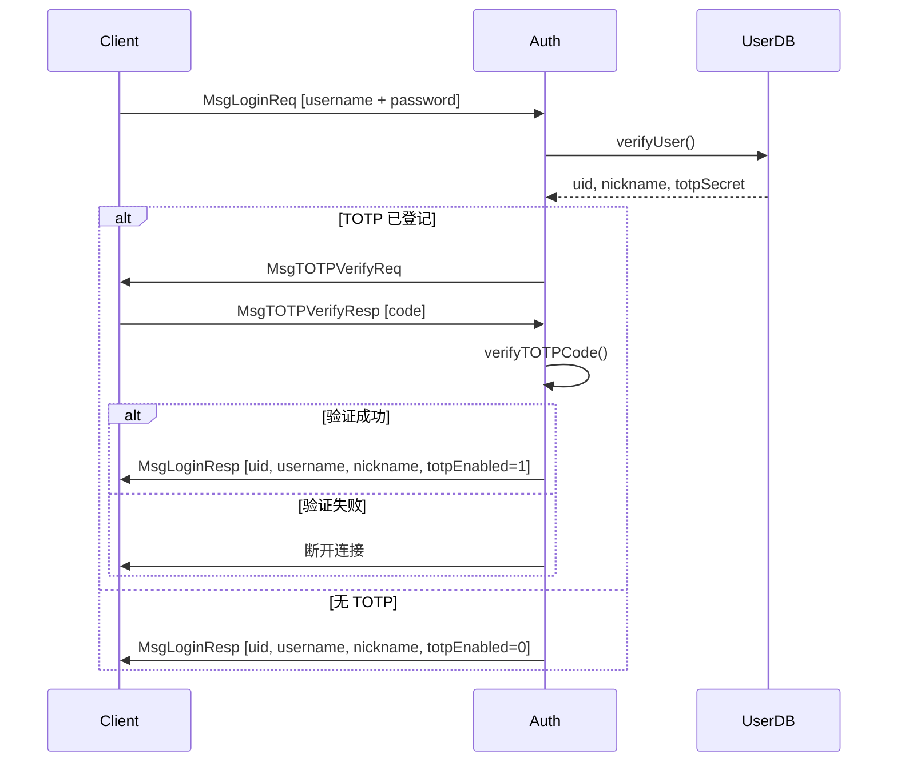

---

### 2.3 Server Room 房间模块 (DEPRECATED)

> **已废弃**：由 [2.13 Server Group](#213-server-group-群组模块) 替代。`MsgRoom*` 消息类型已移除，`ActiveRoom` 结构体已删除。

---

### 2.4 Server Chat 聊天模块 (DEPRECATED)

> **已废弃**：由 [2.12 Server PrivateChat](#212-server-privatechat-私聊模块) 和 [2.13 Server Group](#213-server-group-群组模块) 替代。`MsgChat` 消息类型已移除，`ChatHistoryDB` 和 `RoomDB` 已删除。

---

### 2.11 Server Friend 好友模块

**接口**： `src/server/friend.h`

**实现**： `src/server/friend.c`

处理好友请求、接受、拒绝、删除和列表查询。好友关系为双向确认模型：A 发送请求 → B 接受 → 双向好友关系建立。

#### 2.11.1 公开 API

| 函数 | 说明 | 发送响应 |
|------|------|---------|
| `int serverHandleFriendRequest(Server *s, ClientSession *cs, const Packet *pkt)` | 处理好友请求。校验 payload 为 `FriendOpPayload`，拒绝自身、已有好友、重复请求。调用 `friendRequestCreate()` 写入 FriendDB。 | `MsgFriendRequestResp` (uint8_t status) |
| `int serverHandleFriendAccept(Server *s, ClientSession *cs, const Packet *pkt)` | 接受好友请求。调用 `friendRequestAccept()` 创建双向好友关系。成功后向双方在线会话发送 `MsgFriendNotify`。 | `MsgFriendAcceptResp` (uint8_t status) |
| `int serverHandleFriendReject(Server *s, ClientSession *cs, const Packet *pkt)` | 拒绝好友请求。调用 `friendRequestReject()` 将请求状态设为已拒绝。 | `MsgFriendRejectResp`（由客户端自行处理） |
| `int serverHandleFriendDelete(Server *s, ClientSession *cs, const Packet *pkt)` | 删除好友。调用 `friendDelete()` 移除双向好友关系。 | `MsgFriendDeleteResp` (uint8_t status) |
| `int serverHandleFriendList(Server *s, ClientSession *cs)` | 返回好友列表。调用 `friendListGet()` 获取好友 UID 列表，从 UserDB 查询用户名/昵称，从 OnlineTracker 查询在线状态。 | `MsgFriendListResp` (uint32_t count + FriendInfo[count]) |

#### 2.11.2 好友请求流程图

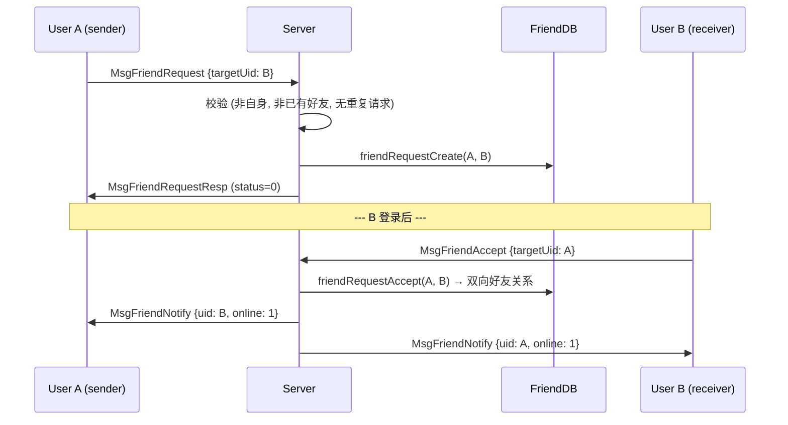

---

### 2.12 Server PrivateChat 私聊模块

**接口**： `src/server/privateChat.h`

**实现**： `src/server/privateChat.c`

处理一对一的私聊消息发送、历史查询和离线消息投递。消息持久化存储在 PrivateChatDB 中。接收者在线时立即转发；离线时暂存，下次登录批量投递。

#### 2.12.1 公开 API

| 函数 | 说明 |
|------|------|
| `int serverHandlePrivateChatSend(Server *s, ClientSession *cs, const Packet *pkt)` | 处理私聊发送。解析 `PrivateChatPayload`，调用 `privateChatStore()` 持久化。若接收者在线则通过 `onlineTrackerFind()` 获取会话并立即转发 `MsgPrivateChatBroadcast`；否则保留 `delivered=0` 待离线投递。 |
| `int serverHandlePrivateChatHistory(Server *s, ClientSession *cs, const Packet *pkt)` | 处理历史消息查询。解析 `PrivateChatHistoryReqPayload`，调用 `privateChatHistory()` 获取两用户间的消息列表（ASC 时间顺序），构造响应。 |
| `void serverDeliverOfflineMessages(Server *s, ClientSession *cs)` | 用户登录时调用。查询 PrivateChatDB 中 `toUid = cs->uid AND delivered = 0` 的待投递消息，逐条发送 `MsgPrivateChatBroadcast` 并标记 `delivered = 1`。 |

#### 2.12.2 离线消息投递流程图

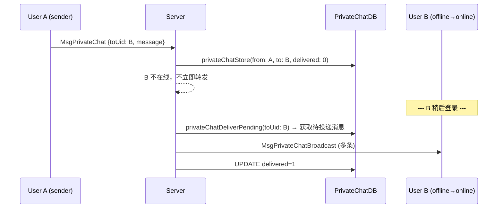

---

### 2.13 Server Group 群组模块

**接口**： `src/server/group.h`

**实现**： `src/server/group.c`

管理群组的创建、加入、退出、踢人、解散和群聊消息。群主拥有一票否决权（踢人、解散）。最多 50 名成员。

#### 2.13.1 公开 API

| 函数 | 说明 | 权限 |
|------|------|------|
| `int serverHandleGroupCreate(Server *s, ClientSession *cs, const Packet *pkt)` | 创建群组。解析 `GroupCreatePayload`，生成唯一 groupId，创建者自动成为群主兼首位成员。 | 任意已登录用户 |
| `int serverHandleGroupJoin(Server *s, ClientSession *cs, const Packet *pkt)` | 加入群组。校验群组存在、未达上限、非重复加入。若当前在其他群组则自动退出。通知现有在线成员 `MsgGroupMemberJoin`。 | 任意已登录用户 |
| `int serverHandleGroupQuit(Server *s, ClientSession *cs, const Packet *pkt)` | 退出群组。若群组变空则删除。通知剩余成员 `MsgGroupMemberQuit`。 | 任意群成员 |
| `int serverHandleGroupList(Server *s, ClientSession *cs)` | 返回所有群组列表。调用 `groupListAll()` 单 SQL 查询（JOIN 优化）。 | 任意已登录用户 |
| `int serverHandleGroupChat(Server *s, ClientSession *cs, const Packet *pkt)` | 群聊消息发送。解析 `GroupChatPayload`，调用 `groupStoreChat()` 持久化，向所有其他在线成员广播 `MsgGroupChatBroadcast`。 | 任意群成员 |
| `int serverHandleGroupKick(Server *s, ClientSession *cs, const Packet *pkt)` | 群主踢人。解析 `GroupKickPayload`，校验操作者为群主且目标非群主，移除成员并通知被踢者和剩余成员。 | 群主 |
| `int serverHandleGroupDisband(Server *s, ClientSession *cs, const Packet *pkt)` | 解散群组。校验操作者为群主，通知所有在线成员 `MsgGroupDisbandNotify`，清除成员状态，删除群组。 | 群主 |
| `int serverHandleGroupChatHistory(Server *s, ClientSession *cs, const Packet *pkt)` | 群聊历史查询。解析 `GroupChatHistoryReqPayload`，调用 `groupChatHistory()` 返回 ASC 时间顺序消息列表。 | 任意群成员 |

---

### 2.14 Server OnlineTracker 在线追踪模块

**接口**： `src/server/onlineTracker.h`

**实现**： `src/server/onlineTracker.c`

维护 uid → ClientSession* 的哈希表映射，支持 O(1) 在线状态查询。512 个哈希桶，拉链法解决冲突。

#### 2.14.1 公开 API

| 函数 | 说明 |
|------|------|
| `OnlineTracker *onlineTrackerCreate(void)` | 分配并返回 OnlineTracker 实例。返回 NULL 表示内存不足。 |
| `void onlineTrackerDestroy(OnlineTracker *trk)` | 释放所有内存。传 NULL 为 no-op。 |
| `void onlineTrackerAdd(OnlineTracker *trk, uint32_t uid, ClientSession *cs)` | 添加/更新 uid→session 映射。幂等：若 uid 已存在则覆盖。 |
| `void onlineTrackerRemove(OnlineTracker *trk, uint32_t uid)` | 移除 uid 的映射。uid 不存在时为 no-op。 |
| `ClientSession *onlineTrackerFind(OnlineTracker *trk, uint32_t uid)` | O(1) 哈希查找。返回 ClientSession* 或 NULL。 |
| `bool onlineTrackerIsOnline(OnlineTracker *trk, uint32_t uid)` | 等同于 `onlineTrackerFind(trk, uid) != NULL`。 |

---

### 2.15 Server Social Database 社交数据库模块

社交系统使用三个独立的加密 SQLCipher 数据库：

| 数据库 | 路径 | 表 |
|--------|------|-----|
| **FriendDB** | `db/friend.db` | `friendships` (双向好友关系), `friend_requests` (待处理请求) |
| **PrivateChatDB** | `db/privateChat.db` | `msg_sequence` (全局消息 ID), `private_messages` (含 delivered 标记) |
| **GroupDB** | `db/group.db` | `groups`, `group_members`, `msg_sequence`, 每群动态表 `group_<groupId>` |

#### 2.15.1 FriendDB 函数

| 函数 | 说明 |
|------|------|
| `int friendRequestCreate(DB *db, uint32_t from, uint32_t to)` | 创建待处理请求 (status=0)。UNIQUE 约束阻止重复请求。 |
| `int friendRequestAccept(DB *db, uint32_t from, uint32_t to)` | 接受请求 (status=1)，写入双向 friendships 行。 |
| `int friendRequestReject(DB *db, uint32_t from, uint32_t to)` | 拒绝请求 (status=2)。 |
| `int friendDelete(DB *db, uint32_t uid, uint32_t friendUid)` | 删除双向好友关系。 |
| `int friendListGet(DB *db, uint32_t uid, FriendInfo **out, size_t *count)` | 获取好友列表 (仅 uid，调用者负责查询用户名/在线状态)。 |
| `int friendRequestPendingList(DB *db, uint32_t uid, FriendInfo **out, size_t *count)` | 获取待处理请求列表。 |
| `int friendIsFriend(DB *db, uint32_t uid, uint32_t other)` | 检查是否为好友关系。 |

#### 2.15.2 PrivateChatDB 函数

| 函数 | 说明 |
|------|------|
| `int privateChatStore(DB *db, uint32_t from, uint32_t to, const uint8_t *msg, uint64_t ts, uint32_t *outMsgId)` | 存储私聊消息 (delivered=0)。 |
| `int privateChatDeliverPending(DB *db, uint32_t toUid, Chat **out, size_t *count)` | 获取待投递消息并标记 delivered=1。 |
| `int privateChatHistory(DB *db, uint32_t uidA, uint32_t uidB, uint32_t beforeMsgId, uint32_t limit, Chat **out, size_t *count)` | ASC 时间顺序查询两用户间的消息历史。 |
| `int privateChatLastMsgTimestamp(DB *db, uint32_t a, uint32_t b, uint64_t *ts)` | 获取两用户间最后一条消息的时间戳。 |

#### 2.15.3 GroupDB 函数

| 函数 | 说明 |
|------|------|
| `int groupCreate(DB *db, uint32_t groupId, const char *name, uint32_t owner)` | 创建群组。 |
| `int groupDelete(DB *db, uint32_t groupId)` | 删除群组。 |
| `int groupAddMember(DB *db, uint32_t groupId, uint32_t uid)` | 添加成员。 |
| `int groupRemoveMember(DB *db, uint32_t groupId, uint32_t uid)` | 移除成员。 |
| `int groupIsMember(DB *db, uint32_t groupId, uint32_t uid)` | 检查成员资格。 |
| `int groupMemberList(DB *db, uint32_t groupId, uint32_t **outUids, size_t *count)` | 获取成员 uid 列表。 |
| `int groupListAll(DB *db, GroupInfo **out, size_t *count)` | 获取所有群组（JOIN 优化，单 SQL）。 |
| `int groupGetInfo(DB *db, uint32_t groupId, GroupInfo *out)` | 获取单个群组信息。 |
| `int groupStoreChat(DB *db, uint32_t groupId, uint32_t uid, const char *msg, int64_t ts, uint64_t *outMsgId)` | 存储群聊消息到 `group_<groupId>` 表。 |
| `int groupChatHistory(DB *db, uint32_t groupId, uint32_t beforeMsgId, uint32_t limit, Chat **out, size_t *count)` | ASC 时间顺序查询群聊历史。 |
| `int groupLastMsgTimestamp(DB *db, uint32_t groupId, uint64_t *ts)` | 获取群组最后一条消息时间戳。 |

---

### 2.5 Server Key Manager 密钥管理模块

**接口**： `src/server/keyManager.h`

**实现**： `src/server/keyManager.c`

实现服务端信封加密密钥体系：主密钥（MK）生成、密钥派生、信封加密存储及启动解密加载。

#### 2.5.1 密钥体系图

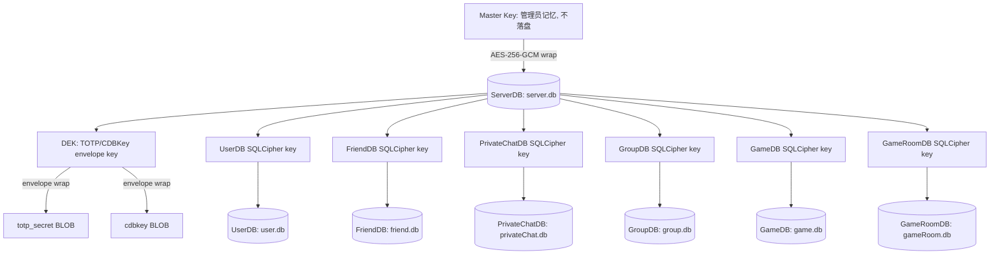

#### 2.5.2 公开 API

**`int serverInitKeys(Server *s)`**

首次运行路径：

1. `cryptoRandomBytes()` 生成 MK、DEK、UserDBKey、FriendDBKey、PrivateChatDBKey、GroupDBKey、GameDBKey、GameRoomDBKey（各 32 字节）
2. 用 MK 经 AES-256-GCM 分别信封加密后七个密钥，存入 ServerDB
3. 载入明文密钥至 `Server` 结构体
4. 一次性十六进制显示 MK 给管理员（通过 TUI Init Page），随后 `OPENSSL_cleanse` 擦除

已有运行路径：

1. 从 ServerDB 读取全部七个 envelope，逐一校验完整性
2. 管理员在 TUI Start Page 输入 MK（64 字符十六进制），经 `hexCharToNibble()` 转为二进制
3. 逐一解密 envelope，校验长度（60 字节 = nonce(12) + key(32) + tag(16)）及 AES-GCM 认证标签
4. 载入明文密钥至 `Server` 结构体

内部 helper `encryptAndStoreKey()` 与 `decryptAndLoadKey()` 为 `static` 函数，不对外暴露。

---

### 2.6 Server Communication 服务端通信模块

**接口**： `src/server/communication.h`

**实现**： `src/server/communication.c`

封装服务端侧的 ECDH+HKDF 密钥协商及面向 `ClientSession` 的加密收发。

#### 2.6.1 公开 API

**`int serverExchangeAESKey(SocketFD clientFD, Packet *reqPacket, AESGCMKey *outKey)`**

完成服务端侧的密钥交换。对客户端发来的 `reqPacket` 执行零信任校验（消息类型、包类型、载荷长度），拒绝反射攻击。生成临时 X25519 密钥对，ECDH 协商后 HKDF-SHA256 派生 AES 密钥。成功时 `outKey->nonce` 已清零。

* **安全措施**：校验失败时 `reqPacket->payload` 被清零，防止密钥材料泄漏

**`int serverSendEncryptedPacket(ClientSession *cs, MessageType mt, const void *data, size_t dataLen)`**

从 `cs` 读取 socket、AES 密钥和序列号，调用 `packetSendEncrypted()` 完成加密发送。

**`int serverRecvEncryptedPacket(ClientSession *cs, Packet *out)`**

接收并解密一个 AES-256-GCM 数据包。用于 `processClient()` 中非密钥交换状态的收包。

**`int serverSendStatusResponse(ClientSession *cs, MessageType mt, uint8_t status)`**

发送单字节状态响应（0 = 成功，1 = 失败）。认证与房间模块通过此统一接口返回操作结果。

---

### 2.7 Server Database 服务端数据库模块

**接口**： `src/server/database.h`

**实现**： `src/server/database/{common,userDb,friendDb,privateChatDb,groupDb,gameRoomDb,serverDb,gameDb}.c`

提供基于 SQLCipher 的持久化数据层。公共接口头文件位于 `src/server/database.h` ，实现在 `src/server/database/` 子目录：

```
src/server/
├── database.h       ← 公共接口头文件（DB handle、所有 CRUD 声明）
└── database/
    ├── common.c     → dbInit / dbClose 生命周期管理
    ├── userDb.c     → 用户表 CRUD (createUser, deleteUser, verifyUser 等)
    ├── friendDb.c   → 好友关系 CRUD (friendRequestCreate, friendListGet 等)
    ├── privateChatDb.c → 私聊消息 CRUD (privateChatStore, privateChatHistory 等)
    ├── groupDb.c    → 群组 CRUD (groupCreate, groupStoreChat 等)
    ├── gameDb.c     → 游戏元数据 CRUD (registerGame, listGameBrief 等)
    ├── gameRoomDb.c → 游戏房间 CRUD (createGameRoom, listGameRooms 等)
    ├── serverDb.c   → 服务器密钥 CRUD (setServerKey, getServerKey)
    └── internal.h   → 内部共享常量和函数声明
```

#### 2.7.1 常量与宏

| 宏                       | 值                        | 说明                     |
| ------------------------ | ------------------------- | ------------------------ |
| `DB_SUCC` | `0` | 操作成功                 |
| `DB_FAIL` | `-1` | 操作失败                 |
| `USER_DB_PATH` | `"./db/user.db"` | 用户数据库文件路径       |
| `CHAT_HISTORY_DB_PATH` | `"./db/chatHistory.db"` | 聊天记录数据库文件路径 (DEPRECATED) |
| `ROOM_DB_PATH` | `"./db/room.db"` | 游戏房间数据库文件路径 (DEPRECATED) |
| `GAME_DB_PATH` | `"./db/game.db"` | 游戏元数据数据库文件路径 |
| `SERVER_DB_PATH` | `"./db/server.db"` | 服务器密钥数据库文件路径 |
| `DB_DIRECTORY` | `"./db"` | 数据库文件所在目录       |
| `ROOM_STMT_BUCKETS` | `32` | Room 语句缓存哈希表桶数 (DEPRECATED) |
| `GROUP_STMT_BUCKETS` | `32` | Group 语句缓存哈希表桶数  |
| `FRIEND_DB_PATH` | `"./db/friend.db"` | 好友关系数据库文件路径 |
| `PRIVATE_CHAT_DB_PATH` | `"./db/privateChat.db"` | 私聊数据库文件路径 |
| `GROUP_DB_PATH` | `"./db/group.db"` | 群组数据库文件路径 |
| `GAME_ROOM_DB_PATH` | `"./db/gameRoom.db"` | 游戏房间数据库文件路径 |

#### 2.7.2 类型定义

**DBType**

```c
typedef enum { UserDB = 1, ServerDB, GameDB, GameRoomDB, FriendDB, PrivateChatDB, GroupDB } DBType;
```

**Chat**

```c
typedef struct {
    uint32_t uid;
    uint64_t msgId;
    char *message;
    time_t timestamp;
} Chat;
```

**DB**

```c
typedef struct DB {
    sqlite3 *handle;
    DBType type;
    // UserDB cached statements
    sqlite3_stmt *stmtInsert, *stmtDelete, *stmtSelect;
    sqlite3_stmt *stmtUidCheck;
    sqlite3_stmt *stmtSetTotpSecret, *stmtGetTOTPSecret, *stmtGetCDBKey;
    // GroupDB cached statements
    sqlite3_stmt *stmtGroupSeq;
    GroupStmtCache *groupCache;
    // PrivateChatDB cached statements
    sqlite3_stmt *stmtSeq;
    // ServerDB cached statements
    sqlite3_stmt *stmtSetKey, *stmtGetKey;
    // GameDB cached statements
    sqlite3_stmt *stmtGameInsert, *stmtGameDelete, *stmtGameUpdate;
    sqlite3_stmt *stmtGameSelectById, *stmtGameSelectByName;
    sqlite3_stmt *stmtGameList, *stmtGameListAll, *stmtGameListRange;
    sqlite3_stmt *stmtGameListPlatformAll, *stmtGameListPlatformRange;
    sqlite3_stmt *stmtGameGetKey;
    sqlite3_stmt *stmtPlatformInsert, *stmtPlatformSelect, *stmtPlatformList;
    // GameRoomDB cached statements
    sqlite3_stmt *stmtGameRoomInsert, *stmtGameRoomDelete;
    sqlite3_stmt *stmtGameRoomSelect, *stmtGameRoomExists;
    // Key material
    uint8_t dekKey[AES_GCM_KEY_LEN];
    uint8_t dbEncKey[DB_ENC_KEY_LEN];
} DB;
```

#### 2.7.3 数据库 Schema

**UserDB**（ `db/user.db` ）

```sql
CREATE TABLE IF NOT EXISTS users (
    uid INTEGER PRIMARY KEY,
    username TEXT UNIQUE NOT NULL,
    nickname TEXT NOT NULL,
    password TEXT NOT NULL,       -- salt_hex:hash_hex
    totp_secret BLOB,             -- AES-256-GCM envelope (DEK-wrapped)
    cdbkey BLOB                   -- AES-256-GCM envelope (DEK-wrapped)
);
```

**ChatHistoryDB**（ `db/chatHistory.db` ）(DEPRECATED)

> **已废弃**：ChatHistoryDB 已从源码中删除。社交消息存储由 [2.15 Server Social Database](#215-server-social-database-社交数据库模块) 中的 PrivateChatDB 和 GroupDB 替代。

```sql
-- 已删除。原 schema 参考 2.15 PrivateChatDB 和 GroupDB。
```

**RoomDB**（ `db/room.db` ）(DEPRECATED)

> **已废弃**：RoomDB 已从源码中删除。

```sql
-- 已删除。
```

**ServerDB**（ `db/server.db` ）

通过 `setServerKey` / `getServerKey` 的键值对模型管理 envelope 数据，内部 schema 为 `server_keys(key_name TEXT PRIMARY KEY, key_value BLOB, created_at INTEGER)` 。

#### 2.7.4 生命周期与密钥管理

| 函数                                                      | 说明                                                                                                   | 释放责任      |
| --------------------------------------------------------- | ------------------------------------------------------------------------------------------------------ | ------------- |
| `DB *dbInit(DBType dbType, const uint8_t *encKey)` | 打开/创建数据库，自动建 `db/` 目录，WAL 模式。encKey 非 NULL 时调用 `sqlite3_key()` 启用 SQLCipher | `dbClose()` |
| `void dbClose(DB *database)` | 关闭连接、finalize 所有 stmt、释放资源、 `OPENSSL_cleanse` 擦除密钥                                   | NULL 安全     |
| `void dbSetDekKey(DB *database, const uint8_t *dekKey)` | 注入 DEK 至 DB 句柄（TOTP 信封加密用）                                                                 | NULL 清零     |
| `void dbSetDbEncKey(DB *database, const uint8_t *key)` | 注入数据库加密密钥至 DB 句柄                                                                           | NULL 清零     |

#### 2.7.5 用户操作

| 函数                                                              | 说明                                                                    | 内存释放                                                   |
| ----------------------------------------------------------------- | ----------------------------------------------------------------------- | ---------------------------------------------------------- |
| `int createUser(DB *database, User *user)` | 创建用户：随机生成 UID、 `hashPassword` 、生成 CDBKey 并由 DEK 加密存储 | 调用者持有 `User` |
| `int deleteUser(DB *database, User *user)` | 按 uid 删除用户                                                         | 调用者持有 `User` |
| `int verifyUser(DB *database, User *user)` | 按 username 验证凭据，常量时间比较防枚举，回填 uid/nickname/totpSecret  | `user->totpSecret` 为 `strdup` 分配，调用者 `free()` |
| `int getCDBKey(DB *database, uint32_t uid, uint8_t outKey[32])` | 解密并返回每用户 CDBKey                                                 | 调用者提供 buffer                                          |

#### 2.7.6 TOTP 密钥与 ServerDB 操作

| 函数                                                                                           | 说明                                                                                 | 内存释放                   |
| ---------------------------------------------------------------------------------------------- | ------------------------------------------------------------------------------------ | -------------------------- |
| `int setTOTPSecret(DB *database, User *user, const char *secret)` | DEK 信封加密后存入 totp_secret 列                                                    | secret 为 NULL/"" 时清除   |
| `char *getTOTPSecret(DB *database, User *user)` | 解密并返回 TOTP 明文字符串                                                           | 调用者 `free()` |
| `int setServerKey(DB *database, const char *keyName, const uint8_t *value, size_t valueLen)` | INSERT OR REPLACE 键值对                                                             | —                         |
| `int getServerKey(DB *database, const char *keyName, uint8_t **outValue, size_t *outLen)` | 按 key_name 查询，返回堆分配副本。不存在时返回 SUCC 且 `*outValue=NULL, *outLen=0` | 调用者 `free(*outValue)` |

#### 2.7.7 社交数据库操作 (DEPRECATED — 旧 chat/RoomDB API)

> **已废弃**：以下 API 来自已删除的 ChatHistoryDB 和 RoomDB。社交数据库操作请参考 [2.15 Server Social Database](#215-server-social-database-社交数据库模块)。

| 函数                                                                                                                   | 说明                                                             | 内存释放                                       |
| ---------------------------------------------------------------------------------------------------------------------- | ---------------------------------------------------------------- | ---------------------------------------------- |
| `int storeChat(DB *database, uint32_t roomId, Chat *chat)` (DEPRECATED) | 存储聊天消息                                                      | —                                             |
| `int queryChatByMsgId(DB *database, uint32_t roomId, uint64_t msgId, Chat *out)` (DEPRECATED) | 按全局 msgId 查询单条                                            | `free(out->message)` |
| `int queryChatByTimeRange(DB *, uint32_t roomId, uint32_t uid, time_t start, time_t end, Chat **out, size_t *count)` (DEPRECATED) | 时间范围查询                                                     | 逐条 `free(out[i].message)` 后 `free(out)` |
| `int queryChatByUserAllRooms(DB *, uint32_t uid, time_t start, time_t end, Chat **out, size_t *count)` (DEPRECATED) | 跨所有房间查询用户消息                                           | 逐条 `free(out[i].message)` 后 `free(out)` |
| `int createRoom(DB *database, uint32_t roomId, uint32_t creatorUid)` (DEPRECATED) | 创建房间                                                         | —                                             |
| `int deleteRoom(DB *database, uint32_t roomId)` (DEPRECATED) | 删除房间                                                         | 不存在时返回 FAIL                              |
| `int listRooms(DB *database, uint32_t **outRoomIds, size_t *count)` (DEPRECATED) | 列出所有房间 ID。空库返回 SUCC 且 `*outRoomIds=NULL, *count=0` | `free(*outRoomIds)` |
| `int roomExists(DB *database, uint32_t roomId)` (DEPRECATED) | 检查房间存在性                                                   | —                                             |

#### 2.7.8 数据库加密（SQLCipher）与密钥体系

PacPlay 服务端所有业务数据库通过 SQLCipher 的 AES-256-CBC 页级加密保护。密钥体系分三层：

```
Layer 1: MK (Master Key) — 256-bit
   仅存于管理员记忆，永不在磁盘持久化
           │ AES-256-GCM 信封加密
           ▼
Layer 2: Envelopes 存储于 server.db (ServerDB)
   nonce(12) ‖ AES-256-GCM(key) ‖ tag(16)
           │ 管理员在 TUI 输入 MK → decryptAESGCM
           ▼
Layer 3: 明文密钥驻留内存 (Server.dekKey / *dbEncKey)
   DEK → TOTP/CDBKey 信封加密
   UserDBKey → user.db SQLCipher
   FriendDBKey → friend.db SQLCipher
   PrivateChatDBKey → privateChat.db SQLCipher
   GroupDBKey → group.db SQLCipher
   GameDBKey → game.db SQLCipher
   GameRoomDBKey → gameRoom.db SQLCipher
```

MK 永不落盘，仅在首次启动时以十六进制一次性显示。DEK 与 DB 密钥在 `serverCleanup()` 和 `dbClose()` 中通过 `OPENSSL_cleanse` 双份擦除。

---

#### 2.7.9 GameRoomDB 游戏房间数据库

以下为 `§2.7 Server Database` 中 GameRoomDB 子模块的补充内容。

**接口**： `src/server/database.h` （GameRoomDB 部分）

**实现**： `src/server/database/gameRoomDb.c`

GameRoomDB 是独立于 RoomDB 的游戏房间持久化数据库，文件路径 `./db/gameRoom.db`，通过 SQLCipher 加密，密钥为 `Server.gameRoomDbEncKey`。存储已创建的游戏房间记录以支持跨服务端重启持久化。

##### 数据库 Schema

```sql
CREATE TABLE IF NOT EXISTS game_rooms (
    gameRoomId INTEGER PRIMARY KEY,
    gameId INTEGER NOT NULL,
    hostUid INTEGER NOT NULL,
    createdAt INTEGER NOT NULL
);
```

##### 常量与宏

| 宏 | 值 | 说明 |
|---|---|---|
| `GAME_ROOM_DB_PATH` | `"./db/gameRoom.db"` | 游戏房间数据库文件路径 |

##### DB 句柄新增字段（`src/server/database.h`）

```c
sqlite3_stmt *stmtGameRoomInsert;  // INSERT INTO game_rooms
sqlite3_stmt *stmtGameRoomDelete;  // DELETE FROM game_rooms WHERE gameRoomId = ?
sqlite3_stmt *stmtGameRoomSelect;  // SELECT gameRoomId FROM game_rooms ORDER BY gameRoomId ASC
sqlite3_stmt *stmtGameRoomExists;  // SELECT 1 FROM game_rooms WHERE gameRoomId = ?
```

##### 公开 API

| 函数 | 说明 | 前置条件 | 释放责任 |
|---|---|---|---|
| `int createGameRoom(DB *database, uint32_t gameRoomId, uint32_t gameId, uint32_t hostUid)` | 插入游戏房间记录，自动设置 `createdAt` 为当前 UNIX 时间戳 | `database != NULL`，`database->type == GameRoomDB`，`gameRoomId != 0` | 无 |
| `int deleteGameRoom(DB *database, uint32_t gameRoomId)` | 按 `gameRoomId` 删除记录。不存在时返回 `DB_FAIL`（严格模式） | `database != NULL`，`database->type == GameRoomDB` | 无 |
| `int listGameRooms(DB *database, uint32_t **outIds, size_t *count)` | 列出所有游戏房间 ID（按 `gameRoomId` 升序）。空库返回 `DB_SUCC` 且 `*outIds=NULL, *count=0` | `database != NULL`，`outIds != NULL`，`count != NULL` | `free(*outIds)` |
| `int gameRoomExists(DB *database, uint32_t gameRoomId)` | 检查 `gameRoomId` 是否存在。`gameRoomId == 0` 直接返回 `DB_FAIL` | `database != NULL`，`database->type == GameRoomDB` | 无 |

**返回值**：所有函数成功返回 `DB_SUCC`（0），失败返回 `DB_FAIL`（-1）。

##### 内部辅助函数

| 函数 | 说明 |
|---|---|
| `int initGameRoomDBSchema(sqlite3 *dbHandle)` | 执行 `CREATE TABLE IF NOT EXISTS game_rooms` DDL |
| `int prepareGameRoomDBStmts(DB *database)` | 预编译所有 4 个 prepared statement 并绑定到 `DB` 句柄 |

---

### 2.8 Server Log 服务端日志子系统

**接口**： `src/server/serverLog.h`

**实现**： `src/server/serverLog.c`

在 vendored `log.h` / `log.c` 之上构建的完整服务端日志子系统，提供异步文件写入、UTC 午夜自动转档、基于 zlib-ng 的后台日志压缩、日志线程崩溃自动重启及面向 TUI 的日志获取 API。

#### 2.8.1 架构

日志子系统内部包含三个独立组件，各自持有独立的同步原语，互不阻塞：

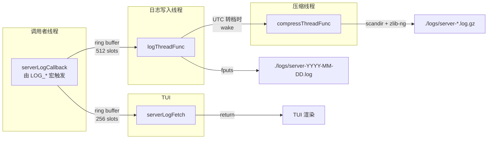

| 组件 | 缓冲区 | 独立锁 | 说明 |
|------|--------|--------|------|
| 文件写入线程 | 环形缓冲区 512 slots | `queue.mutex` + `queue.cond` | 从 `serverLogCallback` 接收格式化消息，写入当前 UTC 日期的日志文件，每行立即 `fflush` |
| 压缩线程 | `scanPending` 标志 | `compressState.mutex` + `compressState.cond` | UTC 转档时被日志线程唤醒，扫描 `./logs/` 下所有 ≥7 天的 `server-*.log`，经 zlib-ng 压缩为 `.log.gz`，成功后删除原始文件 |
| TUI 日志队列 | 环形缓冲区 256 slots | `tuiLogQueue.mutex` | `serverLogCallback` 无阻塞推入；`serverLogFetch` 按级别过滤、排空并返回 |

#### 2.8.2 常量

| 宏 | 值 | 说明 |
|----|----|------|
| `COMPRESS_RETENTION_DAYS` | `7` | ≥此天数的未压缩日志被后台压缩 |
| `COMPRESS_BUF_SIZE` | `64 * 1024` | 压缩时读写缓冲区大小（64 KiB） |
| `LOG_QUEUE_CAPACITY` | `512` | 文件写入环形缓冲区容量 |
| `TUI_LOG_CAPACITY` | `256` | TUI 日志环形缓冲区容量 |
| `LOG_MAX_RESTART` | `3` | 日志线程崩溃后最大自动重启次数 |

#### 2.8.3 公开 API

**`int serverLogInit(void)`**

初始化日志子系统。创建 `./logs/` 目录、启动日志写入线程与后台压缩线程、初始化 TUI 日志环形缓冲区、向 `log.c` 注册 `serverLogCallback`。

* **安全重入**：多次调用为 no-op，始终返回 0
* **失败处理**：任何步骤失败均返回 -1，服务端以仅 stderr 输出继续运行
* **压缩线程**：best-effort —— 启动失败不影响日志写入功能

**`void serverLogCheckAndRestart(void)`**

由 `serverRun()` 主循环周期性调用（约每 16ms 一次，实际检查开销为两次内存读取）。当日志写入线程死亡时自动重启（最多 3 次），同时清空所有环形缓冲区和压缩失败计数器。

* **压缩线程不参与重启** —— 其缺失不影响核心功能
* **第 4 次检查起**：放弃重启，日志子系统降级为仅 stderr

**`void serverLogClose(void)`**

优雅关闭日志子系统。停止日志写入线程（等待排空队列）、停止压缩线程、销毁所有同步原语、释放资源。NULL 状态安全。

**`int serverLogFetch(LogLevel minLevel, char ***outLines, int *outCount)`**

排空并返回自上一次调用以来所有 `level >= minLevel` 的预格式化日志行。结果为零终止的 `char**` 数组（含日志级别、时间戳、文件位置、消息体）。

* **返回值**：0 成功（空结果返回 `count=0` 和有效数组），-1 分配失败（缓冲区仍被清空）
* **释放**：`serverLogFetchFree(lines, count)`
* **线程安全**：可在任意线程与日志活动并发调用

**`void serverLogFetchFree(char **lines, int count)`**

释放 `serverLogFetch()` 返回的数组。NULL 安全。

#### 2.8.4 TUI 使用示例

```c
char **lines = NULL;
int count = 0;
if (serverLogFetch(LogLevelWarn, &lines, &count) == 0) {
    for (int i = 0; i < count; i++) {
        /* render lines[i] —
         * e.g. "2026-06-10 14:35:00 ERROR server.c:102: message\n" */
    }
    serverLogFetchFree(lines, count);
}
```

#### 2.8.5 日志线程崩溃重启

日志线程由 `serverLogCheckAndRestart()` 监控。崩溃后前 3 次自动重启：

1. 关闭残留文件句柄
2. 清空文件写入环形缓冲区
3. 重置压缩状态（`scanPending=false`, `consecutiveFailures=0`）
4. 清空 TUI 日志环形缓冲区
5. 创建新线程

压缩线程 **不**参与重启。压缩连续失败 3 天时通过 `LOG_WARN` 记录，不妨碍服务端运行。

#### 2.8.6 文件布局

```
./logs/
├── server-2026-06-08.log.gz    ← 已压缩（≥7 天）
├── server-2026-06-09.log.gz
├── server-2026-06-10.log       ← 当前正在写入
├── server-2026-06-03.log       ← ≥7 天但压缩失败（待下次重试）
└── server-2026-06-04.log
```

---

### 2.9 Server GameDB 游戏元数据模块

**接口**： `src/server/database.h` （GameDB 部分）、 `src/server/gameControl.h`

**实现**： `src/server/database/gameDb.c` 、 `src/server/gameControl.c`

提供游戏元数据的持久化注册表与管理员控制功能。采用双表设计（ `games` + `game_platforms` ），支持多平台二进制文件管理、AES-256-GCM 静态加密、DEK 信封密钥封装及 SHA-256 完整性校验。数据库通过 SQLCipher 加密，密钥为 `Server.gameDbEncKey` 。

#### 2.9.1 数据库 Schema

**GameDB**（ `db/game.db` ）

```sql
CREATE TABLE IF NOT EXISTS games (
    gameId      INTEGER PRIMARY KEY AUTOINCREMENT,
    name        TEXT NOT NULL UNIQUE,
    version     TEXT NOT NULL,
    description TEXT NOT NULL DEFAULT '',
    encKey      BLOB NOT NULL,        -- AES-256-GCM envelope (DEK-wrapped game key)
    createdAt   INTEGER NOT NULL,
    updatedAt   INTEGER NOT NULL
);

CREATE TABLE IF NOT EXISTS game_platforms (
    gameId   INTEGER NOT NULL,
    platform TEXT NOT NULL,            -- e.g. "linux-x86_64", "win-x64"
    fileName TEXT NOT NULL,
    hash     TEXT NOT NULL,            -- SHA-256 hex of the CLEARTEXT binary
    fileSize INTEGER NOT NULL,         -- ENCRYPTED file size on disk
    PRIMARY KEY (gameId, platform),
    FOREIGN KEY (gameId) REFERENCES games(gameId) ON DELETE CASCADE
);
```

**文件系统布局**： `./gameLib/<gameId>/<platform>/<fileName>`

#### 2.9.2 类型定义

**GameInfo**

```c
typedef struct {
    uint32_t gameId;
    char *name;             // 堆分配，调用者通过 gameInfoFree() 释放
    char *version;          // 堆分配
    char *description;      // 堆分配，缺失时为空字符串 ""
    GamePlatformInfo *platforms;  // 平台数组
    size_t platformCount;
    time_t createdAt;
    time_t updatedAt;
} GameInfo;
```

**GamePlatformInfo**

```c
typedef struct {
    char platform[PLATFORM_NAME_LEN];   // 固定大小 (16 字节)
    char *fileName;                     // 堆分配，调用者释放
    char *hash;                         // 堆分配，SHA-256 十六进制字符串
    uint64_t fileSize;                  // 加密后磁盘文件大小
} GamePlatformInfo;
```

**GameInfoEntry**（网络传输格式，紧凑打包）

```c
#pragma pack(push, 1)
typedef struct {
    uint32_t gameId;
    char name[GAME_NAME_LEN];           // 64 字节，固定
    char version[GAME_VERSION_LEN];     // 32 字节，固定
    char description[GAME_DESC_LEN];    // 1024 字节，固定
    int64_t createdAt;
    int64_t updatedAt;
} GameInfoEntry;                        // 总计 1140 字节
#pragma pack(pop)
```

#### 2.9.3 游戏元数据操作

| 函数 | 说明 | 失败原因 | 释放 |
|------|------|----------|------|
| `registerGame(db, game, encKeyEnvelope, envelopeLen)` | 注册新游戏，自动设置 createdAt/updatedAt，回填 gameId | 名称重复、DB 错误 | — |
| `unregisterGame(db, gameId)` | 移除游戏（CASCADE 删除关联平台） | 不存在时返回 DB_FAIL | — |
| `updateGameVersion(db, gameId, version)` | 更新版本号与 updatedAt | 不存在时返回 DB_FAIL | — |
| `getGameById(db, gameId, out)` | 按 ID 查询完整记录（含平台列表） | 不存在时返回 DB_FAIL | `gameInfoFree(out)` |
| `getGameByName(db, name, out)` | 按名称查询完整记录（含平台列表） | 不存在时返回 DB_FAIL | `gameInfoFree(out)` |
| `listRegisteredGames(db, out, count)` | 列出全部已注册游戏（按 gameId 升序） | DB 错误 | `gameInfoArrayFree(out, count)` |
| `listGameBrief(db, rangeStart, rangeEnd, platform, out, count)` | 范围查询 + 可选平台过滤，返回 GameInfoEntry[] | NULL 参数、DB 错误 | `free(*out)` |
| `getGameEncKey(db, gameId, outEnvelope, outLen)` | 获取加密密钥信封（BLOB） | 不存在时返回 DB_FAIL | `free(*outEnvelope)` |

#### 2.9.4 平台操作

| 函数 | 说明 |
|------|------|
| `registerGamePlatform(db, gameId, platform)` | INSERT OR REPLACE 平台记录 |
| `getGamePlatform(db, gameId, platform, out)` | 按 gameId + platform 查询 |
| `listGamePlatforms(db, gameId, out, count)` | 列出某游戏所有平台 |

#### 2.9.5 函数详细说明

**`int listGameBrief(DB *database, uint32_t rangeStart, uint32_t rangeEnd, const char *platform, GameInfoEntry **out, size_t *count)`**

* **前置条件**：`platform != NULL`
* **行为**：`platform[0] == '\0'` 时不过滤平台（查询 `games` 表）；非空时 JOIN `game_platforms` 表，`WHERE p.platform = ?`。`rangeStart=rangeEnd=0` 返回全部匹配条目
* **返回**：`DB_SUCC` 成功（空结果时 `*out=NULL, *count=0`），`DB_FAIL` 失败
* **释放**：调用者须 `free(*out)`

#### 2.9.6 管理员控制命令（服务端 TUI）

在服务端 TUI 的 Command 面板中输入：

| 命令 | 功能 | 实现 |
|------|------|------|
| `gamelist` | 列出所有已注册游戏 | `gameCtlList()` |
| `gameupdate <path.tar.gz>` | 上架/更新游戏包（解析 metadata.json，验证 SHA-256，静态加密存储） | `gameCtlUpdate()` |
| `gamedelete <id>` | 删除游戏及关联平台 | `gameCtlDelete()` |
| `gamescan` | 扫描 `./gameLib/` 目录校验完整性 | `gameCtlScan()` |
| `gameinfo <id>` | 查看游戏详细元数据（含所有平台） | `gameCtlInfo()` |

#### 2.9.7 静态加密模型

```
每游戏独立 AES-256-GCM Key (gameKey)
        │
        │  AES-256-GCM encrypt with DEK
        ▼
encKey BLOB = nonce(12) ‖ ciphertext(32) ‖ tag(16) = 60 bytes
   (stored in games.encKey)
```

* **注册时**：`cryptoRandomBytes` 生成 32 字节 `gameKey` → DEK 信封加密 → 存库
* **分发时**：从库读取 envelope → DEK 解密 → 用 `gameKey` 在内存中解密文件 → 分块发送
* **磁盘文件**：始终以加密形态存储（`nonce(12) ‖ ciphertext ‖ tag(16)`），绝不落地为明文

#### 2.9.8 释放示例

```c
// 查询单条
GameInfo info;
if (getGameById(gameDB, 42, &info) == DB_SUCC) {
    printf("%s v%s\n", info.name, info.version);
    gameInfoFree(&info);
}

// 平台过滤列表查询
GameInfoEntry *entries = NULL;
size_t count = 0;
if (listGameBrief(gameDB, 0, 0, "linux-x86_64", &entries, &count) == DB_SUCC) {
    for (size_t i = 0; i < count; i++)
        printf("[%u] %s\n", entries[i].gameId, entries[i].name);
    free(entries);
}
```


---

### 2.10 Server TUI 服务端管理面板

**接口**： `src/server/tui/serverTUI.h`

**实现**： `src/server/tui/serverTUI.c`

基于公共 TUI 框架（§1.7）构建的服务端管理界面。在 `serverInit()` 阶段承载 MK 解锁流程，在 `serverRun()` 阶段提供实时日志查看器和命令行控制台。

#### 2.10.1 公开 API

**`void tuiServerEntry(Server *serverInstance, bool isFirstRun, const char *masterKeyHex)`**

* **作用**：启动服务端 TUI 会话。首次运行时展示 Init Page 显示 `masterKeyHex` ，随后过渡到 Start Page；后续运行直接进入 Start Page
* **阻塞**：用户成功解锁后，通过 `serverLaunch()` 在后台线程启动事件循环，TUI 切换至 Main Page（实时日志 + 命令框）。阻塞直到用户输入 `exit` 命令
* **前置条件**：`serverInstance->serverDB` 已打开；`isFirstRun` 为 `true` 时 `masterKeyHex` 指向 64 字符十六进制 MK
* **退出行为**：`exit` 命令内部调用 `serverShutdown()` 停止后台线程后返回

#### 2.10.2 页面结构

服务端 TUI 包含三个页面，按线性流程依次展示：

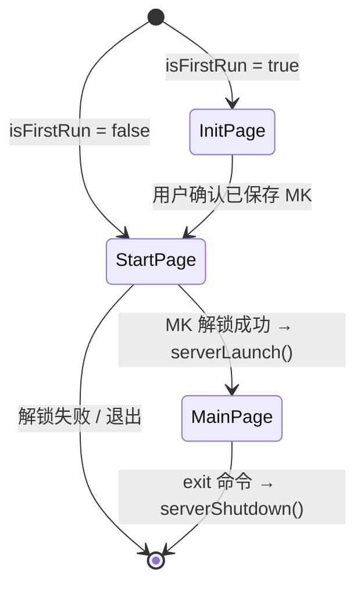

| 页面         | 控件组成                                            | 功能                                             |
| ------------ | --------------------------------------------------- | ------------------------------------------------ |
| **Init Page** | Label（MK 显示）+ Button（确认）                   | 首次启动一次性展示 64 字符十六进制 MK            |
| **Start Page** | Label（提示）+ InputBox（MK 输入）+ Button（解锁） | 管理员输入 MK → `serverUnlockWithMK()` 解密密钥 |
| **Main Page** | ScrollTextBox（日志）+ InputBox（命令）+ Tab 导航   | 实时日志查看器 + 命令行控制台                     |

#### 2.10.3 Main Page 日志查看器

Main Page 通过 `serverLogFetch()` 定期拉取最新日志行，渲染至 `ControlScrollTextBox` 。日志按级别着色：`ERROR` / `FATAL` 为红色，`WARN` 为黄色。命令框支持 `exit` 退出。

---

### 2.11 Server GameRoom 服务端游戏房间模块

**接口**： `src/server/gameRoom.h`

**实现**： `src/server/gameRoom.c`

管理服务端活动游戏房间（`ActiveGameRoom`）的生命周期，处理游戏房间的创建、加入、退出、解散及游戏启动/运行中数据转发等全部协议消息。游戏房间与会话房间（`ActiveRoom`）是独立的两个体系：前者承载游戏对战，后者承载传统聊天。

#### 2.11.1 关联类型定义（来自 `src/server/server.h`）

**ActiveGameRoom** — 内存中活动游戏房间

```c
typedef struct {
    uint32_t gameRoomId;
    uint32_t gameId;
    uint32_t hostUid;
    ClientSession *members[MAX_CLIENTS_PER_ROOM];
    int memberCount;
    enum { GameRoomLobby, GameRoomPlaying } state;
    void *gameHandle;
    struct PacPlaySDK *sdk;
    pthread_t gameThread;
    volatile bool gameRunning;
} ActiveGameRoom;
```

- `state` 表示房间阶段：`GameRoomLobby`（等待中）→ `GameRoomPlaying`（游戏运行中）
- `sdk` 为服务器端 SDK 句柄，用于游戏线程与 IO 线程之间的载荷桥接
- 成员上限 `MAX_CLIENTS_PER_ROOM`（10 人）

**SessionState** 新增状态（来自 `src/server/server.h:129-130`）

```c
SessionGameRoomLobby,   // 在游戏房间大厅中（等待开始）
SessionGameRoomPlay     // 在游戏房间中（游戏运行中）
```

#### 2.11.2 关联协议载荷（来自 `include/protocol.h`）

| 消息类型 | 方向 | 对应载荷 |
|---|---|---|
| `MsgGameRoomListReq` (41) / `MsgGameRoomListResp` (42) | C→S / S→C | `GameRoomListEntry[]` |
| `MsgGameRoomCreate` (43) / `MsgGameRoomCreateResp` (44) | C→S / S→C | `GameRoomCreatePayload` / `GameRoomCreateRespPayload` |
| `MsgGameRoomJoin` (45) / `MsgGameRoomJoinResp` (46) | C→S / S→C | `GameRoomJoinPayload` / `uint8_t` 状态 |
| `MsgGameRoomQuit` (47) / `MsgGameRoomQuitResp` (48) | C→S / S→C | 空 / `uint8_t` 状态 |
| `MsgGameRoomStart` (49) / `MsgGameRoomStartResp` (50) | C→S / S→C | `GameRoomStartPayload` / `uint8_t` 状态 |
| `MsgGameRoomPlayData` (53) | 双向 | 原始载荷（最多 `MAX_PAYLOAD_LEN` 字节） |
| `MsgGameRoomMemberList` (56) | S→C | `GameRoomMemberInfo[]` |
| `MsgGameRoomMemberJoin` (57) | S→C（广播） | `GameRoomMemberInfo` |
| `MsgGameRoomMemberQuit` (58) | S→C（广播） | `GameRoomMemberQuitPayload` |

**载荷结构**（紧凑打包）：

```c
// GameRoomCreatePayload — 创建游戏房间请求
typedef struct { uint32_t gameId; } GameRoomCreatePayload;

// GameRoomCreateRespPayload — 创建响应
typedef struct { uint8_t status; uint32_t gameRoomId; } GameRoomCreateRespPayload;

// GameRoomListEntry — 房间列表条目
typedef struct {
    uint32_t gameRoomId; uint32_t gameId; uint32_t hostUid;
    char hostNickname[LOGIN_NICKNAME_LEN]; char hostUsername[LOGIN_USERNAME_LEN];
    uint32_t memberCount; uint8_t state;
} GameRoomListEntry;

// GameRoomJoinPayload / GameRoomStartPayload
typedef struct { uint32_t gameRoomId; } GameRoomJoinPayload;
typedef struct { uint32_t gameRoomId; } GameRoomStartPayload;

// GameRoomMemberInfo — 成员信息
typedef struct {
    uint32_t roomId; uint32_t uid;
    char nickname[LOGIN_NICKNAME_LEN]; char username[LOGIN_USERNAME_LEN];
} GameRoomMemberInfo;

// GameRoomMemberQuitPayload — 成员退出通知
typedef struct { uint32_t roomId; uint32_t uid; uint8_t dissolved; } GameRoomMemberQuitPayload;
```

#### 2.11.3 房间辅助函数

| 函数 | 说明 | 前置条件 | 释放责任 |
|---|---|---|---|
| `ActiveGameRoom *serverFindActiveGameRoom(const Server *s, uint32_t gameRoomId)` | 按 `gameRoomId` 线性搜索活动游戏房间 | `s != NULL` | 返回 NULL 表示未激活 |
| `ActiveGameRoom *serverGetOrCreateActiveGameRoom(Server *s, uint32_t gameRoomId, uint32_t gameId, uint32_t hostUid)` | 查找或分配新的 `ActiveGameRoom`，支持动态扩容（2x），自动回填 `gameId`/`hostUid` 并设置初始状态 `GameRoomLobby` | `s != NULL`，`gameRoomId != 0` | 返回 NULL 表示分配失败 |
| `void serverRemoveActiveGameRoom(Server *s, uint32_t gameRoomId)` | 停止游戏（如有）并释放 `ActiveGameRoom`，压缩数组 | `s != NULL` | 接管 `ActiveGameRoom` 内存 |
| `void serverRemoveClientFromGameRoom(Server *s, ClientSession *cs)` | 从游戏房间移除成员：若 `cs` 是房主则 `serverDissolveGameRoom()`（解散），否则仅移除该成员并广播 `MsgGameRoomMemberQuit`。空房间自动调用 `deleteGameRoom()` + `serverRemoveActiveGameRoom()` | 无前置条件（`currentGameRoomId == 0` 时 no-op） | 无 |
| `void serverDissolveGameRoom(Server *s, uint32_t gameRoomId, ClientSession *exclude)` | 向除 `exclude` 外所有成员广播解散通知（`dissolved=1`），停止游戏，清空成员列表，删除 DB 记录，移除 ActiveGameRoom | `s != NULL` | 无 |

#### 2.11.4 协议 Handler

| 函数 | 说明 | 前置条件 | 失败原因 |
|---|---|---|---|
| `int serverHandleGameRoomList(Server *s, ClientSession *cs)` | 返回所有活动游戏房间列表（`GameRoomListEntry[]`），逐房间填充房主昵称/用户名。空列表返回空 payload | `cs` 已认证 | 分配失败时返回空列表 |
| `int serverHandleGameRoomCreate(Server *s, ClientSession *cs, const Packet *pkt)` | 校验 payload → 生成随机 roomId（非零、不重复，最多重试 100 次）→ `createGameRoom()` 写入 GameRoomDB → `serverGetOrCreateActiveGameRoom()` → 将 `cs` 加入 → 状态 `SessionGameRoomLobby` → 返回 `gameRoomId` | payload 长度 == `sizeof(GameRoomCreatePayload)` | payload 长度错误、随机数失败、DB 错误、分配失败 |
| `int serverHandleGameRoomJoin(Server *s, ClientSession *cs, const Packet *pkt)` | 校验房间存在/未满/状态为 `GameRoomLobby` → 清理旧房间/会话 → 重新查找（防竞态）→ 加入 → 向新成员发送成员列表（`MsgGameRoomMemberList`）→ 向其他成员广播 `MsgGameRoomMemberJoin` | payload 长度 == `sizeof(GameRoomJoinPayload)`，`cs` 已认证 | 房间不存在、房间满员、非 Lobby 状态 |
| `int serverHandleGameRoomQuit(Server *s, ClientSession *cs)` | 调用 `serverRemoveClientFromGameRoom()` → 返回状态 `0` | `cs` 已在游戏房间中 | 无 |
| `int serverHandleGameRoomStart(Server *s, ClientSession *cs, const Packet *pkt)` | 校验仅房主可启动 → 从 GameDB 查询游戏元数据 → 获取平台文件路径 → `gameRoomStartGame()` 在新线程中 `dlopen` 游戏 `.so` → 状态切换至 `GameRoomPlaying` → 全员切换至 `SessionGameRoomPlay` → 全员广播启动成功 | `cs` 为房主，房间状态 `GameRoomLobby` | 非房主、游戏元数据错误、平台文件缺失、`gameRoomStartGame` 失败 |
| `int serverHandleGameRoomPlayData(Server *s, ClientSession *cs, const Packet *pkt)` | 将 `MsgGameRoomPlayData` 载荷转发至游戏服务器 SDK（`pacplay_srv_push_received`），并向房间内其他成员广播 | `cs` 在游戏房间中，游戏正在运行 | 载荷为空、游戏未运行（静默返回 SUCC） |

#### 2.11.5 游戏房间生命周期

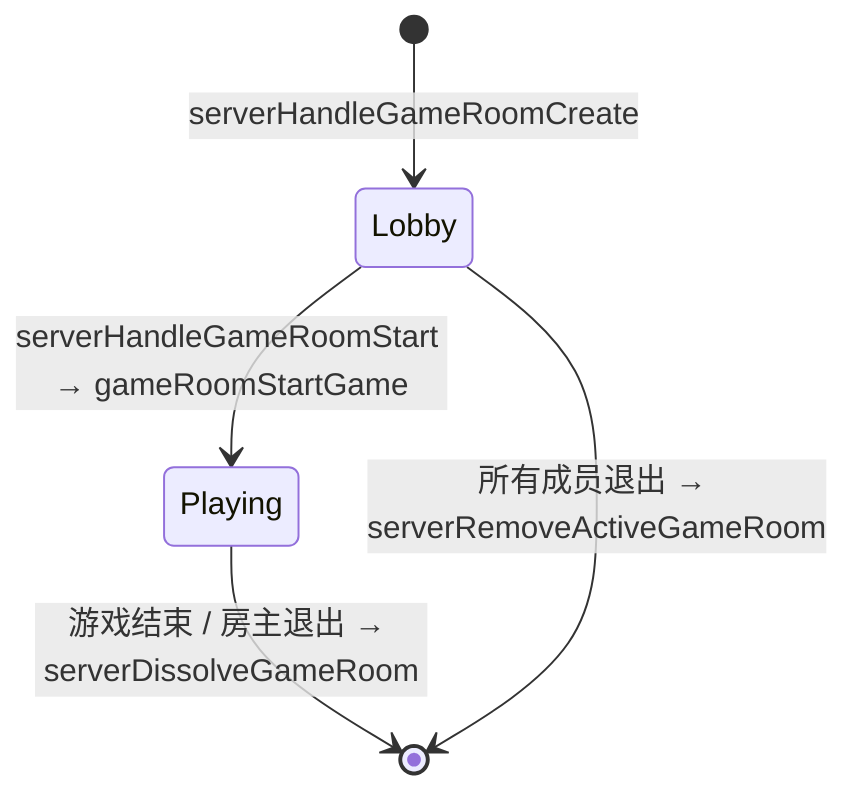

---

### 2.12 Server GameRunner 服务端游戏运行器

**接口**： `src/server/gameRunner.h`

**实现**： `src/server/gameRunner.c`

负责在独立线程中通过 `dlopen` 动态加载游戏 `.so` 文件，调用入口函数 `pacplayMain()`，管理游戏线程的启动与停止。提供服务端全局级别与游戏房间级别两套接口。

#### 2.12.1 公开 API

| 函数 | 说明 | 前置条件 | 释放责任 |
|---|---|---|---|
| `int serverStartGame(Server *s, const char *soPath)` | 为 `Server` 创建 SDK 句柄（`pacplay_srv_create()`）并在新线程中 `dlopen` 游戏 `.so` 调用 `pacplayMain()`。`Server.gameRunning` 设为 `true` | `s != NULL`，`soPath != NULL`，无游戏正在运行 | 游戏结束后 SDK 句柄在线程内释放 |
| `void serverStopGame(Server *s)` | 设置 `gameRunning = false` → `pthread_join` 等待游戏线程退出 → 关闭 `dlopen` 句柄 → 销毁 SDK | `s != NULL` 且游戏正在运行 | 无。可安全重复调用（NULL 安全） |
| `int gameRoomStartGame(ActiveGameRoom *gr, const char *soPath)` | 为 `ActiveGameRoom` 创建 SDK 句柄并在新线程中 `dlopen` 游戏 `.so` 调用 `pacplayMain()`。`gr->gameRunning` 设为 `true` | `gr != NULL`，`soPath != NULL`，该房间无游戏正在运行 | 游戏结束后 SDK 句柄在线程内释放 |
| `void gameRoomStopGame(ActiveGameRoom *gr)` | 设置 `gameRunning = false` → `pthread_join` 等待游戏线程退出 → 关闭 `dlopen` 句柄 → 销毁 SDK | `gr != NULL` 且游戏正在运行 | 无。NULL 安全 |

**内部实现**：`soPath` 通过 `strdup` 复制传递给游戏线程，由线程内部 `free`。游戏线程中，`dlopen` 成功后查找符号 `"pacplayMain"`（签名 `void (*)(void)`），调用后 `dlclose` 并清理 SDK。

**返回值**：成功返回 `SERVER_SUCC`（0），失败返回 `SERVER_FAIL`（-1）。

---

## 第三部分：客户端 API（ `src/client/` ）

客户端采用分层架构： `client.c` 仅负责连接建立/拆除与顶层流程控制，认证、房间与聊天逻辑拆入独立模块。

### 架构总览

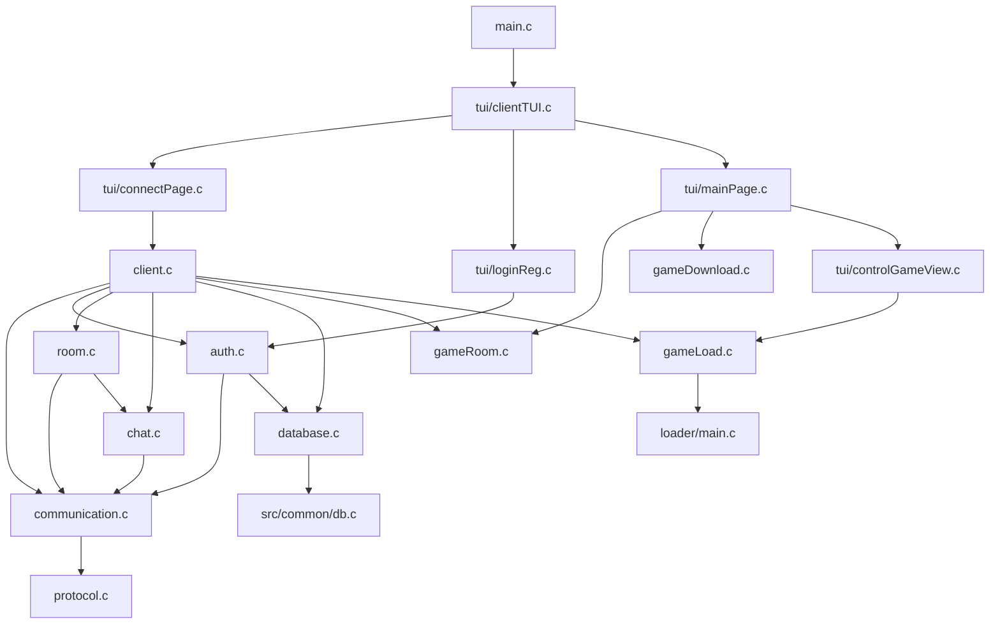

---

### 3.1 Client 客户端主模块

**接口**： `src/client/client.h`

**实现**： `src/client/client.c`

实现交互式 CLI 客户端的高层流程管理。

#### 3.1.1 常量

| 宏              | 值     | 说明     |
| --------------- | ------ | -------- |
| `CLIENT_SUCC` | `0` | 操作成功 |
| `CLIENT_FAIL` | `-1` | 操作失败 |

#### 3.1.2 类型定义

```c
typedef struct Client {
    SocketFD fd;
    AESGCMKey aesKey;
    uint32_t uid;
    uint32_t currentGroupId;
    uint32_t seqID;
    uint8_t cdbkey[CLIENT_DB_KEY_LEN];  // 每用户 CDBKey，登录后从服务端获取
    struct ClientDB *db;                 // 加密客户端数据库句柄
} Client;
```

#### 3.1.3 客户端生命周期

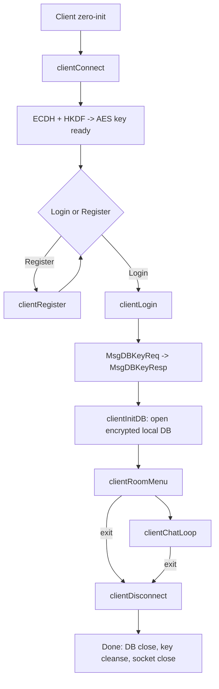

#### 3.1.4 公开 API

| 函数                                                              | 说明                                                                         | 前置条件                      | 失败行为                   |
| ----------------------------------------------------------------- | ---------------------------------------------------------------------------- | ----------------------------- | -------------------------- |
| `int clientConnect(Client *c, const char *addr, uint16_t port)` | 建立 TCP 连接并执行 ECDH+HKDF 密钥交换                                       | `c` 零初始化                | `c->fd = NULL_SOCKETFD` |
| `int clientLogin(Client *c)` | 交互式登录：输入凭据 → login → TOTP(可选) → CDBKey 获取 → 本地 DB 初始化 | `c` 已 connect              | 返回 CLIENT_FAIL，连接保持 |
| `int clientRegister(Client *c)` | 交互式注册：输入 username/nickname/password → MsgRegisterReq                | `c` 已 connect              | 返回 CLIENT_FAIL           |
| `int clientTOTPSetup(Client *c)` | 发送 MsgTOTPSetupReq → 接收 Base32 secret → 显示 otpauth:// URI            | `c` 已登录( `c->uid != 0` ) | TOTP 已启用时不视为错误    |
| `int clientRoomMenu(Client *c)` | 拉取房间列表、交互式创建/加入                                                | `c` 已登录                  | `/exit` 退出             |
| `int clientChatLoop(Client *c)` | 使用 `select(stdin, socket)` 实现聊天循环                                  | `c` 已在房间内              | `/exit` 退出             |
| `void clientDisconnect(Client *c)` | 关闭本地 DB、 `OPENSSL_cleanse` 擦除 aesKey 和 cdbkey、关闭套接字           | —                            | NULL 安全                  |

**注意**： `clientLogin()` 中 `cdbkey` 的清除发生在 `clientDisconnect()` 中，而非登录后立即清除。 `cdbkey` 在 `Client` 结构体中保留至连接断开，用于 `clientInitDB()` 及后续数据库操作。

#### 3.1.5 聊天命令

| 命令      | 行为                             |
| --------- | -------------------------------- |
| `/exit` | 发送 `MsgLogout` ，退出聊天循环 |
| `/help` | 显示可用命令列表                 |

---

### 3.2 Client Auth 客户端认证模块

**接口**： `src/client/auth.h`

**实现**： `src/client/auth.c`

`auth.h` 仅包含 `client.h` ，作为模块边界头存在，不声明额外公开函数。所有认证 API（ `clientLogin` 、 `clientRegister` 、 `clientTOTPSetup` ）均在 `client.h` 中声明。

内部实现从 `client.c` 拆分出登录、注册与 TOTP 设置逻辑。所有认证操作通过 `Client` 结构体读写 socket 与密钥状态。

---

### 3.3 Client Room 客户端房间模块 (DEPRECATED)

> **已废弃**：由 [3.11 Client Social](#311-client-social-社交逻辑模块) 替代。

### 3.4 Client Chat 客户端聊天模块 (DEPRECATED)

> **已废弃**：由 [3.13 Client chatView](#313-client-chatview-聊天视图-tui) 替代。

`room.h` 仅包含 `client.h` ，作为模块边界头存在，不声明额外公开函数。所有房间 API（ `clientRoomMenu` ）在 `client.h` 中声明。

内部提供交互式房间列表展示、创建与加入功能。用户输入解析沿用 `fgets` / `strtoul` 模式。

---

### 3.4 Client Chat 客户端聊天模块

**接口**： `src/client/chat.h`

**实现**： `src/client/chat.c`

封装聊天消息的构造与解析，将聊天业务逻辑从 UI loop 中解耦。

#### 3.4.1 公开 API

**`int clientChatSend(Client *client, const char *message, int64_t timestamp)`**

* **行为**：构造 `ChatPacketPayload`（timestamp + message），分配临时堆缓冲区，通过 `clientSendEncryptedPacket()` 发送 `MsgChat`，发送后释放缓冲区
* **前置条件**：`message` 为 NUL 终止字符串，`timestamp` 为 UTC 时间戳
* **失败原因**：分配失败、发送失败

**`int clientChatParseBroadcast(const Packet *pkt, ChatBroadcastPayload *out, size_t *outLen)`**

* **行为**：从 `pkt->payload` 解析 `ChatBroadcastPayload` 结构，提取 uid、msgId、timestamp 和消息体起始指针
* **输出**：`*outLen` 为消息体的实际字节长度（不含 NUL）
* **注意**：`out` 中的 message 指针直接指向 `pkt->payload` 内部，不分配新内存——调用者不应释放，且 `out` 仅在 `pkt` 有效期间可用

---

### 3.5 Client Communication 客户端通信模块

**接口**： `src/client/communication.h`

**实现**： `src/client/communication.c`

封装客户端侧的 ECDH+HKDF 密钥协商及面向 `Client` 结构体的加密收发。

#### 3.5.1 公开 API

**`int clientExchangeAESKey(SocketFD socketFD, AESGCMKey *outKey)`**

完成客户端侧的密钥交换。生成临时 X25519 密钥对，发送公钥，接收服务端公钥，ECDH 协商后 HKDF-SHA256 派生 AES 密钥。成功时 `outKey->nonce` 已清零。返回 `PROTOCOL_SUCC` / `PROTOCOL_FAIL` 。

**`int clientSendEncryptedPacket(Client *client, MessageType mt, const void *data, size_t dataLen)`**

从 `client` 读取 socket、AES 密钥和序列号，调用 `packetSendEncrypted()` 。返回 `PROTOCOL_SUCC` / `PROTOCOL_FAIL` 。

**`int clientRecvEncryptedPacket(Client *client, Packet *out)`**

接收并解密一个 AES-256-GCM 数据包。返回 `PROTOCOL_SUCC` / `PROTOCOL_FAIL` / `PROTOCOL_AUTH_FAIL` 。

**`int clientRecvStatusResponse(Client *client, MessageType expectedMt)`**

接收指定类型的服务器状态响应（单字节 payload），返回状态值 0-255，失败返回 -1。

---

### 3.6 Client Database 客户端数据库模块

**接口**： `src/client/database.h`

**实现**： `src/client/database.c`

提供基于 SQLCipher 的加密本地游戏库，密钥为登录后从服务端获取的每用户 CDBKey（256-bit）。所有操作通过缓存的 prepared statement 执行，杜绝 SQL 注入。

#### 3.6.1 常量与宏

| 宏                 | 值                   | 说明                 |
| ------------------ | -------------------- | -------------------- |
| `CLIENT_DB_PATH` | `"./db/client.db"` | 客户端数据库文件路径 |
| `CLIENT_DB_DIR` | `"./db"` | 数据库文件所在目录   |
| `CLIENT_DB_SUCC` | `0` | 操作成功             |
| `CLIENT_DB_FAIL` | `-1` | 操作失败             |

#### 3.6.2 类型定义

**GameRecord**

```c
typedef struct {
    uint32_t gameId;
    char *gameName;    // 堆分配，调用者 free()
    char *gamePath;    // 堆分配，调用者 free()
    uint64_t playTime; // 累计游玩时间（秒）
} GameRecord;
```

**ClientDB**

```c
typedef struct ClientDB {
    sqlite3 *handle;
    sqlite3_stmt *stmtInsert;
    sqlite3_stmt *stmtSelectAll;
    sqlite3_stmt *stmtSelectById;
    sqlite3_stmt *stmtDelete;
    sqlite3_stmt *stmtUpdatePlayTime;
    uint8_t dbEncKey[CLIENT_DB_KEY_LEN];
} ClientDB;
```

#### 3.6.3 数据库 Schema

```sql
CREATE TABLE IF NOT EXISTS gameList (
    gameId INTEGER PRIMARY KEY,
    gameName TEXT NOT NULL,
    gamePath TEXT NOT NULL,
    playTime INTEGER NOT NULL DEFAULT 0
);
```

#### 3.6.4 生命周期与 CRUD

| 函数                                                                                         | 说明                                                                                | 释放责任                                                                                 |
| -------------------------------------------------------------------------------------------- | ----------------------------------------------------------------------------------- | ---------------------------------------------------------------------------------------- |
| `int clientInitDB(Client *client)` | 打开/创建加密客户端数据库，启用 WAL。密钥从 `client->cdbkey` 拷贝至 `ClientDB` | `clientCloseDB(client)` |
| `void clientCloseDB(Client *client)` | 关闭连接、finalize stmt、 `OPENSSL_cleanse` 擦除 encKey                            | NULL 安全                                                                                |
| `int addGame(Client *client, uint32_t gameId, const char *gameName, const char *gamePath, const char *gameVersion, const char *platform, const char *fileHash)` | 插入游戏记录（含版本、平台、哈希），playTime 初始为 0                                 | —                                                                                       |
| `int listGames(Client *client, GameRecord ***outRecords, size_t *count)` | 列出所有游戏，按 gameName ASC 排序。空库返回 SUCC 且 `*count=0, *outRecords=NULL` | 逐条 `free(r->gameName)` , `free(r->gamePath)` , `free(r)` , 再 `free(*outRecords)` |
| `int deleteGame(Client *client, uint32_t gameId)` | 按 gameId 删除。不存在时返回 FAIL                                                   | —                                                                                       |
| `int updatePlayTime(Client *client, uint32_t gameId, uint64_t playTime)` | **覆盖**累计游玩时间（秒），非增量加法                                        | —                                                                                       |

** `listGames()` 释放示例**：

```c
GameRecord **records = NULL;
size_t count = 0;
if (listGames(client, &records, &count) == CLIENT_DB_SUCC) {
    for (size_t i = 0; i < count; i++) {
        free(records[i]->gameName);
        free(records[i]->gamePath);
        free(records[i]);
    }
    free(records);
}
```

#### 3.6.5 多用户运行约束

`CLIENT_DB_PATH` 固定为 `./db/client.db` ，多用户共用同一工作目录时依赖不同 CDBKey 做 SQLCipher 页级加密隔离。**不同用户的数据库文件会互相覆盖**——生产环境中应确保每个用户具有独立的工作目录或数据库路径。

---

### 3.7 Client TUI 客户端界面系统

**接口**： `src/client/tui/clientTUI.h` 、 `src/client/tui/connectPage.h` 、 `src/client/tui/loginReg.h` 、 `src/client/tui/mainPage.h`

**实现**： `src/client/tui/clientTUI.c` 、 `src/client/tui/connectPage.c` 、 `src/client/tui/loginReg.c` 、 `src/client/tui/mainPage.c`

基于公共 TUI 框架（§1.7）构建的客户端全交互界面。取代原有的 CLI 交互模式，客户端 `main()` 直接调用 `tuiClientEntry()` 进入 TUI 事件循环，所有用户交互（连接、登录、注册、TOTP、聊天）均在 TUI 页面中完成。

#### 3.7.1 常量与类型

| 宏 / 类型               | 值 / 定义                    | 说明                          |
| ------------------------ | ---------------------------- | ----------------------------- |
| `TUI_BTN_HEIGHT` | `3` | TUI 按钮固定高度              |
| `TUI_BTN_WIDTH` | `13` | TUI 按钮固定宽度              |
| `TuiClientColor` | `{ColorRed=1, ColorGreen, ColorStableBlack, ColorStableWhite}` | 自定义 ncurses 颜色 ID |
| `TuiClientColorAttr` | `{ColorAttrDefault=0, ColorAttrRed=1, ...}` | 颜色对属性 ID |

**全局状态**

```c
extern Client *client;              // 当前客户端实例指针
extern ControlPage connectPage;     // 连接页面
extern ControlPage loginPage;       // 登录/注册页面
extern ControlPage homePage;        // 主页面
```

三个页面对象定义为全局变量，在各自的 `Init()` 函数中构造控件树，由 `tuiClientEntry()` 统一注册至 TUI 框架。

#### 3.7.2 公开 API

| 函数                                               | 说明                                                                    | 前置条件           |
| -------------------------------------------------- | ----------------------------------------------------------------------- | ------------------ |
| `void tuiClientEntry(Client *clientInstance)` | 客户端 TUI 入口。初始化 ncurses → 自定义颜色 → 注册三页面 → 以 `connectPage` 启动事件循环 | `clientInstance` 已零初始化 |
| `void tuiClientConnectPageInit()` | 构造连接页面控件（IP 输入框、端口输入框、连接按钮）                     | —                 |
| `void tuiClientLoginRegInit()` | 构造登录页面、注册页面和 TOTP 验证页面的全部控件                        | —                 |
| `void tuiClientMainPageInit()` | 构造主页面控件（欢迎标签、功能按钮等）                                  | —                 |
| `void homePageInitUpdate(char *nickname, char *username)` | 登录成功后更新主页面的昵称和用户名显示                              | 登录已完成         |

#### 3.7.3 页面导航流程

```mermaid
stateDiagram-v2
    [*] --> ConnectPage
    ConnectPage --> LoginPage : clientConnect() 成功
    ConnectPage --> ConnectPage : 连接失败（显示错误）
    LoginPage --> LoginPage : 登录/注册失败（显示错误）
    LoginPage --> TOTPVerify : 需要 TOTP 验证
    TOTPVerify --> HomePage : 验证成功
    TOTPVerify --> LoginPage : 验证失败
    LoginPage --> HomePage : 登录成功（无 TOTP）
    HomePage --> [*] : 退出
```

#### 3.7.4 客户端 TUI 初始化流程

```mermaid
sequenceDiagram
    participant M as main()
    participant T as tuiClientEntry
    participant A as tuiAppInit
    participant P as Page Init

    M->>T: tuiClientEntry(clientInstance)
    T->>A: tuiAppInit()
    Note over A: initscr / cbreak / noecho / keypad / curs_set(0)
    T->>T: tuiClientColorInit()
    T->>P: tuiClientConnectPageInit()
    T->>P: tuiClientLoginRegInit()
    T->>P: tuiClientMainPageInit()
    T->>A: tuiAppStart(&connectPage)
    Note over A: 阻塞事件循环
```

#### 3.7.5 Connect Page 交互

连接页面包含两个 `ControlInputBox` （IP 地址和端口）和一个 `ControlButton` （连接按钮）。用户填写服务器地址后按下连接按钮，在回调中调用 `clientConnect()` 建立 TCP 连接并执行 ECDH+HKDF 密钥交换。成功后通过 `tuiAppChangePage(&loginPage)` 切换至登录页面。

#### 3.7.6 Login/Register Page 交互

登录/注册页面提供用户名、密码（隐藏输入）、昵称（仅注册）等输入框和登录/注册切换按钮。调用 `clientLogin()` 或 `clientRegister()` 完成认证。登录成功后自动请求 CDBKey 并初始化本地数据库，然后通过 `homePageInitUpdate()` 刷新主页显示并切换至 Home Page。

#### 3.7.7 ControlGameView 游戏视图控件

**接口**： `src/client/tui/controlGameView.h`

**实现**： `src/client/tui/controlGameView.c`

`ControlGameView` 是继承自 TUI 框架 `Control` 基类的自定义控件，用于在客户端 TUI 界面中嵌入运行中的游戏画面。通过 PTY 接收子进程终端输出，经 libvterm 解析后渲染至 ncurses 窗口；同时将键盘输入编码为终端控制序列写回子进程。

##### 类型定义

```c
typedef struct {
    Control base;
    bool running;
    VTerm *vterm;
    VTermScreen *vscreen;
    int vtHeight;
    int vtWidth;
    pid_t pid;
    int ptyFD;
} ControlGameView;
```

- `running`：游戏是否正在运行
- `vterm` / `vscreen`：libvterm 终端仿真器与屏幕缓冲区
- `vtHeight` / `vtWidth`：虚拟终端尺寸（控件内部区域减 2，为边框留空间）
- `pid` / `ptyFD`：子进程 PID 与 PTY master 文件描述符

##### 虚表回调

`ControlGameView` 在 `controlGameViewConstruct` 中绑定 `defaultControlGameViewVTable`：

| 虚表函数 | 实现 | 行为 |
|---|---|---|
| `draw` | `controlGameViewDraw` | 绘制双线/普通边框；游戏运行时逐单元格读取 `vscreen` 内容渲染至 ncurses 窗口；未运行时显示 "No game running" |
| `msgHandler` | `controlGameViewMsgHandler` | 游戏运行中：`ESC` 键释放输入接管，其他按键经 `ncursesKeyToVTerm()` / `vterm_keyboard_unichar()` 编码后写入 PTY；`MsgFocusEnter` 自动 `takeOverInput=true`；`MsgResize` 同步更新 libvterm 尺寸并通过 `TIOCSWINSZ` + `SIGWINCH` 通知子进程 |
| `update` | `controlGameViewUpdate` | 从 PTY master FD 非阻塞读取子进程输出，写入 `vterm_input_write()`；检测到子进程退出（`read` 返回 0 或非 EAGAIN/EWOULDBLOCK 错误）时自动调用 `controlGameViewStop()` |

##### 公开 API

| 函数 | 说明 | 前置条件 | 释放责任 |
|---|---|---|---|
| `void controlGameViewConstruct(ControlGameView *self, int height, int width, int y, int x)` | 构造控件，设置 `takeOverInput=true`，初始化虚拟终端尺寸为 `height-2 × width-2` | — | — |
| `void controlGameViewRun(ControlGameView *self, const char *gamePath)` | 通过 `clientRunGame()` 启动子进程运行游戏 `.so`。成功后 `running=true` | 控件已构造 | 由 `controlGameViewStop()` 停止 |
| `void controlGameViewStop(ControlGameView *self)` | 设 `running=false`，调用 `clientStopGame()` 终止子进程并释放 PTY | `running == true` | 无。可安全重复调用 |

**控件交互**：聚焦时显示双线边框以提示"正在捕获键盘"。`ESC` 键临时释放输入接管（边框变虚线），允许用户通过 Tab 切换至其他控件。`ControlGameView` 不实现 `destruct` 虚表回调（NULL），资源清理全部在 `controlGameViewStop()` 中完成。

---

### 3.8 Client GameRoom 客户端游戏房间模块

**接口**： `src/client/gameRoom.h`

**实现**： `src/client/gameRoom.c`

提供客户端侧的游戏房间管理功能，包括房间列表查询（按 `gameId` 过滤）、创建、加入、退出、启动游戏及非阻塞通知轮询。

#### 3.8.1 关联 Client 类型新增字段（来自 `src/client/client.h`）

```c
uint32_t currentGameRoomId;           // 0 表示不在任何游戏房间
GameRoomMemberInfo *roomMembers;      // 当前房间成员列表
int roomMemberCount;                  // 成员数量
volatile bool gameStarted;            // 由 clientPollNotifications 在收到启动响应后置位
```

#### 3.8.2 公开 API

| 函数 | 说明 | 前置条件 | 释放责任 |
|---|---|---|---|
| `int clientGameRoomList(Client *client, uint32_t gameId, GameRoomListEntry **outEntries, size_t *outCount)` | 发送 `MsgGameRoomListReq` 获取全部活动游戏房间，按 `gameId` 过滤后返回。空结果返回 `CLIENT_SUCC` 且 `*outEntries=NULL, *outCount=0` | `client` 已连接且认证 | `free(*outEntries)` |
| `int clientGameRoomCreate(Client *client, uint32_t gameId, uint32_t *outRoomId)` | 发送 `MsgGameRoomCreate` 请求创建游戏房间，成功后将 `client->currentGameRoomId` 设为返回的 `gameRoomId` | `client` 已连接且认证 | 无 |
| `int clientGameRoomJoin(Client *client, uint32_t gameRoomId)` | 发送 `MsgGameRoomJoin` 请求加入游戏房间，成功后将 `client->currentGameRoomId` 设为该 ID | `client` 已连接且认证 | 无 |
| `void clientGameRoomQuit(Client *client)` | 发送 `MsgGameRoomQuit` 并清零 `client->currentGameRoomId` | `client` 已连接 | 无 |
| `int clientGameRoomStart(Client *client, uint32_t gameRoomId)` | 发送 `MsgGameRoomStart` 请求启动房间内游戏（需为房主） | `client` 已连接且在游戏房间中 | 无 |
| `void clientPollNotifications(Client *client)` | 非阻塞轮询 socket（`select` 超时 0），接收并处理服务器推送：`MsgGameRoomMemberList`（覆盖成员列表）、`MsgGameRoomMemberJoin`（追加新成员）、`MsgGameRoomMemberQuit`（移除成员或解散清空）、`MsgGameRoomStartResp`（设置 `gameStarted` 标志） | `client != NULL` 且 `fd` 有效 | 无 |

**返回值**：列表/创建/加入/启动成功返回 `CLIENT_SUCC`（0），失败返回 `CLIENT_FAIL`（-1）。`clientGameRoomQuit` 和 `clientPollNotifications` 无返回值。

---

### 3.9 Client GameLoad 客户端游戏加载模块

**接口**： `src/client/gameLoad.h`

**实现**： `src/client/gameLoad.c`

负责以子进程方式运行客户端本地游戏。通过 `fork` + `execl` 启动独立的 `loader` 进程，该进程通过 `dlopen` 加载游戏 `.so` 文件。父子进程间通过 PTY（伪终端）通信，`libvterm` 提供终端仿真以屏蔽不同游戏的终端控制序列差异。

#### 3.9.1 常量与宏

| 宏 | 值 | 说明 |
|---|---|---|
| `MAX_CLIENT_DOWNLOADS` | `4` | 最大并发下载数（定义在 `gameLoad.h`） |

#### 3.9.2 公开 API

| 函数 | 说明 | 前置条件 | 释放责任 |
|---|---|---|---|
| `int clientRunGame(VTerm **vterm, VTermScreen **vscreen, const char *path, int height, int width, pid_t *pid, int *ptyFD)` | 创建 PTY → 初始化 libvterm（UTF-8 模式，高度×宽度）→ `fork()`。子进程通过 `dup2` 将 stdin/stdout 重定向至 PTY slave，执行 `./loader <path>`。父进程返回 master PTY FD 和子进程 PID | `height > 0`，`width > 0`，`path` 非 NULL | 通过 `clientStopGame()` 释放 |
| `void clientStopGame(VTerm **vterm, pid_t *pid, int *ptyFD)` | 关闭 PTY master FD → 释放 `VTerm` → `kill(pid, SIGTERM)` → `waitpid` 等待子进程退出 | 已通过 `clientRunGame` 启动 | 无。NULL 安全（PTY FD 设为 -1） |

**返回值**：`clientRunGame` 成功返回 `CLIENT_SUCC`（0），失败返回 `CLIENT_FAIL`（-1）。`clientStopGame` 无返回值。

**子进程退出行为**：如 `execl` 失败，子进程以 exit code 127 退出（`_exit(SUBPROCESS_EXIT_NUM)`）。

---

### 3.10 Client Loader 客户端游戏加载器

**接口**： `src/client/loader/loader.h`

**实现**： `src/client/loader/main.c`

独立编译的轻量二进制文件（`bin/client/loader`），由客户端主进程通过 `fork` + `execl` 启动。接收游戏 `.so` 文件路径作为唯一命令行参数，通过 `dlopen` 加载并调用入口函数 `pacplayMain()`。

#### 3.10.1 类型定义

```c
typedef struct {
    void (*pacplayMain)();
} GameFunctions;
```

`GameFunctions` 存储从游戏 `.so` 中通过 `dlsym` 解析的函数指针。目前仅包含 `pacplayMain` 入口。

#### 3.10.2 运行流程

```
clientRunGame() fork → 子进程 execl("./loader", "loader", <soPath>, NULL)
                           │
                           ├─ setenv("TERM", "xterm-256color")
                           ├─ dlopen(soPath, RTLD_LAZY)
                           ├─ dlsym(handle, "pacplayMain")
                           ├─ pacplayMain()           ← 游戏主循环（阻塞）
                           ├─ usleep(10000000)         ← 10 秒缓冲（防止残留输出丢失）
                           └─ dlclose(handle) → exit(0)
```

**命令行参数**：`argc` 必须为 2（程序名 + `.so` 路径）。参数错误或 `dlopen`/`dlsym` 失败时以 `EXIT_FAILURE` 退出。

**环境变量**：启动时强制设置 `TERM=xterm-256color` 以确保游戏输出的终端控制码被正确解析。

**构建特性**：Loader 使用 `--disable-new-dtags` 与 `$ORIGIN/../../sdk/lib` rpath，可相对于自身位置解析 `libpacplay_client_sdk.so`。

---

### 3.11 Client Social 社交逻辑模块

**接口**： `src/client/social.h`

**实现**： `src/client/social.c`

封装所有社交操作的客户端网络请求和消息解析。所有发送函数构造对应 payload 后通过 `packetSendEncrypted()` 发送。

#### 3.11.1 好友操作

| 函数 | 说明 | 发送 MsgType |
|------|------|-------------|
| `int clientFriendRequest(Client *c, uint32_t targetUid)` | 发送好友请求 | `MsgFriendRequest` |
| `int clientFriendAccept(Client *c, uint32_t targetUid)` | 接受好友请求 | `MsgFriendAccept` |
| `int clientFriendReject(Client *c, uint32_t targetUid)` | 拒绝好友请求 | `MsgFriendReject` |
| `int clientFriendDelete(Client *c, uint32_t targetUid)` | 删除好友 | `MsgFriendDelete` |
| `int clientFriendListRequest(Client *c)` | 请求好友列表 | `MsgFriendListReq` |

#### 3.11.2 私聊操作

| 函数 | 说明 |
|------|------|
| `int clientPrivateChatSend(Client *c, uint32_t toUid, const char *message)` | 发送私聊消息。构造 `PrivateChatPayload` (fromUid=c->uid, toUid, msgId=0, timestamp, message), 通过 `MsgPrivateChat` 发送。 |
| `int clientPrivateChatHistoryRequest(Client *c, uint32_t peerUid, uint32_t beforeMsgId, uint32_t limit)` | 请求私聊历史。构造 `PrivateChatHistoryReqPayload`, 通过 `MsgPrivateChatHistoryReq` 发送。 |

#### 3.11.3 群组操作

| 函数 | 说明 |
|------|------|
| `int clientGroupCreate(Client *c, const char *groupName)` | 创建群组。 |
| `int clientGroupJoin(Client *c, uint32_t groupId)` | 加入群组。 |
| `int clientGroupQuit(Client *c, uint32_t groupId)` | 退出群组。 |
| `int clientGroupListRequest(Client *c)` | 请求群组列表。 |
| `int clientGroupChatSend(Client *c, uint32_t groupId, const char *message)` | 发送群聊消息。 |
| `int clientGroupKick(Client *c, uint32_t groupId, uint32_t targetUid)` | 群主踢人。 |
| `int clientGroupDisband(Client *c, uint32_t groupId)` | 解散群组。 |
| `int clientGroupChatHistoryRequest(Client *c, uint32_t groupId, uint32_t beforeMsgId, uint32_t limit)` | 请求群聊历史。 |

#### 3.11.4 消息轮询

**`int clientPollAndDispatch(Client *c, Packet *outPkt)`**

标准的非阻塞 socket 轮询函数。被所有需要接收消息的 TUI 页面共享调用。流程：
1. `select(c->fd, ...)` 零超时检查可读性
2. 若可读，调用 `packetRecvEncrypted()` 解密接收
3. 返回 1（有包）、0（无数据）、-1（错误）

所有 TUI 页面通过此单一入口点接收消息，消除了多页面独立轮询导致的竞态条件。

---

### 3.12 Client socialPage 社交中心 TUI

**接口**： `src/client/tui/socialPage.h`

**实现**： `src/client/tui/socialPage.c`

**`void socialPageEnter(Client *client)`**

进入统一社交中心页面。

**布局**：
- **顶部操作栏**：`Friend Requests(N)` / `Add Friend` / `New Group` 按钮
- **联系人列表**：好友和群组混合显示，按最后消息时间降序排列（最近联系置顶）。好友显示在线状态（●/○），群组显示成员数。
- **底部操作栏**：选中好友时显示 `Chat` / `Remove`；选中群组时显示 `Enter` / `Leave`。
- **输入覆盖层**：添加好友弹出 UID 输入框，创建群组弹出名称输入框。
- **好友请求覆盖层**：列出待处理请求，提供 `Accept` / `Reject` 按钮。

**消息处理**：`socialPoll()` 调用 `clientPollAndDispatch()` 接收消息，处理 `MsgFriendListResp`、`MsgGroupListResp`、`MsgFriendNotify`、`MsgGroupMemberJoin`、`MsgGroupMemberQuit`、`MsgGroupKickResp` 等，触发 UI 刷新。私聊/群聊消息在 chatView 激活时缓冲至待处理队列，否则显示通知。

---

### 3.13 Client chatView 聊天视图 TUI

**接口**： `src/client/tui/chatView.h`

**实现**： `src/client/tui/chatView.c`

**`void chatViewEnter(Client *client, uint32_t target, uint8_t isGroup)`**

进入通用聊天视图，私聊和群聊共用同一页面。

**参数**：
- `target`: 私聊时为对方 uid，群聊时为 groupId
- `isGroup`: `1` 为群聊模式，`0` 为私聊模式

**布局**：
- **标题栏**：`← Back` + `Chat with <nickname>` 或 `<groupName>`
- **消息区域**：滚动消息列表，显示发送者昵称和消息内容
- **输入区域**：`InputBox` + `Send` 按钮
- 群聊模式可选右侧成员列表

**消息处理**：从 `client->pendingChatMessages` 队列读取消息（由 `socialPoll()` 填充），不直接轮询 socket，避免了与 socialPage 的竞态条件。

### 4.1 首次服务端启动流程

```mermaid
sequenceDiagram
    participant Admin
    participant S as Server
    participant K as KeyManager
    participant DB as ServerDB

    Admin->>S: 启动服务端 (指定端口)
    S->>DB: dbInit(ServerDB)
    S->>K: serverInitKeys()
    K->>DB: getServerKey("dek")
    DB-->>K: 不存在 (首次启动)
    K->>K: cryptoRandomBytes: MK, DEK, UserDBKey, FriendDBKey, PrivateChatDBKey, GroupDBKey, GameDBKey, GameRoomDBKey
    K->>DB: setServerKey("dek", AESGCM(MK, DEK))
    K->>DB: setServerKey("user_db", AESGCM(MK, UserDBKey))
    K->>DB: setServerKey("friend_db", AESGCM(MK, FriendDBKey))
    K->>DB: setServerKey("privatechat_db", AESGCM(MK, PrivateChatDBKey))
    K->>DB: setServerKey("group_db", AESGCM(MK, GroupDBKey))
    K->>DB: setServerKey("game_db", AESGCM(MK, GameDBKey))
    K->>DB: setServerKey("gameroom_db", AESGCM(MK, GameRoomDBKey))
    K->>Admin: TUI Init Page 显示 MK (64 字符十六进制)
    K->>K: OPENSSL_cleanse(MK)
    S->>DB: dbInit(UserDB, UserDBKey)
    S->>DB: dbInit(FriendDB, FriendDBKey)
    S->>DB: dbInit(PrivateChatDB, PrivateChatDBKey)
    S->>DB: dbInit(GroupDB, GroupDBKey)
    S->>DB: dbInit(GameDB, GameDBKey)
    S->>DB: dbInit(GameRoomDB, GameRoomDBKey)
    S->>Admin: 服务端就绪，开始监听
```

管理员必须保存 MK，后续启动需要输入该密钥。

### 4.2 后续服务端启动流程

```mermaid
sequenceDiagram
    participant Admin
    participant S as Server
    participant K as KeyManager
    participant DB as ServerDB

    Admin->>S: 启动服务端
    S->>DB: dbInit(ServerDB)
    S->>K: serverInitKeys()
    K->>DB: getServerKey("dek")
    DB-->>K: 返回 envelope (存在)
    K->>Admin: 提示输入 MK
    Admin->>K: 输入 64 字符 hex MK
    K->>K: hexCharToNibble → 32 字节 MK
    K->>DB: getServerKey("user_db"), getServerKey("friend_db"), getServerKey("privatechat_db"), getServerKey("group_db"), getServerKey("game_db"), getServerKey("gameroom_db")
    K->>K: 逐一解密 7 个 envelope (AES-GCM, 校验标签和长度)
    K->>K: OPENSSL_cleanse(MK)
    S->>DB: dbInit(UserDB, UserDBKey)
    S->>DB: dbInit(FriendDB, FriendDBKey)
    S->>DB: dbInit(PrivateChatDB, PrivateChatDBKey)
    S->>DB: dbInit(GroupDB, GroupDBKey)
    S->>DB: dbInit(GameDB, GameDBKey)
    S->>DB: dbInit(GameRoomDB, GameRoomDBKey)
    S->>Admin: 服务端就绪
```

DK 输入错误时，envelope 解密返回 `CRYPTO_AUTH_FAIL` 或长度不匹配，服务端退出。

### 4.3 注册流程

1. 客户端 `clientConnect()` 完成 ECDH+HKDF 密钥交换
2. 客户端调用 `clientRegister()`：
   - 提示输入 username、nickname、password
   - 构造 `RegisterRequestPayload` （username[32] + nickname[32] + password[N]）
   - 发送 `MsgRegisterReq` （加密）
3. 服务端 `serverHandleRegister()`：
   - 解析 payload → `hashPassword()` → `createUser()` （生成 UID 和 CDBKey，DEK envelope 加密存入）
   - 返回单字节状态：0 = 成功，1 = 用户名已存在

### 4.4 登录流程

1. 客户端 `clientLogin()`：

   - 提示输入 username、password
   - 构造 `LoginRequestPayload` （username[32] + password[N]）
   - 发送 `MsgLoginReq` （加密）
   - 等待服务端响应
2. 服务端 `serverHandleLogin()`：

   - `verifyUser()` 校验凭据
   - **无 TOTP**：直接发送 `MsgLoginResp` ， `cs->state = SessionLobby`

   - **有 TOTP**：发送 `MsgTOTPVerifyReq` （空 payload）， `cs->state = SessionTOTPVerify`

3. TOTP 路径：

   - 客户端收到 `MsgTOTPVerifyReq` ，提示输入 6 位验证码
   - 客户端发送 `MsgTOTPVerifyResp [TOTPVerifyPayload: code]`

   - 服务端 `serverHandleTOTPVerify()` → `verifyTOTPCode()` → 正确则发送 `MsgLoginResp` ， `cs->state = SessionLobby`

4. 登录成功后：

   - 客户端解析 `LoginResponsePayload` ：uid, username, nickname, totpEnabled
   - 客户端发送 `MsgDBKeyReq` （空 payload）
   - 服务端返回 `MsgDBKeyResp [DBKeyRespPayload: 32B CDBKey]`

   - 客户端将 CDBKey 存入 `client->cdbkey`

   - 客户端调用 `clientInitDB()` 打开加密本地数据库

### 4.5 房间流程 (DEPRECATED)

> **已废弃**：由 [4.13.3 群聊流程](#4133-群聊流程) 替代。

### 4.6 聊天流程 (DEPRECATED)

> **已废弃**：由 [4.13.2 私聊流程](#4132-私聊流程) 和 [4.13.3 群聊流程](#4133-群聊流程) 替代。

### 4.7 命令行运行方式

**服务端**：

```bash
make server
./bin/server
```

服务端启动后进入 TUI 管理面板。首次启动在 Init Page 显示 64 字符十六进制 MK（管理员须妥善保存），确认后进入 Start Page。后续启动直接进入 Start Page 提示输入 MK。解锁成功后自动进入 Main Page（日志查看器 + 命令行），服务端在后台线程中开始监听连接。

**客户端**：

```bash
make client
./bin/client
```

客户端启动后进入 TUI 界面。Connect Page 中输入服务器 IP 和端口后连接。成功后进入 Login Page 完成登录/注册，最后进入 Home Page。

### 4.8 TUI 页面导航总览

以下两张状态图展示服务端与客户端的完整 TUI 页面导航关系。

**服务端 TUI 页面导航**

```mermaid
stateDiagram-v2
    [*] --> InitPage : 首次启动
    [*] --> StartPage : 后续启动
    InitPage --> StartPage : 确认已保存 MK
    StartPage --> MainPage : MK 解锁成功
    StartPage --> StartPage : MK 错误（重试）
    state MainPage {
        [*] --> LogViewer : serverLaunch 后台启动
        LogViewer --> CommandBox : Tab 切换
        CommandBox --> LogViewer : Tab 切换
    }
    MainPage --> [*] : exit 命令 → serverShutdown
```

**客户端 TUI 页面导航**

```mermaid
stateDiagram-v2
    [*] --> ConnectPage
    ConnectPage --> LoginPage : TCP + ECDH 成功
    ConnectPage --> ConnectPage : 连接失败
    state LoginPage {
        [*] --> LoginForm
        LoginForm --> RegisterForm : 切换注册
        RegisterForm --> LoginForm : 切换登录
    }
    LoginPage --> TOTPPage : TOTP 挑战
    TOTPPage --> HomePage : 验证成功
    TOTPPage --> LoginPage : 验证失败
    LoginPage --> HomePage : 登录成功（无 TOTP）
    state HomePage {
        [*] --> Welcome
        Welcome --> TOTPSetup : 设置 TOTP
        Welcome --> GameLibrary : 游戏库
    }
    HomePage --> [*] : 退出
```

---

### 4.9 游戏房间流程

```mermaid
sequenceDiagram
    participant C1 as Client1 (Host)
    participant S as Server
    participant C2 as Client2 (Member)

    Note over C1,S: Phase 1 — 创建游戏房间
    C1->>S: MsgGameRoomCreate [gameId]
    S->>S: 生成随机 gameRoomId → 写入 GameRoomDB
    S->>C1: MsgGameRoomCreateResp [status=0, gameRoomId]
    Note over C1: state → SessionGameRoomLobby

    Note over C2,S: Phase 2 — 加入游戏房间
    C2->>S: MsgGameRoomJoin [gameRoomId]
    S->>C2: MsgGameRoomJoinResp [status=0]
    S->>C2: MsgGameRoomMemberList [所有成员信息]
    S->>C1: MsgGameRoomMemberJoin [C2 信息]
    Note over C2: state → SessionGameRoomLobby

    Note over C1,S: Phase 3 — 启动游戏
    C1->>S: MsgGameRoomStart [gameRoomId]
    S->>S: gameRoomStartGame(dlopen + pacplayMain)
    S->>C1: MsgGameRoomStartResp [status=0]
    S->>C2: MsgGameRoomStartResp [status=0]
    Note over C1,C2: state → SessionGameRoomPlay

    Note over C1,C2: Phase 4 — 游戏中数据交换
    C1->>S: MsgGameRoomPlayData [游戏载荷]
    S->>S: pacplay_srv_push_received(sdk, data)
    S-->>C2: MsgGameRoomPlayData [广播]

    Note over C2,S: Phase 5 — 退出
    C2->>S: MsgGameRoomQuit
    S->>C1: MsgGameRoomMemberQuit [uid, dissolved=0]
    Note over C2: state → SessionLobby
```

### 4.10 游戏启动流程（客户端本地）

```mermaid
sequenceDiagram
    participant T as TUI MainPage
    participant G as clientRunGame
    participant F as fork()
    participant L as Loader (子进程)
    participant V as libvterm

    T->>G: controlGameViewRun(gamePath)
    G->>G: openpty() → master/slave FD
    G->>V: vterm_new(height, width)
    G->>F: fork()
    F-->>L: 子进程
    L->>L: dup2(slave → stdin/stdout/stderr)
    L->>L: setenv("TERM", "xterm-256color")
    L->>L: dlopen(gamePath) → pacplayMain()
    Note over L: 游戏主循环运行中

    loop TUI 更新循环
        T->>G: controlGameViewUpdate()
        G->>G: read(masterFD) → vterm_input_write()
        G->>T: 渲染 vscreen → ncurses 窗口
    end

    loop 用户输入
        T->>G: controlGameViewMsgHandler(MsgInput)
        G->>G: ncursesKeyToVTerm() → write(masterFD)
    end

    Note over L: pacplayMain() 返回
    G->>G: read() 返回 0 → controlGameViewStop()
    G->>G: kill(pid, SIGTERM) → waitpid()
    G->>V: vterm_free()
```

---

### 4.11 社交系统端到端流程

#### 4.11.1 好友请求与接受流程

```mermaid
sequenceDiagram
    participant A as User A
    participant S as Server
    participant DB as FriendDB
    participant T as OnlineTracker
    participant B as User B

    A->>S: MsgFriendRequest {targetUid: B}
    S->>DB: friendRequestCreate(A, B)
    S->>A: MsgFriendRequestResp (status=0)

    Note over B: B 登录后查看待处理请求

    B->>S: MsgFriendAccept {targetUid: A}
    S->>DB: friendRequestAccept(A, B) → 双向 friendships 行
    S->>T: 查询 A 是否在线
    S->>A: MsgFriendNotify {uid: B, online: 1}
    S->>B: MsgFriendNotify {uid: A, online: 1}
    S->>B: MsgFriendAcceptResp (status=0)
```

#### 4.11.2 私聊流程（含离线投递）

```mermaid
sequenceDiagram
    participant A as User A
    participant S as Server
    participant DB as PrivateChatDB
    participant T as OnlineTracker
    participant B as User B (offline→online)

    A->>S: MsgPrivateChat {toUid: B, message: "Hello"}
    S->>DB: privateChatStore(A, B, "Hello", delivered=0)
    S->>T: onlineTrackerFind(B)
    Note over S: B 不在线，不立即转发

    Note over B: --- B 稍后登录 ---

    S->>DB: privateChatDeliverPending(B) → 获取待投递消息
    S->>B: MsgPrivateChatBroadcast (msgId=42, from: A, "Hello")
    S->>DB: UPDATE delivered=1 WHERE msgId=42
```

#### 4.11.3 群聊流程

```mermaid
sequenceDiagram
    participant A as User A (群主)
    participant S as Server
    participant DB as GroupDB
    participant T as OnlineTracker
    participant B as User B

    A->>S: MsgGroupCreate {groupName: "Dev"}
    S->>DB: groupCreate(groupId=1001, "Dev", owner=A)
    S->>DB: groupAddMember(1001, A)
    S->>A: MsgGroupCreateResp (status=0, groupId=1001)

    B->>S: MsgGroupJoin {groupId: 1001}
    S->>DB: groupAddMember(1001, B)
    S->>T: 查找在线群成员
    S->>A: MsgGroupMemberJoin {groupId: 1001, uid: B}

    A->>S: MsgGroupChat {groupId: 1001, message: "Welcome"}
    S->>DB: groupStoreChat(1001, A, "Welcome") → msgId=1
    S->>T: 查找在线群成员 (排除发送者)
    S->>B: MsgGroupChatBroadcast {groupId: 1001, uid: A, msgId: 1, "Welcome"}

    A->>S: MsgGroupKick {groupId: 1001, targetUid: B}
    S->>DB: groupRemoveMember(1001, B)
    S->>B: MsgGroupMemberQuit (被踢通知)
    S->>T: 通知剩余在线成员
    S->>A: MsgGroupKickResp (status=0)

    A->>S: MsgGroupDisband {groupId: 1001}
    S->>T: 查找所有在线成员
    S->>B: MsgGroupDisbandNotify {groupId: 1001}
    S->>DB: groupDelete(1001)
```

#### 4.11.4 联系人排序

联系人在 `socialPage` 中按**最后消息时间降序**排列（最近联系的置顶）：
- 好友：使用 `privateChatLastMsgTimestamp()` 获取与每位好友的最后私聊时间
- 群组：使用 `groupLastMsgTimestamp()` 获取每个群组的最后消息时间
- 无消息记录的联系人/群组排在末尾

---

## 第五部分：可运行示例

以下示例均为**可直接编译运行的独立程序**。每个示例标注了编译命令和预期行为。

---

### 5.1 AES-GCM 加解密 roundtrip

**文件**：保存为 `example_aes.c`

```c
#include "crypto.h"
#include <stdio.h>
#include <string.h>

enum { BufSize = 64 };

int main(void) {
    // 1. 生成随机密钥和 nonce
    AESGCMKey key;
    cryptoRandomBytes(key.key, AES_GCM_KEY_LEN);
    cryptoRandomBytes(key.nonce, AES_GCM_NONCE_LEN);

    // 2. 准备明文
    const char *msg = "Hello, PacPlay AES-GCM!";
    size_t msgLen = strlen(msg);

    AESGCMBuffer plainIn = { .data = (uint8_t *)msg,
                              .capacity = msgLen,
                              .len = msgLen };

    // 3. 分配密文输出
    AESGCMCipher cipher;
    aesGCMBufferInit(&cipher.buffer, msgLen);
    cipher.buffer.len = msgLen;

    // 4. 加密
    encryptAESGCM(&plainIn, NULL, &key, &cipher);

    // 5. 解密
    AESGCMBuffer plainOut;
    aesGCMBufferInit(&plainOut, msgLen);
    plainOut.len = msgLen;
    int rc = decryptAESGCM(&cipher, NULL, &key, &plainOut);

    // 6. 验证
    plainOut.data[msgLen] = '\0'; // for safe printing
    if (rc == CRYPTO_SUCC && memcmp(plainIn.data, plainOut.data, msgLen) == 0) {
        printf("Roundtrip OK: %s\n", plainOut.data);
    } else {
        printf("Roundtrip FAILED (rc=%d)\n", rc);
    }

    // 7. 释放
    aesGCMBufferDeinit(&cipher.buffer);
    aesGCMBufferDeinit(&plainOut);
    return (rc == CRYPTO_SUCC) ? 0 : 1;
}
```

**编译与运行**：

```bash
clang -Iinclude -Isrc -Wall -Wextra -Werror -g \
      -o example_aes example_aes.c src/common/crypto.c src/common/log.c \
      -lssl -lcrypto
./example_aes
# 预期输出：Roundtrip OK: Hello, PacPlay AES-GCM!
```

---

### 5.2 ECDH + HKDF 双端派生同一 AES 密钥

**文件**：保存为 `example_ecdh.c`

```c
#include "crypto.h"
#include <stdio.h>
#include <string.h>

int main(void) {
    // Alice
    EVP_PKEY *aliceKey = genECDHKeypair();
    uint8_t alicePub[ECDH_PUBLIC_KEY_SIZE];
    exportECDHPublicKey(aliceKey, alicePub);

    // Bob
    EVP_PKEY *bobKey = genECDHKeypair();
    uint8_t bobPub[ECDH_PUBLIC_KEY_SIZE];
    exportECDHPublicKey(bobKey, bobPub);

    // Exchange: import peer public keys
    EVP_PKEY *alicePeer = importECDHPeerPublicKey(bobPub);
    EVP_PKEY *bobPeer = importECDHPeerPublicKey(alicePub);

    // Derive shared secrets
    uint8_t aliceSecret[ECDH_SHARED_SECRET_SIZE];
    uint8_t bobSecret[ECDH_SHARED_SECRET_SIZE];
    deriveECDHSharedSecret(aliceKey, alicePeer, aliceSecret);
    deriveECDHSharedSecret(bobKey, bobPeer, bobSecret);

    // Verify shared secrets match
    if (memcmp(aliceSecret, bobSecret, ECDH_SHARED_SECRET_SIZE) != 0) {
        printf("FAIL: shared secrets differ\n");
        return 1;
    }

    // Derive AES keys via HKDF
    AESGCMKey aliceAES, bobAES;
    deriveAESKey(aliceSecret, ECDH_SHARED_SECRET_SIZE, &aliceAES);
    deriveAESKey(bobSecret, ECDH_SHARED_SECRET_SIZE, &bobAES);

    // Verify AES keys match
    if (memcmp(aliceAES.key, bobAES.key, AES_GCM_KEY_LEN) == 0) {
        printf("OK: AES-256 keys match (HKDF consistent)\n");
    } else {
        printf("FAIL: AES keys differ\n");
    }

    // Cleanup
    EVP_PKEY_free(aliceKey);
    EVP_PKEY_free(bobKey);
    EVP_PKEY_free(alicePeer);
    EVP_PKEY_free(bobPeer);
    OPENSSL_cleanse(aliceSecret, sizeof(aliceSecret));
    OPENSSL_cleanse(bobSecret, sizeof(bobSecret));
    return 0;
}
```

**编译与运行**：

```bash
clang -Iinclude -Isrc -Wall -Wextra -Werror -g \
      -o example_ecdh example_ecdh.c src/common/crypto.c src/common/log.c \
      -lssl -lcrypto
./example_ecdh
# 预期输出：OK: AES-256 keys match (HKDF consistent)
```

---

### 5.3 Protocol 序列化/反序列化

**文件**：保存为 `example_packet.c`

```c
#include "protocol.h"
#include <stdio.h>
#include <string.h>

enum { BufSize = 2048 };

int main(void) {
    const char *testMsg = "Hello";
    size_t msgLen = strlen(testMsg);

    // 1. packetInit
    Packet pkt = {0};
    packetInit(&pkt, MsgChat, 1, PlaintextPacket, testMsg, msgLen);

    // 2. packetSerialize
    uint8_t buf[BufSize];
    size_t serLen = 0;
    packetSerialize(&pkt, buf, sizeof(buf), &serLen);

    // 3. packetDeserialize
    Packet pkt2 = {0};
    if (packetDeserialize(buf, serLen, &pkt2) != PROTOCOL_SUCC) {
        printf("FAIL: deserialize\n");
        return 1;
    }

    // 4. Verify
    int ok = (pkt2.header.messageType == MsgChat &&
              pkt2.header.payloadLength == msgLen &&
              memcmp(pkt2.payload, testMsg, msgLen) == 0);
    printf("%s: header and payload match after serialize→deserialize\n",
           ok ? "OK" : "FAIL");

    // 5. packetClear twice (verify double-free safety)
    packetClear(&pkt);
    packetClear(&pkt);  // safe
    packetClear(&pkt2);
    packetClear(&pkt2); // safe

    return ok ? 0 : 1;
}
```

**编译与运行**：

```bash
clang -Iinclude -Isrc -Wall -Wextra -Werror -g \
      -o example_packet example_packet.c src/common/protocol.c src/common/crypto.c src/common/log.c \
      -lssl -lcrypto
./example_packet
# 预期输出：OK: header and payload match after serialize→deserialize
```

---

### 5.4 Packet 加密传输

**文件**：保存为 `example_encrypt.c`

```c
#include "protocol.h"
#include <stdio.h>
#include <string.h>

int main(void) {
    const char *testMsg = "Secret message";
    size_t msgLen = strlen(testMsg);

    // 1. 创建明文包
    Packet pkt = {0};
    packetInit(&pkt, MsgChat, 42, PlaintextPacket, testMsg, msgLen);

    // 2. 生成随机 AES 密钥
    uint8_t aesKey[AES_GCM_KEY_LEN];
    cryptoRandomBytes(aesKey, sizeof(aesKey));

    // 3. 加密
    if (packetAESEncrypt(&pkt, aesKey) != PROTOCOL_SUCC) {
        printf("FAIL: encrypt\n");
        return 1;
    }

    // 4. 解密
    if (packetAESDecrypt(&pkt, aesKey) != PROTOCOL_SUCC) {
        printf("FAIL: decrypt\n");
        return 1;
    }

    // 5. 验证
    int ok = (pkt.header.packetType == PlaintextPacket &&
              pkt.header.payloadLength == msgLen &&
              memcmp(pkt.payload, testMsg, msgLen) == 0);
    printf("%s: encrypt→decrypt roundtrip\n", ok ? "OK" : "FAIL");

    packetClear(&pkt);
    return ok ? 0 : 1;
}
```

**编译与运行**：

```bash
clang -Iinclude -Isrc -Wall -Wextra -Werror -g \
      -o example_encrypt example_encrypt.c src/common/protocol.c src/common/crypto.c src/common/log.c \
      -lssl -lcrypto
./example_encrypt
# 预期输出：OK: encrypt→decrypt roundtrip
```

---

### 5.5 Container Queue/Array 示例

```c
/* QUEUE_DEFINE(int) 和 ARRAY_DEFINE(int) 生成类型安全的 int 容器 */
#include "container.h"
#include <stdio.h>

QUEUE_DEFINE(int)
ARRAY_DEFINE(int)

int main(void) {
    // Queue
    Queueint q;
    queueintInit(&q, 4);
    queueintPush(&q, 10);
    queueintPush(&q, 20);
    int frontVal = 0;
    queueintFront(&q, &frontVal);
    printf("Queue front: %d\n", frontVal); // 10
    queueintPop(&q);
    queueintFront(&q, &frontVal);
    printf("After pop, front: %d\n", frontVal); // 20
    queueintDeinit(&q);

    // Array
    Arrayint arr;
    arrayintInit(&arr, 4);
    arrayintPushBack(&arr, 100);
    arrayintPushBack(&arr, 200);
    int val = 0;
    arrayintGet(&arr, 0, &val);
    printf("Array[0]: %d\n", val); // 100
    arrayintGet(&arr, 1, &val);
    printf("Array[1]: %d\n", val); // 200
    printf("Size: %zu\n", arrayintSize(&arr)); // 2
    arrayintDeinit(&arr);

    return 0;
}
```

**编译与运行**：

```bash
clang -Iinclude -Isrc -Wall -Wextra -Werror -g \
      -o example_container example_container.c
./example_container
```

---

### 5.6 服务端数据库基本操作 (DEPRECATED)

> **已废弃**：以下示例引用已删除的 `ChatHistoryDB`、`RoomDB`、`chatDb.c`、`roomDb.c`。社交数据库的类似示例请参考 [5.6.1 社交数据库基本操作](#561-社交数据库基本操作)。

以下示例展示 UserDB、ChatHistoryDB、RoomDB 的创建/查询流程（DEPRECATED）。**注意**：此示例需要 SQLCipher 和临时工作目录。

```c
#include "server/database.h"
#include "server/server.h"
#include "crypto.h"
#include <inttypes.h>
#include <stdio.h>
#include <string.h>
#include <sys/stat.h>

int main(void) {
    // 0. 确保 db/ 目录存在
    PLATFORM_MKDIR("db", 0755);

    // 1. 生成测试密钥
    uint8_t dek[AES_GCM_KEY_LEN], userDbKey[DB_ENC_KEY_LEN];
    uint8_t chatDbKey[DB_ENC_KEY_LEN], roomDbKey[DB_ENC_KEY_LEN];
    cryptoRandomBytes(dek, sizeof(dek));
    cryptoRandomBytes(userDbKey, sizeof(userDbKey));
    cryptoRandomBytes(chatDbKey, sizeof(chatDbKey));
    cryptoRandomBytes(roomDbKey, sizeof(roomDbKey));

    // 2. 打开 UserDB
    DB *userDB = dbInit(UserDB, userDbKey);
    dbSetDekKey(userDB, dek);
    dbSetDbEncKey(userDB, userDbKey);
    if (userDB == NULL) { printf("FAIL: dbInit UserDB\n"); return 1; }

    // 3. 创建用户
    User u = { .username = "alice", .nickname = "Alice",
               .password = "testpass", .totpSecret = NULL };
    if (createUser(userDB, &u) == DB_SUCC) {
        printf("User created: uid=%u\n", u.uid);
    }

    // 4. 验证用户
    User loginU = { .username = "alice", .password = "testpass" };
    if (verifyUser(userDB, &loginU) == DB_SUCC) {
        printf("Login OK: uid=%u, nickname=%s\n", loginU.uid, loginU.nickname);
        free(loginU.totpSecret);
    }

    // 5. 打开 ChatHistoryDB 并存储消息
    DB *chatDB = dbInit(ChatHistoryDB, chatDbKey);
    dbSetDbEncKey(chatDB, chatDbKey);
    Chat chat = { .uid = u.uid, .message = "Hello World",
                  .timestamp = getCurrentTimestamp() };
    if (storeChat(chatDB, 100, &chat) == DB_SUCC) {
        printf("Chat stored: msgId=%" PRIu64 "\n", chat.msgId);
    }

    // 6. 打开 RoomDB 并创建房间
    DB *roomDB = dbInit(RoomDB, roomDbKey);
    dbSetDbEncKey(roomDB, roomDbKey);
    createRoom(roomDB, 100, u.uid);
    printf("Room 100 created\n");

    // 7. 查询并释放聊天记录
    Chat *results = NULL;
    size_t count = 0;
    queryChatByTimeRange(chatDB, 100, 0, 0, getCurrentTimestamp(), &results, &count);
    for (size_t i = 0; i < count; i++) {
        printf("  msgId=%" PRIu64 ": %s\n", results[i].msgId, results[i].message);
        free(results[i].message);
    }
    free(results);

    // 8. 清理
    dbClose(userDB);
    dbClose(chatDB);
    dbClose(roomDB);
    printf("All DBs closed (keys cleansed)\n");
    return 0;
}
```

**编译与运行**：

```bash
clang -Iinclude -Isrc -Wall -Wextra -Werror -g \
      -o example_server_db example_server_db.c \
      src/server/database/common.c src/server/database/userDb.c \
       src/server/database/chatDb.c src/server/database/roomDb.c \
       src/server/database/serverDb.c src/common/db.c src/common/crypto.c \
       src/common/log.c src/common/utils.c \
       -lsqlcipher -lssl -lcrypto
./example_server_db
```

> **注意**：`chatDb.c` 和 `roomDb.c` 已从源码中删除，此编译命令仅在保留旧版本文件时有效。社交数据库示例请参考 [2.15 Server Social Database](#215-server-social-database-社交数据库模块)。

**注意**：此示例在当前目录下创建 `db/` 目录和数据库文件。建议在临时目录下运行以避免污染项目目录。

---

### 5.7 客户端数据库 CRUD

```c
#include "client/database.h"
#include "client/client.h"
#include "crypto.h"
#include <stdio.h>

int main(void) {
    // 1. 构造 client 结构体（填入测试 CDBKey）
    Client client = {0};
    cryptoRandomBytes(client.cdbkey, sizeof(client.cdbkey));

    // 2. 打开加密数据库
    clientInitDB(&client);

    // 3. 添加游戏
    addGame(&client, 1, "Test Game", "/usr/bin/test");
    addGame(&client, 2, "Another Game", "/usr/local/bin/another");

    // 4. 列出游戏
    GameRecord **records = NULL;
    size_t count = 0;
    listGames(&client, &records, &count);
    for (size_t i = 0; i < count; i++) {
        printf("[%u] %s (%s) playtime=%lu s\n",
               records[i]->gameId, records[i]->gameName,
               records[i]->gamePath, (unsigned long)records[i]->playTime);
    }

    // 5. 更新游玩时间（覆盖累计值）
    updatePlayTime(&client, 1, 3600);

    // 6. 释放 listGames 结果
    for (size_t i = 0; i < count; i++) {
        free(records[i]->gameName);
        free(records[i]->gamePath);
        free(records[i]);
    }
    free(records);

    // 7. 删除游戏
    deleteGame(&client, 2);

    // 8. 关闭（擦除密钥）
    clientCloseDB(&client);
    printf("Client DB closed\n");
    return 0;
}
```

**编译与运行**：

```bash
clang -Iinclude -Isrc -Wall -Wextra -Werror -g \
      -o example_client_db example_client_db.c \
      src/client/database.c src/common/db.c src/common/crypto.c \
      src/common/log.c src/common/utils.c \
      -lsqlcipher -lssl -lcrypto
./example_client_db
```

---

### 5.8 GameDB 注册与查询

```c
#include "server/database.h"
#include "server/server.h"
#include "crypto.h"
#include <stdio.h>
#include <string.h>

int main(void) {
    PLATFORM_MKDIR("db", 0755);

    // 1. 生成测试密钥并打开 GameDB
    uint8_t gameDbKey[DB_ENC_KEY_LEN];
    cryptoRandomBytes(gameDbKey, sizeof(gameDbKey));
    DB *gameDB = dbInit(GameDB, gameDbKey);
    if (gameDB == NULL) { printf("FAIL: dbInit GameDB\n"); return 1; }
    dbSetDbEncKey(gameDB, gameDbKey);

    // 2. 注册游戏
    GameInfo game = { .gameId = 1, .name = "PacMan",
                      .version = "1.0.0", .hash = "abc123",
                      .path = "/usr/local/games/pacman" };
    if (registerGame(gameDB, &game) == DB_SUCC) {
        printf("Game registered: %s v%s\n", game.name, game.version);
    }

    // 3. 按 ID 查询
    GameInfo result;
    if (getGameById(gameDB, 1, &result) == DB_SUCC) {
        printf("Found: [%u] %s at %s\n", result.gameId, result.name, result.path);
        gameInfoFree(&result);
    }

    // 4. 更新版本
    updateGameVersion(gameDB, 1, "1.1.0", "def456");

    // 5. 列出全部
    GameInfo *list = NULL;
    size_t count = 0;
    if (listRegisteredGames(gameDB, &list, &count) == DB_SUCC) {
        for (size_t i = 0; i < count; i++) {
            printf("  [%u] %s v%s\n", list[i].gameId, list[i].name, list[i].version);
        }
        gameInfoArrayFree(list, count);
    }

    // 6. 清理
    dbClose(gameDB);
    printf("GameDB closed\n");
    return 0;
}
```

**编译与运行**：

```bash
clang -Iinclude -Isrc -Wall -Wextra -Werror -g \
      -o example_game_db example_game_db.c \
      src/server/database/common.c src/server/database/gameDb.c \
      src/server/database/serverDb.c src/common/db.c src/common/crypto.c \
      src/common/log.c src/common/utils.c \
      -lsqlcipher -lssl -lcrypto
./example_game_db
```

---

## 第六部分：错误码、内存所有权与维护注意事项

### 6.1 错误码总表

| 模块      | 成功                   | 通用失败                | 认证失败                    |
| --------- | ---------------------- | ----------------------- | --------------------------- |
| Crypto    | `CRYPTO_SUCC` (0)    | `CRYPTO_FAIL` (-1)    | `CRYPTO_AUTH_FAIL` (-2)   |
| Protocol  | `PROTOCOL_SUCC` (0)  | `PROTOCOL_FAIL` (-1)  | `PROTOCOL_AUTH_FAIL` (-2) |
| Server    | `SERVER_SUCC` (0)    | `SERVER_FAIL` (-1)    | —                          |
| Server DB | `DB_SUCC` (0)        | `DB_FAIL` (-1)        | —                          |
| Client    | `CLIENT_SUCC` (0)    | `CLIENT_FAIL` (-1)    | —                          |
| Client DB | `CLIENT_DB_SUCC` (0) | `CLIENT_DB_FAIL` (-1) | —                          |

### 6.2 内存所有权表

| API                           | 分配者                             | 释放者 | 释放方式                                                                   |
| ----------------------------- | ---------------------------------- | ------ | -------------------------------------------------------------------------- |
| `hashPassword()` | 函数内部                           | 调用者 | `free()` |
| `base32Encode()` | 函数内部                           | 调用者 | `free(*outStr)` |
| `base32Decode()` | 函数内部                           | 调用者 | `free(*outData)` |
| `generateOTPAuthURI()` | 函数内部                           | 调用者 | `free(*outURI)` |
| `packetInit()` | 函数内部                           | 调用者 | `packetClear()` |
| `packetDeserialize()` | 函数内部                           | 调用者 | `packetClear()` |
| `packetRecv()` | 函数内部                           | 调用者 | `packetClear()` |
| `packetRecvEncrypted()` | 成功时函数内部分配；失败时自动清除 | 调用者 | `packetClear()` |
| `genECDHKeypair()` | 函数内部                           | 调用者 | `EVP_PKEY_free()` |
| `importECDHPeerPublicKey()` | 函数内部                           | 调用者 | `EVP_PKEY_free()` |
| `getTOTPSecret()` | 函数内部                           | 调用者 | `free()` |
| `getServerKey()` | 函数内部                           | 调用者 | `free(*outValue)` |
| `verifyUser()` (totpSecret) | `strdup` | 调用者 | `free(user->totpSecret)` |
| `listGames()` | 逐 record 的 strdup + 数组 malloc  | 调用者 | `free(r->gameName)` , `free(r->gamePath)` , `free(r)` , `free(array)` |
| `queryChatByTimeRange()` (DEPRECATED) | 函数内部逐条分配                   | 调用者 | 逐条 `free(out[i].message)` 后 `free(out)` |
| `queryChatByUserAllRooms()` (DEPRECATED) | 函数内部逐条分配                   | 调用者 | 逐条 `free(out[i].message)` 后 `free(out)` |
| `queryChatByMsgId()` (DEPRECATED) | `strdup(out->message)` | 调用者 | `free(out->message)` |
| `listRooms()` (DEPRECATED) | 函数内部 `malloc` | 调用者 | `free(*outRoomIds)` |
| `privateChatStore()` | 函数内部分配                       | 调用者 | `privateChatFree()` |
| `privateChatHistory()` | 函数内部逐条分配                   | 调用者 | 逐条 `free(out[i].message)` 后 `free(out)` |
| `privateChatDeliverPending()` | 函数内部逐条分配                   | 调用者 | 逐条 `free(out[i].message)` 后 `free(out)` |
| `friendListGet()` | 函数内部 `malloc` | 调用者 | `free(*out)` |
| `friendRequestPendingList()` | 函数内部 `malloc` | 调用者 | `free(*out)` |
| `groupListAll()` | 函数内部逐条分配                   | 调用者 | `groupListFree(*out, *count)` |
| `groupMemberList()` | 函数内部 `malloc` | 调用者 | `free(*outUids)` |
| `groupChatHistory()` | 函数内部逐条分配                   | 调用者 | 逐条 `free(out[i].message)` 后 `free(out)` |
| `getGameById()` (字符串字段) | 逐字段 `strdup` | 调用者 | `gameInfoFree(&info)` |
| `getGameByName()` (字符串字段) | 逐字段 `strdup` | 调用者 | `gameInfoFree(&info)` |
| `listRegisteredGames()` | 函数内部逐条分配 | 调用者 | `gameInfoArrayFree(arr, count)` |
| `clientInitDB()` | 函数内部 `calloc(ClientDB)` | 调用者 | `clientCloseDB(client)` |
| `aesGCMBufferInit()` | `malloc` | 调用者 | `aesGCMBufferDeinit()` |

### 6.3 项目整体依赖架构

PacPlay 按编译边界分为三层——公共层、服务端层、客户端层。公共层（ `include/` + `src/common/` ）提供两边共用的密码学、协议、日志、容器、TUI 终端框架和数据库辅助，并支撑上层模块。服务端和客户端各拥有独立的通信、认证、房间、聊天和数据库模块，两边模块结构镜像但实现独立编译。 `★ log.c` 是 vendored 第三方日志库（rxi/log.c），被全项目所有 `.c` 文件链接使用，图中省略逐条连线以保持清晰。数据库层按类型进一步拆分为独立文件，由 `server.c` 仅通过 `database/common.c` 做生命周期管理。

```mermaid
graph TD
    subgraph public["公共层 include/ + src/common/"]
        crypto["crypto.c<br/>AES-GCM / ECDH / TOTP / Base32"]
        protocol["protocol.c<br/>二进制协议栈 序列化 / 加密收发 / TCP"]
        db["db.c<br/>SQLite prepared statement 辅助"]
        utils["utils.c<br/>跨平台 mkdir / hex / 密码读入"]
        container["container.h<br/>泛型 QueueT / ArrayT"]
        tui["tui/<br/>tuiapp.c / control.c<br/>TUI 终端 GUI 框架"]
        log["★ log.c<br/>vendored rxi/log.c"]
    end

    subgraph server["服务端层 src/server/"]
        sMain["server.c<br/>select() 事件循环 / 请求分派"]
        sComm["communication.c<br/>服务端密钥协商 + 加密收发"]
        sAuth["auth.c<br/>登入 / 注册 / TOTP / CDBKey"]
        sRoom["room.c<br/>房间 CRUD / ActiveRoom (DEPRECATED)"]
        sChat["chat.c<br/>聊天消息存储与广播 (DEPRECATED)"]
        sLog["serverLog.c<br/>异步日志写入 / 压缩 / TUI fetch"]
        sKey["keyManager.c<br/>MK 信封加密密钥体系"]
        sDb["database/<br/>common.c / userDb.c / friendDb.c<br/>privateChatDb.c / groupDb.c / serverDb.c / gameDb.c"]
        sTui["tui/serverTUI.c<br/>MK 管理 / 日志面板"]
        sGameRoom["gameRoom.c<br/>游戏房间管理 / ActiveGameRoom"]
        sGameRunner["gameRunner.c<br/>dlopen + 游戏线程管理"]
        sGameDist["gameDistribution.c<br/>游戏列表 / 下载握手"]
        sDownPool["downloadPool.c<br/>多线程文件传输池"]
        sFriend["friend.c<br/>好友请求/接受/拒绝/删除"]
        sGroup["group.c<br/>群组创建/加入/聊天/解散"]
        sPrivateChat["privateChat.c<br/>私聊消息发送/历史/离线投递"]
        sOnlineTrk["onlineTracker.c<br/>在线状态追踪"]
    end

    subgraph client["客户端层 src/client/"]
        cMain["client.c<br/>连接 / 登入流程"]
        cComm["communication.c<br/>客户端密钥协商"]
        cAuth["auth.c<br/>注册 / 登入 / TOTP"]
        cRoom["room.c<br/>房间加入 / 退出"]
        cChat["chat.c<br/>聊天消息收发"]
        cDb["database.c<br/>加密游戏库 ClientDB"]
        cTui["tui/<br/>clientTUI.c / connectPage.c<br/>loginReg.c / mainPage.c"]
        cGameRoom["gameRoom.c<br/>游戏房间列表/加入/退出"]
        cGameLoad["gameLoad.c<br/>fork + PTY + vterm"]
        cGameDl["gameDownload.c<br/>下载管理器 / 分块传输"]
        cLoader["loader/<br/>dlopen 游戏执行器"]
    end

    subgraph external["外部依赖"]
        ssl["libssl + libcrypto<br/>OpenSSL 3.x"]
        sqlcipher["libsqlcipher<br/>SQLCipher"]
        ncurses["libncursesw<br/>ncurses 宽字符库"]
        pthread["libpthread<br/>POSIX 线程"]
        zlib["libz-ng<br/>zlib-ng 压缩库"]
    end

    %% 公共层内部依赖
    protocol --> crypto
    protocol --> utils
    utils --> crypto
    crypto --> ssl
    db --> sqlcipher
    tui --> container
    tui --> ncurses
    tui --> pthread

    %% 服务端模块依赖
    sMain --> sComm
    sMain --> sAuth
    sMain --> sRoom (DEPRECATED)
    sMain --> sChat (DEPRECATED)
    sMain --> sLog
    sMain --> sKey
    sMain --> sDb
    sMain --> sFriend
    sMain --> sGroup
    sMain --> sPrivateChat
    sMain --> sOnlineTrk
    sMain --> sGameRoom
    sMain --> sGameDist
    sAuth --> sDb
    sAuth --> sComm
    sRoom --> sDb (DEPRECATED)
    sRoom --> sComm (DEPRECATED)
    sChat --> sDb (DEPRECATED)
    sChat --> sComm (DEPRECATED)
    sKey --> sDb
    sKey --> crypto
    sKey --> utils
    sComm --> protocol
    sDb --> db
    sDb --> crypto
    sFriend --> sDb
    sGroup --> sDb
    sPrivateChat --> sDb
    sOnlineTrk --> sDb

    sLog --> pthread
    sLog --> zlib["libz-ng<br/>zlib-ng"]
    sTui --> sKey
    sTui --> sLog
    sTui --> tui

    sMain --> sGameRoom
    sMain --> sGameDist
    sGameRoom --> sGameRunner
    sGameRoom --> sDb
    sGameRoom --> sComm
    sGameDist --> sDownPool
    sGameDist --> sDb
    sGameDist --> sComm
    sDownPool --> protocol
    sGameRunner --> crypto

    %% 客户端模块依赖
    cMain --> cComm
    cMain --> cAuth
    cMain --> cRoom (DEPRECATED)
    cMain --> cChat (DEPRECATED)
    cMain --> cDb
    cTui --> cMain
    cTui --> cAuth
    cTui --> tui
    cAuth --> cDb
    cComm --> protocol
    cDb --> db
    cDb --> crypto

    cMain --> cGameRoom
    cMain --> cGameLoad
    cTui --> cGameRoom
    cTui --> cGameLoad
    cGameRoom --> cComm
    cGameLoad --> cLoader
    cGameDl --> protocol
    cGameDl --> cComm
```

**图例说明**：

* 实线箭头 `→` 表示编译或链接依赖（`#include` 头文件或链接 `.o`）
* `★ log.c` 被图中所有模块链接使用，省略逐个连线以保持可读性
* 服务端 `database/` 子树在 [2.7](#27-server-database-服务端数据库模块) 中有完整展开图
* `container.h` 为 header-only 模板库，通过预处理器宏生成类型安全的泛型队列与数组
* `tui/` 为终端 GUI 框架，依赖 `container.h` 的泛型队列/数组管理消息队列和控件注册表

### 6.4 维护注意事项

**协议与数据格式**：

* `PacketHeader` 是 wire format，使用 `#pragma pack(push, 1)` 消除填充，**严禁随意增删字段**。修改前必须同步更新所有序列化逻辑和 `sizeof(PacketHeader)` 相关测试
* `MAX_PAYLOAD_LEN`（131072）影响加密和反序列化边界，修改需同步调整所有 payload 结构体设计
* `AES_PACKET_EXTRA_LEN`（28 = nonce 12 + tag 16）是加密开销，收包时 `payloadLength` 校验必须考虑此差值

**密码学安全**：

* **AES-GCM nonce 不能复用**——每次加密前必须 `cryptoRandomBytes()` 生成新的 12 字节 nonce。nonce 复用将彻底破坏 GCM 安全性
* AAD（`(payloadLength << 32) | sequenceID`）提供重放保护：解密时 AAD 不匹配返回 `PROTOCOL_AUTH_FAIL`
* `hashPassword()` 与 `verifyPassword()` 使用 `OPENSSL_cleanse` 清理中间值，`verifyPassword` 使用常量时间比较防 timing attack

**数据库与密钥**：

* SQLCipher 数据库密钥必须通过 `OPENSSL_cleanse` 擦除，不能仅 `memset`（编译器可能优化掉）
* `dbClose()` 和 `clientCloseDB()` 内部已实现密钥擦除，调用者无需额外操作
* ServerDB 中 envelope 长度为 60 字节（nonce 12 + key 32 + tag 16），任何不匹配均视为损坏

**内存安全**：

* `packet->payload` 进入 `packetDeserialize()`、`packetRecv()`、`packetRecvEncrypted()` 前**必须为 NULL**，否则返回失败
* `packetClear()` 可重复调用（double-free 安全）
* `listGames()` 返回的 `GameRecord **` 数组有三级释放：`gameName` → `gamePath` → `record` → `array`

**服务端状态机**：

* 任何状态下的非预期消息类型会导致客户端被断开连接
* 密钥交换完成后所有数据包必须为 `AES256GCMPacket`
* `SessionLobby` 允许 `MsgTOTPSetupReq`、`MsgDBKeyReq` 以及全部社交与游戏房间消息类型
* 客户端断开连接时自动清理其 ActiveRoom 成员资格，空游戏房间自动删除

**第三方代码**：

* `src/common/log.c` 和 `include/log.h` 是 vendored 第三方代码（rxi/log.c），**不应随意修改**
* 所有日志输出使用 `LOG_TRACE`…`LOG_FATAL` 宏，禁止 `printf`

**游戏元数据**：

* GameDB 的 `name` 列有 `UNIQUE` 约束，同名游戏重复注册返回 `DB_FAIL`
* `gameInfoFree()` 仅释放结构体内部字符串字段，不释放结构体本身；`gameInfoArrayFree()` 释放整个数组
* `listRegisteredGames()` 返回按 `gameId` 升序排列的结果集

**TUI 集成**：

* 服务端 TUI（`tuiServerEntry`）在 `serverInit()` 中阻塞——MK 解锁完成前服务端不监听连接
* 客户端 `main()` 直接调用 `tuiClientEntry()` ，不再使用 CLI 交互模式
* TUI 框架的消息队列是线程安全的，但控件注册表和事件循环不具备线程安全性——不可在非主线程中操作控件树

**运行约束**：

* `CLIENT_DB_PATH` 固定为 `./db/client.db`，多用户共用工作目录时会产生文件冲突
* 服务端首次启动在 TUI Init Page 显示的 MK 必须妥善保存，丢失则所有 envelope 无法解密
* `updatePlayTime()` 是**覆盖**累计值，非增量加法

### 6.5 测试与验证

**运行全部测试**：

```bash
make test
```

**运行单个测试**：

```bash
./bin/tests/test_protocol
./bin/tests/test_crypto
./bin/tests/test_server
./bin/tests/test_server_database
./bin/tests/test_client_database
./bin/tests/test_container
./bin/tests/test_communication
./bin/tests/test_client_chat
./bin/tests/test_tui_control
./bin/tests/test_utils
```

**测试框架**：自定义轻量宏框架（ `tests/test_utils.h` ），提供 `ASSERT_INT_EQ` 、 `ASSERT_UINT_EQ` 、 `ASSERT_TRUE` 、 `ASSERT_FALSE` 、 `ASSERT_MEM_EQ` 、 `ASSERT_STR_EQ` 、 `ASSERT_NULL` 、 `ASSERT_NOT_NULL` 、 `RUN_TEST` 、 `TEST_REPORT` 。

**TUI 测试覆盖**： `tests/test_tui_control.c` 覆盖控件构造、vtable 正确性及 InputBox 文本操作逻辑（19 用例），不依赖 ncurses 终端。应用级测试（ `tuiAppInit` 等）因需终端交互暂未覆盖。

**新增测试文件后**：须执行 `make json` 更新 `compile_commands.json` ，确保 `clang-tidy` 能分析新文件。

### 6.6 典型调用顺序

**服务端调用顺序**：

```
serverInit()           → serverLogInit() → 创建监听、打开 ServerDB
  ├─ tuiServerEntry()  → TUI 解锁阶段（阻塞至 MK 输入正确）
  │    ├─ Init Page    → 首次运行显示 MK
  │    └─ Start Page   → 输入 MK → serverUnlockWithMK()
  └─ serverInitKeys()  → 首次生成 envelope / 已有则 MK 解密
serverRun()            → serverLaunch()（后台线程）
  ├─ dbInit(UserDB, userDbEncKey)
  ├─ dbInit(FriendDB, friendDbEncKey)
  ├─ dbInit(PrivateChatDB, privateChatDbEncKey)
  ├─ dbInit(GroupDB, groupDbEncKey)
  ├─ dbInit(GameDB, gameDbEncKey)
  ├─ dbInit(GameRoomDB, gameRoomDbEncKey)
  └─ TUI Main Page（日志 + 命令，阻塞）
serverShutdown()       → running=false → pthread_join
serverCleanup()        → 释放所有资源、密钥擦除
```

**客户端调用顺序**：

```
tuiClientEntry()       → tuiAppInit() → 注册页面 → tuiAppStart(&connectPage)
  ├─ Connect Page      → clientConnect() → TCP + ECDH + HKDF
  ├─ Login Page        → clientLogin() / clientRegister()
  │    ├─ 登录成功     → MsgDBKeyReq → clientInitDB()
  │    └─ 可选         → clientTOTPSetup() / clientTOTPVerify()
  └─ Home Page         → 游戏库 / TOTP 设置 / 退出
clientDisconnect()     → clientCloseDB() → OPENSSL_cleanse → socketClose()
```

**TUI 框架通用初始化流程**：

```
tuiAppInit()           → 初始化 ncurses 环境 + 消息队列
  ├─ controlPageConstruct()              → 创建页面根节点
  ├─ controlGridConstruct()              → 创建布局容器
  ├─ controlButtonConstruct() / controlLabelConstruct() / controlInputBoxConstruct()
  │  / controlTextBoxConstruct() / controlScrollTextBoxConstruct()
  │  / controlListBoxConstruct()         → 创建子控件
  ├─ controlInstantiate(ctrl, parent)    → 为各控件创建 ncurses 窗口并注册到控件树
  └─ tuiAppStart(page)                   → 启动事件循环（阻塞，等待 wgetch / SIGWINCH）
tuiAppStop()           → 退出循环 → endwin
```

---

## 第七部分：游戏分发 API

### 7.1 架构概述

游戏分发采用**双通道模型**：控制通道复用现有 AES-256-GCM 加密 TCP 连接处理列表查询与下载握手；数据通道为独立 TCP 连接（`port+1`），通过 HKDF-SHA256 从主通道密钥派生独立密钥，承载分块文件传输。

```
控制通道 (port P)                    数据通道 (port P+1)
┌──────────────────────┐            ┌──────────────────────────┐
│ MsgGameListReq/Resp  │            │ MsgDataAuth (明文)        │
│ MsgGameDownloadReq   │── token ─►│ MsgDataAuthResp           │
│ MsgGameDownloadCancel│            │ MsgGameMetadata           │
│ MsgGameDownloadResp  │◄─ token ──│ MsgGameChunk × N (加密)   │
└──────────────────────┘            │ MsgGameChunkAck × N       │
                                    │ MsgGameDownloadDone       │
                                    └──────────────────────────┘
```

### 7.2 协议常量

| 宏 | 值 | 说明 |
|----|-----|------|
| `GAME_NAME_LEN` | 64 | 游戏名称最大长度（含 NUL） |
| `GAME_VERSION_LEN` | 32 | 版本号最大长度 |
| `GAME_DESC_LEN` | 1024 | 游戏描述最大长度（1 KB） |
| `GAME_HASH_LEN` | 65 | SHA-256 十六进制字符串长度（含 NUL） |
| `PLATFORM_NAME_LEN` | 16 | 平台标识符最大长度 |
| `GAME_CHUNK_SIZE` | 65536 | 每个分块的字节数（64 KiB） |
| `DATA_AUTH_TOKEN_LEN` | 32 | 数据通道认证令牌长度 |
| `TOKEN_EXPIRE_SECS` | 30 | 令牌有效期（秒） |
| `DATA_PORT_OFFSET` | 1 | 数据端口偏移（控制端口 + 1） |
| `DATA_MAX_PAYLOAD_LEN` | 65536 | 数据通道最大载荷 |

### 7.3 载荷结构体

#### 7.3.1 控制通道载荷

**GameListReqPayload**（24 字节，紧凑打包）

```c
#pragma pack(push, 1)
typedef struct {
    uint32_t rangeStart;               // 起始 gameId（0 = 无下限）
    uint32_t rangeEnd;                 // 终止 gameId（0 = 无上限）
    char platform[PLATFORM_NAME_LEN];  // 平台过滤："" = 全平台，非空 = JOIN 过滤
} GameListReqPayload;
#pragma pack(pop)
```

**语义**：
| rangeStart | rangeEnd | platform | 结果 |
|------------|----------|----------|------|
| 0 | 0 | `""` | 全部游戏 |
| 0 | 0 | `"linux-x86_64"` | 该平台的全部游戏 |
| M | N (M≤N) | `""` | gameId ∈ [M, N] |
| M | N (M>N, 均非零) | 任意 | 空列表 |

**GameInfoEntry**（1140 字节，紧凑打包）

```c
#pragma pack(push, 1)
typedef struct {
    uint32_t gameId;
    char name[GAME_NAME_LEN];
    char version[GAME_VERSION_LEN];
    char description[GAME_DESC_LEN];
    int64_t createdAt;
    int64_t updatedAt;
} GameInfoEntry;
#pragma pack(pop)
```

`MsgGameListResp` 载荷为连续的 `GameInfoEntry[]` 数组。条目数 = `payloadLength / 1140`。

**GameDownloadReqPayload**（24 字节）

```c
typedef struct {
    uint32_t gameId;
    uint32_t resumeChunkIndex;          // 0 = 新下载，>0 = 续传起始块
    char platform[PLATFORM_NAME_LEN];
} GameDownloadReqPayload;
```

**GameDownloadRespPayload**（116 字节）

```c
typedef struct {
    uint8_t status;                     // 0 = OK, 1 = 错误
    uint32_t gameId;
    uint64_t fileSize;                  // 明文文件大小（字节）
    uint32_t totalChunks;
    uint16_t dataPort;                  // 数据通道端口号
    uint8_t token[DATA_AUTH_TOKEN_LEN]; // 一次性认证令牌
    char hash[GAME_HASH_LEN];           // SHA-256 hex
} GameDownloadRespPayload;
```

#### 7.3.2 数据通道载荷

| 载荷 | 大小 | 说明 |
|------|------|------|
| `DataAuthPayload` | 32 字节 | 仅含 `token[32]`，明文发送 |
| `GameMetadataPayload` | 189 字节 | gameId + fileSize + name + version + hash + platform |
| `GameChunkPayload` | 8 + FAM | chunkIndex + chunkSize + `data[]` |
| `GameChunkAckPayload` | 4 字节 | chunkIndex（确认已接收的块号） |

### 7.4 服务端分发模块

**接口**： `src/server/gameDistribution.h`

**实现**： `src/server/gameDistribution.c`

| 函数 | 说明 |
|------|------|
| `serverHandleGameList(Server *s, ClientSession *cs, const Packet *pkt)` | 解析 GameListReqPayload → `listGameBrief()` → `packetSendEncryptedData(MsgGameListResp, entries[])` |
| `serverHandleGameDownload(Server *s, ClientSession *cs, const Packet *pkt)` | 解析 GameDownloadReqPayload → 验证游戏/平台/文件 → 解密 gameEncKey → 注册 token 到 DownloadPool → 发送 GameDownloadRespPayload |
| `serverHandleGameDownloadCancel(Server *s, ClientSession *cs, const Packet *pkt)` | 按 token 调用 `downloadPoolCancelByToken()`，不发送响应 |

**路由位置**： `server.c:processClient()` 在 `SessionLobby` 状态中，`MsgGameListReq` / `MsgGameDownloadReq` / `MsgGameDownloadCancel` 被分派到以上 handler。

### 7.5 DownloadPool 下载线程池

**接口**： `src/server/downloadPool.h`

**实现**： `src/server/downloadPool.c`

固定大小工作线程池，管理数据通道的生命周期。

| 函数 | 说明 |
|------|------|
| `downloadPoolInit(pool, dataPort, workerCount)` | 绑定 TCP 监听端口，启动 1 accept 线程 + N worker 线程 |
| `downloadPoolRegisterToken(pool, token)` | 注册一次性认证令牌（30 秒过期，32 槽） |
| `downloadPoolCancelByToken(pool, token)` | 按令牌取消待处理或进行中的传输 |
| `downloadPoolDestroy(pool)` | 停止所有线程，释放所有资源 |

**Worker 线程行为**：
1. 发送 `MsgDataAuthResp(status=0)`
2. 发送 `MsgGameMetadata`
3. 从磁盘读取加密文件 → 内存中 AES-256-GCM 解密 → 分块发送 `MsgGameChunk`
4. 每块等待 `MsgGameChunkAck`，最多重试 3 次（ACK 类型错误或 chunkIndex 不匹配时重传当前块）
5. 发送 `MsgGameDownloadDone`

**续传支持**：Worker 从 `resumeChunkIndex` 开始发送。

### 7.6 客户端下载管理器

**接口**： `src/client/gameDownload.h`

**实现**： `src/client/gameDownload.c`

#### 7.6.1 游戏列表查询

```c
int clientRequestGameList(Client *client, uint32_t rangeStart,
                          uint32_t rangeEnd, const char *platform,
                          GameInfoEntry **outList, size_t *outCount);
```

* **前置条件**：`client != NULL`，`platform != NULL`，`outList/outCount != NULL`
* **行为**：发送 `MsgGameListReq` → 接收 `MsgGameListResp` → 分配 `GameInfoEntry[]` 数组
* **释放**：`clientFreeGameList(*outList)`（等价于 `free()`）

#### 7.6.2 DownloadManager 生命周期

```c
int  downloadManagerInit(DownloadManager **mgr, Client *client);
void downloadManagerDestroy(DownloadManager *mgr);
```

* `downloadManagerInit`：分配 DownloadManager，初始化互斥锁，创建 `./gameLib/` 目录。登录成功后调用
* `downloadManagerDestroy`：取消所有活跃下载 → `pthread_join` 等待线程退出 → 释放资源。退出前调用

#### 7.6.3 下载操作

```c
int downloadManagerStartDownload(DownloadManager *mgr, uint32_t gameId,
                                  const char *platform);
```

1. 查找空闲下载槽（最多 `MAX_CLIENT_DOWNLOADS=4` 并发）
2. 检查 `./gameLib/<gameId>.downloading.meta` 续传元数据
3. 发送 `MsgGameDownloadReq` → 接收 `MsgGameDownloadResp`
4. 创建独立下载线程（`downloadThread`）
5. 返回 `CLIENT_SUCC`（下载在后台进行）

#### 7.6.4 下载线程流程

```
1. clientSetup(serverAddr, dataPort)       → 连接数据通道
2. packetSend(MsgDataAuth, 明文 token)     → 认证
3. HKDF-SHA256(mainKey, token)             → 派生 dataKey
4. packetRecvEncrypted(MsgDataAuthResp)    → 校验 status=0
5. packetRecvEncrypted(MsgGameMetadata)    → 填充游戏元数据
6. open(./gameLib/<id>.downloading)        → 创建/续写临时文件
7. for each chunk:
     recv MsgGameChunk → pwrite() → 更新 .downloading.meta → send MsgGameChunkAck
8. recv MsgGameDownloadDone
9. computeFileHash() → 与预期 hash 比对
10. extractTarGz() → 解压到 ./gameLib/<gameId>/
11. addGame(clientDB)                      → 注册到本地加密数据库
12. 删除 .downloading + .downloading.meta + metadata.json
```

#### 7.6.5 进度查询与取消

```c
int downloadManagerGetProgress(DownloadManager *mgr, DownloadProgress *out,
                                size_t *count);
int downloadManagerCancel(DownloadManager *mgr, uint32_t gameId);
```

**DownloadProgress** 结构：

```c
typedef struct {
    uint32_t gameId;
    char gameName[GAME_NAME_LEN];
    char gameVersion[GAME_VERSION_LEN];
    char platform[PLATFORM_NAME_LEN];
    uint64_t fileSize;
    uint32_t totalChunks;
    uint32_t receivedChunks;
    DownloadStatus status;   // DlPending / DlDownloading / DlVerifying / DlDone / DlFailed / DlCancelled
} DownloadProgress;
```

### 7.7 客户端 TUI 集成

**实现**： `src/client/tui/mainPage.c`

| 按钮 | 行为 |
|------|------|
| **Refresh games** | 调用 `clientRequestGameList(client, 0, 0, CLIENT_DEFAULT_PLATFORM, ...)`，仅返回当前平台支持的游戏。条目以双行展示：第一行游戏名，第二行描述（截断 3 行 + `...`）。通过 `controlListBoxAppendMulti(height=2)` 渲染 |
| **Download selected** | 从服务器游戏列表取选中条目的 gameId，调用 `downloadManagerStartDownload()` |
| **Play...** | 从本地游戏库取选中条目的 `gamePath`，调用 `controlGameViewRun()` |
| **Remove selected** | 调用 `deleteGame()` 从本地 ClientDB 删除 |
| **下载进度** | 每帧在 `homeOperGridUpdate` 中调用 `downloadManagerGetProgress()`，显示 `receivedChunks/totalChunks`。下载完成后自动刷新本地游戏列表 |

**`CLIENT_DEFAULT_PLATFORM`** 通过编译期宏确定：

```c
#if defined(__linux__)
#define CLIENT_DEFAULT_PLATFORM "linux-x86_64"
#elif defined(_WIN32) || defined(_WIN64)
#define CLIENT_DEFAULT_PLATFORM "win-x64"
#elif defined(__APPLE__)
#define CLIENT_DEFAULT_PLATFORM "macos-arm64"
#else
#define CLIENT_DEFAULT_PLATFORM "unknown"
#endif
```

### 7.8 安全模型

| 层 | 机制 | 说明 |
|----|------|------|
| 控制通道 | AES-256-GCM | 复用 session 密钥，AAD 绑定 payloadLength + sequenceID |
| 数据通道认证 | 32 字节随机令牌 | 一次性使用，30 秒过期 |
| 数据通道加密 | AES-256-GCM | HKDF-SHA256 派生独立密钥（info=`"PacPlay-DataChannel"`，salt=token） |
| 文件静态加密 | AES-256-GCM | 每游戏独立密钥，DEK 信封加密存入 GameDB |
| 完整性校验 | SHA-256 | 客户端下载完成后全文件哈希比对 |
| 密钥擦除 | OPENSSL_cleanse | dataKey、gameEncKey 使用后立即擦除 |

### 7.9 错误处理

| 场景 | 服务端 | 客户端 |
|------|--------|--------|
| 游戏/平台/文件不存在 | GameDownloadResp.status=1 | downloadManagerStartDownload 返回 FAIL |
| 令牌过期/无效 | 数据通道拒绝连接 | downloadThread → DlFailed |
| ACK 不匹配 | 重传当前块（最多 3 次） | 正常 ACK |
| ACK 重试耗尽 | 中止传输，关闭连接 | DlFailed |
| 哈希不匹配 | — | 删除下载文件 → DlFailed |
| 网络中断 | worker 清理退出 | DlFailed |
| slot 耗尽 | — | downloadManagerStartDownload 返回 FAIL |

### 7.10 文件清单

| 文件 | 说明 |
|------|------|
| `include/protocol.h` | GameListReqPayload, GameInfoEntry, GameDownloadReqPayload, GameDownloadRespPayload, DataAuthPayload, GameMetadataPayload, GameChunkPayload, GameChunkAckPayload |
| `include/archive.h` | `extractTarGz()` 公共解压接口 |
| `include/tui/control.h` | ControlListBoxEntry.height, controlListBoxAppendMulti() |
| `src/common/tui/control.c` | 多行 ListBox draw/nav/mouse 实现 |
| `src/common/archive.c` | tar.gz 解压实现（microtar + zlib-ng） |
| `src/server/database.h` | listGameBrief, registerGamePlatform, getGamePlatform, listGamePlatforms, getGameEncKey |
| `src/server/database/gameDb.c` | 双表 schema, listGameBrief (JOIN 平台过滤), 密钥信封操作 |
| `src/server/database/common.c` | GameDB stmt finalize |
| `src/server/gameDistribution.h/c` | serverHandleGameList / serverHandleGameDownload / serverHandleGameDownloadCancel |
| `src/server/downloadPool.h/c` | 多线程下载池：accept + worker + token 池 + ACK 重传 |
| `src/server/gameControl.h/c` | parseMetadataJson, gameCtlUpdate/Delete/List/Scan/Info |
| `src/server/server.c` | processClient 路由, DownloadPool 生命周期 |
| `src/client/client.h` | Client.serverAddr / serverPort |
| `src/client/gameDownload.h/c` | clientRequestGameList, DownloadManager, downloadThread, 续传, tar.gz 提取 |
| `src/client/tui/mainPage.c` | 游戏列表展示（双行+平台过滤）、下载启动、进度轮询、游戏启动/删除 |
