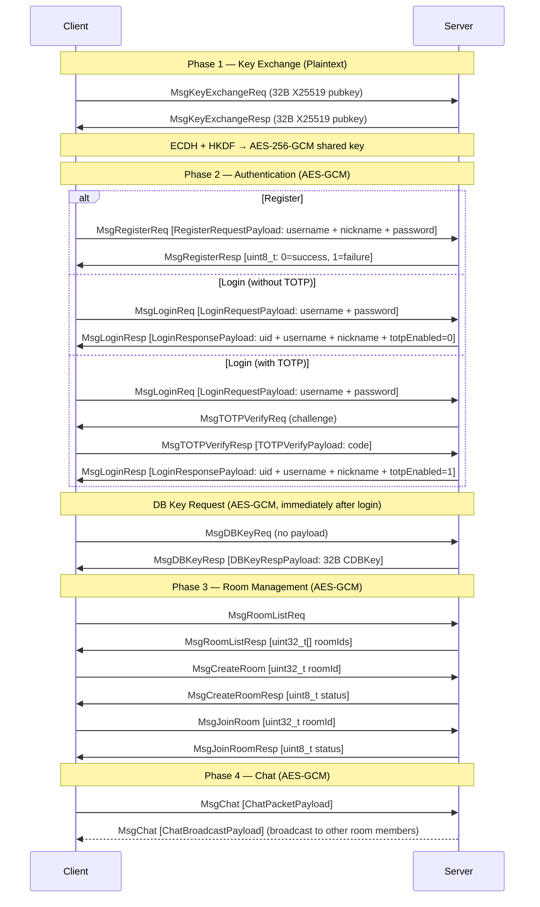
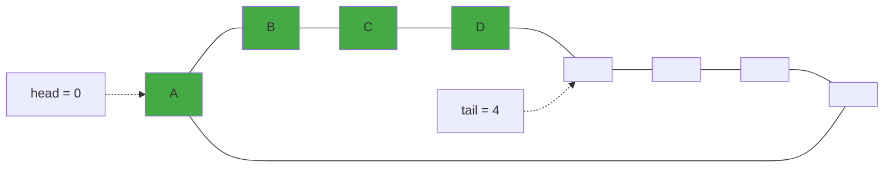
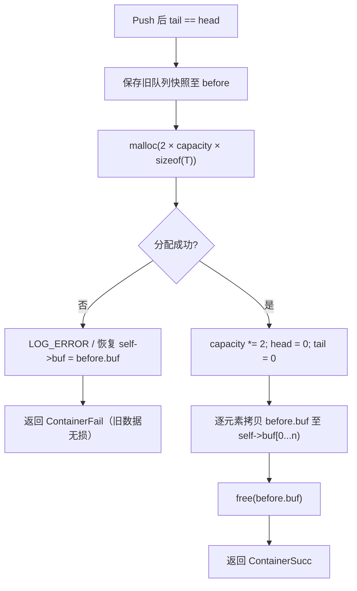
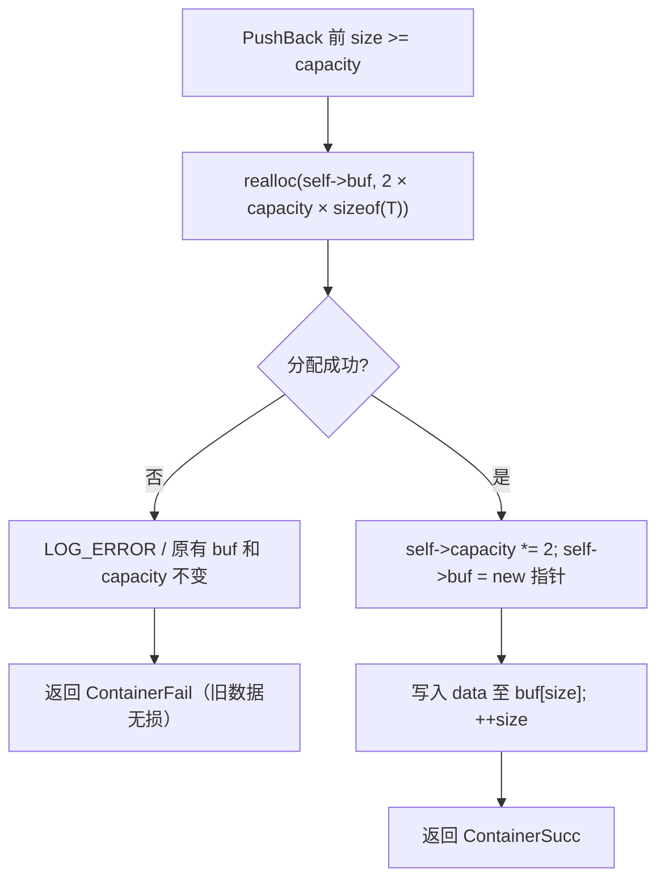
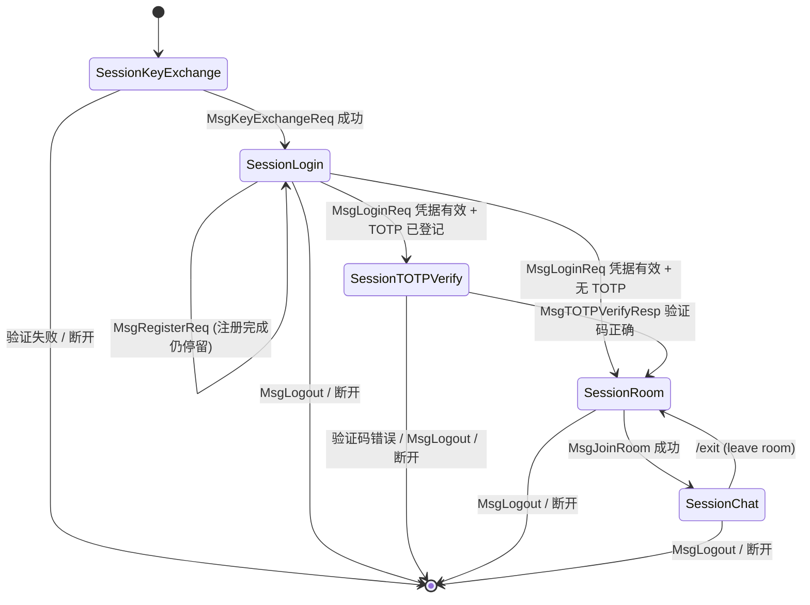
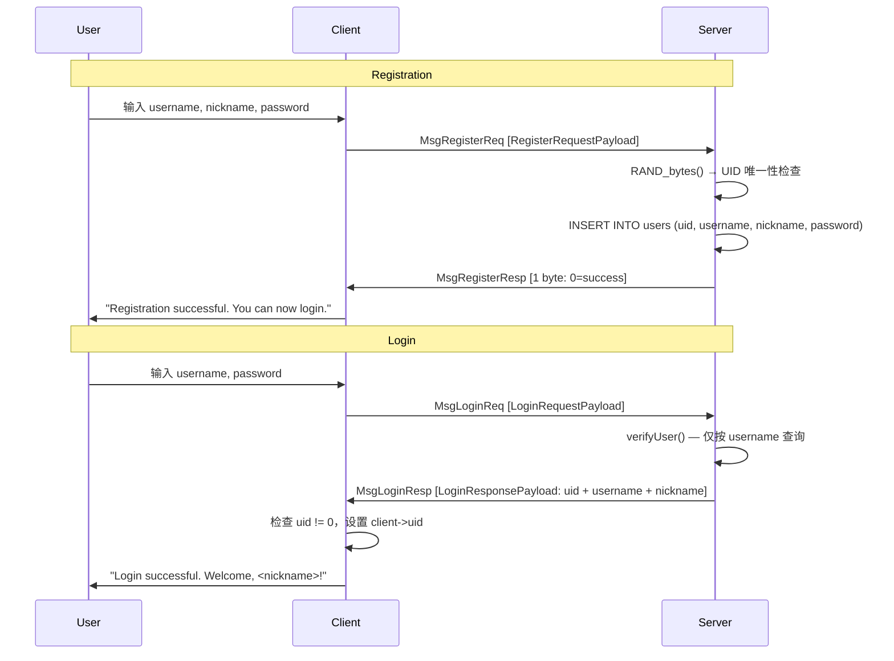

# API 文档

---

## 第一部分：公共 API（ `include/` ）

本部分涵盖 `include/` 目录下所有对客户端与服务端均可见的公共接口，包括密码学、网络协议、日志及通用工具。

---

### 1.1 Crypto 密码学模块

**接口**： `include/crypto.h`

**实现**： `src/common/crypto.c`

提供与上层协议解耦的低级密码学封装，涵盖 AES-256-GCM 认证加密、ECDH（X25519）密钥协商、HKDF-SHA256 密钥派生及密码学安全随机数生成。所有实现基于 OpenSSL 3.x EVP API，符合 C17 标准。

#### 1.1.1 常量与宏

| 宏                          | 值                   | 说明                                              |
| --------------------------- | -------------------- | ------------------------------------------------- |
| `CRYPTO_SUCC` | `0` | 函数执行成功                                      |
| `CRYPTO_FAIL` | `-1` | 通用失败                                          |
| `CRYPTO_AUTH_FAIL` | `-2` | AES-GCM 认证标签校验失败                          |
| `AES_GCM_KEY_LEN` | `32` | AES-256 对称密钥长度（字节）                      |
| `AES_GCM_NONCE_LEN` | `12` | GCM 模式 nonce 长度（字节）                       |
| `AES_GCM_TAG_LEN` | `16` | GCM 认证标签长度（字节）                          |
| `ECDH_SHARED_SECRET_SIZE` | `32` | X25519 ECDH 协商后的共享密钥长度（字节）          |
| `ECDH_PUBLIC_KEY_SIZE` | `32` | X25519 原始公钥长度（字节）                       |
| `HKDF_INFO_AES_KEY` | `"PacPlay-AESKey"` | HKDF-SHA256 派生 AES 密钥时使用的固定 info 字符串 |
| `HASH_SALT_LEN` | `16` | 密码哈希 salt 长度（字节，128 位）                |
| `HASH_SHA256_LEN` | `32` | SHA-256 摘要长度（字节）                          |
| `TOTP_STEP_SECONDS` | `30` | TOTP 时间步长（秒）                               |
| `TOTP_DIGITS` | `6` | TOTP 验证码位数                                    |
| `TOTP_WINDOW` | `1` | 允许的时间窗口偏移（±1，共 3 个窗口）             |
| `TOTP_HMAC_SHA1_LEN` | `20` | SHA-1 HMAC 输出长度（字节）                       |
| `TOTP_CODE_RANGE` | `1000000` | 6 位验证码取模基数（10^TOTP_DIGITS）              |
| `TOTP_MIN_KEY_LEN` | `16` | TOTP 共享密钥最小长度（字节，RFC 4226: ≥128 位）  |

#### 1.1.2 类型定义

**AESGCMKey**

```c
typedef struct {
    uint8_t key[AES_GCM_KEY_LEN];
    uint8_t nonce[AES_GCM_NONCE_LEN];
} AESGCMKey;
```

AES-256-GCM 的完整密钥材料。 `key` 为 32 字节对称密钥； `nonce` 为每次加密前须单独生成的 12 字节随机值。禁止在任何两次加密操作中复用同一 nonce。

**AESGCMBuffer**

```c
typedef struct {
    uint8_t *data;
    size_t capacity;
    size_t len;
} AESGCMBuffer;
```

通用字节缓冲区描述符。 `data` 指向由调用者或 `aesGCMBufferInit()` 分配的内存。 `encryptAESGCM()` 与 `decryptAESGCM()` 均要求调用者预先为输入/输出缓冲区分配足够内存，函数本身不执行动态分配。

**AESGCMCipher**

```c
typedef struct {
    AESGCMBuffer buffer;
    uint8_t tag[AES_GCM_TAG_LEN];
} AESGCMCipher;
```

AES-GCM 加密输出结构。 `buffer.data` 存放密文， `tag` 存放 16 字节认证标签。

#### 1.1.3 缓冲区辅助函数

| 函数                                                         | 说明                                               |
| ------------------------------------------------------------ | -------------------------------------------------- |
| `int aesGCMBufferInit(AESGCMBuffer *buf, size_t capacity)` | 分配 `capacity` 字节堆内存，初始化 `buf->data` |
| `void aesGCMBufferDeinit(AESGCMBuffer *buf)` | 释放 `buf->data` ，指针置为 NULL（可重复调用）    |

调用 `aesGCMBufferInit()` 后须显式调用 `aesGCMBufferDeinit()` 释放，防止内存泄漏。

#### 1.1.4 AES-256-GCM 加密与解密

**`int encryptAESGCM(const AESGCMBuffer *plaintext, const AESGCMBuffer *aad, const AESGCMKey *key, AESGCMCipher *output)`**

对给定明文执行 AES-256-GCM 加密。 `aad` 可为 NULL 或零长度。 `output->buffer.data` 须由调用者预先分配，且 `output->buffer.capacity >= plaintext->len` 。成功返回 `CRYPTO_SUCC` ， `output->buffer.len` 为密文长度， `output->tag` 有效。

**`int decryptAESGCM(const AESGCMCipher *cipher, const AESGCMBuffer *aad, const AESGCMKey *key, AESGCMBuffer *plaintext)`**

对给定密文执行 AES-256-GCM 解密并校验认证标签。 `aad` 必须与加密时完全一致。返回 `CRYPTO_SUCC` （解密成功）、 `CRYPTO_AUTH_FAIL` （认证失败，密文被篡改）或 `CRYPTO_FAIL` （参数非法）。收到 `CRYPTO_AUTH_FAIL` 时不得信任 `plaintext->data` 中的任何内容。

#### 1.1.5 ECDH（X25519）密钥协商

| 函数                                                                                      | 说明                                                                             |
| ----------------------------------------------------------------------------------------- | -------------------------------------------------------------------------------- |
| `EVP_PKEY *genECDHKeypair(void)` | 生成 X25519 临时密钥对，返回 `EVP_PKEY *` ，调用者须以 `EVP_PKEY_free()` 释放 |
| `int exportECDHPublicKey(EVP_PKEY *pkey, uint8_t pub[32])` | 提取 32 字节原始公钥，可直接网络传输                                             |
| `EVP_PKEY *importECDHPeerPublicKey(const uint8_t pub[32])` | 将对端 32 字节公钥重构为 `EVP_PKEY *` |
| `int deriveECDHSharedSecret(EVP_PKEY *localKey, EVP_PKEY *peerKey, uint8_t secret[32])` | 执行 ECDH 协商，输出 32 字节共享密钥。失败时用 `OPENSSL_cleanse` 清零输出      |

#### 1.1.6 HKDF-SHA256 密钥派生

**`int deriveAESKey(const uint8_t *sharedSecret, size_t secretLen, AESGCMKey *outKey)`**

基于 HKDF（RFC 5869）将 32 字节共享密钥派生为 AES-256-GCM 密钥。使用 SHA-256 摘要，Info 字符串为 `"PacPlay-AESKey"` 。成功时 `outKey->key` 包含 32 字节 AES 密钥， `outKey->nonce` 已清零（调用者须在每次加密前用 `cryptoRandomBytes()` 重新生成随机 nonce）。

#### 1.1.7 安全随机数

**`int cryptoRandomBytes(uint8_t *buf, int len)`**

填充密码学安全随机字节。内部调用 OpenSSL `RAND_bytes` 。 `buf` 不得为 NULL， `len` 须大于 0。

#### 1.1.8 密码哈希与验证

**`char *hashPassword(const char *password)`**

对明文密码执行 salted SHA-256 哈希，用于数据库持久化存储。哈希流程：

1. 调用 `RAND_bytes()` 生成 16 字节（128 位）密码学安全随机 salt。
2. 计算 `SHA-256(password || salt)`。
3. 输出格式为 `"salt_hex:hash_hex"` 的堆分配字符串（总长度 97 字节含 NUL），其中 `salt_hex` 与 `hash_hex` 各为小写十六进制编码。
4. 所有中间敏感数据（salt、digest）在函数返回前经 `OPENSSL_cleanse` 安全擦除。

调用者负责 `free()` 返回的字符串。密码不可为空。失败（内存不足或随机数生成失败）返回 NULL。

**`int verifyPassword(const char *password, const char *storedHash)`**

校验明文密码与存储的哈希字符串是否匹配。 `storedHash` 格式须严格为 `"salt_hex:hash_hex"` （由 `hashPassword()` 生成）。

安全特性：
* 使用 `CRYPTO_memcmp` 常量时间比较，防御时序攻击。
* 不区分"格式错误"与"密码不匹配"，统一返回 `CRYPTO_FAIL`，防止用户枚举。
* 所有中间敏感数据（salt、期望 hash、计算 hash）经 `OPENSSL_cleanse` 安全擦除。

成功返回 `CRYPTO_SUCC` ，失败返回 `CRYPTO_FAIL` 。

#### 1.1.9 Base32 编解码（RFC 4648）

实现 RFC 4648 Base32 编码，使用标准字母表 `ABCDEFGHIJKLMNOPQRSTUVWXYZ234567` 。编码输出不含 `=` 填充字符。主要用于 TOTP 密钥的文本化表示。

**`int base32Encode(const uint8_t *data, size_t len, char **outStr)`**

将 `len` 字节的原始二进制数据编码为堆分配的 NUL 终止 Base32 字符串。 `len > 0` 时 `data` 不得为 NULL。输出长度由 `ceil(len * 8 / 5)` 确定。

调用者负责 `free(*outStr)` 。成功返回 `CRYPTO_SUCC` ，失败（参数无效或分配失败）返回 `CRYPTO_FAIL` ， `*outStr` 置为 NULL。

**`int base32Decode(const char *encoded, uint8_t **outData, size_t *outLen)`**

将 Base32 字符串解码为原始二进制字节。解码规则：

* **大小写不敏感**：`a-z` 等效于 `A-Z`。
* **空白忽略**：ASCII 空格、制表符、换行符、回车符在解码时被静默剔除，适用于人工格式化的输入。
* **拒绝非法字符**：`=` 填充符及字母表外字符一律拒绝。
* **完整性校验**：编码长度须至少能提取一个完整字节；悬挂未使用的比特必须全为零，否则视为篡改或损坏的编码。

调用者负责 `free(*outData)` 。空字符串解码为 `*outData = NULL` 、 `*outLen = 0` 。成功返回 `CRYPTO_SUCC` ，失败返回 `CRYPTO_FAIL` 。

#### 1.1.10 TOTP 基于时间的一次性密码（RFC 6238）

实现基于 HMAC-SHA1（RFC 2104）的 TOTP 算法，生成 6 位数字验证码。与 Google Authenticator、Authy 等标准认证器应用兼容。

**核心参数**：30 秒时间步长、HMAC-SHA1、6 位数字、±1 窗口容差（共验证 3 个连续窗口）。

**`int verifyTOTPCode(const char *secret, int *code)`**

验证用户输入的 TOTP 验证码。 `secret` 为 Base32 编码的共享密钥（由调用者预先编码）； `code` 指向待验证的 6 位数字码。

验证流程：

1. 调用 `base32Decode()` 将 secret 解码为原始密钥字节。
2. 校验密钥长度 ≥ `TOTP_MIN_KEY_LEN`（16 字节，RFC 4226 要求 ≥128 位）。
3. 以 `getCurrentTimestamp() / 30` 为基准时间步，遍历 `[baseStep - 1, baseStep + 1]` 三个窗口。
4. 对每个窗口计算 `HMAC-SHA1(key, counter)`，counter 为 8 字节大端表示的 64 位时间步值。
5. 对 HMAC 输出执行动态截断（RFC 4226 §5.3），提取 4 字节并取模 `10^6` 得到 6 位数字码。
6. 若任一窗口的计算结果与 `*code` 相等，返回 `CRYPTO_SUCC`。

安全特性：解码后的密钥在函数返回前经 `OPENSSL_cleanse` 安全擦除。密钥过短（<16 字节）被拒绝。证书在所有错误路径上一致返回 `CRYPTO_FAIL` ，不泄露失败原因。

**`int generateOTPAuthURI(const char *secret, const char *username, char **outURI)`**

生成 `otpauth://totp/` 格式的密钥 URI 字符串，可直接嵌入 QR 码供认证器应用扫描导入。

输出格式：

```
otpauth://totp/PacPlay:{username}?secret={secret}&issuer=PacPlay&algorithm=SHA1&digits=6&period=30
```

参数说明：
* `secret`：Base32 编码的 TOTP 共享密钥（不含 `=` 填充）。函数内部校验其仅含合法 Base32 字符，拒绝含 `&`/`=`/`?` 等会破坏 URI 结构的输入。
* `username`：用户可读账号标识。URI 的 label 为 `PacPlay:{username}`。若含保留字符（空格、`@`、`:` 等），自动按 RFC 3986 百分号编码。

调用者负责 `free(*outURI)` 。成功返回 `CRYPTO_SUCC` ，失败（参数为 NULL/空、secret 含非法字符、分配失败）返回 `CRYPTO_FAIL` 。

#### 1.1.11 端到端加密密钥协商推荐流程

```
Alice                              Bob
  │                                 │
  ├─ genECDHKeypair()               ├─ genECDHKeypair()
  ├─ exportECDHPublicKey() ────────►├─ importECDHPeerPublicKey()
  ├─ importECDHPeerPublicKey() ◄────├─ exportECDHPublicKey()
  │                                 │
  ├─ deriveECDHSharedSecret()       ├─ deriveECDHSharedSecret()
  ├─ deriveAESKey()                 ├─ deriveAESKey()
  │                                 │
  ▼ 握手完成，AES 密钥就绪          ▼
```

密钥协商完成后，应安全清理临时材料：

```c
OPENSSL_cleanse(sharedSecret, sizeof(sharedSecret));
EVP_PKEY_free(myKeypair);
EVP_PKEY_free(peerKey);
```

通信时的 nonce 管理：每次调用 `encryptAESGCM()` 前用 `cryptoRandomBytes()` 生成新的 12 字节 nonce，与密文一并传送。复用 nonce 将破坏 GCM 的安全性。

---

### 1.2 Protocol 通信协议

**接口**： `include/protocol.h`

**实现**： `src/common/protocol.c`

实现 PacPlay 的二进制网络协议栈，涵盖 TCP 套接字管理、数据包序列化、AES-256-GCM 加密传输及阻塞式收发。 `protocol.h` 通过 `#include "crypto.h"` 引入密码学模块的全部类型与常量。

#### 1.2.1 常量与宏

| 宏                       | 值             | 说明                                  |
| ------------------------ | -------------- | ------------------------------------- |
| `PROTOCOL_SUCC` | `0` | 函数执行成功                          |
| `PROTOCOL_FAIL` | `-1` | 通用失败                              |
| `PROTOCOL_AUTH_FAIL` | `-2` | AES-GCM 认证标签校验失败或 AAD 不匹配 |
| `MAX_PAYLOAD_LEN` | `1024` | 明文载荷最大字节数                    |
| `LOGIN_USERNAME_LEN` | `32` | 用户名固定长度（NUL 终止）            |
| `LOGIN_NICKNAME_LEN` | `32` | 昵称固定长度（NUL 终止）              |
| `AES_PACKET_EXTRA_LEN` | `28` | 加密后额外开销：nonce(12) + tag(16)   |
| `BACKLOG` | `1024` | `listen()` 连接队列长度             |
| `NULL_SOCKETFD` | `-1` | 无效套接字描述符标识                  |
| `PACKET_MAGIC`            | `0x5050504D`      | 包魔术字，ASCII `PPPM`                              |
| `TOTP_SETUP_SECRET_LEN`    | `33`              | TOTP 设置响应中 Base32 密钥的固定长度（32 字符 + NUL） |
| `CLIENT_DB_KEY_LEN` | `32` | 每用户客户端数据库加密密钥长度（256 位） |

#### 1.2.2 类型定义

**SocketFD**

```c
typedef int SocketFD;
```

套接字文件描述符别名。取值为 `NULL_SOCKETFD` 表示无效或已关闭。

**PacketType 与 MessageType**

```c
typedef enum {
    PlaintextPacket = 1,
    AES256GCMPacket
} PacketType;

typedef enum {
    MsgKeyExchangeReq = 1, MsgKeyExchangeResp,   // Phase 1: 密钥交换
    MsgLoginReq, MsgLoginResp,                    // Phase 2: 认证
    MsgRegisterReq, MsgRegisterResp,              // Phase 2: 注册
    MsgTOTPSetupReq, MsgTOTPSetupResp,            // Phase 2: TOTP 设置
    MsgTOTPVerifyReq, MsgTOTPVerifyResp,          // Phase 2: TOTP 二次验证
    MsgDBKeyReq, MsgDBKeyResp,                    // Phase 2: 数据库密钥交换
    MsgRoomListReq, MsgRoomListResp,              // Phase 3: 房间管理
    MsgCreateRoom, MsgCreateRoomResp,
    MsgJoinRoom, MsgJoinRoomResp,
    MsgChat,                                       // Phase 4: 聊天
    MsgLogout, MsgHeartbeat,                      // 会话生命周期
    MsgGameStart, MsgGameStop                      // Phase 5: 游戏（预留）
} MessageType;
```

`MessageType` 按协议阶段重新排列，值自 1 起连续递增。枚举仅用于命名常量，网络传输中存储为 `uint32_t` 以确保跨平台宽度一致。

**PacketHeader（紧凑打包，无填充）**

```c
#pragma pack(push, 1)
typedef struct {
    uint32_t magic;        // PACKET_MAGIC (0x5050504D)
    uint32_t packetType;   // PlaintextPacket 或 AES256GCMPacket
    uint32_t messageType;  // MessageType 枚举值
    uint32_t payloadLength; // 载荷字节数
    uint32_t sequenceID;    // 单调递增序列号
} PacketHeader;
#pragma pack(pop)
```

`#pragma pack(push, 1)` 消除结构体内存填充，确保 wire format 与内存布局完全一致。所有字段使用 `uint32_t` 定长类型以使平台无关。接收端必须校验 `magic == PACKET_MAGIC` 。

**Packet**

```c
typedef struct {
    PacketHeader header;
    uint8_t *payload;
} Packet;
```

完整数据包结构。 `header` 与 `payload` 内存**不连续**， `payload` 由调用者或接收函数动态分配。Packet 本身不序列化（header 与 payload 分别传输），故无需 `#pragma pack` 。

#### 1.2.3 载荷结构

**KeyExchangePacketPayload**（密钥交换阶段）

```c
#pragma pack(push, 1)
typedef struct {
    uint8_t publicKey[ECDH_PUBLIC_KEY_SIZE]; // 32 字节 X25519 公钥
} KeyExchangePacketPayload;
#pragma pack(pop)
```

**LoginRequestPayload**（登录请求， `MsgLoginReq` 专用）

```c
#pragma pack(push, 1)
typedef struct {
    char username[LOGIN_USERNAME_LEN];  // 32 字节，NUL 终止
    char password[];                    // FAM，长度 = payloadLength - 32
} LoginRequestPayload;
#pragma pack(pop)
```

U6D 不在登录请求中传输 — UID 由服务器在注册时分配，登录时通过 `LoginResponsePayload` 返回给客户端。 `username` 为定长 NUL 终止数组； `password` 为柔性数组成员，调用者须确保其 NUL 终止于总载荷内。

**RegisterRequestPayload**（注册请求， `MsgRegisterReq` 专用）

```c
#pragma pack(push, 1)
typedef struct {
    char username[LOGIN_USERNAME_LEN];  // 32 字节，NUL 终止
    char nickname[LOGIN_NICKNAME_LEN];  // 32 字节，NUL 终止
    char password[];                    // FAM，长度 = payloadLength - 64
} RegisterRequestPayload;
#pragma pack(pop)
```

客户端不发送 UID — 服务器利用 `RAND_bytes` 生成随机唯一 UID 并在 `createUser()` 中回填。

**LoginResponsePayload**（登录响应， `MsgLoginResp` 专用）

```c
#pragma pack(push, 1)
typedef struct {
    uint32_t uid;                        // 服务器分配的 UID (0 = 失败)
    char username[LOGIN_USERNAME_LEN];   // 用户名
    char nickname[LOGIN_NICKNAME_LEN];   // 昵称
    uint8_t totpEnabled;                 // 0 = 未登记 TOTP, 1 = 已登记 TOTP
} LoginResponsePayload;
#pragma pack(pop)
```

服务端在验证成功后返回完整的 `User` 记录（包括 UID、username、nickname）及 TOTP 登记状态。若验证失败， `uid` 为 0，所有其他字段为零填充。客户端须通过检查 `uid != 0` 判定登录是否成功。 `totpEnabled == 0` 时客户端应提示用户启用 TOTP 增强安全性。固定大小 69 字节。

**TOTPSetupRespPayload**（TOTP 设置响应， `MsgTOTPSetupResp` 专用）

```c
#pragma pack(push, 1)
typedef struct {
    char secret[TOTP_SETUP_SECRET_LEN];  // 32 字符 Base32 + NUL (33 字节)
} TOTPSetupRespPayload;
#pragma pack(pop)
```

服务端生成 20 字节（160 位）随机密钥后，Base32 编码为 32 字符，NUL 终止后填入此结构体返回给客户端。客户端应将该密钥导入认证器应用。固定大小 33 字节。

**TOTPVerifyPayload**（TOTP 验证码， `MsgTOTPVerifyResp` 专用）

```c
#pragma pack(push, 1)
typedef struct {
    uint32_t code;                       // 6 位 TOTP 验证码 (0-999999)
} TOTPVerifyPayload;
#pragma pack(pop)
```

客户端在收到 `MsgTOTPVerifyReq` 挑战后，要求用户输入当前 6 位 TOTP 验证码，填入此结构体发送给服务端验证。固定大小 4 字节。

**DBKeyRespPayload**（数据库密钥响应， `MsgDBKeyResp` 专用）

```c
#pragma pack(push, 1)
typedef struct {
    uint8_t cdbkey[CLIENT_DB_KEY_LEN];   // 256 位原始 CDBKey 密钥材料
} DBKeyRespPayload;
#pragma pack(pop)
```

服务端在收到 `MsgDBKeyReq` 后，从 UserDB 的 `cdbkey` 列读取经 DEK 信封加密的每用户 CDBKey，解密后通过此结构体返回给客户端。固定大小 `CLIENT_DB_KEY_LEN` （32 字节）。

**ChatPacketPayload**（客户端→服务端聊天消息）

```c
#pragma pack(push, 1)
typedef struct {
    int64_t timestamp;       // UTC UNIX 时间戳
    uint8_t message[];       // FAM
} ChatPacketPayload;
#pragma pack(pop)
```

**ChatBroadcastPayload**（服务端→房间成员广播）

```c
#pragma pack(push, 1)
typedef struct {
    uint32_t uid;       // 发送者 UID
    uint64_t msgId;     // 全局唯一消息 ID
    int64_t timestamp;  // UTC UNIX 时间戳
    uint8_t message[];  // FAM
} ChatBroadcastPayload;
#pragma pack(pop)
```

#### 1.2.4 网络连接管理

| 函数                                                      | 说明                                                                                                   |
| --------------------------------------------------------- | ------------------------------------------------------------------------------------------------------ |
| `SocketFD serverSetup(uint16_t port)` | 在指定端口创建 TCP 监听套接字，绑定 `INADDR_ANY` ，队列长度为 `BACKLOG` 。失败返回 `NULL_SOCKETFD` |
| `SocketFD clientSetup(const char *addr, uint16_t port)` | 创建 TCP 客户端套接字并连接。 `addr` 须为 IPv4 点分十进制字符串。失败返回 `NULL_SOCKETFD` |
| `void socketClose(SocketFD *socketFD)` | 关闭套接字并重置为 `NULL_SOCKETFD` 。重复调用安全                                                     |

#### 1.2.5 数据包序列化与反序列化

**`int packetSerialize(const Packet *packet, uint8_t *buffer, size_t bufferSize, size_t *serializedSize)`**

将 `Packet` 写入连续字节缓冲区，输出顺序为 `PacketHeader` 后紧跟 `payload` 。不执行加密 — 若需加密须先调用 `packetAESEncrypt()` 。 `serializedSize` 输出实际写入字节数（ `sizeof(PacketHeader) + payloadLength` ）。返回 `PROTOCOL_SUCC` 或 `PROTOCOL_FAIL` 。

**`int packetDeserialize(const uint8_t *buffer, size_t bufferSize, Packet *packet)`**

从字节缓冲区解析 `PacketHeader` ，校验魔术字，随后为 `payload` 动态分配内存。调用前须保证 `packet->payload == NULL` 。成功时 `packet->payload` 由 `malloc` 分配，调用者须以 `packetClear()` 释放。

#### 1.2.6 数据包加密与解密

Protocol 层的加密与解密通过 `crypto` 模块提供的 `encryptAESGCM()` 与 `decryptAESGCM()` 实现。Protocol 模块负责数据包的上下文封装：构造 AAD、管理 nonce/ciphertext/tag 的拼接与解析，以及 Packet 结构的状态转换。

**`int packetAESEncrypt(Packet *packet, uint8_t key[AES_GCM_KEY_LEN])`**

对明文数据包执行原地 AES-256-GCM 加密。

前置条件： `packet->header.packetType == PlaintextPacket` ， `payloadLength <= MAX_PAYLOAD_LEN` 。

加密流程：

1. 调用 `cryptoRandomBytes()` 生成 12 字节随机 nonce。
2. 构造 AAD 为 `uint64_t` 值 `(payloadLength << 32) | sequenceID`，同时绑定载荷长度与序列号。
3. 调用 `encryptAESGCM()` 加密明文，获得密文与 16 字节 tag。
4. 分配新 payload 内存，按顺序拼接 `nonce(12B) || ciphertext || tag(16B)`。
5. 更新 `packetType = AES256GCMPacket`，`payloadLength` 同步更新为新长度。
6. 释放旧 payload 及临时密文缓冲区。

失败时 packet 的原有状态保持不变（旧 payload 不释放， `packetType` 与 `payloadLength` 不修改），调用者可安全重试。

**`int packetAESDecrypt(Packet *packet, uint8_t key[AES_GCM_KEY_LEN])`**

对加密数据包执行原地 AES-256-GCM 解密。

前置条件： `packet->header.packetType == AES256GCMPacket` ， `payloadLength >= AES_PACKET_EXTRA_LEN` 。

解密流程：

1. 从载荷前端提取 nonce（12 字节），末端提取 tag（16 字节），中间段为 ciphertext。
2. 重建 AAD 为 `uint64_t` 值 `((payloadLength - AES_PACKET_EXTRA_LEN) << 32) | sequenceID`。
3. 调用 `decryptAESGCM()` 解密 ciphertext 并校验 tag。
4. 解密成功后执行二次 AAD 校验（防御性检查）。
5. 更新 `packetType = PlaintextPacket`，`payloadLength` 恢复为明文长度。

返回： `PROTOCOL_SUCC` （成功）、 `PROTOCOL_AUTH_FAIL` （认证失败，数据被篡改）或 `PROTOCOL_FAIL` （参数/格式/内存错误）。

#### 1.2.7 数据包生命周期管理

**`int packetInit(Packet *packet, MessageType msgType, uint32_t seqID, PacketType pktType, const void *data, size_t dataLen)`**

构造完整的 `Packet` 对象，是创建数据包的**唯一推荐入口**。函数内部分配堆内存拷贝 `data` 中的 `dataLen` 字节作为载荷，并设置所有头部字段（包括魔术字 `PACKET_MAGIC` ）。

调用前须确保 `packet->payload == NULL` 。 `dataLen` 必须 `<= MAX_PAYLOAD_LEN` ； `dataLen > 0` 时 `data` 不得为 NULL。

区别于 `packetDeserialize()` （从字节流恢复）与 `packetRecv()` （从套接字接收），本函数用于在本地构造待发送的数据包。使用后须调用 `packetClear()` 释放载荷。

**`void packetClear(Packet *packet)`**

释放 `packet->payload` 指向的动态内存并将其置为 NULL。对同一 Packet 重复调用安全。所有通过 `packetDeserialize()` 、 `packetRecv()` 或 `packetInit()` 获得载荷的 Packet 对象，在生命周期结束前必须调用此函数。

#### 1.2.8 网络收发

| 函数                                                  | 说明                                                                                                                        |
| ----------------------------------------------------- | --------------------------------------------------------------------------------------------------------------------------- |
| `int packetSend(Packet *packet, SocketFD socketFD)` | 分两次发送完 header 与 payload，使用 `sendAll` 循环处理部分写                                                             |
| `int packetRecv(Packet *dest, SocketFD socketFD)` | 阻塞接收完整数据包，先收 header（校验 magic 与长度），再收 payload。加密包限额为 `MAX_PAYLOAD_LEN + AES_PACKET_EXTRA_LEN` |

#### 1.2.9 协议使用要点

1. **内存所有权**：凡导致 `payload` 非 NULL 的 API（`packetDeserialize`、`packetRecv`、`packetInit`），后续必须配对 `packetClear()`。
2. **加密顺序**：发送加密包应先 `packetAESEncrypt()` 再 `packetSend()`。接收后应先 `packetRecv()` 再 `packetAESDecrypt()`。
3. **AAD 完整性**：AAD 绑定 `(payloadLength << 32) | sequenceID`，任何对 header 的篡改均导致 `PROTOCOL_AUTH_FAIL`。
4. **序列号**：`sequenceID` 为每个会话独立的单调递增计数器，由调用者维护。Protocol 模块不自动递增序列号。

#### 1.2.10 协议数据流总览



---

### 1.3 Log 日志模块

**接口**： `include/log.h`

**实现**： `src/common/log.c`

轻量日志库，修改自 [rxi/log.c](https://github.com/rxi/log.c)。

#### 1.3.1 日志级别

 `LogLevelTrace < LogLevelDebug < LogLevelInfo < LogLevelWarn < LogLevelError < LogLevelFatal`

低于全局阈值的消息直接丢弃。默认阈值 `LogLevelTrace` （全部输出）。

#### 1.3.2 便捷宏

| 宏                      | 等价展开                                                |
| ----------------------- | ------------------------------------------------------- |
| `LOG_TRACE(fmt, ...)` | `logLog(LogLevelTrace, __FILE__, __LINE__, fmt, ...)` |
| `LOG_DEBUG(fmt, ...)` | `logLog(LogLevelDebug, __FILE__, __LINE__, fmt, ...)` |
| `LOG_INFO(fmt, ...)` | `logLog(LogLevelInfo, __FILE__, __LINE__, fmt, ...)` |
| `LOG_WARN(fmt, ...)` | `logLog(LogLevelWarn, __FILE__, __LINE__, fmt, ...)` |
| `LOG_ERROR(fmt, ...)` | `logLog(LogLevelError, __FILE__, __LINE__, fmt, ...)` |
| `LOG_FATAL(fmt, ...)` | `logLog(LogLevelFatal, __FILE__, __LINE__, fmt, ...)` |

所有宏自动捕获 `__FILE__` 和 `__LINE__` ，输出至 `stderr` ，格式： `HH:MM:SS LEVEL file.c:line: message` 。参数与 `printf` 语义一致。

#### 1.3.3 配置函数

| 函数                                                             | 作用                                             |
| ---------------------------------------------------------------- | ------------------------------------------------ |
| `void logSetLevel(LogLevel level)` | 设置全局最低输出级别                             |
| `void logSetQuiet(bool enable)` | `true` 关闭 stderr 输出，不影响回调            |
| `void logSetLock(LogLockFn fn, void *udata)` | 注册加锁回调，多线程必须设置                     |
| `int logAddFp(FILE *fp, LogLevel level)` | 添加文件输出（带完整日期格式），最多 32 个回调槽 |
| `int logAddCallback(LogLogFn fn, void *udata, LogLevel level)` | 注册自定义日志后端                               |

#### 1.3.4 线程安全

库内部无锁。多线程场景须通过 `logSetLock()` 注册锁回调：

```c
static pthread_mutex_t mu = PTHREAD_MUTEX_INITIALIZER;
void lockFn(bool lock, void *udata) {
    lock ? pthread_mutex_lock(&mu) : pthread_mutex_unlock(&mu);
}
logSetLock(lockFn, NULL);
```

---

### 1.4 Container 容器模块

**接口**：`include/container.h`

提供泛型数据容器，为服务端与客户端提供通用数据结构支持。当前包含泛型环形缓冲区（QueueT）与泛型动态数组（ArrayT）。

所有函数均为 `static inline`，通过单步预处理器宏在编译期生成。`#include "container.h"` 后调用 `QUEUE_DEFINE(T)` 或 `ARRAY_DEFINE(T)` 即可使用，无需单独的 `.c` 实现文件。

#### 1.4.1 泛型环形缓冲区（QueueT）

通过 `QUEUE_DEFINE(T)` 单步预处理器宏为任意数据类型生成类型安全的循环队列（环形缓冲区）实现，支持自动扩容、O(1) 推入/弹出及完整生命周期管理。

##### 常量与宏

| 宏                         | 值    | 说明                                                                              |
| -------------------------- | ----- | --------------------------------------------------------------------------------- |
| `QUEUE_DEFAULT_CAPACITY` | `8` | 队列初始容量（槽位数）。当 `Init` 传入容量为 `0` 时自动采用此默认值           |
| `USE_DEFAULT_CAPACITY`   | `0` | 哨兵值，传入 `Init` 表示使用默认容量                                           |
| `QUEUE_DEFINE(T)`        | —    | 为类型 `T` 一步生成结构体定义及全部 `static inline` 函数。直接放在需要使用的翻译单元中 |

##### 类型定义

**ContainerRes**

```c
typedef enum { ContainerSucc = 0, ContainerFail = -1 } ContainerRes;
```

所有容器函数的统一返回值。 `ContainerSucc` 表示操作成功， `ContainerFail` 表示失败（队空、内存不足等）。

**QueueT**（由 `QUEUE_DEFINE(T)` 展开）

以 `typedef int Int; QUEUE_DEFINE(Int)` 为例，展开后生成如下结构体：

```c
typedef struct {
    Int *buf;         // 环形缓冲区，动态分配于堆上
    size_t capacity;  // 当前容量（槽位数，以 sizeof(T) 为单位）
    size_t head;      // 队首索引（下一出队位置）
    size_t tail;      // 队尾索引（下一入队位置）
} QueueInt;
```

环形缓冲区的核心不变式：

* **空队列**：`head == tail`
* **满队列**：`tail` 追上 `head`（`Push` 写入后若 `tail == head` 立即触发扩容）
* 有效元素个数（推导值）：`(tail - head + capacity) % capacity`

下图为容量为 8、已存储 4 个元素的环形缓冲区内存布局（绿色槽位为已占用，虚线箭头表示首尾回环）：



Push 操作将元素写入 `buf[tail]` 后 `tail = (tail + 1) % capacity` ；Pop 操作 `head = (head + 1) % capacity` （不释放元素内存）。两指针均按模容量循环推进，实现 O(1) 入队/出队。

##### 命名规则

`##` 拼接运算符将类型名 `T` 直接拼入标识符。调用者传入的类型名大小写决定最终函数名：

| 宏调用                     | 结构体名        | Init 函数名         | Push 函数名         |
| -------------------------- | --------------- | ------------------- | ------------------- |
| `QUEUE_DEFINE(Int)`      | `QueueInt`    | `queueIntInit`    | `queueIntPush`    |
| `QUEUE_DEFINE(Packet)`   | `QueuePacket` | `queuePacketInit` | `queuePacketPush` |

**推荐使用 `typedef` 别名**以获得符合命名规范的 CamelCase 结构体名（如 `typedef int Int;`）。

##### 公开 API

| 函数              | 签名                                                       | 返回                                  | 说明                                                                                                                                               |
| ----------------- | ---------------------------------------------------------- | ------------------------------------- | -------------------------------------------------------------------------------------------------------------------------------------------------- |
| `queueTInit` | `ContainerRes queueTInit(QueueT *self, size_t capacity)` | `ContainerSucc` / `ContainerFail` | 分配 `capacity * sizeof(T)` 字节堆内存并初始化各字段。 `capacity == 0` 时使用 `QUEUE_DEFAULT_CAPACITY` 。 `malloc` 失败返回 `ContainerFail` |
| `queueTDeinit` | `void queueTDeinit(QueueT *self)` | void                                  | 释放 `self->buf` 并置 NULL。传入 NULL 安全返回。对同一 Queue 重复调用安全（double-free 安全）                                                    |
| `queueTFront` | `ContainerRes queueTFront(QueueT *self, T *result)` | `ContainerSucc` / `ContainerFail` | 将队首元素**拷贝**至 `*result` 。队空时返回 `ContainerFail` ， `*result` 不变                                                             |
| `queueTPush` | `ContainerRes queueTPush(QueueT *self, T data)` | `ContainerSucc` / `ContainerFail` | 将 `data` 写入队尾，尾指针前进。写后若 `tail == head` 自动调用内部 `Reserve` 扩容为 2 倍。扩容 OOM 时返回 `ContainerFail` ，旧数据无损      |
| `queueTPop` | `ContainerRes queueTPop(QueueT *self)` | `ContainerSucc` / `ContainerFail` | 队首指针前进一位，**不返回弹出元素**。队空时返回 `ContainerFail` |
| `queueTIsEmpty` | `bool queueTIsEmpty(QueueT *self)` | `true` / `false` | `head == tail` 时返回 `true` |

**注意**： `queueTPop` 不返回被弹出元素的值。如需获取后弹出，先调用 `queueTFront` 后 `queueTPop` 。

##### 内部扩容机制（ `queueTReserve` ）

`Reserve` 为 `static` 函数，对外不可见，仅在队满时由 `Push` 自动触发。扩容流程：



关键保证：

- **错误回滚**：分配失败时完整恢复 `self->buf` 指向旧缓冲区，队列状态与扩容前完全一致。
- **线性化**：旧环形缓冲区中的元素按 `head → tail` 顺序被拷贝到新缓冲区的连续区间 `[0, n)`，`head` 与 `tail` 重置为 `0` 和 `n`。
- **触发时机**：仅在 `Push` 导致 `(tail + 1) % capacity == head`（即 `tail` 追上 `head`）时触发，而非预判式扩容。

##### 容量语义

```
容量 = 可用槽位数。Push N 次后，若 N ≤ capacity，无需扩容。
若 N > capacity，扩容为 2 × capacity，可容纳至多 2N 个元素。
```

`capacity == 0` 是非法的——容量为 0 的队列没有存储槽位，Push 后 `tail == head` （队满），触发 `Reserve` 时 `0 × 2 = 0` 导致死循环。因此，本模块将 `capacity == 0` 作为"使用默认值"的哨兵：

```c
QueueInt q;
queueIntInit(&q, 0);   // 等价于 queueIntInit(&q, 8)
queueIntInit(&q, 256); // 显式指定 256 槽位
```

##### 完整使用示例

以 `int` 为例演示单步使用的完整流程：

```c
#include "container.h"

typedef int Int;
QUEUE_DEFINE(Int)

void example(void) {
    QueueInt q;

    // 初始化（使用默认容量 8）
    if (queueIntInit(&q, 0) == ContainerFail) {
        LOG_ERROR("OOM");
        return;
    }

    // 推入
    for (int i = 1; i <= 100; i++) {
        if (queueIntPush(&q, i) == ContainerFail) {
            LOG_ERROR("Push failed at %d", i);
            break;
        }
    }

    // 依次取出并处理
    Int val;
    while (!queueIntIsEmpty(&q)) {
        queueIntFront(&q, &val); // 获取队首
        queueIntPop(&q);         // 弹出
        printf("%d\n", val);
    }

    // 释放
    queueIntDeinit(&q);
}
```

此例中首次扩容发生在第 9 次 Push（容量 8 → 16），后续依次 16 → 32 → 64 → 128。最终队列容纳全部 100 个元素后，容量为 128。

##### 使用要点

1. **单步实例化**：`QUEUE_DEFINE(T)` 生成 `static inline` 函数，可在任何需要使用的翻译单元中直接调用。由于函数带有 `static` 链接属性，多个翻译单元各自实例化同一类型不会导致多重定义错误。
2. **内存所有权**：`Init` 在堆上分配 `buf`，`Deinit` 释放之。若 `T` 本身包含指向堆内存的指针（如 `char *`），`Deinit` **仅释放 `buf` 数组本身**，不递归释放 `T` 内部的指针。调用者须在 `Deinit` 前手动遍历释放每个元素的嵌套内存。
3. **`Pop` 不返回元素**：`Pop` 仅移动 `head` 指针，不返回弹出值。获取队首值须先调用 `Front`。对于大型结构体，可避免不必要的数据拷贝。
4. **非线程安全**：所有函数未加锁。多线程环境下须由调用者在外部施加同步（如 `pthread_mutex_t`）。
5. **元素拷贝语义**：`Push` 和 `Front` 均为**值拷贝**（浅拷贝），通过 `=` 赋值完成。对于包含指针成员的复杂类型，需注意浅拷贝导致的悬挂指针问题。
6. **无 `queueTSize` 接口**：未提供直接获取当前元素个数的函数。若需计数，调用者须自行维护外部计数器，或通过推导公式 `(tail - head + capacity) % capacity` 计算（需访问内部字段，破坏封装）。
7. **哨兵容量值**：`Init` 的 `capacity` 参数取 `0` 时使用默认容量 8。`0` 不被视为合法容量，传入非零值则将严格使用该值（无最小值保护——传入 `1` 则仅分配 1 个槽位）。

##### Packet 类型特化风险

`QueuePacket`（通过 `QUEUE_DEFINE(Packet)` 生成）在实际使用中需特别注意，因为 `Packet` 结构体内部含有堆分配指针 `payload`，而队列的所有操作均为**浅拷贝**。以下逐一说明风险场景及正确用法。

**8. 浅拷贝与 payload 所有权**

`Push` 执行 `self->buf[self->tail] = data` （结构体赋值）， `Front` 执行 `*result = self->buf[self->head]` 。两者均为浅拷贝——仅拷贝 `PacketHeader` 字段和 `payload` **指针值**，不复制 `payload` 指向的堆内存。结果：队列内的 `Packet` 副本与调用方持有的 `Packet` 副本**共享**同一块 `payload` 内存。

若任一方调用 `packetClear` 释放 `payload` ，其他副本中的 `payload` 立即成为悬挂指针。因此，将 `Packet` 推入队列后，**原所有者的 `payload` 所有权已转移至队列**，原所有者不应再单独释放该 `Packet` 。

**9. `Pop` 不释放 payload → 内存泄漏**

`Pop` 仅将 `head` 指针前移一位，不调用 `packetClear` 。这意味着：

* 若在 `Pop` 之前未通过 `Front` 取出元素并手动 `packetClear`，该元素的 `payload` 将永久泄漏。
* 正确用法：先 `Front` 取出队首，处理完毕后 `packetClear(&front)`，然后 `Pop`。示例：

```c
Packet front;
while (!queuePacketIsEmpty(&q)) {
    queuePacketFront(&q, &front);
    // ... 处理 front ...
    packetClear(&front);   // 释放 payload，防止泄漏
    queuePacketPop(&q);    // 仅移动 head 指针
}
```

**10. `Deinit` 前必须清空队列**

`Deinit` 只执行 `free(self->buf)` 释放 `Packet` 结构体数组，**不遍历**调用每个元素的 `packetClear` 。若队列中仍残留未弹出的 `Packet` （ `payload != NULL` ），它们将随 `Deinit` 永久泄漏。正确清理流程：

```c
// 1. 清空队列（逐个弹出并释放）
while (!queuePacketIsEmpty(&q)) {
    Packet pkt;
    queuePacketFront(&q, &pkt);
    packetClear(&pkt);
    queuePacketPop(&q);
}
// 2. 释放队列缓冲区
queuePacketDeinit(&q);
```

**11. Double-Init 导致旧缓冲区泄漏**

`Init` **不检查**队列是否已初始化。对同一 `QueuePacket` 调用两次 `Init` （中间未调用 `Deinit` ），第一次分配的缓冲区将被覆盖且无法追踪，导致永久内存泄漏：

```c
QueuePacket q;
queuePacketInit(&q, 4);   // 分配 buf A
queuePacketInit(&q, 8);   // 分配 buf B，覆盖 buf A 指针 → buf A 泄漏
queuePacketDeinit(&q);    // 仅释放 buf B
```

**防范**：(a) 在首次 `Init` 前用 `memset(&q, 0, sizeof(q))` 零初始化，或 (b) `Init` → `Deinit` → `Init` 成对调用。

**12. `Reserve` 扩容时的所有权转移**

当队列满触发 `Reserve` 扩容时，旧缓冲区中的 `Packet` 通过浅拷贝转移至新缓冲区，旧缓冲区随后被 `free` 。 `payload` 指针在此过程中被正确转移（未被重复释放），因此扩容不会导致 payload 泄漏。所有元素在扩容后仍保持有效。

---

#### 1.4.2 泛型动态数组（ArrayT）

通过 `ARRAY_DEFINE(T)` 单步预处理器宏为任意数据类型生成类型安全的动态数组实现，支持自动扩容、O(1) 尾部追加/弹出、O(1) 随机读写及完整生命周期管理。与队列不同，数组元素存储在**连续内存区间**中，支持按索引直接访问。

##### 常量与宏

| 宏                         | 值    | 说明                                                                              |
| -------------------------- | ----- | --------------------------------------------------------------------------------- |
| `ARRAY_DEFAULT_CAPACITY` | `8` | 数组初始容量（槽位数）。当 `Init` 传入容量为 `0` 时自动采用此默认值           |
| `USE_DEFAULT_CAPACITY`   | `0` | 哨兵值，传入 `Init` 表示使用默认容量                                           |
| `ARRAY_DEFINE(T)`        | —    | 为类型 `T` 一步生成结构体定义及全部 `static inline` 函数。直接放在需要使用的翻译单元中 |

##### 类型定义

**ArrayT**（由 `ARRAY_DEFINE(T)` 展开）

以 `typedef int Int; ARRAY_DEFINE(Int)` 为例，展开后生成如下结构体：

```c
typedef struct {
    Int *buf;         // 连续存储区，动态分配于堆上
    size_t capacity;  // 当前容量（槽位数，以 sizeof(T) 为单位）
    size_t size;      // 当前已存储元素个数
} ArrayInt;
```

动态数组的核心不变式：

- **`0 ≤ size ≤ capacity`**：已使用槽位不超过总容量，空余槽位位于 `[size, capacity)`。
- **连续存储**：元素 `0..size-1` 存储于 `buf[0]..buf[size-1]`，无需模运算。
- **自动扩容**：`PushBack` 在 `size >= capacity` 时触发扩容（2 倍），与队列的扩容触发条件（写后 `tail == head`）不同。

下图为容量为 8、已存储 4 个元素的动态数组内存布局（绿色槽位为已占用）：


##### 命名规则

`##` 拼接运算符将类型名 `T` 直接拼入标识符。调用者传入的类型名大小写决定最终函数名：

| 宏调用                    | 结构体名       | Init 函数名        | PushBack 函数名        |
| ------------------------- | -------------- | ------------------ | ---------------------- |
| `ARRAY_DEFINE(Int)`     | `ArrayInt`   | `arrayIntInit`   | `arrayIntPushBack`   |
| `ARRAY_DEFINE(Packet)`  | `ArrayPacket` | `arrayPacketInit` | `arrayPacketPushBack` |

**推荐使用 `typedef` 别名**以获得符合命名规范的 CamelCase 结构体名。

##### 公开 API

| 函数               | 签名                                                                       | 返回                                  | 说明                                                                                                                                                |
| ------------------ | -------------------------------------------------------------------------- | ------------------------------------- | --------------------------------------------------------------------------------------------------------------------------------------------------- |
| `arrayTInit`     | `ContainerRes arrayTInit(ArrayT *self, size_t capacity)`                | `ContainerSucc` / `ContainerFail` | 分配 `capacity * sizeof(T)` 字节堆内存并初始化各字段。`capacity == 0` 时使用 `ARRAY_DEFAULT_CAPACITY`。`malloc` 失败返回 `ContainerFail` |
| `arrayTDeinit`   | `void arrayTDeinit(ArrayT *self)`                                        | void                                  | 释放 `self->buf` 并置 NULL。传入 NULL 安全返回。对同一 Array 重复调用安全（double-free 安全）                                                      |
| `arrayTSet`      | `ContainerRes arrayTSet(ArrayT *self, size_t index, T data)`              | `ContainerSucc` / `ContainerFail` | 将 `data` 写入 `buf[index]`（浅拷贝）。`index >= size` 时返回 `ContainerFail`，`buf` 不变                                                      |
| `arrayTGet`      | `ContainerRes arrayTGet(ArrayT *self, size_t index, T *dest)`             | `ContainerSucc` / `ContainerFail` | 将 `buf[index]` **拷贝**至 `*dest`。`index >= size` 时返回 `ContainerFail`，`*dest` 不变                                                      |
| `arrayTPushBack` | `ContainerRes arrayTPushBack(ArrayT *self, T data)`                       | `ContainerSucc` / `ContainerFail` | 将 `data` 追加至 `buf[size]`，`size` 递增。写前若 `size >= capacity` 自动调用内部 `Reserve` 扩容为 2 倍。扩容 OOM 时返回 `ContainerFail`，旧数据无损 |
| `arrayTPopBack`  | `ContainerRes arrayTPopBack(ArrayT *self)`                                | `ContainerSucc` / `ContainerFail` | `size` 递减一位，**不返回弹出元素**。`size == 0` 时返回 `ContainerFail`                                                                       |
| `arrayTSize`     | `size_t arrayTSize(const ArrayT *self)`                                   | 当前元素个数                          | 直接返回 `self->size`                                                                                                                              |

**注意**：`arrayTPopBack` 不返回被弹出元素的值。如需获取后弹出，先调用 `arrayTGet(&a, arrayTSize(&a) - 1, &val)` 后 `arrayTPopBack(&a)`。

##### 内部扩容机制（`arrayTReserve`）

`Reserve` 为 `static` 函数，对外不可见，仅在 `size >= capacity` 时由 `PushBack` 自动触发。与队列的 `Reserve` 不同，数组使用 `realloc` 而非 `malloc` + 逐元素拷贝 + `free`：



关键保证：

- **错误回滚**：`realloc` 失败时返回 NULL，原内存块不受影响——本函数在确认成功前不更新 `self->buf` 和 `self->capacity`。
- **原地扩展**：`realloc` 在后续内存充足时可原地扩展，减少拷贝开销；否则自动搬移数据至新位置。
- **触发时机**：在 `PushBack` 的**写入前**检测 `size >= capacity`，与队列的"写入后检测"（`tail == head`）形成对比。

##### 容量语义

```
容量 = 可用槽位数。size 个元素占用槽位 [0, size)。
PushBack N 次后，若 N ≤ capacity，无需扩容。
若 N > capacity，扩容为 2 × capacity，可容纳至多 2N 个元素。
```

与队列相同，`capacity == 0` 被作为"使用默认值"的哨兵：

```c
ArrayInt a;
arrayIntInit(&a, 0);   // 等价于 arrayIntInit(&a, 8)
arrayIntInit(&a, 256); // 显式指定 256 槽位
```

##### 完整使用示例

以 `int` 为例演示单步使用的完整流程：

```c
#include "container.h"

typedef int Int;
ARRAY_DEFINE(Int)

void example(void) {
    ArrayInt a;

    if (arrayIntInit(&a, 0) == ContainerFail) {
        LOG_ERROR("OOM");
        return;
    }

    for (int i = 1; i <= 10; i++) {
        arrayIntPushBack(&a, i);
    }

    arrayIntSet(&a, 0, 42); /* 覆盖第一个元素 */

    for (size_t idx = 0; idx < arrayIntSize(&a); idx++) {
        Int val;
        arrayIntGet(&a, idx, &val);
        printf("[%zu] = %d\n", idx, val);
    }

    while (arrayIntSize(&a) > 0) {
        arrayIntPopBack(&a);
    }

    arrayIntDeinit(&a);
}
```

此例中首次扩容发生在第 9 次 PushBack（容量 8 → 16）。

##### 使用要点

1. **单步实例化**：`ARRAY_DEFINE(T)` 生成 `static inline` 函数，可在任何需要使用的翻译单元中直接调用。由于函数带有 `static` 链接属性，多个翻译单元各自实例化同一类型不会导致多重定义错误。
2. **内存所有权**：`Init` 在堆上分配 `buf`，`Deinit` 释放之。若 `T` 本身包含指向堆内存的指针，`Deinit` **仅释放 `buf` 数组本身**，不递归释放 `T` 内部的指针。调用者须在 `Deinit` 前手动遍历释放每个元素的嵌套内存。
3. **`PopBack` 不返回元素**：`PopBack` 仅递减 `size`，不返回弹出值。获取末尾值须先调用 `Get` 配合 `Size() - 1`。
4. **非线程安全**：所有函数未加锁。多线程环境下须由调用者在外部施加同步。
5. **元素拷贝语义**：`PushBack`、`Set` 和 `Get` 均为**值拷贝**（浅拷贝），通过 `=` 赋值完成。对于包含指针成员的复杂类型，需注意浅拷贝导致的悬挂指针问题。
6. **边界检查**：`Set` 和 `Get` 按 `size`（而非 `capacity`）进行边界检查——不允许访问 `[size, capacity)` 的未初始化槽位。
7. **哨兵容量值**：`Init` 的 `capacity` 参数取 `0` 时使用默认容量 8。传入非零值则将严格使用该值。
8. **Double-Init 导致旧缓冲区泄漏**：`Init` 不检查数组是否已初始化。对同一 Array 调用两次 `Init`（中间未调用 `Deinit`），第一次分配的缓冲区将被覆盖且无法追踪，导致永久内存泄漏。防范方式与队列相同。

##### 队列与数组的对比

| 特性               | QueueT（环形缓冲区）           | ArrayT（动态数组）             |
| ------------------ | ------------------------------ | ------------------------------ |
| 存储结构           | 环形，head/tail 双指针模容量移动 | 连续存储，按索引直接访问       |
| 扩容触发           | `Push` 写入后 `tail == head` | `PushBack` 写入前 `size >= capacity` |
| 扩容方式           | `malloc` 新缓冲 + 逐元素拷贝 + `free` 旧缓冲 | `realloc`（可原地扩展） |
| 随机访问           | 不支持（需通过 `Front` + `Pop` 顺序遍历） | 支持（O(1) 按索引 `Set`/`Get`） |
| 获取当前元素数     | 不提供（需自行推导）           | 提供 `Size()`             |
| 头部操作           | O(1) `Push` / `Front` / `Pop` | 不支持（仅尾部追加/弹出）      |
| 适用场景           | FIFO 消息队列、生产者-消费者   | 动态集合、随机存取缓存         |

---

### 1.5 Utils 工具模块

**接口**： `include/utils.h`

**实现**： `src/common/utils.c`

提供通用辅助宏与跨平台工具函数。

**通用宏**

```c
#define MAX(a, b) ((a) > (b) ? (a) : (b))
#define MIN(a, b) ((a) < (b) ? (a) : (b))
```

**时间戳**

```c
time_t getCurrentTimestamp(void);
```

获取当前 UTC UNIX 时间戳（秒）。内部调用 ISO C `time()` 函数，跨平台（POSIX / Windows / macOS）。失败返回 `(time_t)-1` 。

**密码读入**

```c
size_t readPasswordMasked(char *buf, size_t bufsize);
```

从 stdin 读取密码并显示 `*` 掩码。当 stdin 为终端时禁用 echo，读取至多 `bufsize - 1` 个字符，处理退格键，完成后恢复终端设置。当 stdin 为非终端时退化为普通 `fgets()` （不掩码）。缓冲区始终 NUL 终止，尾随换行符已消费但不存入。返回实际读取的密码长度（不含 NUL），EOF 或错误返回 0。调用者应在之后 `printf("\n")` 以推进光标。

---

## 第二部分：服务端 API（ `src/server/` ）

本部分涵盖服务端专属的模块，包括事件循环与会话管理、数据库持久化及服务端密钥协商。

---

### 2.1 Server 服务端模块

**接口**： `src/server/server.h`

**实现**： `src/server/server.c`

实现 `select()` 驱动的单线程事件循环，管理客户端会话生命周期（KeyExchange → Login → Room → Chat）、房间成员追踪及消息广播。

#### 2.1.1 常量

| 宏                           | 值        | 说明                                                         |
| ---------------------------- | --------- | ------------------------------------------------------------ |
| `USERNAME_MAX_LEN` | `32` | 用户名最大长度（含 NUL），与 `LOGIN_USERNAME_LEN` 保持同步 |
| `NICKNAME_MAX_LEN` | `32` | 昵称最大长度（含 NUL），与 `LOGIN_NICKNAME_LEN` 保持同步   |
| `MAX_CLIENTS_PER_ROOM` | `10` | 单个房间最大客户端数                                         |
| `SERVER_INITIAL_CAPACITY` | `16` | 动态 session / room 数组初始容量                             |
| `SERVER_SELECT_TIMEOUT_US` | `16000` | `select()` 超时时间（微秒，约 60 Hz）                      |
| `DB_ENC_KEY_LEN`          | `32`     | 每数据库 SQLCipher 加密密钥长度（256 位）                   |
| `SERVER_SUCC` | `0` | 操作成功                                                     |
| `SERVER_FAIL` | `-1` | 操作失败                                                     |

#### 2.1.2 服务端状态机



#### 2.1.3 类型定义

**User**

```c
typedef struct {
    char username[USERNAME_MAX_LEN];  // NUL 终止
    char nickname[NICKNAME_MAX_LEN];  // NUL 终止
    uint32_t uid;                     // 服务器分配的唯一标识符
    char *password;                   // 明文密码（存储前哈希处理）
    char *totpSecret;                 // Base32 TOTP 密钥，或 NULL（解密后填充）
} User;
```

`User` 结构体用于数据库注册/验证及 `ClientSession.currentUser` 。 `password` 指针为明文（调用者所有），数据库内部通过 `hashPassword()` 计算 salted hash 后存储。 `totpSecret` 在 `verifyUser()` 成功时通过 DEK 解密后填充，调用者须在不再使用时 `OPENSSL_cleanse` + `free()` 。登录成功后 `currentUser.password` 设为 NULL。

**SessionState**

```c
typedef enum {
    SessionKeyExchange = 0,  // 等待 MsgKeyExchangeReq
    SessionLogin,            // 等待 MsgLoginReq / MsgRegisterReq
    SessionTOTPVerify,       // 等待 MsgTOTPVerifyResp（TOTP 二次验证）
    SessionRoom,             // 大厅 — 可列出/创建/加入房间 / TOTP 设置
    SessionChat              // 房间内 — 可聊天、心跳及 TOTP 设置
} SessionState;
```

**ClientSession**

```c
typedef struct {
    SocketFD fd;
    SessionState state;
    AESGCMKey aesKey;
    User currentUser;        // 登录成功后填充
    uint32_t currentRoomId;  // 0 = 未加入房间
    uint32_t seqID;          // 每客户端单调递增序列号
} ClientSession;
```

**ActiveRoom**

```c
typedef struct {
    uint32_t roomId;
    ClientSession *members[MAX_CLIENTS_PER_ROOM];
    int memberCount;
} ActiveRoom;
```

仅追踪在线成员，用于广播。房间持久化由 GameDB 管理。

**Server**

```c
typedef struct {
    SocketFD listenFd;
    ClientSession **clients;    // 动态数组
    int clientCount;
    int clientCapacity;
    ActiveRoom **activeRooms;   // 动态数组
    int activeRoomCount;
    int activeRoomCapacity;
    struct DB *userDB;
    struct DB *chatDB;
    struct DB *gameDB;
    struct DB *serverDB;        // 服务器密钥-值存储（明文，无 SQLCipher 加密）
    bool freshKeysGenerated;    // 首次运行时生成密钥为 true（memset 零初始化为 false）
    uint8_t dekKey[AES_GCM_KEY_LEN];  // 解密后的 DEK（TOTP 信封加密用）
    uint8_t userDbEncKey[DB_ENC_KEY_LEN];   // 解密后的 UserDBKey（user.db SQLCipher 加密密钥）
    uint8_t chatDbEncKey[DB_ENC_KEY_LEN];   // 解密后的 ChatHistoryDBKey（chatHistory.db SQLCipher 加密密钥）
    uint8_t gameDbEncKey[DB_ENC_KEY_LEN];   // 解密后的 GameDBKey（game.db SQLCipher 加密密钥）
} Server;
```

#### 2.1.4 公开 API

| 函数                                         | 说明                                                                           |
| -------------------------------------------- | ------------------------------------------------------------------------------ |
| `int serverInit(Server *s, uint16_t port)` | 创建监听套接字。先打开 ServerDB（明文），调用 `serverInitKeys()` 初始化/恢复全部密钥，再依次用各自的 dbEncKey 打开 UserDB / ChatHistoryDB / GameDB（SQLCipher 加密），最后设置 DEK。须传入零初始化的 `Server` 。首次运行时自动删除旧的明文数据库文件以防 SQLCipher key mismatch |
| `int serverInitKeys(Server *s)` | 信封加密密钥初始化。首次启动：`cryptoRandomBytes()` 生成 MK + DEK + UserDBKey + ChatHistoryDBKey + GameDBKey（各 32B），用 MK 经 `encryptAESGCM()` 分别加密为 60B envelop 后调用 `setServerKey()` 存入 ServerDB，设置 `freshKeysGenerated = true` 。随后打印 MK 十六进制显示给管理员（仅此一次）。后续启动：提示输入 MK，`getServerKey()` 读取全部四个 envelop → 逐一校验完整性（任一缺失则 `LOG_ERROR("密钥丢失: <KeyName>")` 并返回 `SERVER_FAIL`）→ `decryptAESGCM()` 解密全部四个密钥载入 `Server` 结构体，设置 `freshKeysGenerated = false` |
| `void serverRun(Server *s)` | 进入 `select()` 事件循环（阻塞直至进程终止）。16ms 超时为后续 game tick 预留 |
| `void serverCleanup(Server *s)` | 断开所有客户端、释放 session/room、关闭数据库、安全擦除 `dekKey` / `userDbEncKey` / `chatDbEncKey` / `gameDbEncKey` |

#### 2.1.5 Handler 处理逻辑

| 阶段            | 接收包                 | 处理行为                                                                                                                                              |
| --------------- | ---------------------- | ----------------------------------------------------------------------------------------------------------------------------------------------------- |
| KeyExchange     | `MsgKeyExchangeReq`  | 调用 `serverExchangeAESKey()` → 状态切至 `SessionLogin`                                                                                          |
| Login           | `MsgLoginReq`        | 解析 `LoginRequestPayload`，调用 `verifyUser()` 。若无 TOTP → 发 `MsgLoginResp{totpEnabled=0}` + 切 `SessionRoom` ；若有 TOTP → 切 `SessionTOTPVerify` + 发 `MsgTOTPVerifyReq` ；失败 → 发 `uid=0` 的 `MsgLoginResp` |
| Login           | `MsgRegisterReq`     | 解析 `RegisterRequestPayload`，调用 `createUser()`，发单字节状态响应 |
| Login           | `MsgLogout`          | 断开连接                                                                                                                                              |
| TOTPVerify      | `MsgTOTPVerifyResp`  | 解析 `TOTPVerifyPayload.code`，调用 `verifyTOTPCode()`：正确 → 发 `MsgLoginResp{totpEnabled=1}` + 切 `SessionRoom` ；错误 → 发 `uid=0` 的 `MsgLoginResp` + 断开 |
| TOTPVerify      | `MsgLogout`          | 断开连接                                                                                                                                              |
| Room            | `MsgRoomListReq`     | 查询 GameDB → 发送房间 ID 数组                                                                                                                       |
| Room            | `MsgCreateRoom`      | 写入 GameDB → `MsgCreateRoomResp` (0/1)                                                                                                           |
| Room            | `MsgJoinRoom`        | 检查 GameDB 存在性 → 加入 ActiveRoom → `MsgJoinRoomResp` (0/1) → 状态切至 `SessionChat`                                                           |
| Room            | `MsgTOTPSetupReq`    | 生成 20B 随机密钥 → Base32 编码 → DEK 加密存 UserDB → `MsgTOTPSetupResp` 返回 Base32 密钥给客户端。如已设置 TOTP 则拒绝                            |
| Room            | `MsgDBKeyReq`        | 调用 `getCDBKey()` 从 UserDB 读取并解密每用户 CDBKey → 通过 `MsgDBKeyResp` （ `DBKeyRespPayload` ）返回 32B 原始密钥材料                           |
| Room            | `MsgLogout`          | 断开连接                                                                                                                                              |
| Chat            | `MsgChat`            | 存入 ChatHistoryDB → 广播 `ChatBroadcastPayload` 给同房间其他成员                                                                                  |
| Chat            | `MsgHeartbeat`       | 回显 `MsgHeartbeat`                                                                                                                                 |
| Chat            | `MsgTOTPSetupReq`    | 同 Room 阶段 TOTP 设置                                                                                                                               |
| Chat            | `MsgDBKeyReq`        | 同 Room 阶段                                                                                                                                          |
| Chat            | `MsgLogout`          | 断开连接                                                                                                                                              |

#### 2.1.6 协议违规

在任何状态下接收到非预期的消息类型（如 `SessionLogin` 状态收到 `MsgChat` ），服务端记录警告并断开该客户端。密钥交换完成后，所有数据包必须为 `AES256GCMPacket` 类型，明文包将被拒绝并导致断开。

---

### 2.2 Database 数据库模块

**接口**： `src/server/database.h`

**实现**： `src/server/database.c`

提供基于 SQLCipher（加密 SQLite3，通过 `sqlite3_key()` 设置页级 AES-256-CBC 加密）的持久化数据层，涵盖用户管理（注册、删除、验证、TOTP 密钥加密存储）、聊天记录存储/查询、游戏房间持久化及服务器密钥-值存储。数据库采用四个独立文件： `db/user.db` （用户库，SQLCipher 加密）、 `db/chatHistory.db` （聊天记录库，SQLCipher 加密）、 `db/game.db` （游戏房间库，SQLCipher 加密）和 `db/server.db` （服务器密钥库，明文存储加密 envelop）。

#### 2.2.1 常量与宏

| 宏                       | 值                      | 说明                    |
| ------------------------ | ----------------------- | ----------------------- |
| `DB_SUCC` | `0` | 操作成功                |
| `DB_FAIL` | `-1` | 操作失败                |
| `DB_ENC_KEY_LEN`         | `32`                   | 每数据库 SQLCipher 加密密钥长度（256 位） |
| `USER_DB_PATH` | `"db/user.db"` | 用户数据库文件路径      |
| `CHAT_HISTORY_DB_PATH` | `"db/chatHistory.db"` | 聊天记录数据库文件路径  |
| `GAME_DB_PATH`            | `"db/game.db"`         | 游戏房间数据库文件路径  |
| `SERVER_DB_PATH`          | `"db/server.db"`       | 服务器密钥数据库文件路径 |
| `DB_DIRECTORY`            | `"db"`                 | 数据库文件所在目录      |
| `ROOM_STMT_BUCKETS`       | `32`                   | Room 语句缓存哈希表桶数 |

#### 2.2.2 类型定义

**DBType**

```c
typedef enum { UserDB = 1, ChatHistoryDB, GameDB, ServerDB } DBType;
```

标识数据库类型。 `dbInit()` 据此确定文件路径和 schema 初始化策略。

**Chat**

```c
typedef struct {
    uint32_t uid;
    uint64_t msgId;    // 全局唯一递增 ID，存入时忽略，存入后由数据库回填
    char *message;     // 查询返回时由 strdup 分配，调用者须 free
    time_t timestamp;  // UTC 秒级 UNIX 时间
} Chat;
```

**RoomStmtCache**

```c
typedef struct {
    RoomStmtEntry *buckets[ROOM_STMT_BUCKETS];
} RoomStmtCache;
```

按 `roomId % 32` 索引的链式哈希表，存放每个聊天室缓存的 4 条 prepared statement（INSERT、SELECT-by-id、SELECT-by-time-uid、SELECT-by-time-all）。

**DB**

```c
typedef struct DB {
    sqlite3 *handle;
    DBType type;
    sqlite3_stmt *stmtInsert;          // INSERT (UserDB / GameDB)
    sqlite3_stmt *stmtDelete;          // DELETE (UserDB / GameDB)
    sqlite3_stmt *stmtSelect;          // SELECT (UserDB / GameDB)
    sqlite3_stmt *stmtRoomExists;      // SELECT 1 FROM rooms WHERE roomId=? (GameDB)
    sqlite3_stmt *stmtUidCheck;        // SELECT 1 FROM users WHERE uid=? (UserDB)
    sqlite3_stmt *stmtSetTotpSecret;   // UPDATE totp_secret (UserDB)
    sqlite3_stmt *stmtGetTotpSecret;   // SELECT totp_secret (UserDB)
    sqlite3_stmt *stmtGetCDBKey;       // SELECT cdbkey WHERE uid=? (UserDB)
    sqlite3_stmt *stmtSeq;             // Global msg sequence INSERT (ChatHistoryDB)
    RoomStmtCache *roomCache;          // Per-room statement cache (ChatHistoryDB)
    sqlite3_stmt *stmtSetKey;          // INSERT OR REPLACE server_keys (ServerDB)
    sqlite3_stmt *stmtGetKey;          // SELECT key_value FROM server_keys (ServerDB)
    uint8_t dekKey[AES_GCM_KEY_LEN];   // DEK for TOTP secret envelope encryption
    uint8_t dbEncKey[DB_ENC_KEY_LEN];  // 每数据库 SQLCipher 加密密钥（dbClose 时安全擦除）
} DB;
```

#### 2.2.3 数据库 Schema

**UserDB ( `db/user.db` )**

```sql
CREATE TABLE IF NOT EXISTS users (
    uid INTEGER PRIMARY KEY,      -- 服务器随机生成，数据库唯一性约束
    username TEXT UNIQUE NOT NULL,
    nickname TEXT NOT NULL,
    password TEXT NOT NULL,       -- 格式: "<salt_hex>:<hash_hex>"
    totp_secret BLOB,             -- AES-256-GCM 加密的 TOTP 密钥，可空
    cdbkey BLOB                   -- AES-256-GCM 加密的客户端数据库密钥，可空
);
```

`password` 字段存储 `hashPassword()` 的输出（SHA-256 + 128-bit 随机 salt），而非明文。 `totp_secret` 字段存储经 DEK 信封加密（AES-256-GCM）后的 TOTP 共享密钥 BLOB，格式为 `nonce(12B) || ciphertext || tag(16B)` 。未经加密的明文密钥永不在落盘。 `cdbkey` 字段存储同样经 DEK 信封加密的每用户 256-bit 客户端数据库密钥（Client Database Key, CDBKey），由 `createUser()` 自动生成，客户端通过 `MsgDBKeyReq` / `MsgDBKeyResp` 获取后用于加密本地 `client.db` 。DB 句柄持有 DEK，通过 `dbSetDekKey()` 设置，在 `dbClose()` 时安全擦除。

**ChatHistoryDB ( `db/chatHistory.db` )**

全局序列表（初始化时创建）：

```sql
CREATE TABLE IF NOT EXISTS msg_sequence (
    id INTEGER PRIMARY KEY AUTOINCREMENT
);
```

每次插入消息前向此表 INSERT 一行，取 `last_insert_rowid()` 作为全局唯一 msgId。

Room 表（首次访问时按需创建）：

```sql
CREATE TABLE IF NOT EXISTS room_<roomId> (
    msgId INTEGER PRIMARY KEY,
    uid INTEGER NOT NULL,
    message TEXT NOT NULL,
    timestamp INTEGER NOT NULL
);
CREATE INDEX IF NOT EXISTS idx_<roomId>_ts ON room_<roomId>(timestamp);
CREATE INDEX IF NOT EXISTS idx_<roomId>_uid_ts ON room_<roomId>(uid, timestamp);
```

**GameDB ( `db/game.db` )**

```sql
CREATE TABLE IF NOT EXISTS rooms (
    roomId INTEGER PRIMARY KEY,
    creatorUid INTEGER NOT NULL,
    createdAt INTEGER NOT NULL
);
```

#### 2.2.4 生命周期与 DEK 管理

| 函数                           | 说明                                                                                                                        |
| ------------------------------ | --------------------------------------------------------------------------------------------------------------------------- |
| `DB *dbInit(DBType dbType, const uint8_t *encKey)` | 打开（或创建）指定类型数据库。自动创建 `db/` 目录，启用 WAL journal 模式及外键约束。非 ServerDB 时若 `encKey != NULL` 则在 `sqlite3_open()` 后立即调用 `sqlite3_key(handle, encKey, DB_ENC_KEY_LEN)` 设置 SQLCipher 页级加密密钥，随后所有 PRAGMA 及 schema 写入均被加密；`encKey == NULL` 时跳过加密（ServerDB 及测试环境）。密钥副本保存在 `database->dbEncKey` 。失败返回 NULL，所有已分配资源正确释放 |
| `void dbClose(DB *database)` | 关闭数据库连接、finalize 所有缓存 prepared statement、释放哈希表等关联资源、安全擦除 `dekKey` 及 `dbEncKey` 。 `dbClose(NULL)` 为安全的 no-op      |
| `void dbSetDekKey(DB *database, const uint8_t *dekKey)` | 将 32 字节 DEK 注入 UserDB 句柄，用于 TOTP 密钥的信封加密/解密。传入 NULL 清零 DEK。 `dbClose()` 自动擦除 |
| `void dbSetDbEncKey(DB *database, const uint8_t *key)` | 将 `DB_ENC_KEY_LEN` 字节的数据库加密密钥注入 DB 句柄。传入 NULL 清零 `dbEncKey` 。主要在测试或 re-key 场景使用（正常启动由 `dbInit(encKey)` 自动设置）。 `dbClose()` 自动擦除 |

#### 2.2.5 用户操作

**`int createUser(DB *database, User *user)`**

创建新用户。 `user->uid` 字段在调用前被忽略，函数内部通过以下流程生成唯一 UID：

1. 校验参数（非空 username/nickname/password，数据库类型为 UserDB）。
2. **UID 生成循环**（最多 10 次尝试）：
   - 调用 `RAND_bytes()` 生成 32 位随机值。
   - 跳过零值（0 保留为 sentinel）。
   - 通过缓存的 `stmtUidCheck` 查询 `SELECT 1 FROM users WHERE uid = ?` 进行唯一性检查。
   - 若该 UID 不存在，赋值给 `user->uid` 并跳出循环。
   - 若 10 次尝试均失败，返回 `DB_FAIL` 。
3. 调用 `cryptoRandomBytes()` 生成 256-bit 随机 CDBKey，通过 DEK 经 AES-256-GCM 加密为 BLOB 后绑定到 `cdbkey` 列，随后 `OPENSSL_cleanse` 擦除明文 CDBKey。
4. 调用 `hashPassword()` 生成 `"salt_hex:hash_hex"` 格式的哈希字符串。
5. 若 `user->totpSecret` 非 NULL，通过 DEK 经 AES-256-GCM 加密为 BLOB 后存入 `totp_secret` 列；否则存入 NULL。
6. 通过缓存的 `stmtInsert` 执行 INSERT。
7. 用 `OPENSSL_cleanse` 安全擦除哈希字符串内存后释放。

返回 `DB_SUCC` （成功）或 `DB_FAIL` （参数非法、UID 生成失败、用户名已存在、密码哈希失败、加密失败、CDBKey 生成失败、SQLite 错误）。

**`int deleteUser(DB *database, User *user)`**

按 uid 删除用户。严格模式：uid 不存在时返回 `DB_FAIL` 。

**`int verifyUser(DB *database, User *user)`**

验证用户凭据。身份认证仅依赖 username + password — **UID 不再参与认证**，客户端在首次登录前不知道自己的 UID。

1. 以 username 为条件查询 `SELECT uid, nickname, password, totp_secret FROM users WHERE username = ?`（仅绑定 username，不绑定 uid）。
2. 若用户存在，提取 `user->uid`（从数据库列 0）、`user->nickname`（从列 1）、stored hash（从列 2）和加密的 TOTP 密钥（从列 3）。
3. 调用 `verifyPassword()`（SHA-256 常量时间比较）校验密码。
4. 若密码匹配，`user->uid` 与 `user->nickname` 已被填充（从数据库恢复为规范值）；TOTP 密钥从列 3 的加密 BLOB 通过 DEK 解密后赋给 `user->totpSecret`。

安全设计：函数不区分"用户不存在"与"密码错误"，统一返回 `DB_FAIL` ，防止用户枚举攻击。密码比较使用 `CRYPTO_memcmp` 常量时间算法。 `totp_secret` 通过 DEK 经 AES-256-GCM 解密后赋给 `user->totpSecret` （调用者须 `free` ）。

#### 2.2.5a TOTP 密钥操作

| 函数 | 说明 |
| ---- | ---- |
| `int setTOTPSecret(DB *database, User *user, const char *secret)` | 将 Base32 编码的 TOTP 密钥经 DEK 信封加密（AES-256-GCM）后存入 `totp_secret` 列。 `secret` 为 NULL 或空字符串时清除密钥。固定大小： `12B nonce + strlen(secret) ciphertext + 16B tag` |
| `char *getTOTPSecret(DB *database, User *user)` | 按 uid 查询 `totp_secret` 列，通过 DEK 解密后返回 Base32 明文字符串。无密钥时返回 NULL。调用者须 `free` 返回值 |

**`int getCDBKey(DB *database, uint32_t uid, uint8_t outKey[DB_ENC_KEY_LEN])`**

按 uid 从 UserDB 的 `cdbkey` BLOB 列读取经 DEK 信封加密的 CDBKey，通过 AES-256-GCM 解密后写入 `outKey` 。解密后校验明文长度必须等于 `DB_ENC_KEY_LEN` （32 字节），否则返回 `DB_FAIL` 。用于 `handleDBKeyReq` 处理 `MsgDBKeyReq` 请求，将解密后的密钥通过 `MsgDBKeyResp` 返回给客户端。调用者须在不再使用时用 `OPENSSL_cleanse` 擦除 `outKey` 。返回 `DB_SUCC` （成功）或 `DB_FAIL` （数据库为 NULL、类型错误、用户不存在、 `cdbkey` 为空、DEK 未设置、解密认证失败、长度异常）。

#### 2.2.5b ServerDB — 服务器密钥-值存储

**文件**： `db/server.db`

```sql
CREATE TABLE IF NOT EXISTS server_keys (
    key_name TEXT PRIMARY KEY,
    key_value BLOB NOT NULL,
    created_at INTEGER NOT NULL
);
```

用于存储服务器加密密钥（如加密的 DEK），以及其他服务器级持久化配置。 `key_value` 为 BLOB， `created_at` 为 UNIX 时间戳。

| 函数 | 说明 |
| ---- | ---- |
| `int setServerKey(DB *database, const char *keyName, const uint8_t *value, size_t valueLen)` | INSERT OR REPLACE 键值对。 `valueLen` 可为 0（空 BLOB）。 `created_at` 自动设为当前时间 |
| `int getServerKey(DB *database, const char *keyName, uint8_t **outValue, size_t *outLen)` | 按 key_name 查询。键不存在时返回 `DB_SUCC` 且 `*outValue = NULL` 。调用者须 `free(*outValue)` |

ServerDB 当前存储以下信封加密密钥（均经 MK 经 AES-256-GCM 加密为 envelop，格式为 `nonce(12B) || ciphertext(32B) || tag(16B) = 60B`）：

| Key Name              | 明文密钥           | 用途                                                   |
|-----------------------|--------------------|--------------------------------------------------------|
| `"DEK"`               | DEK                | TOTP 密钥信封加密/解密                                  |
| `"UserDBKey"`         | UserDBKey          | `db/user.db` SQLCipher 页级加密密钥                     |
| `"ChatHistoryDBKey"`  | ChatHistoryDBKey   | `db/chatHistory.db` SQLCipher 页级加密密钥              |
| `"GameDBKey"`         | GameDBKey           | `db/game.db` SQLCipher 页级加密密钥                     |

读写以上键值封装的内部辅助函数 `encryptAndStoreKey()` 与 `decryptAndLoadKey()` 定义于 `src/server/server.c` ，均为 `static` 函数不对外暴露：

```c
/* src/server/server.c — 密钥封装辅助函数 */

static int encryptAndStoreKey(const uint8_t *mkKey, const uint8_t *keyData,
                              const char *keyName, DB *serverDB) {
    enum {
        EncEnvelopeLen = AES_GCM_NONCE_LEN + AES_GCM_KEY_LEN + AES_GCM_TAG_LEN
    };

    AESGCMKey encKey;
    memcpy(encKey.key, mkKey, AES_GCM_KEY_LEN);
    if (cryptoRandomBytes(encKey.nonce, AES_GCM_NONCE_LEN) != CRYPTO_SUCC)
        return SERVER_FAIL;

    AESGCMBuffer pt;
    pt.data = (uint8_t *)keyData;
    pt.len = AES_GCM_KEY_LEN;
    pt.capacity = AES_GCM_KEY_LEN;

    AESGCMCipher ct;
    if (aesGCMBufferInit(&ct.buffer, AES_GCM_KEY_LEN) != CRYPTO_SUCC)
        return SERVER_FAIL;
    if (encryptAESGCM(&pt, NULL, &encKey, &ct) != CRYPTO_SUCC) {
        aesGCMBufferDeinit(&ct.buffer);
        return SERVER_FAIL;
    }

    uint8_t envelope[EncEnvelopeLen];
    memcpy(envelope, encKey.nonce, AES_GCM_NONCE_LEN);
    memcpy(envelope + AES_GCM_NONCE_LEN, ct.buffer.data, AES_GCM_KEY_LEN);
    memcpy(envelope + AES_GCM_NONCE_LEN + AES_GCM_KEY_LEN, ct.tag,
           AES_GCM_TAG_LEN);
    aesGCMBufferDeinit(&ct.buffer);

    if (setServerKey(serverDB, keyName, envelope, sizeof(envelope)) != DB_SUCC)
        return SERVER_FAIL;
    return SERVER_SUCC;
}

static int decryptAndLoadKey(const uint8_t *mkKey, const uint8_t *blob,
                             size_t blobLen, const char *keyName,
                             uint8_t *outKey) {
    enum {
        EncEnvelopeLen = AES_GCM_NONCE_LEN + AES_GCM_KEY_LEN + AES_GCM_TAG_LEN
    };

    if (blobLen != EncEnvelopeLen)
        return SERVER_FAIL;

    AESGCMKey decKey;
    memcpy(decKey.key, mkKey, AES_GCM_KEY_LEN);
    memcpy(decKey.nonce, blob, AES_GCM_NONCE_LEN);

    AESGCMCipher ct;
    ct.buffer.data = (uint8_t *)blob + AES_GCM_NONCE_LEN;
    ct.buffer.len = AES_GCM_KEY_LEN;
    ct.buffer.capacity = AES_GCM_KEY_LEN;
    memcpy(ct.tag, blob + AES_GCM_NONCE_LEN + AES_GCM_KEY_LEN,
           AES_GCM_TAG_LEN);

    AESGCMBuffer pt;
    if (aesGCMBufferInit(&pt, AES_GCM_KEY_LEN) != CRYPTO_SUCC)
        return SERVER_FAIL;

    int decRet = decryptAESGCM(&ct, NULL, &decKey, &pt);
    if (decRet != CRYPTO_SUCC) {
        aesGCMBufferDeinit(&pt);
        return SERVER_FAIL;
    }

    memcpy(outKey, pt.data, AES_GCM_KEY_LEN);
    aesGCMBufferDeinit(&pt);
    return SERVER_SUCC;
}
```

#### 2.2.6 聊天记录操作

| 函数                                                                                                                                   | 说明                                                                                                                                                                   |
| -------------------------------------------------------------------------------------------------------------------------------------- | ---------------------------------------------------------------------------------------------------------------------------------------------------------------------- |
| `int storeChat(DB *database, uint32_t roomId, Chat *chat)` | 存入一条聊天消息，msgId 由数据库生成并回填                                                                                                                             |
| `int queryChatByMsgId(DB *database, uint32_t roomId, uint64_t msgId, Chat *out)` | 按全局唯一 msgId 查询单条记录， `out->message` 须 `free` |
| `int queryChatByTimeRange(DB *database, uint32_t roomId, uint32_t uid, time_t startTime, time_t endTime, Chat **out, size_t *count)` | 查询指定房间时间范围闭区间 `[startTime, endTime]` 内的消息。 `uid == 0` 查询所有用户。结果按 msgId ASC 排序。调用者须 `free` 每个 `out[i].message` 及数组本身   |
| `int queryChatByUserAllRooms(DB *database, uint32_t uid, time_t startTime, time_t endTime, Chat **out, size_t *count)` | 跨所有房间查询指定用户的消息，按全局 msgId ASC 排序返回。通过 `sqlite_master` 发现所有 room 表，使用缓存的 `stmtSelectByTimeUid` 逐表查询，最后 `qsort` 合并排序 |

所有函数通过 `getOrCreateRoomStmts()` 在首次访问某 room 时自动创建表、索引并缓存 prepared statement，后续访问直接命中缓存。结果上限 100000 条以防范 OOM。所有用户输入通过参数绑定（ `?` 占位符），不存在 SQL 注入风险。

#### 2.2.7 GameDB — 游戏房间持久化

| 函数                                                                   | 说明                                                                                              |
| ---------------------------------------------------------------------- | ------------------------------------------------------------------------------------------------- |
| `int createRoom(DB *database, uint32_t roomId, uint32_t creatorUid)` | 创建房间记录， `createdAt` 由 `time(NULL)` 填充。 `roomId` 不得为 0，重复创建返回 `DB_FAIL` |
| `int deleteRoom(DB *database, uint32_t roomId)` | 删除房间。严格模式：不存在则返回 `DB_FAIL` |
| `int listRooms(DB *database, uint32_t **outRoomIds, size_t *count)` | 列出所有房间 ID，按 `roomId ASC` 排序。调用者须 `free(*outRoomIds)` |
| `int roomExists(DB *database, uint32_t roomId)` | 检查房间是否存在，用于 `handleRoomJoin` 验证                                                    |

#### 2.2.8 Prepared Statement 缓存机制

本模块的核心设计理念是"编译一次、复用多次"：

* **UserDB**：5 条固定 stmt（INSERT、DELETE、SELECT、UID check、Room exists）在 `dbInit` 时编译，通过 `sqlite3_reset` + `sqlite3_clear_bindings` 重复使用。
* **ChatHistoryDB**：由于表名包含动态 roomId，采用按需缓存策略 — 首次访问某 room 时创建表和索引、编译 4 条 stmt 并存入哈希表（冲突以链表解决），`dbClose` 时遍历哈希表统一 finalize。

#### 2.2.9 数据库加密（SQLCipher）与密钥体系

PacPlay 服务端所有业务数据库（UserDB / ChatHistoryDB / GameDB）通过 SQLCipher 的 AES-256-CBC 页级加密进行全盘保护。ServerDB 自身不加密（存储的均为经 MK 信封加密的密钥，不具备可读性），但其文件保护依赖宿主机文件系统权限。密钥体系分三层：

```
┌──────────────────────────────────────────────────────────┐
│ Layer 1: MK (Master Key) — 256-bit 随机                   │
│ 仅存于管理员记忆/离线记录中，永不在磁盘持久化               │
│ 在首次启动时以十六进制一次性显示给管理员，随后从内存擦除    │
└──────────┬───────────────────────────────────────────────┘
           │ AES-256-GCM 信封加密
           ▼
┌──────────────────────────────────────────────────────────┐
│ Layer 2: Envelops 存储于 server.db (ServerDB 明文)        │
│ ┌───────────────┬──────────────────────────────────────┐ │
│ │ "DEK"         │ nonce(12) ‖ AES-256-GCM(DEK) ‖ tag  │ │
│ │ "UserDBKey"   │ nonce(12) ‖ AES-256-GCM(UK)  ‖ tag  │ │
│ │ "ChatHistory… │ nonce(12) ‖ AES-256-GCM(CK)  ‖ tag  │ │
│ │ "GameDBKey"   │ nonce(12) ‖ AES-256-GCM(GK)  ‖ tag  │ │
│ └───────────────┴──────────────────────────────────────┘ │
└──────────┬───────────────────────────────────────────────┘
           │ 管理员输入 MK hex → decryptAESGCM 解密
           ▼
┌──────────────────────────────────────────────────────────┐
│ Layer 3: 明文密钥驻留内存（Server.dekKey / *dbEncKey 等）│
│ ┌───────────┬───────────────┬──────────────────────────┐ │
│ │ DEK (32B) │ TOTP 信封加密 │ set into userDB.dekKey   │ │
│ │ UserDBKey │ user.db 保护  │ set into userDB.dbEncKey │ │
│ │ ChatDBKey │ chat.db 保护  │ set into chatDB.dbEncKey │ │
│ │ GameDBKey │ game.db 保护  │ set into gameDB.dbEncKey │ │
│ └───────────┴───────────────┴──────────────────────────┘ │
└──────────────────────────────────────────────────────────┘
```

**启动流程详解**

首次启动（`server.db` 中不存在 `"DEK"` 键）执行以下步骤（ `src/server/server.c` → `serverInitKeys()` 首次运行路径）：

```c
/* src/server/server.c — serverInitKeys() first-run path (核心逻辑片段) */

// 1. 生成五个 256-bit 随机密钥
uint8_t mkKey[AES256KeyLen];
uint8_t dekKey[AES256KeyLen];
uint8_t userDbKey[DB_ENC_KEY_LEN];
uint8_t chatDbKey[DB_ENC_KEY_LEN];
uint8_t gameDbKey[DB_ENC_KEY_LEN];

cryptoRandomBytes(mkKey, AES256KeyLen);       // MK — 永不存库
cryptoRandomBytes(dekKey, AES256KeyLen);       // DEK — 加密后存库
cryptoRandomBytes(userDbKey, DB_ENC_KEY_LEN);  // UserDBKey — 加密后存库
cryptoRandomBytes(chatDbKey, DB_ENC_KEY_LEN);  // ChatHistoryDBKey — 加密后存库
cryptoRandomBytes(gameDbKey, DB_ENC_KEY_LEN);  // GameDBKey — 加密后存库

// 2. 用 MK 分别信封加密四个密钥 → 各自 60B envelop → 写入 server.db
encryptAndStoreKey(mkKey, dekKey,    "DEK",                 s->serverDB);
encryptAndStoreKey(mkKey, userDbKey, "UserDBKey",           s->serverDB);
encryptAndStoreKey(mkKey, chatDbKey, "ChatHistoryDBKey",    s->serverDB);
encryptAndStoreKey(mkKey, gameDbKey, "GameDBKey",           s->serverDB);

// 3. 明文密钥载入 Server 结构体（后续 memcpy s->userDbEncKey 等）
memcpy(s->dekKey, dekKey, AES256KeyLen);
s->freshKeysGenerated = true;

// 4. 一次性显示 MK 给管理员 → getchar() 确认 → OPENSSL_cleanse 擦除 MK
printf("Master Key (SAVE THIS — shown only once):\n  ");
for (int i = 0; i < AES256KeyLen; i++) printf("%02x", mkKey[i]);
printf("\nPress Enter after you have saved the key...");
(void)getchar();
OPENSSL_cleanse(mkKey, sizeof(mkKey));
```

随后 `serverInit()` 依次调用 `dbInit(UserDB, server->userDbEncKey)` 、 `dbInit(ChatHistoryDB, ...)` 、 `dbInit(GameDB, ...)` ，各 `dbInit` 内在 `sqlite3_open()` 后立即 `sqlite3_key()` 设置 SQLCipher 加密密钥，再执行 PRAGMA 和建 schema —— 自文件的第一字节起即被加密。

首次运行时 `serverInit()` 还会调用 `remove()` 删除旧的明文 `.db` 文件（从旧版无 SQLCipher 升级时残留），确保不出现"用 SQLCipher 密钥打开明文数据库"的错误。

后续启动（`server.db` 中已存在 `"DEK"` 键）执行以下步骤（ `src/server/server.c` → `serverInitKeys()` 已有数据库路径）：

```c
/* src/server/server.c — serverInitKeys() existing-DB path (核心逻辑片段) */

// 1. 从 server.db 读取全部四个 envelop，一并校验完整性
uint8_t *dekEnc = NULL, *userDbEnc = NULL, *chatDbEnc = NULL, *gameDbEnc = NULL;
getServerKey(s->serverDB, "DEK",                 &dekEnc,    &dekLen);
getServerKey(s->serverDB, "UserDBKey",           &userDbEnc, &userDbLen);
getServerKey(s->serverDB, "ChatHistoryDBKey",    &chatDbEnc, &chatDbLen);
getServerKey(s->serverDB, "GameDBKey",           &gameDbEnc, &gameDbLen);

if (userDbEnc == NULL) { LOG_ERROR("密钥丢失: UserDBKey");      return SERVER_FAIL; }
if (chatDbEnc == NULL) { LOG_ERROR("密钥丢失: ChatHistoryDBKey"); return SERVER_FAIL; }
if (gameDbEnc == NULL) { LOG_ERROR("密钥丢失: GameDBKey");      return SERVER_FAIL; }

// 2. 提示管理员输入 MK（64 字符十六进制），通过 hexToNibble() 转为 32B 二进制
printf("Enter Master Key: ");
readPasswordMasked(hexBuf, sizeof(hexBuf));
for (size_t i = 0; i < AES256KeyLen; i++)
    mkKey[i] = (uint8_t)((hexToNibble(hexBuf[i*2]) << 4) | hexToNibble(hexBuf[i*2+1]));

// 3. 逐一解密四个 envelop，校验长度(60B)及 AES-GCM 认证标签
decryptAndLoadKey(mkKey, dekEnc,    dekLen,    "DEK",                 s->dekKey);
decryptAndLoadKey(mkKey, userDbEnc, userDbLen, "UserDBKey",           s->userDbEncKey);
decryptAndLoadKey(mkKey, chatDbEnc, chatDbLen, "ChatHistoryDBKey",    s->chatDbEncKey);
decryptAndLoadKey(mkKey, gameDbEnc, gameDbLen, "GameDBKey",           s->gameDbEncKey);

OPENSSL_cleanse(mkKey, sizeof(mkKey));
s->freshKeysGenerated = false;
```

**`dbInit` 内的 SQLCipher 密钥设置**

```c
/* src/server/database.c — dbInit() 中 SQLCipher 密钥设置 */

/* Apply encryption key for non-ServerDB databases — must be set before
 * any PRAGMA or schema operation so that newly created databases are
 * encrypted from the first byte written. */
if (encKey != NULL) {
    rc = sqlite3_key(database->handle, encKey, (int)DB_ENC_KEY_LEN);
    if (rc != SQLITE_OK) {
        LOG_ERROR("dbInit: sqlite3_key('%s') failed: %s (rc=%d)",
                  dbPath, sqlite3_errmsg(database->handle), rc);
        sqlite3_close(database->handle);
        free(database);
        return NULL;
    }
    memcpy(database->dbEncKey, encKey, DB_ENC_KEY_LEN);
}
```

**`dbSetDbEncKey` — 手动设置数据库加密密钥**

```c
/* src/server/database.c */

void dbSetDbEncKey(DB *database, const uint8_t *key) {
    if (database == NULL)
        return;
    if (key != NULL)
        memcpy(database->dbEncKey, key, DB_ENC_KEY_LEN);
    else
        memset(database->dbEncKey, 0, sizeof(database->dbEncKey));
}
```

**`serverInit` — 启动编排**

```c
/* src/server/server.c — serverInit() 数据库与密钥初始化顺序 */

// 1. 先打开 ServerDB（明文，无加密）
DB *serverDB = dbInit(ServerDB, NULL);
server->serverDB = serverDB;

// 2. 加载或生成所有加密密钥
serverInitKeys(server);

// 3. 首次运行时删除可能残留的明文数据库文件
if (server->freshKeysGenerated) {
    remove(USER_DB_PATH);
    remove(CHAT_HISTORY_DB_PATH);
    remove(GAME_DB_PATH);
}

// 4. 用各自的密钥打开加密数据库（内部 sqlite3_key + 建 schema）
DB *userDB = dbInit(UserDB,        server->userDbEncKey);
DB *chatDB = dbInit(ChatHistoryDB, server->chatDbEncKey);
DB *gameDB = dbInit(GameDB,        server->gameDbEncKey);

// 5. 设置 DEK（用于 TOTP 信封加密）
dbSetDekKey(server->userDB, server->dekKey);
```

**密钥生命周期安全保障**

- **MK 永不落盘**：只在首次启动时显示给管理员，随后立即 `OPENSSL_cleanse()` 擦除。已有启动仅从终端读取，解密后立刻擦除。
- **DEK 与三个 dbEncKey 双份擦除**： `serverCleanup()` 擦除 `Server` 结构体中的副本； `dbClose()` 擦除各 `DB` 句柄中的副本。擦除使用 `OPENSSL_cleanse()` （常量时间，禁止编译器优化移除）。
- **`freshKeysGenerated` 标志**：通过 `memset(&server, 0, sizeof(server))` 零初始化为 `false` ；首次运行时设为 `true` ，驱动旧文件删除逻辑。已有运行时设为 `false` ，保留加密数据库文件。
- **测试环境豁免**： `tests/` 中所有 `dbInit(XXX, NULL)` 均跳过加密，数据库以明文 SQLite 运行（不调用 `sqlite3_key()` ）。测试结束后 `removeDBFiles()` 清除临时文件。
- **`readPasswordMasked` 终端安全**：当 stdin 为终端时禁用 echo 并显示 `*` 掩码；非终端时退化为 `fgets()` （适配自动化测试）。缓冲区经 `OPENSSL_cleanse` 擦除。

---

### 2.3 Server Communication 服务端通信模块

**接口**： `src/server/communication.h`

**实现**： `src/server/communication.c`

封装服务端侧的 ECDH+HKDF 密钥协商流程。

#### 2.3.1 常量

| 宏            | 值     | 说明     |
| ------------- | ------ | -------- |
| `COMM_SUCC` | `0` | 操作成功 |
| `COMM_FAIL` | `-1` | 操作失败 |

#### 2.3.2 `int serverExchangeAESKey(SocketFD clientFD, Packet *reqPacket, AESGCMKey *outKey)`

完成服务端侧的密钥交换。

完整流程：

1. 对 `reqPacket`（调用方事先通过 `packetRecv` 接收）执行零信任校验：
   - 消息类型必须为 `MsgKeyExchangeReq` 。
   - 包类型必须为 `PlaintextPacket` 。
   - 载荷长度必须精确等于 `ECDH_PUBLIC_KEY_SIZE` （32 字节）。
   - 拒绝对方发回的己方公钥（反射/自环攻击防御）。
2. 生成临时 X25519 密钥对，导出己方公钥。
3. 提取客户端公钥后以 `OPENSSL_cleanse` 清零 `reqPacket->payload` 中的公钥数据。
4. 将服务端公钥填入 `MsgKeyExchangeResp` 包发送给客户端。
5. 导入客户端公钥，执行 ECDH 协商得到 32 字节共享密钥。
6. 通过 HKDF-SHA256 派生为 32 字节 AES-256-GCM 密钥。
7. 清零所有敏感缓冲，释放临时 EVP_PKEY 对象。

返回后 `reqPacket->payload` 已清零但**未被释放**，调用者须随后调用 `packetClear(reqPacket)` 。

---

## 第三部分：客户端 API（ `src/client/` ）

本部分涵盖客户端专属的模块，包括 CLI 状态机与会话管理及客户端密钥协商。

---

### 3.1 Client 客户端模块

**接口**： `src/client/client.h`

**实现**： `src/client/client.c`

实现交互式 CLI 客户端，支持连接、密钥交换、注册、登录、房间管理及实时聊天。

#### 3.1.1 常量

| 宏              | 值     | 说明     |
| --------------- | ------ | -------- |
| `CLIENT_SUCC` | `0` | 操作成功 |
| `CLIENT_FAIL` | `-1` | 操作失败 |

#### 3.1.2 类型定义

```c
typedef struct {
    SocketFD fd;
    AESGCMKey aesKey;
    uint32_t uid;           // 由服务器在登录成功时分配
    uint32_t currentRoomId;
    uint32_t seqID;         // 单调递增序列号
    uint8_t cdbkey[CLIENT_DB_KEY_LEN]; /**< 服务器下发，DB 初始化后立即擦除 */
    struct ClientDB *db;               /**< 不透明加密客户端数据库句柄 */
} Client;
```

#### 3.1.3 公开 API

| 函数                                                              | 说明                                                                                                                                                                                                                                                  |
| ----------------------------------------------------------------- | ----------------------------------------------------------------------------------------------------------------------------------------------------------------------------------------------------------------------------------------------------- |
| `int clientConnect(Client *c, const char *addr, uint16_t port)` | 建立 TCP 连接并执行 ECDH+HKDF 密钥交换。成功时 `c->aesKey` 已就绪                                                                                                                                                                                   |
| `int clientLogin(Client *c)` | 从 stdin 交互式读入 username 和 password（密码掩码显示），发送 `MsgLoginReq` （ `LoginRequestPayload` ），接收 `MsgLoginResp` （ `LoginResponsePayload` ），通过 `resp->uid != 0` 判定成功。成功时 `c->uid` 被设置，随后自动发送 `MsgDBKeyReq` （空载荷）请求每用户 CDBKey，接收 `MsgDBKeyResp` （ `DBKeyRespPayload` ）后将密钥 `memcpy` 至 `c->cdbkey` ，立即调用 `clientInitDB(c)` 初始化加密本地数据库，最后 `OPENSSL_cleanse` 擦除 `c->cdbkey` 中的明文密钥副本。显示欢迎信息（含 nickname） |
| `int clientRegister(Client *c)` | 从 stdin 交互式读入 username、nickname 和 password，发送 `MsgRegisterReq` （ `RegisterRequestPayload` ）。UID 由服务器自动分配，注册成功后可另行登录获取                                                                                             |
| `int clientRoomMenu(Client *c)` | 拉取房间列表，提供交互式 `[c]reate room` 、 `[j]oin room` 、 `[r]efresh` 、 `[q]uit` 菜单                                                                                                                                                           |
| `int clientChatLoop(Client *c)` | 进入房间聊天循环：使用 `select(stdin, socket)` 同时监听键盘输入和网络消息。stdin 输入以 `MsgChat` 发送；收到的 `ChatBroadcastPayload` 格式化显示。支持 `/exit` （登出）和 `/help` 命令                                                       |
| `void clientDisconnect(Client *c)` | 安全擦除 AES 密钥并关闭套接字                                                                                                                                                                                                                         |

#### 3.1.4 注册与登录流程



#### 3.1.5 聊天命令

| 命令      | 行为                             |
| --------- | -------------------------------- |
| `/exit` | 发送 `MsgLogout` ，退出聊天循环 |
| `/help` | 显示可用命令列表                 |

---

### 3.2 Client Communication 客户端通信模块

**接口**： `src/client/communication.h`

**实现**： `src/client/communication.c`

封装客户端侧的 ECDH+HKDF 密钥协商流程。

#### 3.2.1 常量

| 宏            | 值     | 说明     |
| ------------- | ------ | -------- |
| `COMM_SUCC` | `0` | 操作成功 |
| `COMM_FAIL` | `-1` | 操作失败 |

#### 3.2.2 `int clientExchangeAESKey(SocketFD socketFD, AESGCMKey *outKey)`

完成客户端侧的密钥交换。

完整流程：

1. 生成临时 X25519 密钥对，导出己方 32 字节公钥。
2. 通过 `packetInit` 构造 `MsgKeyExchangeReq` 包，通过 `packetSend` 发送。
3. 阻塞接收服务端 `MsgKeyExchangeResp` 包。
4. 对接收包执行零信任校验（消息类型、包类型、载荷长度），拒绝反射攻击。
5. 提取服务端公钥并导入。
6. 执行 ECDH 协商 + HKDF-SHA256 派生 → 32 字节 AES-256-GCM 密钥。
7. 清零所有敏感缓冲，释放临时 EVP_PKEY 对象。

成功时 `outKey->nonce` 已清零，调用者须在每次加密前通过 `cryptoRandomBytes()` 生成新的随机 nonce。

---

### 3.3 Client Database 客户端数据库模块

**接口**： `src/client/database.h`

**实现**： `src/client/database.c`

提供基于 SQLCipher 的加密本地游戏库，密钥为登录后从服务端获取的每用户 CDBKey（256-bit）。所有操作通过缓存的 prepared statement 执行，杜绝 SQL 注入。数据库文件 `db/client.db` 自第一字节起即被页级 AES-256-CBC 加密，无密钥不可读。

#### 3.3.1 常量与宏

| 宏                       | 值                | 说明                                  |
| ------------------------ | ----------------- | ------------------------------------- |
| `CLIENT_DB_PATH` | `"./db/client.db"` | 客户端数据库文件路径                  |
| `CLIENT_DB_DIR` | `"./db"` | 数据库文件所在目录                    |
| `CLIENT_DB_SUCC` | `0` | 操作成功                              |
| `CLIENT_DB_FAIL` | `-1` | 操作失败                              |

#### 3.3.2 类型定义

**GameRecord**

```c
typedef struct {
    uint32_t gameId;
    char *gameName;   /**< Human-readable game name, caller-freed. */
    char *gamePath;   /**< Filesystem path to the game, caller-freed. */
    uint64_t playTime; /**< Accumulated play time in seconds. */
} GameRecord;
```

表示 `gameList` 表的一条记录。 `gameName` 与 `gamePath` 为堆分配拷贝，调用者须 `free()` 。

**ClientDB**

```c
typedef struct ClientDB {
    sqlite3 *handle;
    sqlite3_stmt *stmtInsert;
    sqlite3_stmt *stmtSelectAll;
    sqlite3_stmt *stmtSelectById;
    sqlite3_stmt *stmtDelete;
    sqlite3_stmt *stmtUpdatePlayTime;
    uint8_t dbEncKey[CLIENT_DB_KEY_LEN]; /**< SQLCipher page-level key. */
} ClientDB;
```

不透明客户端数据库句柄。包装 SQLCipher 连接及 5 条缓存的 prepared statement。 `dbEncKey` 在 `clientCloseDB()` 时安全擦除。

#### 3.3.3 数据库 Schema

**ClientDB ( `db/client.db` )**

```sql
CREATE TABLE IF NOT EXISTS gameList (
    gameId INTEGER PRIMARY KEY,
    gameName TEXT NOT NULL,
    gamePath TEXT NOT NULL,
    playTime INTEGER NOT NULL DEFAULT 0
);
```

`playTime` 新建记录时默认为 0（秒），通过 `updatePlayTime()` 累加更新。

#### 3.3.4 预处理语句

| 语句               | SQL                                                      | 绑定参数                    |
| ------------------ | -------------------------------------------------------- | --------------------------- |
| `stmtInsert` | `INSERT INTO gameList ... VALUES (?, ?, ?, 0)` | ?1=gameId, ?2=gameName, ?3=gamePath |
| `stmtSelectAll` | `SELECT ... FROM gameList ORDER BY gameName ASC` | 无                          |
| `stmtSelectById` | `SELECT ... FROM gameList WHERE gameId = ?` | ?1=gameId                   |
| `stmtDelete` | `DELETE FROM gameList WHERE gameId = ?` | ?1=gameId                   |
| `stmtUpdatePlayTime` | `UPDATE gameList SET playTime = ? WHERE gameId = ?` | ?1=playTime, ?2=gameId      |

#### 3.3.5 生命周期

| 函数                                                   | 说明                                                                                                                        |
| ------------------------------------------------------ | --------------------------------------------------------------------------------------------------------------------------- |
| `int clientInitDB(Client *client)` | 打开（或创建）加密客户端数据库。流程：确保 `db/` 目录存在 → `sqlite3_open` → `sqlite3_key(client->cdbkey, CLIENT_DB_KEY_LEN)` → WAL + foreign_keys pragma → `CREATE TABLE gameList` → 编译 5 条 prepared statement。密钥从 `client->cdbkey` 拷贝至 `ClientDB.dbEncKey` （仅一处副本）。失败时释放所有已分配资源并清零密钥。返回 `CLIENT_DB_SUCC` / `CLIENT_DB_FAIL` |
| `void clientCloseDB(Client *client)` | 关闭数据库连接、finalize 全部 5 条 prepared statement、 `sqlite3_close` 、安全擦除 `dbEncKey` 并设置 `client->db = NULL` 。 `client->db == NULL` 时安全 no-op |

#### 3.3.6 gameList CRUD 操作

| 函数                                                                                                                                                             | 说明                                                                                                                                                                   |
| ---------------------------------------------------------------------------------------------------------------------------------------------------------------- | ---------------------------------------------------------------------------------------------------------------------------------------------------------------------- |
| `int addGame(Client *client, uint32_t gameId, const char *gameName, const char *gamePath)` | 插入游戏记录。 `playTime` 新建时自动为 0。 `gameId` 重复（PRIMARY KEY 冲突）返回 `CLIENT_DB_FAIL` 。通过 `?1..?3` 绑定参数防注入 |
| `int listGames(Client *client, GameRecord ***outRecords, size_t *count)` | 列出所有游戏，按 `gameName ASC` 排序。成功时 `*outRecords` 为堆分配 `GameRecord *` 数组，每条记录的 `gameName` / `gamePath` 亦为堆分配（ `strdup` ）。空库返回 `CLIENT_DB_SUCC` 且 `*count=0` `*outRecords=NULL` 。调用者须先 `free` 每条记录的 `gameName` / `gamePath` / 记录本身，再 `free` 数组。先校验 `outRecords != NULL && count != NULL` 再写入输出，防止空指针解引用 |
| `int deleteGame(Client *client, uint32_t gameId)` | 按 gameId 删除。严格模式： `gameId` 不存在时返回 `CLIENT_DB_FAIL` 。通过 `sqlite3_changes()` 检测受影响行数 |
| `int updatePlayTime(Client *client, uint32_t gameId, uint64_t playTime)` | 更新累计游玩时间（秒）。通过 `?1=playTime, ?2=gameId` 绑定参数。 `gameId` 不存在时返回 `CLIENT_DB_FAIL` |

#### 3.3.7 加密与密钥安全

- **密钥来源**：CDBKey 由服务端在用户注册时（ `createUser()` ）通过 `cryptoRandomBytes()` 生成 256-bit 随机数，经 DEK 信封加密（AES-256-GCM，格式 `nonce(12) || ciphertext(32) || tag(16)`）后存入 UserDB 的 `cdbkey` 列
- **密钥传输**：客户端登录后通过 `MsgDBKeyReq` / `MsgDBKeyResp` 获取解密后的 32 字节原始 CDBKey，全程受会话 AES-256-GCM 密钥保护
- **内存安全**： `clientInitDB` 将 CDBKey 拷贝至 `ClientDB.dbEncKey` 后， `clientLogin` 立即 `OPENSSL_cleanse(c->cdbkey)` 擦除 Client 结构体中的明文副本。整个 session 期间密钥仅存于 `ClientDB.dbEncKey` ，由 `clientCloseDB()` 在断开时同样以 `OPENSSL_cleanse` 擦除
- **`dbClose` 内安全擦除**： `dbClose` 擦除 `Server` 结构体中的副本；各 `DB` 句柄中的副本擦除。擦除均使用 `OPENSSL_cleanse` （常量时间，禁止编译器优化移除）
