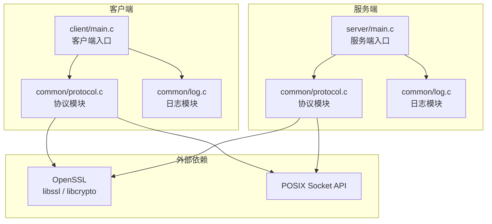
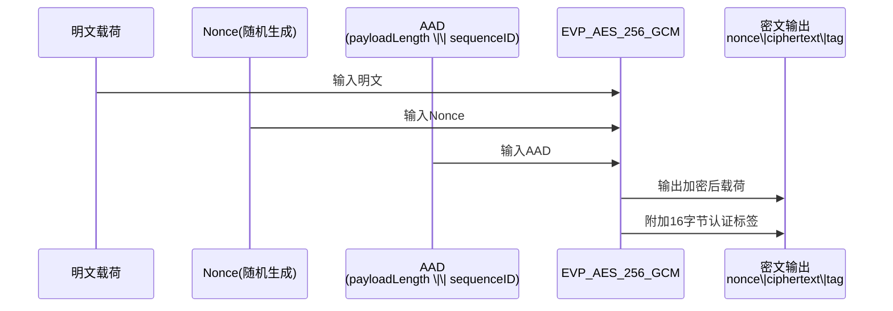

# 项目报告

## 引言

随着局域网内多人协作与娱乐需求的日益增长，构建一个稳定、安全、可扩展的局域网游戏平台具有重要的实践意义。PacPlay项目正是在这一背景下发起的一个局域网内游戏平台项目，旨在为局域网环境下的多人在线互动提供底层网络通信支撑。

本项目采用客户端-服务器（Client/Server）架构，使用C语言开发，以保障运行时的高性能和低资源占用。在网络层，项目基于TCP协议实现可靠传输，并在此基础上设计了专用的二进制应用层协议。考虑到局域网环境中仍可能存在的数据窃听或篡改风险，项目在协议层集成了AES-256-GCM Authenticated Encryption，为传输数据提供机密性与完整性双重保护。此外，项目还配套实现了结构化的日志系统与自动化测试框架，以支持后续的功能迭代与质量保障。

本报告将围绕PacPlay项目的需求分析、系统设计、程序实现、测试验证等方面展开论述，并对项目的现状与改进方向进行总结。

## 需求分析

### 功能需求

1. **可靠网络连接**：服务器端应能够在指定端口监听并接收客户端的TCP连接请求；客户端应能够向指定的服务器地址和端口发起连接，建立稳定的通信链路。

2. **自定义应用层协议**：系统需要定义一套二进制应用层协议，用于封装和解析游戏业务数据。协议应包含消息类型标识、载荷长度、序列号及魔数校验等字段，以支持不同类型的业务消息（如登录请求、聊天、房间创建、游戏启停、心跳等）。

3. **数据序列化与反序列化**：协议模块应提供将内存中的数据包结构序列化为连续字节流的能力，以及将字节流还原为数据包结构的能力，确保数据在网络传输过程中的完整性。

4. **加密传输**：对于敏感数据，系统应支持基于AES-256-GCM的载荷加密。加密过程应使用随机生成的nonce，并将认证标签附加在密文之后；解密过程应验证认证标签，并在验证失败时拒绝数据，防止篡改。

5. **结构化日志记录**：系统应提供分级别的日志输出能力，包括TRACE、DEBUG、INFO、WARN、ERROR、FATAL六个级别，支持输出到标准错误流和自定义文件，并具备线程安全的锁机制扩展接口。

6. **自动化测试**：项目应包含自动化单元测试，覆盖协议常量、结构体布局、序列化/反序列化、加密/解密、网络发送/接收、异常处理等场景，以保障核心模块的正确性。

### 性能需求

1. **协议载荷上限**：单个数据包的载荷长度上限为1024字节，加密后的总附加开销为28字节（12字节nonce + 16字节认证标签），该设计在控制单次网络传输开销的同时满足了常见游戏控制消息的大小需求。

2. **并发处理能力**：服务器端socket监听队列长度（backlog）设置为5，能够应对小规模的局域网并发连接场景。

3. **资源安全**：所有动态分配的内存（如数据包载荷、加密缓冲区）应有明确的释放路径；socket描述符在出错或关闭后应被重置为无效哨兵值，防止重复关闭或悬空引用。

## 系统设计

### 总体设计

PacPlay采用经典的客户端-服务器架构，整体划分为三个源码目录：服务器端（`src/server/`）、客户端（`src/client/`）和公共模块（`src/common/`）。公共模块被独立编译到服务端和客户端各自的构建目录中，避免了因多个入口文件（`main.c`）同时链接而导致的符号冲突。

系统的总体架构如图1所示。



图1 PacPlay总体架构图

从功能模块角度，系统可细分为以下四个核心模块：

- **Socket管理模块**：负责服务器端监听套接字的创建与绑定，以及客户端连接套接字的创建与连接。
- **协议处理模块**：负责数据包的构造、序列化、反序列化、加密、解密、发送和接收。
- **日志模块**：提供多级别、多输出目标的日志记录能力。
- **测试框架模块**：提供轻量级的宏驱动单元测试基础设施。

### 详细设计

#### Socket管理模块

Socket管理模块提供三个公共接口：`serverSetup`、`clientSetup`和`socketClose`。

`serverSetup(uint16_t port)`的工作流程为：调用`socket()`创建TCP流套接字；使用`bind()`将其绑定到指定的IPv4地址与端口；调用`listen()`进入监听状态。若任一环节失败，则输出错误日志，关闭已创建的描述符并返回`NULL_SOCKETFD`。

`clientSetup(const char *serverAddress, uint16_t serverPort)`的工作流程为：创建TCP套接字；使用`inet_pton()`解析服务器IPv4地址；调用`connect()`发起连接。同样，失败时执行清理并返回错误。

`socketClose(SocketFD *socketFD)`在描述符有效（非负）时调用底层`close()`进行关闭，随后将描述符重置为`NULL_SOCKETFD`，确保对无效描述符的重复调用是安全的。

为确保网络发送和接收的完整性，模块内部还实现了`sendAll`和`recvAll`两个辅助函数，分别通过循环调用`send()`和`recv()`，保证在出现短读或短写时能够持续传输直至目标字节数完成。

#### 协议处理模块

协议处理模块是本项目的核心。其设计围绕`Packet`结构展开，该结构由一个`PacketHeader`和一个指向载荷的指针组成。`PacketHeader`使用`#pragma pack(push, 1)`进行紧凑排布，包含以下字段：

| 字段名 | 类型 | 说明 |
| -------- | ------ | ------ |
| magic | uint32_t | 魔数，固定为`0x5050504D`（ASCII "PPPM"） |
| packetType | PacketType | 包类型：明文或AES-256-GCM密文 |
| messageType | MessageType | 消息类型：登录、聊天、房间、游戏、心跳等 |
| payloadLength | size_t | 载荷字节长度 |
| sequenceID | uint32_t | 包序列号 |

协议处理模块的接口及职责如表1所示。

表1 协议处理模块公共接口

| 接口函数 | 功能描述 |
| --------- | --------- |
| `packetSerialize` | 将`Packet`序列化为连续字节缓冲区 |
| `packetDeserialize` | 从字节缓冲区解析出`Packet`（含魔数校验） |
| `packetAESEncrypt` | 使用AES-256-GCM就地加密明文包的载荷 |
| `packetAESDecrypt` | 使用AES-256-GCM就地解密密文包的载荷 |
| `packetSend` | 通过socket先发送包头再发送载荷 |
| `packetRecv` | 从socket先接收包头再按需接收载荷 |
| `packetClear` | 释放包内动态分配的载荷内存 |

加密流程的设计要点如下：每次加密时通过OpenSSL的`RAND_bytes`生成12字节随机nonce；将原始载荷长度与序列号组合为一个64位AAD（Additional Authenticated Data），公式为`AAD = (payloadLength << 32) | sequenceID`；加密完成后，新载荷的格式为`nonce(12B) || ciphertext(NB) || tag(16B)`，并将包类型标记为`AES256GCMPacket`。解密时提取nonce和tag，重建AAD，调用EVP接口进行解密和认证，若认证失败则返回`PROTOCOL_AUTH_FAIL`。

#### 日志模块

日志模块基于第三方轻量库`log.c`实现，采用回调机制支持多路输出。核心数据结构为全局的`logger`状态结构，包含锁函数指针、日志级别、静默开关以及最多32个回调函数槽位。

模块内置两个默认回调：`stdoutCallback`将日志按`HH:MM:SS LEVEL file:line: message`的格式输出到标准错误流；`fileCallback`将日志按`YYYY-MM-DD HH:MM:SS LEVEL file:line: message`的格式输出到指定的文件指针。用户可通过`logAddCallback`注册自定义回调，并通过`logSetLock`注册互斥锁函数以支持多线程环境。

#### 测试框架模块

测试框架以纯宏形式存在于`test_utils.h`中，无需外部依赖。其核心组件包括断言宏（`ASSERT_INT_EQ`、`ASSERT_UINT_EQ`、`ASSERT_TRUE`、`ASSERT_FALSE`、`ASSERT_MEM_EQ`、`ASSERT_STR_EQ`）、测试运行宏（`RUN_TEST`）以及结果报告宏（`TEST_REPORT`）。每个测试文件编译为独立的可执行程序，执行时自动统计通过和失败的用例数。

## 程序实现

### 主要功能实现

#### Socket连接的建立与关闭

服务器端和客户端的初始化逻辑分别封装在`serverSetup`和`clientSetup`中。两个函数都调用内部的`socketOpen`辅助函数来创建基于`AF_INET`和`SOCK_STREAM`的TCP套接字。服务器端使用`INADDR_ANY`绑定到所有可用网络接口，客户端则通过`inet_pton`将点分十进制地址转换为网络字节序的二进制地址。

网络I/O的完整性由`sendAll`和`recvAll`保证。它们在一个`while`循环中持续发送或接收，直到全部目标字节被处理完毕，或者遇到明确的错误（返回值小于等于0）。这种设计避免了在慢速或高负载网络环境下因单次`send`/`recv`未处理全部数据而导致的包截断问题。

#### 数据包的序列化与反序列化

序列化操作`packetSerialize`首先计算总长度（包头大小 + 载荷长度），检查目标缓冲区容量是否足够，然后分两次调用`memcpy`，先将包头复制到缓冲区起始位置，再将载荷复制到包头之后。反序列化操作`packetDeserialize`则从缓冲区头部提取`PacketHeader`，校验魔数`PACKET_MAGIC`，再根据`payloadLength`动态分配内存并复制载荷。

反序列化过程中包含两道安全检查：魔数校验用于识别非本协议数据流；缓冲区总长度校验用于防止因畸形包头声明的`payloadLength`过大而导致的越界读取或内存过度分配。

#### AES-256-GCM加密与解密

加密函数`packetAESEncrypt`首先生成随机nonce并构建AAD，然后调用内部静态函数`encryptAESGCM`完成EVP环境下的初始化、AAD注入、密文生成和认证标签提取。加密成功后，原载荷被释放，替换为新的`nonce || ciphertext || tag`结构，包头中的`packetType`被更新为`AES256GCMPacket`，`payloadLength`同步更新。

解密函数`packetAESDecrypt`执行逆向流程：从载荷中拆分nonce、ciphertext和tag；重建AAD；调用`decryptAESGCM`进行解密和GCM标签验证。若OpenSSL的`EVP_DecryptFinal_ex`返回失败，说明数据被篡改，函数返回`PROTOCOL_AUTH_FAIL`。即使OpenSSL的解密流程返回成功，程序还会额外执行一次AAD重建与比对，确保解密后的长度与原始编码一致。

#### 日志的多级别输出

日志核心入口`logLog`在每次调用时获取当前时间并构造`LogEvent`结构，随后依次执行：上锁、标准错误输出（若未静默且级别满足）、遍历并触发所有已注册回调、解锁。这种设计允许在保持低开销的同时灵活扩展输出目标，例如未来可方便地接入网络日志收集器或系统日志服务。

### 数据结构和算法

#### PacketHeader与Packet结构

`PacketHeader`是协议通信中最基础的数据结构，其定义如下：

```c
typedef struct {
    uint32_t magic;
    PacketType packetType;
    MessageType messageType;
    size_t payloadLength;
    uint32_t sequenceID;
} PacketHeader;
```

通过`#pragma pack(push, 1)`进行字节对齐压制后，该结构体在64位平台上的总大小为确定性值`sizeof(uint32_t) + sizeof(PacketType) + sizeof(MessageType) + sizeof(size_t) + sizeof(uint32_t)`，便于跨平台解析。

`Packet`结构将包头与载荷分离存储：

```c
typedef struct {
    PacketHeader header;
    uint8_t *payload;
} Packet;
```

这种设计的优势在于载荷长度可变，且加密/解密过程中需要原地替换载荷指针时，无需重新分配整个`Packet`结构。

#### AES-256-GCM相关辅助结构

在`protocol.c`内部定义了三个非公开结构以封装加密过程中的临时数据：

- `AESGCMKey`：包含32字节对称密钥和12字节nonce。
- `AESGCMBuffer`：通用字节缓冲区，包含数据指针、容量和当前长度。
- `AESGCMCipher`：在通用缓冲区的基础上附加16字节GCM认证标签。

这些内部结构将OpenSSL的EVP操作细节与公共API解耦，提高了代码的可读性和可维护性。

#### AES-256-GCM算法流程

AES-256-GCM是一种认证加密模式，兼具机密性和完整性保护。其工作流程如图2所示。



图2 AES-256-GCM加密流程示意图

AAD的构造方式将载荷长度左移32位后与序列号按位或，形成一个64位无符号整数。这样做的好处是，任何对包头中`payloadLength`或`sequenceID`的篡改都会在GCM标签验证阶段被发现。

### 程序核心代码

#### Socket可靠收发实现

`sendAll`和`recvAll`是保障数据完整性的核心辅助函数，其实现如下：

```c
static int sendAll(SocketFD socketFD, const void *data, size_t totalLen) {
    const uint8_t *ptr = (const uint8_t *)data;
    size_t remaining = totalLen;

    while (remaining > 0) {
        ssize_t sent = send(socketFD, ptr, remaining, MSG_NOSIGNAL);
        if (sent <= 0) {
            LOG_ERROR("Failed to send data: %s (%d)", strerror(errno), errno);
            return PROTOCOL_FAIL;
        }
        ptr += sent;
        remaining -= (size_t)sent;
    }
    return PROTOCOL_SUCC;
}

static int recvAll(SocketFD socketFD, void *data, size_t totalLen) {
    uint8_t *ptr = (uint8_t *)data;
    size_t remaining = totalLen;

    while (remaining > 0) {
        ssize_t received = recv(socketFD, ptr, remaining, MSG_NOSIGNAL);
        if (received <= 0) {
            LOG_ERROR("Failed to receive data: %s (%d)", strerror(errno), errno);
            return PROTOCOL_FAIL;
        }
        ptr += received;
        remaining -= (size_t)received;
    }
    return PROTOCOL_SUCC;
}
```

上述代码通过循环和指针偏移，确保了在网络环境不稳定时也能完成精确字节数的传输。`MSG_NOSIGNAL`标志用于避免因对端断开连接而产生的`SIGPIPE`信号导致程序异常终止。

#### 数据包序列化与反序列化实现

序列化与反序列化的实现直接操作内存，保证了高效率和协议兼容性：

```c
int packetSerialize(const Packet *packet, uint8_t *buffer, size_t bufferSize,
                    size_t *serializedSize) {
    if (packet == NULL || buffer == NULL || serializedSize == NULL) {
        return PROTOCOL_FAIL;
    }

    size_t totalSize = sizeof(PacketHeader) + packet->header.payloadLength;
    if (bufferSize < totalSize) {
        LOG_ERROR("Serialize buffer too small (%zu < %zu)", bufferSize, totalSize);
        return PROTOCOL_FAIL;
    }

    memcpy(buffer, &packet->header, sizeof(PacketHeader));
    if (packet->header.payloadLength > 0 && packet->payload != NULL) {
        memcpy(buffer + sizeof(PacketHeader), packet->payload,
               packet->header.payloadLength);
    }

    *serializedSize = totalSize;
    return PROTOCOL_SUCC;
}

int packetDeserialize(const uint8_t *buffer, size_t bufferSize,
                      Packet *packet) {
    if (buffer == NULL || packet == NULL || packet->payload != NULL) {
        return PROTOCOL_FAIL;
    }

    if (bufferSize < sizeof(PacketHeader)) {
        LOG_ERROR("Buffer too small for header (%zu < %zu)", bufferSize,
                  sizeof(PacketHeader));
        return PROTOCOL_FAIL;
    }

    memcpy(&packet->header, buffer, sizeof(PacketHeader));

    if (packet->header.magic != PACKET_MAGIC) {
        LOG_ERROR("Invalid packet magic: 0x%08X", packet->header.magic);
        return PROTOCOL_FAIL;
    }

    size_t totalSize = sizeof(PacketHeader) + packet->header.payloadLength;
    if (bufferSize < totalSize) {
        LOG_ERROR("Buffer too small for payload (%zu < %zu)", bufferSize,
                  totalSize);
        return PROTOCOL_FAIL;
    }

    if (packet->header.payloadLength > 0) {
        packet->payload = malloc(packet->header.payloadLength);
        if (packet->payload == NULL) {
            LOG_ERROR("Failed to allocate payload: %s (%d)", strerror(errno),
                      errno);
            return PROTOCOL_FAIL;
        }
        memcpy(packet->payload, buffer + sizeof(PacketHeader),
               packet->header.payloadLength);
    }

    return PROTOCOL_SUCC;
}
```

反序列化中的魔数校验和缓冲区长度校验是防御畸形数据包攻击的关键措施。

#### AES-256-GCM加密实现

`packetAESEncrypt`的加密流程展现了完整的EVP接口调用和载荷替换逻辑：

```c
int packetAESEncrypt(Packet *packet, uint8_t key[AES_GCM_KEY_LEN]) {
    if (packet == NULL || packet->payload == NULL || key == NULL) {
        return PROTOCOL_FAIL;
    }

    if (packet->header.packetType != PlaintextPacket) {
        LOG_ERROR("Cannot encrypt: packet is not PlaintextPacket");
        return PROTOCOL_FAIL;
    }

    if (packet->header.payloadLength > MAX_PAYLOAD_LEN) {
        LOG_ERROR("Payload too large for encryption (%zu > %d)",
                  packet->header.payloadLength, MAX_PAYLOAD_LEN);
        return PROTOCOL_FAIL;
    }

    size_t plaintextLen = packet->header.payloadLength;

    AESGCMKey aesKey;
    memcpy(aesKey.key, key, AES_GCM_KEY_LEN);
    if (RAND_bytes(aesKey.nonce, AES_GCM_NONCE_LEN) != 1) {
        LOG_ERROR_SSL("Failed to generate random nonce");
        return PROTOCOL_FAIL;
    }

    uint64_t aadValue = buildAAD(plaintextLen, packet->header.sequenceID);
    AESGCMBuffer aad = {.data = (uint8_t *)&aadValue,
                        .capacity = AAD_LEN,
                        .len = AAD_LEN};

    AESGCMBuffer plaintext = {.data = packet->payload,
                              .capacity = plaintextLen,
                              .len = plaintextLen};

    AESGCMCipher cipher;
    if (aesGCMBufferInit(&cipher.buffer, plaintextLen) != CIPHER_SUCC) {
        return PROTOCOL_FAIL;
    }

    if (encryptAESGCM(&plaintext, &aad, &aesKey, &cipher) != CIPHER_SUCC) {
        aesGCMBufferDeinit(&cipher.buffer);
        return PROTOCOL_FAIL;
    }

    size_t newPayloadLen =
        AES_GCM_NONCE_LEN + cipher.buffer.len + AES_GCM_TAG_LEN;
    uint8_t *newPayload = malloc(newPayloadLen);
    if (newPayload == NULL) {
        LOG_ERROR("Failed to allocate encrypted payload: %s (%d)",
                  strerror(errno), errno);
        aesGCMBufferDeinit(&cipher.buffer);
        return PROTOCOL_FAIL;
    }

    uint8_t *cursor = newPayload;
    memcpy(cursor, aesKey.nonce, AES_GCM_NONCE_LEN);
    cursor += AES_GCM_NONCE_LEN;
    memcpy(cursor, cipher.buffer.data, cipher.buffer.len);
    cursor += cipher.buffer.len;
    memcpy(cursor, cipher.tag, AES_GCM_TAG_LEN);

    free(packet->payload);
    packet->payload = newPayload;
    packet->header.payloadLength = newPayloadLen;
    packet->header.packetType = AES256GCMPacket;

    aesGCMBufferDeinit(&cipher.buffer);
    return PROTOCOL_SUCC;
}
```

该函数在加密前对输入参数进行多重校验，确保仅对明文包且载荷长度合规的数据进行加密。加密后的载荷采用紧凑排列，将nonce、密文和tag顺序存放，便于接收方直接解析。

## 测试

### 测试环境

测试在以下环境中执行：

- **操作系统**：Linux（64位）
- **编译器**：Clang（支持C17标准）
- **构建工具**：GNU Make（启用`-j$(nproc)`多线程编译）
- **外部依赖**：OpenSSL 3.x（提供`libssl`和`libcrypto`）
- **代码质量工具**：`clang-format`（LLVM风格，4空格缩进）、`clang-tidy`（启用`readability-magic-numbers`、`bugprone-*`、`clang-analyzer-core.*`等严格检查）

测试文件`tests/test_protocol.c`基于项目自研的宏测试框架`tests/test_utils.h`编写，编译为独立可执行程序`bin/tests/test_protocol`。测试运行时通过`make test`命令自动构建并执行。

### 测试用例

#### protocol 通讯协议

测试套件共包含76个测试用例，按功能划分为12个组别。各组别的测试目标、覆盖范围及用例数量如表2所示。

表2 测试用例分类统计

| 组别 | 测试内容 | 用例数量 |
| :----- | :--------- | :--------- |
| 1. Constants & Enums | 魔数、常量、枚举值验证 | 7 |
| 2. PacketHeader Layout | 包头大小、字段偏移、字段读写独立性 | 3 |
| 3. packetClear | 载荷释放、NULL安全、幂等性 | 3 |
| 4. packetSerialize | 正常序列化、NULL参数、缓冲区不足、零载荷、精确边界 | 10 |
| 5. packetDeserialize | 正常反序列化、NULL参数、魔数错误、缓冲区截断、尾随字节忽略 | 9 |
| 6. Serialize / Deserialize Roundtrip | 正向-逆向一致性、最大载荷、二进制载荷（含NUL字节） | 3 |
| 7. packetAESEncrypt | 正常加密、NULL参数、错误包类型、载荷超限、边界值、字段保持 | 8 |
| 8. packetAESDecrypt | NULL参数、错误包类型、密文过短 | 5 |
| 9. AES Encrypt / Decrypt Roundtrip | 加解密一致性、最小/最大载荷、二进制载荷、错误密钥、密文/标签/nonce/序列号篡改、多序列号覆盖、非确定性加密 | 12 |
| 10. Full Pipeline | 序列化-加密-解密-反序列化完整链路 | 1 |
| 11. packetSend / packetRecv | NULL参数、端到端收发、加密包收发、非法魔数拒绝、超限载荷拒绝、对端关闭处理 | 9 |
| 12. socket setup / close | 关闭哨兵值、负FD安全、真实FD关闭、服务端临时端口、客户端无效地址、客户端连接拒绝 | 6 |

以下对每个组别的测试逻辑进行详细说明。

##### Constants & Enums

该组验证协议常量与枚举值的稳定性，确保符号定义与文档一致。具体包括：`PACKET_MAGIC`的数值验证、`MAX_PAYLOAD_LEN`的边界值验证、AES-GCM相关常量（密钥长度32、nonce长度12、认证标签长度16）的验证、`PacketType`与`MessageType`枚举值顺序验证、`NULL_SOCKETFD`哨兵值验证，以及`PROTOCOL_SUCC`、`PROTOCOL_FAIL`、`PROTOCOL_AUTH_FAIL`三个返回码的互异性验证。

##### PacketHeader Layout

该组验证`PacketHeader`在`#pragma pack(push, 1)`作用下的物理布局确定性。具体包括：结构体总大小是否等于各字段大小之和、`offsetof`获取的各字段偏移是否与预期一致、对单个字段写入是否导致相邻字段被污染。

##### packetClear

该组验证`packetClear`的资源释放行为。具体包括：对含动态分配载荷的包调用后`payload`指针是否置为`NULL`、对`payload`已为`NULL`的包调用是否安全（不崩溃）、连续调用两次是否为幂等操作。

##### packetSerialize

该组覆盖序列化函数的正面路径与负面路径。正面路径包括：正常序列化成功并返回正确字节数、包头与载荷内容在缓冲区中的位置验证、零长度载荷序列化、缓冲区大小恰好等于所需大小时的成功边界、 oversized缓冲区中超出的字节不被改写。负面路径包括：`packet`、`buffer`、`serializedSize`任一参数为`NULL`时返回失败、缓冲区不足以容纳包头或载荷时返回失败、缓冲区比所需大小少1字节时返回失败。

##### packetDeserialize

该组覆盖反序列化函数的正面路径与负面路径。正面路径包括：从有效缓冲区成功还原`Packet`并校验所有字段、零载荷包反序列化后`payload`保持`NULL`、缓冲区包含尾随额外字节时仍能正确解析。负面路径包括：`buffer`、`packet`为`NULL`时返回失败、`packet->payload`不为`NULL`时返回失败、缓冲区小于包头大小时返回失败、魔数错误时返回失败、缓冲区不足以容纳声明的载荷时返回失败。

###### Serialize / Deserialize Roundtrip

该组验证序列化与反序列化的组合一致性。具体包括：普通文本载荷的往返一致性、最大长度（1024字节）载荷的往返一致性、包含`0x00`字节的二进制载荷往返一致性，确保序列化过程不会将NUL字节误解释为字符串终止符。

###### packetAESEncrypt

该组覆盖加密函数的参数校验与状态转换。具体包括：正常加密后`packetType`变为`AES256GCMPacket`、`payloadLength`增长`AES_PACKET_EXTRA_LEN`（28字节）、`magic`、`messageType`、`sequenceID`保持不变；`packet`、`key`、`payload`为`NULL`时返回失败；包类型非`PlaintextPacket`时返回失败；载荷长度超过`MAX_PAYLOAD_LEN`时返回失败；载荷长度恰好等于`MAX_PAYLOAD_LEN`时成功（边界测试）。

###### packetAESDecrypt

该组覆盖解密函数的参数校验。具体包括：`packet`、`key`、`payload`为`NULL`时返回失败；包类型非`AES256GCMPacket`时返回失败；加密载荷长度小于`AES_PACKET_EXTRA_LEN`时返回失败。

###### AES Encrypt / Decrypt Roundtrip

该组是测试中对安全性验证最为深入的部分。正面路径包括：普通载荷、1字节最小载荷、1024字节最大载荷、含NUL字节二进制载荷的加解密往返一致性；不同`sequenceID`（0、1、`0x7FFFFFFF`、`0xFFFFFFFF`）下AAD绑定正确性；两次加密相同明文产生不同密文（随机nonce导致的非确定性）。负面路径包括：使用错误密钥解密返回`PROTOCOL_AUTH_FAIL`、翻转密文中任意一位返回`PROTOCOL_AUTH_FAIL`、翻转认证标签中任意一位返回`PROTOCOL_AUTH_FAIL`、翻转nonce中任意一位返回`PROTOCOL_AUTH_FAIL`、修改包头`sequenceID`导致AAD不匹配返回`PROTOCOL_AUTH_FAIL`。

###### Full Pipeline

该组验证从业务数据到网络字节流再还原为业务数据的完整链路。流程为：构造明文包、加密、序列化、反序列化、解密，最终验证所有字段与载荷与原始数据一致。

###### packetSend / packetRecv

该组覆盖基于真实socket的端到端测试。参数校验包括：`packet`为`NULL`或`payload`为`NULL`时`packetSend`失败、`dest`为`NULL`或`dest->payload`不为`NULL`时`packetRecv`失败。正面路径包括：通过`socketpair`创建的本地套接字对进行明文包收发往返、加密包收发往返（接收后解密验证）。负面路径包括：发送错误魔数的包头后`packetRecv`拒绝接收、发送声明载荷超限的包头后`packetRecv`拒绝接收、对端提前关闭连接后`packetRecv`返回失败。

###### socket setup / close

该组验证Socket管理模块的资源安全。具体包括：`socketClose`后描述符被重置为`NULL_SOCKETFD`、对负值描述符调用`socketClose`不崩溃、对真实打开的描述符调用`socketClose`后底层描述符失效（再次`close`返回-1）、`serverSetup`在端口0时成功并绑定到内核分配的临时端口、`clientSetup`对非法地址字符串返回失败、`clientSetup`对未监听的本地端口返回失败（连接被拒绝）。

### 测试结果

全部76个测试用例均通过，未出现失败或异常。测试执行期间的错误日志输出均为测试框架故意触发的负面路径（如缓冲区过小、魔数错误、认证失败等），符合预期。

测试结果汇总如下：

- **通过用例数**：76
- **失败用例数**：0
- **总体状态**：通过

## 结论

### 项目优点

1. **协议设计清晰且安全**：项目定义了结构紧凑的二进制协议，集成了AES-256-GCM认证加密，并通过AAD将载荷长度与序列号绑定，有效防止重放攻击和数据篡改。

2. **代码质量管控严格**：项目配置了`clang-format`和`clang-tidy`，编译标志启用`-Wall -Wextra -Werror`，对魔法数字和潜在Bug模式进行静态检查，保障了代码的规范性和可维护性。

3. **测试覆盖全面**：76个单元测试覆盖了正常流程、边界条件、错误路径及安全场景，为协议模块的可靠性提供了充分保障。

4. **模块化与可扩展性**：公共代码独立编译，服务端与客户端共享同一协议与日志实现，降低了重复代码；日志模块的回调机制为未来接入更多输出通道预留了扩展点。

### 存在的问题

1. **上层业务尚未实现**：当前服务端和客户端的`main.c`仅包含空入口函数，登录、聊天、房间管理、游戏同步等上层业务逻辑尚未落地，项目仍处于底层基础设施阶段。

2. **并发模型待完善**：服务器端目前仅实现了单线程的监听与连接建立，缺乏对多客户端并发处理（如多线程、多进程或事件驱动模型）的支持。

3. **平台兼容性局限**：代码中使用了POSIX特有的`socketpair`和`MSG_NOSIGNAL`等特性，在Windows平台需要额外的适配层。

### 改进方向

1. **引入事件驱动或线程池模型**：建议服务器端采用`epoll`/`kqueue`或线程池架构，以支持高并发客户端连接和消息处理。

2. **完善上层业务协议**：在现有消息类型枚举的基础上，定义各消息类型的载荷格式，并实现登录鉴权、房间状态机、游戏数据同步等逻辑。

3. **增强平台可移植性**：为Windows平台补充Winsock2初始化、关闭函数适配以及`localtime_s`等替代实现。

4. **引入持续集成**：结合GitHub Actions或类似服务，在每次提交时自动执行`make all`、`make test`以及静态分析，确保代码质量持续达标。

## 参考文献

## 附录

### 程序源代码

本附录完整收录项目的全部非测试源代码文件，按路径组织如下。

#### include/protocol.h

```c
/**
 * @file protocol.h
 * @brief PacPlay network protocol definitions and packet operations.
 *
 * @date 2026-05-16
 * @copyright GPLv3 License
 * @section LICENSE
 * PacPlay
 * Copyright (C) 2026 Winston Meursault & Kiraterin
 *
 * This program is free software: you can redistribute it and/or modify
 * it under the terms of the GNU General Public License as published by
 * the Free Software Foundation, either version 3 of the License, or
 * (at your option) any later version.
 *
 * This program is distributed in the hope that it will be useful,
 * but WITHOUT ANY WARRANTY; without even the implied warranty of
 * MERCHANTABILITY or FITNESS FOR A PARTICULAR PURPOSE.  See the
 * GNU General Public License for more details.
 *
 * You should have received a copy of the GNU General Public License
 * along with this program.  If not, see <https: //www.gnu.org/licenses/>.
 */

#ifndef PROTOCOL_H
#define PROTOCOL_H

#include <stdbool.h>
#include <stddef.h>
#include <stdint.h>

#ifdef _WIN32
#include <winsock2.h>
#else
#include <arpa/inet.h>
#endif

#define PROTOCOL_SUCC (0)
#define PROTOCOL_FAIL (-1)
#define PROTOCOL_AUTH_FAIL (-2)

#define MAX_PAYLOAD_LEN 1024

#define AES_GCM_KEY_LEN 32
#define AES_GCM_NONCE_LEN 12
#define AES_GCM_TAG_LEN 16

/** @brief Extra bytes added by AES-256-GCM encryption: nonce + tag. */
#define AES_PACKET_EXTRA_LEN (AES_GCM_NONCE_LEN + AES_GCM_TAG_LEN)

#define BACKLOG 5

/* When the value of a socket fd is NULL_SOCKETFD, the exception should have
   been already handled if any error occurred. */
#define NULL_SOCKETFD (-1)

typedef int SocketFD;

#define PACKET_MAGIC 0x5050504Du // 'PPPM' in ASCII, PacPlay Packet Magic

typedef enum {
    PlaintextPacket = 1,

    AES256GCMPacket
} PacketType;

typedef enum {
    MsgLoginReq = 1,
    MsgLoginResp,

    MsgChat,

    MsgCreateRoom,
    MsgJoinRoom,

    MsgGameStart,
    MsgGameStop,

    MsgHeartbeat
} MessageType;

#pragma pack(push, 1)

typedef struct {
    uint32_t magic;
    PacketType packetType;
    MessageType messageType;
    size_t payloadLength;
    uint32_t sequenceID;
} PacketHeader;

#pragma pack(pop)

typedef struct {
    PacketHeader header;
    uint8_t *payload;
} Packet;

/**
 * @brief Setup a server.
 *
 * @param port The port on which the server to be launched.
 * @return SocketFD The socket FD of the created server, and macro
 *         @c NULL_SOCKETFD when it fails to launch.
 *
 * Setup a server on a given port and return the socket FD and begin listening.
 * It will output error message when it failed to do that. Use function
 * @c socketClose to close the server FD.
 */
SocketFD serverSetup(uint16_t port);

/**
 * @brief Setup a client.
 *
 * @param serverAddress The server address.
 * @param serverPort The server port.
 * @return SocketFD The socket FD of the created client, and macro
 *         @c NULL_SOCKETFD when it fails.
 *
 * Setup a client connecting to a specific server and return the socket FD.
 * It will output error message when it failed to do that. Use function
 * @c socketClose to close the client FD.
 */
SocketFD clientSetup(const char *serverAddress, uint16_t serverPort);

/**
 * @brief Close a socket.
 *
 * @param socketFD A pointer to the socket FD to be closed.
 *
 * Close a socket FD. It will automatically reject to close an illegal
 * socketFD (e.g. @c *socketFD @c == @c -1), hence it's safe not to care about
 * whether the fd is valid.
 */
void socketClose(SocketFD *socketFD);

/**
 * @brief Clear a packet.
 *
 * @param packet The packet to clear.
 *
 * Free the dynamically allocated payload and set the pointer to NULL.
 */
void packetClear(Packet *packet);

/**
 * @brief Serialize a packet into a raw byte buffer.
 *
 * @param packet The packet to serialize.
 * @param buffer The buffer to store the serialized data.
 * @param bufferSize The capacity of @p buffer in bytes.
 * @param serializedSize Output: the number of bytes written to @p buffer.
 * @return @c PROTOCOL_SUCC on success, @c PROTOCOL_FAIL on failure.
 *
 * Writes the packet header followed by the payload into a contiguous byte
 * buffer. No encryption is performed; call @c packetAESEncrypt beforehand
 * if encryption is needed.
 */
int packetSerialize(const Packet *packet, uint8_t *buffer, size_t bufferSize,
                    size_t *serializedSize);

/**
 * @brief Deserialize a raw byte buffer into a packet.
 *
 * @param buffer The buffer containing the serialized packet.
 * @param bufferSize The size of @p buffer in bytes.
 * @param packet The packet to populate. @c packet->payload MUST be NULL.
 * @return @c PROTOCOL_SUCC on success, @c PROTOCOL_FAIL on failure.
 *
 * Reads the packet header from the buffer, validates the magic number, then
 * allocates and copies the payload. Call @c packetClear to free the payload
 * when done.
 */
int packetDeserialize(const uint8_t *buffer, size_t bufferSize, Packet *packet);

/**
 * @brief Encrypt a packet in-place using AES-256-GCM.
 *
 * @param packet The plaintext packet to encrypt. Must have
 *               @c packetType @c == @c PlaintextPacket.
 * @param key    The 32-byte AES-256-GCM key.
 * @return @c PROTOCOL_SUCC on success, @c PROTOCOL_FAIL on failure.
 *
 * Encrypts the payload, replacing it with the encrypted form:
 * @c nonce(12B) @c || @c ciphertext @c || @c tag(16B). The nonce is randomly
 * generated. AAD is a @c uint64_t formed by @c (payloadLength @c << @c 32)
 * @c | @c sequenceID. On success, @c packetType is set to @c AES256GCMPacket
 * and @c payloadLength is updated accordingly.
 */
int packetAESEncrypt(Packet *packet, uint8_t key[AES_GCM_KEY_LEN]);

/**
 * @brief Decrypt a packet in-place using AES-256-GCM.
 *
 * @param packet The encrypted packet to decrypt. Must have
 *               @c packetType @c == @c AES256GCMPacket.
 * @param key    The 32-byte AES-256-GCM key.
 * @return @c PROTOCOL_SUCC on success, @c PROTOCOL_FAIL on internal failure,
 *         @c PROTOCOL_AUTH_FAIL if authentication tag verification fails or
 *         the AAD does not match the decrypted content.
 *
 * Parses @c nonce, @c ciphertext, and @c tag from the payload, then decrypts.
 * On success, @c packetType is restored to @c PlaintextPacket and
 * @c payloadLength is updated to the original plaintext length.
 */
int packetAESDecrypt(Packet *packet, uint8_t key[AES_GCM_KEY_LEN]);

/**
 * @brief Send a packet over a socket.
 *
 * @param packet A pointer to the packet to send. @c packet->payload must not
 *               be NULL.
 * @param socketFD The socket FD through which the packet is sent.
 * @return @c PROTOCOL_SUCC on success, @c PROTOCOL_FAIL on failure.
 *
 * Sends the packet header followed by the payload. Handles partial writes
 * internally until the entire packet is transmitted.
 */
int packetSend(Packet *packet, SocketFD socketFD);

/**
 * @brief Receive a packet from a socket.
 *
 * @param dest A pointer to the packet to populate. @c dest->payload MUST be
 *             NULL.
 * @param socketFD The socket FD from which to receive.
 * @return @c PROTOCOL_SUCC on success, @c PROTOCOL_FAIL on failure.
 *
 * Receives the packet header first, validates magic and payload length, then
 * allocates and receives the payload. Call @c packetClear to free the payload
 * when done.
 */
int packetRecv(Packet *dest, SocketFD socketFD);

#endif /* PROTOCOL_H */
```

#### include/log.h

```c
/**
 * Copyright (c) 2020 rxi
 *
 * This library is free software; you can redistribute it and/or modify it
 * under the terms of the MIT license. See `log.c` for details.
 */

#ifndef LOG_H
#define LOG_H

#include <stdarg.h>
#include <stdbool.h>
#include <stdio.h>
#include <time.h>

/**
 * @brief Severity levels for log messages.
 *
 * Levels are ordered from least severe (LogLevelTrace) to most severe
 * (LogLevelFatal). The global log level acts as a filter: only messages
 * at or above the configured level are emitted.
 */
typedef enum {
    LogLevelTrace, /**< Fine-grained diagnostic information. */
    LogLevelDebug, /**< Debugging information useful during development. */
    LogLevelInfo,  /**< Informational messages highlighting progress. */
    LogLevelWarn,  /**< Potentially harmful situations. */
    LogLevelError, /**< Error events that might still allow continued running.
                    */
    LogLevelFatal  /**< Severe error events that will presumably abort. */
} LogLevel;

/**
 * @brief Context passed to every logging callback.
 *
 * Populated by logLog() before each callback invocation. The @c ap field
 * is valid only for the duration of the callback.
 */
typedef struct {
    va_list ap;       /**< Variable argument list for the format string. */
    const char *fmt;  /**< printf-style format string. */
    const char *file; /**< Source file name of the log call site. */
    struct tm time;   /**< Local time at the moment of the log call. */
    void *udata;      /**< User data associated with this callback. */
    int line;         /**< Source line number of the log call site. */
    LogLevel level;   /**< Severity level of this log event. */
} LogEvent;

/**
 * @brief Signature for logging callback functions.
 *
 * @param ev Pointer to the LogEvent describing the current log message.
 */
typedef void (*LogLogFn)(LogEvent *ev);

/**
 * @brief Signature for the lock/unlock callback used for thread safety.
 *
 * @param lock @c true to acquire the lock, @c false to release it.
 * @param udata Opaque user data passed during logSetLock() registration.
 */
typedef void (*LogLockFn)(bool lock, void *udata);

/**
 * @brief Return the human-readable name of a log level.
 *
 * @param level The log level to convert.
 * @return const char* A static string such as "TRACE", "DEBUG", ..., "FATAL",
 *                     or "UNKNOWN" if @p level is out of range.
 *
 * The returned pointer references static storage and must not be freed.
 */
const char *logLevelString(LogLevel level);

/**
 * @brief Register a lock/unlock function for thread-safe logging.
 *
 * @param fn  The lock callback, or @c NULL to disable locking.
 * @param udata Opaque pointer forwarded to @p fn on each call.
 *
 * When set, the library calls @p fn(true, udata) before writing and
 * @p fn(false, udata) after writing, allowing the caller to serialise
 * access with a mutex or similar primitive.
 */
void logSetLock(LogLockFn fn, void *udata);

/**
 * @brief Set the minimum log level for stderr output.
 *
 * @param level Messages below this level are suppressed.
 *
 * The default level is LogLevelTrace (everything is printed).
 */
void logSetLevel(LogLevel level);

/**
 * @brief Enable or disable stderr output.
 *
 * @param enable @c true to suppress all stderr output, @c false to re-enable.
 *
 * When quiet mode is enabled, the built-in stderr callback is skipped.
 * Registered file and custom callbacks are unaffected.
 */
void logSetQuiet(bool enable);

/**
 * @brief Register a custom logging callback.
 *
 * @param fn    The callback function invoked for each qualifying log event.
 * @param udata Opaque pointer stored and forwarded to @p fn via LogEvent.
 * @param level Minimum level required to trigger this callback.
 * @return int  0 on success, -1 if the callback table is full.
 *
 * Up to 32 callbacks may be registered simultaneously. Each callback has
 * its own independent level filter.
 */
int logAddCallback(LogLogFn fn, void *udata, LogLevel level);

/**
 * @brief Register a FILE* as a log destination.
 *
 * @param fp    An open FILE pointer (e.g. from fopen()).
 * @param level Minimum level required to write to this file.
 * @return int  0 on success, -1 if the callback table is full.
 *
 * Convenience wrapper around logAddCallback() that uses an internal
 * file-writing callback. Each log line is flushed immediately.
 */
int logAddFp(FILE *fp, LogLevel level);

/**
 * @brief Emit a log message.
 *
 * @param level Severity level of the message.
 * @param file  Source file name (typically passed via __FILE__).
 * @param line  Source line number (typically passed via __LINE__).
 * @param fmt   printf-style format string.
 * @param ...   Format arguments.
 *
 * This is the core logging entry point. The LOG_TRACE .. LOG_FATAL
 * convenience macros expand to calls to this function with the correct
 * file and line filled in automatically.
 */
void logLog(LogLevel level, const char *file, int line, const char *fmt, ...);

/** @brief Log a message at TRACE level. */
#define LOG_TRACE(...) logLog(LogLevelTrace, __FILE__, __LINE__, __VA_ARGS__)
/** @brief Log a message at DEBUG level. */
#define LOG_DEBUG(...) logLog(LogLevelDebug, __FILE__, __LINE__, __VA_ARGS__)
/** @brief Log a message at INFO level. */
#define LOG_INFO(...)  logLog(LogLevelInfo,  __FILE__, __LINE__, __VA_ARGS__)
/** @brief Log a message at WARN level. */
#define LOG_WARN(...)  logLog(LogLevelWarn,  __FILE__, __LINE__, __VA_ARGS__)
/** @brief Log a message at ERROR level. */
#define LOG_ERROR(...) logLog(LogLevelError, __FILE__, __LINE__, __VA_ARGS__)
/** @brief Log a message at FATAL level. */
#define LOG_FATAL(...) logLog(LogLevelFatal, __FILE__, __LINE__, __VA_ARGS__)

#endif
```

#### src/common/protocol.c

```c
/**
 * @file protocol.c
 * @brief PacPlay network protocol implementation.
 *
 * @date 2026-05-16
 * @copyright GPLv3 License
 * @section LICENSE
 * PacPlay
 * Copyright (C) 2026 Winston Meursault & Kiraterin
 *
 * This program is free software: you can redistribute it and/or modify
 * it under the terms of the GNU General Public License as published by
 * the Free Software Foundation, either version 3 of the License, or
 * (at your option) any later version.
 *
 * This program is distributed in the hope that it will be useful,
 * but WITHOUT ANY WARRANTY; without even the implied warranty of
 * MERCHANTABILITY or FITNESS FOR A PARTICULAR PURPOSE.  See the
 * GNU General Public License for more details.
 *
 * You should have received a copy of the GNU General Public License
 * along with this program.  If not, see <https: //www.gnu.org/licenses/>.
 */

#include "protocol.h"
#include "log.h"
#include "utils.h"
#include <errno.h>
#include <openssl/err.h>
#include <openssl/evp.h>
#include <openssl/rand.h>
#include <stdbool.h>
#include <stdlib.h>
#include <string.h>
#include <unistd.h>

/* ───────────────────────── internal constants ──────────────────────────── */

#define CIPHER_SUCC (0)
#define CIPHER_FAIL (-1)
#define CIPHER_AUTH_FAIL (-2)

/** @brief Size of the AAD used for AES-GCM packet encryption. */
#define AAD_LEN (sizeof(uint64_t))

/** @brief Number of bits to shift payloadLength when building the AAD. */
#define AAD_PAYLOAD_SHIFT 32

/* ───────────────────────── internal types ───────────────────────────────── */

/** @brief AES-256-GCM key material: symmetric key + per-message nonce. */
typedef struct {
    uint8_t key[AES_GCM_KEY_LEN];
    uint8_t nonce[AES_GCM_NONCE_LEN];
} AESGCMKey;

/** @brief General-purpose byte buffer with capacity tracking. */
typedef struct {
    uint8_t *data;
    size_t capacity;
    size_t len;
} AESGCMBuffer;

/** @brief Ciphertext buffer with appended authentication tag. */
typedef struct {
    AESGCMBuffer buffer;
    uint8_t tag[AES_GCM_TAG_LEN];
} AESGCMCipher;

/* ──────────── OpenSSL error-logging helper ──────────────────────────────── */

#define LOG_ERROR_SSL(msg)                                                     \
    do {                                                                       \
        unsigned long errCode = ERR_get_error();                               \
        LOG_ERROR(msg ": %s (SSLERR:%lu)", ERR_reason_error_string(errCode),   \
                  errCode);                                                    \
    } while (false)

/* ──────────────────────── AESGCMBuffer helpers ─────────────────────────── */

/**
 * @brief Allocate an AESGCMBuffer with the given capacity.
 *
 * @param buf      Buffer to initialise.
 * @param capacity Number of bytes to allocate.
 * @return @c CIPHER_SUCC on success, @c CIPHER_FAIL on allocation failure.
 */
static int aesGCMBufferInit(AESGCMBuffer *buf, size_t capacity) {
    buf->data = malloc(capacity);
    buf->capacity = capacity;
    buf->len = 0;
    if (buf->data == NULL) {
        LOG_ERROR("Failed to allocate memory for AESGCM buffer: %s (%d)",
                  strerror(errno), errno);
        return CIPHER_FAIL;
    }
    return CIPHER_SUCC;
}

/**
 * @brief Free the memory held by an AESGCMBuffer.
 *
 * @param buf Buffer to deinitialise.
 */
static void aesGCMBufferDeinit(AESGCMBuffer *buf) {
    free(buf->data);
    buf->data = NULL;
}

/* ───────────────────── AES-256-GCM encrypt / decrypt ───────────────────── */

/**
 * @brief Encrypt plaintext using AES-256-GCM.
 *
 * @param plaintext Input plaintext buffer.
 * @param aad       Additional authenticated data, or NULL if unused.
 * @param key       Encryption key and nonce.
 * @param output    Output ciphertext and authentication tag.
 *                  Caller must pre-allocate @c output->buffer.data with at
 *                  least @c plaintext->len bytes.
 * @return @c CIPHER_SUCC on success, @c CIPHER_FAIL on failure.
 */
static int encryptAESGCM(const AESGCMBuffer *plaintext, const AESGCMBuffer *aad,
                         const AESGCMKey *key, AESGCMCipher *output) {
    if (plaintext == NULL || key == NULL || output == NULL ||
        output->buffer.data == NULL) {
        return CIPHER_FAIL;
    }

    if (output->buffer.capacity < plaintext->len) {
        LOG_ERROR(
            "Output buffer capacity too small (%zu(capacity) < %zu(length))",
            output->buffer.capacity, plaintext->len);
        return CIPHER_FAIL;
    }

    EVP_CIPHER_CTX *ctx = EVP_CIPHER_CTX_new();
    if (ctx == NULL) {
        LOG_ERROR_SSL("Failed to create EVP_CIPHER_CTX");
        return CIPHER_FAIL;
    }

    int32_t len = 0;
    int ret = CIPHER_FAIL;

    if (EVP_EncryptInit_ex(ctx, EVP_aes_256_gcm(), NULL, NULL, NULL) != 1) {
        LOG_ERROR_SSL("Failed to initialize AES-256-GCM encryption");
        goto cleanup;
    }

    if (EVP_CIPHER_CTX_ctrl(ctx, EVP_CTRL_GCM_SET_IVLEN, AES_GCM_NONCE_LEN,
                            NULL) != 1) {
        LOG_ERROR_SSL("Failed to set GCM nonce length");
        goto cleanup;
    }

    if (EVP_EncryptInit_ex(ctx, NULL, NULL, key->key, key->nonce) != 1) {
        LOG_ERROR_SSL("Failed to set AES-GCM key and nonce");
        goto cleanup;
    }

    /* Feed AAD (authenticated but not encrypted). */
    if (aad != NULL && aad->len > 0) {
        if (EVP_EncryptUpdate(ctx, NULL, &len, aad->data, (int32_t)aad->len) !=
            1) {
            LOG_ERROR_SSL("Failed to set AAD for AES-GCM encryption");
            goto cleanup;
        }
    }

    if (EVP_EncryptUpdate(ctx, output->buffer.data, &len, plaintext->data,
                          (int32_t)plaintext->len) != 1) {
        LOG_ERROR_SSL("Failed to encrypt plaintext");
        goto cleanup;
    }
    output->buffer.len = (size_t)len;

    if (EVP_EncryptFinal_ex(ctx, output->buffer.data + len, &len) != 1) {
        LOG_ERROR_SSL("Failed to finalize AES-GCM encryption");
        goto cleanup;
    }

    if (EVP_CIPHER_CTX_ctrl(ctx, EVP_CTRL_GCM_GET_TAG, AES_GCM_TAG_LEN,
                            output->tag) != 1) {
        LOG_ERROR_SSL("Failed to get AES-GCM authentication tag");
        goto cleanup;
    }

    ret = CIPHER_SUCC;

cleanup:
    EVP_CIPHER_CTX_free(ctx);
    return ret;
}

/**
 * @brief Decrypt ciphertext using AES-256-GCM.
 *
 * @param cipher    Input ciphertext, length, and authentication tag.
 * @param aad       Additional authenticated data, or NULL if unused.
 *                  Must match the AAD used during encryption.
 * @param key       Decryption key and nonce.
 * @param plaintext Output plaintext buffer. Caller must pre-allocate
 *                  @c plaintext->data with at least @c cipher->buffer.len
 *                  bytes.
 * @return @c CIPHER_SUCC on success, @c CIPHER_FAIL on internal failure,
 *         @c CIPHER_AUTH_FAIL on authentication tag verification failure.
 */
static int decryptAESGCM(const AESGCMCipher *cipher, const AESGCMBuffer *aad,
                         const AESGCMKey *key, AESGCMBuffer *plaintext) {
    if (cipher == NULL || key == NULL || plaintext == NULL ||
        plaintext->data == NULL) {
        return CIPHER_FAIL;
    }

    if (plaintext->capacity < cipher->buffer.len) {
        LOG_ERROR(
            "Output buffer capacity too small (%zu(capacity) < %zu(length))",
            plaintext->capacity, cipher->buffer.len);
        return CIPHER_FAIL;
    }

    EVP_CIPHER_CTX *ctx = EVP_CIPHER_CTX_new();
    if (ctx == NULL) {
        LOG_ERROR_SSL("Failed to create EVP_CIPHER_CTX");
        return CIPHER_FAIL;
    }

    int32_t len = 0;
    int ret = CIPHER_FAIL;

    if (EVP_DecryptInit_ex(ctx, EVP_aes_256_gcm(), NULL, NULL, NULL) != 1) {
        LOG_ERROR_SSL("Failed to initialize AES-256-GCM decryption");
        goto cleanup;
    }

    if (EVP_CIPHER_CTX_ctrl(ctx, EVP_CTRL_GCM_SET_IVLEN, AES_GCM_NONCE_LEN,
                            NULL) != 1) {
        LOG_ERROR_SSL("Failed to set GCM nonce length");
        goto cleanup;
    }

    if (EVP_DecryptInit_ex(ctx, NULL, NULL, key->key, key->nonce) != 1) {
        LOG_ERROR_SSL("Failed to set AES-GCM key and nonce");
        goto cleanup;
    }

    /* Feed AAD (must match what was used during encryption). */
    if (aad != NULL && aad->len > 0) {
        if (EVP_DecryptUpdate(ctx, NULL, &len, aad->data, (int32_t)aad->len) !=
            1) {
            LOG_ERROR_SSL("Failed to set AAD for AES-GCM decryption");
            goto cleanup;
        }
    }

    if (EVP_DecryptUpdate(ctx, plaintext->data, &len, cipher->buffer.data,
                          (int32_t)cipher->buffer.len) != 1) {
        LOG_ERROR_SSL("Failed to decrypt ciphertext");
        goto cleanup;
    }
    plaintext->len = (size_t)len;

    if (EVP_CIPHER_CTX_ctrl(ctx, EVP_CTRL_GCM_SET_TAG, AES_GCM_TAG_LEN,
                            (void *)(uintptr_t)cipher->tag) != 1) {
        LOG_ERROR_SSL("Failed to set AES-GCM authentication tag");
        goto cleanup;
    }

    if (EVP_DecryptFinal_ex(ctx, plaintext->data + len, &len) != 1) {
        LOG_ERROR_SSL("AES-GCM tag verification failed");
        EVP_CIPHER_CTX_free(ctx);
        return CIPHER_AUTH_FAIL;
    }

    ret = CIPHER_SUCC;

cleanup:
    EVP_CIPHER_CTX_free(ctx);
    return ret;
}

/* ──────────────────── AAD helper ───────────────────────────────────────── */

/**
 * @brief Build the AAD value for AES-GCM packet encryption.
 *
 * The AAD is a single @c uint64_t: @c (payloadLength @c << @c 32) @c |
 * @c sequenceID.
 *
 * @param payloadLength The plaintext payload length (before encryption).
 * @param sequenceID    The packet sequence ID.
 * @return The AAD as a @c uint64_t.
 */
static uint64_t buildAAD(size_t payloadLength, uint32_t sequenceID) {
    return ((uint64_t)payloadLength << AAD_PAYLOAD_SHIFT) |
           (uint64_t)sequenceID;
}

/* ─────────────────── socket helpers ────────────────────────────────────── */

/**
 * @brief Open a TCP socket.
 *
 * @return SocketFD FD of the opened socket or @c NULL_SOCKETFD when failed.
 */
static SocketFD socketOpen(void) {
    SocketFD socketFD = socket(AF_INET, SOCK_STREAM, IPPROTO_TCP);
    if (socketFD == -1) {
        LOG_ERROR("Failed to create socket file descriptor: %s (%d)",
                  strerror(errno), errno);
        socketClose(&socketFD);
        return NULL_SOCKETFD;
    }
    return socketFD;
}

/**
 * @brief Send exactly @p totalLen bytes from @p data over @p socketFD.
 *
 * @param socketFD The socket to write to.
 * @param data     Pointer to the data.
 * @param totalLen Number of bytes to send.
 * @return @c PROTOCOL_SUCC on success, @c PROTOCOL_FAIL on failure.
 */
static int sendAll(SocketFD socketFD, const void *data, size_t totalLen) {
    const uint8_t *ptr = (const uint8_t *)data;
    size_t remaining = totalLen;

    while (remaining > 0) {
        ssize_t sent = send(socketFD, ptr, remaining, MSG_NOSIGNAL);
        if (sent <= 0) {
            LOG_ERROR("Failed to send data: %s (%d)", strerror(errno), errno);
            return PROTOCOL_FAIL;
        }
        ptr += sent;
        remaining -= (size_t)sent;
    }
    return PROTOCOL_SUCC;
}

/**
 * @brief Receive exactly @p totalLen bytes into @p data from @p socketFD.
 *
 * @param socketFD The socket to read from.
 * @param data     Pointer to the destination buffer.
 * @param totalLen Number of bytes to receive.
 * @return @c PROTOCOL_SUCC on success, @c PROTOCOL_FAIL on failure.
 */
static int recvAll(SocketFD socketFD, void *data, size_t totalLen) {
    uint8_t *ptr = (uint8_t *)data;
    size_t remaining = totalLen;

    while (remaining > 0) {
        ssize_t received = recv(socketFD, ptr, remaining, MSG_NOSIGNAL);
        if (received <= 0) {
            LOG_ERROR("Failed to receive data: %s (%d)", strerror(errno),
                      errno);
            return PROTOCOL_FAIL;
        }
        ptr += received;
        remaining -= (size_t)received;
    }
    return PROTOCOL_SUCC;
}

/* ────────────────────── public API: sockets ─────────────────────────────── */

SocketFD serverSetup(uint16_t port) {
    struct sockaddr_in sockAddr;

    SocketFD socketFD = socketOpen();
    if (socketFD == NULL_SOCKETFD) {
        goto cleanup;
    }

    memset(&sockAddr, 0, sizeof(sockAddr));
    sockAddr.sin_family = AF_INET;
    sockAddr.sin_port = htons(port);
    sockAddr.sin_addr.s_addr = htonl(INADDR_ANY);

    if (bind(socketFD, (struct sockaddr *)&sockAddr, sizeof(sockAddr)) < 0) {
        LOG_ERROR("Failed to bind socket file descriptor with address: %s (%d)",
                  strerror(errno), errno);
        goto cleanup;
    }

    if (listen(socketFD, BACKLOG) == -1) {
        LOG_ERROR("Failed to listen on port %d: %s (%d)", port, strerror(errno),
                  errno);
        goto cleanup;
    }

    return socketFD;

cleanup:
    socketClose(&socketFD);
    return NULL_SOCKETFD;
}

SocketFD clientSetup(const char *serverAddress, uint16_t serverPort) {
    struct sockaddr_in serverSockAddr;

    SocketFD socketFD = socketOpen();
    if (socketFD == NULL_SOCKETFD) {
        return NULL_SOCKETFD;
    }

    serverSockAddr.sin_family = AF_INET;
    serverSockAddr.sin_port = htons(serverPort);
    switch (inet_pton(AF_INET, serverAddress, &serverSockAddr.sin_addr)) {
    case 0:
        LOG_ERROR("Unknown address: %s", serverAddress);
        goto cleanup;
    case -1:
        LOG_ERROR("Unable to parse address: %s (%d)", strerror(errno), errno);
        goto cleanup;
    default:
        break;
    }

    if (connect(socketFD, (struct sockaddr *)&serverSockAddr,
                sizeof(struct sockaddr)) == -1) {
        LOG_ERROR("Cannot connect to the server %s:%d: %s (%d)", serverAddress,
                  serverPort, strerror(errno), errno);
        goto cleanup;
    }

    return socketFD;

cleanup:
    socketClose(&socketFD);
    return NULL_SOCKETFD;
}

void socketClose(SocketFD *socketFD) {
    if (*socketFD >= 0) {
        int32_t result;
#ifdef _WIN32
        result = closesocket(*socketFD);
#else
        result = close(*socketFD);
#endif
        if (result < 0) {
            LOG_ERROR("Failed to close socket FD: %s (%d)", strerror(errno),
                      errno);
        }
    }
    *socketFD = NULL_SOCKETFD;
}

/* ──────────────────── public API: packet lifecycle ──────────────────────── */

void packetClear(Packet *packet) {
    free(packet->payload);
    packet->payload = NULL;
}

/* ──────────────── public API: serialize / deserialize ───────────────────── */

int packetSerialize(const Packet *packet, uint8_t *buffer, size_t bufferSize,
                    size_t *serializedSize) {
    if (packet == NULL || buffer == NULL || serializedSize == NULL) {
        return PROTOCOL_FAIL;
    }

    size_t totalSize = sizeof(PacketHeader) + packet->header.payloadLength;
    if (bufferSize < totalSize) {
        LOG_ERROR("Serialize buffer too small (%zu < %zu)", bufferSize,
                  totalSize);
        return PROTOCOL_FAIL;
    }

    /* Copy header, then payload. */
    memcpy(buffer, &packet->header, sizeof(PacketHeader));
    if (packet->header.payloadLength > 0 && packet->payload != NULL) {
        memcpy(buffer + sizeof(PacketHeader), packet->payload,
               packet->header.payloadLength);
    }

    *serializedSize = totalSize;
    return PROTOCOL_SUCC;
}

int packetDeserialize(const uint8_t *buffer, size_t bufferSize,
                      Packet *packet) {
    if (buffer == NULL || packet == NULL || packet->payload != NULL) {
        return PROTOCOL_FAIL;
    }

    if (bufferSize < sizeof(PacketHeader)) {
        LOG_ERROR("Buffer too small for header (%zu < %zu)", bufferSize,
                  sizeof(PacketHeader));
        return PROTOCOL_FAIL;
    }

    /* Read header. */
    memcpy(&packet->header, buffer, sizeof(PacketHeader));

    if (packet->header.magic != PACKET_MAGIC) {
        LOG_ERROR("Invalid packet magic: 0x%08X", packet->header.magic);
        return PROTOCOL_FAIL;
    }

    size_t totalSize = sizeof(PacketHeader) + packet->header.payloadLength;
    if (bufferSize < totalSize) {
        LOG_ERROR("Buffer too small for payload (%zu < %zu)", bufferSize,
                  totalSize);
        return PROTOCOL_FAIL;
    }

    /* Allocate and copy payload. */
    if (packet->header.payloadLength > 0) {
        packet->payload = malloc(packet->header.payloadLength);
        if (packet->payload == NULL) {
            LOG_ERROR("Failed to allocate payload: %s (%d)", strerror(errno),
                      errno);
            return PROTOCOL_FAIL;
        }
        memcpy(packet->payload, buffer + sizeof(PacketHeader),
               packet->header.payloadLength);
    }

    return PROTOCOL_SUCC;
}

/* ──────────────── public API: AES-256-GCM encrypt / decrypt ────────────── */

int packetAESEncrypt(Packet *packet, uint8_t key[AES_GCM_KEY_LEN]) {
    if (packet == NULL || packet->payload == NULL || key == NULL) {
        return PROTOCOL_FAIL;
    }

    if (packet->header.packetType != PlaintextPacket) {
        LOG_ERROR("Cannot encrypt: packet is not PlaintextPacket");
        return PROTOCOL_FAIL;
    }

    if (packet->header.payloadLength > MAX_PAYLOAD_LEN) {
        LOG_ERROR("Payload too large for encryption (%zu > %d)",
                  packet->header.payloadLength, MAX_PAYLOAD_LEN);
        return PROTOCOL_FAIL;
    }

    size_t plaintextLen = packet->header.payloadLength;

    /* 1. Generate random nonce and build key material. */
    AESGCMKey aesKey;
    memcpy(aesKey.key, key, AES_GCM_KEY_LEN);
    if (RAND_bytes(aesKey.nonce, AES_GCM_NONCE_LEN) != 1) {
        LOG_ERROR_SSL("Failed to generate random nonce");
        return PROTOCOL_FAIL;
    }

    /* 2. Build AAD: (payloadLength << 32) | sequenceID. */
    uint64_t aadValue = buildAAD(plaintextLen, packet->header.sequenceID);
    AESGCMBuffer aad = {.data = (uint8_t *)&aadValue,
                        .capacity = AAD_LEN,
                        .len = AAD_LEN};

    /* 3. Prepare plaintext buffer (references existing payload, no copy). */
    AESGCMBuffer plaintext = {.data = packet->payload,
                              .capacity = plaintextLen,
                              .len = plaintextLen};

    /* 4. Allocate ciphertext output buffer. */
    AESGCMCipher cipher;
    if (aesGCMBufferInit(&cipher.buffer, plaintextLen) != CIPHER_SUCC) {
        return PROTOCOL_FAIL;
    }

    /* 5. Encrypt. */
    if (encryptAESGCM(&plaintext, &aad, &aesKey, &cipher) != CIPHER_SUCC) {
        aesGCMBufferDeinit(&cipher.buffer);
        return PROTOCOL_FAIL;
    }

    /* 6. Build new flat payload: nonce(12) || ciphertext(N) || tag(16). */
    size_t newPayloadLen =
        AES_GCM_NONCE_LEN + cipher.buffer.len + AES_GCM_TAG_LEN;
    uint8_t *newPayload = malloc(newPayloadLen);
    if (newPayload == NULL) {
        LOG_ERROR("Failed to allocate encrypted payload: %s (%d)",
                  strerror(errno), errno);
        aesGCMBufferDeinit(&cipher.buffer);
        return PROTOCOL_FAIL;
    }

    uint8_t *cursor = newPayload;
    memcpy(cursor, aesKey.nonce, AES_GCM_NONCE_LEN);
    cursor += AES_GCM_NONCE_LEN;
    memcpy(cursor, cipher.buffer.data, cipher.buffer.len);
    cursor += cipher.buffer.len;
    memcpy(cursor, cipher.tag, AES_GCM_TAG_LEN);

    /* 7. Replace old payload with encrypted payload. */
    free(packet->payload);
    packet->payload = newPayload;
    packet->header.payloadLength = newPayloadLen;
    packet->header.packetType = AES256GCMPacket;

    aesGCMBufferDeinit(&cipher.buffer);
    return PROTOCOL_SUCC;
}

int packetAESDecrypt(Packet *packet, uint8_t key[AES_GCM_KEY_LEN]) {
    if (packet == NULL || packet->payload == NULL || key == NULL) {
        return PROTOCOL_FAIL;
    }

    if (packet->header.packetType != AES256GCMPacket) {
        LOG_ERROR("Cannot decrypt: packet is not AES256GCMPacket");
        return PROTOCOL_FAIL;
    }

    if (packet->header.payloadLength < AES_PACKET_EXTRA_LEN) {
        LOG_ERROR("Encrypted payload too short (%zu < %d)",
                  packet->header.payloadLength, AES_PACKET_EXTRA_LEN);
        return PROTOCOL_FAIL;
    }

    /* 1. Parse flat payload: nonce(12) || ciphertext(N) || tag(16). */
    size_t ciphertextLen =
        packet->header.payloadLength - AES_PACKET_EXTRA_LEN;
    uint8_t *payloadPtr = packet->payload;

    uint8_t nonce[AES_GCM_NONCE_LEN];
    memcpy(nonce, payloadPtr, AES_GCM_NONCE_LEN);
    payloadPtr += AES_GCM_NONCE_LEN;

    /* Ciphertext starts at payloadPtr, length = ciphertextLen. */
    uint8_t *ciphertextPtr = payloadPtr;
    payloadPtr += ciphertextLen;

    uint8_t tag[AES_GCM_TAG_LEN];
    memcpy(tag, payloadPtr, AES_GCM_TAG_LEN);

    /* 2. Build key material from the provided key and extracted nonce. */
    AESGCMKey aesKey;
    memcpy(aesKey.key, key, AES_GCM_KEY_LEN);
    memcpy(aesKey.nonce, nonce, AES_GCM_NONCE_LEN);

    /* 3. Reconstruct AAD: original payloadLength == ciphertextLen. */
    uint64_t aadValue = buildAAD(ciphertextLen, packet->header.sequenceID);
    AESGCMBuffer aad = {.data = (uint8_t *)&aadValue,
                        .capacity = AAD_LEN,
                        .len = AAD_LEN};

    /* 4. Set up cipher input (references existing payload, no extra copy). */
    AESGCMCipher cipher;
    cipher.buffer.data = ciphertextPtr;
    cipher.buffer.capacity = ciphertextLen;
    cipher.buffer.len = ciphertextLen;
    memcpy(cipher.tag, tag, AES_GCM_TAG_LEN);

    /* 5. Allocate plaintext output buffer. */
    AESGCMBuffer plaintext;
    if (aesGCMBufferInit(&plaintext, ciphertextLen) != CIPHER_SUCC) {
        return PROTOCOL_FAIL;
    }

    /* 6. Decrypt. If tag verification fails, return authentication error. */
    int decryptRet = decryptAESGCM(&cipher, &aad, &aesKey, &plaintext);
    if (decryptRet == CIPHER_AUTH_FAIL) {
        LOG_ERROR("Decryption authentication failed: AAD or payload tampered");
        aesGCMBufferDeinit(&plaintext);
        return PROTOCOL_AUTH_FAIL;
    }
    if (decryptRet != CIPHER_SUCC) {
        aesGCMBufferDeinit(&plaintext);
        return PROTOCOL_FAIL;
    }

    /* 7. Post-decryption AAD verification: ensure the decrypted length
     *    matches what was encoded in the AAD. */
    uint64_t verifyAAD = buildAAD(plaintext.len, packet->header.sequenceID);
    if (verifyAAD != aadValue) {
        LOG_ERROR("Post-decryption AAD mismatch");
        aesGCMBufferDeinit(&plaintext);
        return PROTOCOL_AUTH_FAIL;
    }

    /* 8. Replace encrypted payload with decrypted plaintext. */
    free(packet->payload);
    packet->payload = plaintext.data;
    packet->header.payloadLength = plaintext.len;
    packet->header.packetType = PlaintextPacket;

    /* Do NOT call aesGCMBufferDeinit here; ownership transferred to packet. */
    return PROTOCOL_SUCC;
}

/* ──────────────────── public API: send / recv ──────────────────────────── */

int packetSend(Packet *packet, SocketFD socketFD) {
    if (packet == NULL || packet->payload == NULL) {
        return PROTOCOL_FAIL;
    }

    /* Send header first, then payload — Packet is not contiguous in memory. */
    if (sendAll(socketFD, &packet->header, sizeof(PacketHeader)) !=
        PROTOCOL_SUCC) {
        return PROTOCOL_FAIL;
    }

    if (sendAll(socketFD, packet->payload, packet->header.payloadLength) !=
        PROTOCOL_SUCC) {
        return PROTOCOL_FAIL;
    }

    return PROTOCOL_SUCC;
}

int packetRecv(Packet *dest, SocketFD socketFD) {
    if (dest == NULL || dest->payload != NULL) {
        return PROTOCOL_FAIL;
    }

    /* Receive header. */
    if (recvAll(socketFD, &dest->header, sizeof(PacketHeader)) !=
        PROTOCOL_SUCC) {
        return PROTOCOL_FAIL;
    }

    /* Validate magic. */
    if (dest->header.magic != PACKET_MAGIC) {
        LOG_ERROR("Received invalid packet magic: 0x%08X", dest->header.magic);
        return PROTOCOL_FAIL;
    }

    /* Validate payload length based on packet type. */
    size_t maxLen = (dest->header.packetType == AES256GCMPacket)
                        ? MAX_PAYLOAD_LEN + AES_PACKET_EXTRA_LEN
                        : MAX_PAYLOAD_LEN;
    if (dest->header.payloadLength > maxLen) {
        LOG_ERROR("Payload length exceeds limit (%zu > %zu)",
                  dest->header.payloadLength, maxLen);
        return PROTOCOL_FAIL;
    }

    /* Allocate and receive payload. */
    dest->payload = malloc(dest->header.payloadLength);
    if (dest->payload == NULL) {
        LOG_ERROR("Failed to allocate payload: %s (%d)", strerror(errno),
                  errno);
        return PROTOCOL_FAIL;
    }

    if (recvAll(socketFD, dest->payload, dest->header.payloadLength) !=
        PROTOCOL_SUCC) {
        free(dest->payload);
        dest->payload = NULL;
        return PROTOCOL_FAIL;
    }

    return PROTOCOL_SUCC;
}
```

#### src/common/log.c

```c
/*
 * Copyright (c) 2020 rxi
 *
 * Permission is hereby granted, free of charge, to any person obtaining a copy
 * of this software and associated documentation files (the "Software"), to
 * deal in the Software without restriction, including without limitation the
 * rights to use, copy, modify, merge, publish, distribute, sublicense, and/or
 * sell copies of the Software, and to permit persons to whom the Software is
 * furnished to do so, subject to the following conditions:
 *
 * The above copyright notice and this permission notice shall be included in
 * all copies or substantial portions of the Software.
 *
 * THE SOFTWARE IS PROVIDED "AS IS", WITHOUT WARRANTY OF ANY KIND, EXPRESS OR
 * IMPLIED, INCLUDING BUT NOT LIMITED TO THE WARRANTIES OF MERCHANTABILITY,
 * FITNESS FOR A PARTICULAR PURPOSE AND NONINFRINGEMENT. IN NO EVENT SHALL THE
 * AUTHORS OR COPYRIGHT HOLDERS BE LIABLE FOR ANY CLAIM, DAMAGES OR OTHER
 * LIABILITY, WHETHER IN AN ACTION OF CONTRACT, TORT OR OTHERWISE, ARISING
 * FROM, OUT OF OR IN CONNECTION WITH THE SOFTWARE OR THE USE OR OTHER DEALINGS
 * IN THE SOFTWARE.
 */

#include "log.h"

/** @brief Maximum number of simultaneously registered logging callbacks. */
#define MAX_CALLBACKS 32
/** @brief Buffer size for short time strings (HH:MM:SS). */
#define TIME_BUF_SIZE 16
/** @brief Buffer size for full datetime strings (YYYY-MM-DD HH:MM:SS). */
#define DATETIME_BUF_SIZE 64

/**
 * @brief Internal representation of a registered callback entry.
 */
typedef struct {
    LogLogFn fn;    /**< The callback function. */
    void *udata;    /**< Opaque user data forwarded via LogEvent. */
    LogLevel level; /**< Minimum severity to trigger this callback. */
} Callback;

/** @brief Global logger state (file-scoped). */
static struct {
    void *udata;                       /**< User data for the lock function. */
    LogLockFn lock;                    /**< Lock/unlock callback. */
    LogLevel level;                    /**< Minimum level for stderr output. */
    bool quiet;                        /**< Suppress stderr when true. */
    Callback callbacks[MAX_CALLBACKS]; /**< Registered callback table. */
} logger;

/** @brief Human-readable names indexed by LogLevel. */
static const char *levelStrings[] = {"TRACE", "DEBUG", "INFO",
                                     "WARN",  "ERROR", "FATAL"};

#ifdef LOG_USE_COLOR
/** @brief ANSI colour escape sequences indexed by LogLevel. */
static const char *levelColors[] = {"\x1b[94m", "\x1b[36m", "\x1b[32m",
                                    "\x1b[33m", "\x1b[31m", "\x1b[35m"};
#endif

/**
 * @brief Thread-safe wrapper around localtime.
 *
 * @param t      Pointer to the calendar time to convert.
 * @param result Pointer to a struct tm that receives the broken-down time.
 * @return struct tm* @p result on success, or @c NULL on failure.
 *
 * Delegates to localtime_s on MSVC and localtime_r on POSIX, ensuring
 * no shared static buffer is used.
 */
static struct tm *safeLocaltime(const time_t *t, struct tm *result) {
#if defined(_MSC_VER)
    return localtime_s(result, t) == 0 ? result : NULL;
#else
    return localtime_r(t, result);
#endif
}

/**
 * @brief Built-in callback that writes log messages to stderr.
 *
 * @param ev Pointer to the current log event.
 *
 * Formats the message as "HH:MM:SS LEVEL file:line: message\n".
 * When LOG_USE_COLOR is defined, ANSI escape codes are used for
 * coloured level names and dimmed source locations.
 */
static void stdoutCallback(LogEvent *ev) {
    char buf[TIME_BUF_SIZE];
    buf[strftime(buf, sizeof(buf), "%H:%M:%S", &ev->time)] = '\0';
#ifdef LOG_USE_COLOR
    fprintf((FILE *)ev->udata, "%s %s%-5s\x1b[0m \x1b[90m%s:%d:\x1b[0m ", buf,
            levelColors[ev->level], levelStrings[ev->level], ev->file,
            ev->line);
#else
    fprintf((FILE *)ev->udata, "%s %-5s %s:%d: ", buf, levelStrings[ev->level],
            ev->file, ev->line);
#endif
    vfprintf((FILE *)ev->udata, ev->fmt, ev->ap);
    fprintf((FILE *)ev->udata, "\n");
    fflush((FILE *)ev->udata);
}

/**
 * @brief Built-in callback that writes log messages to a file.
 *
 * @param ev Pointer to the current log event.
 *
 * Formats the message as "YYYY-MM-DD HH:MM:SS LEVEL file:line: message\n".
 * Each line is flushed immediately to avoid data loss on crash.
 */
static void fileCallback(LogEvent *ev) {
    char buf[DATETIME_BUF_SIZE];
    buf[strftime(buf, sizeof(buf), "%Y-%m-%d %H:%M:%S", &ev->time)] = '\0';
    fprintf((FILE *)ev->udata, "%s %-5s %s:%d: ", buf, levelStrings[ev->level],
            ev->file, ev->line);
    vfprintf((FILE *)ev->udata, ev->fmt, ev->ap);
    fprintf((FILE *)ev->udata, "\n");
    fflush((FILE *)ev->udata);
}

/**
 * @brief Acquire the logger lock if a lock function is registered.
 *
 * No-op when no lock callback has been set via logSetLock().
 */
static void loggerLock(void) {
    if (logger.lock) {
        logger.lock(true, logger.udata);
    }
}

/**
 * @brief Release the logger lock if a lock function is registered.
 *
 * No-op when no lock callback has been set via logSetLock().
 */
static void loggerUnlock(void) {
    if (logger.lock) {
        logger.lock(false, logger.udata);
    }
}

const char *logLevelString(LogLevel level) {
    if (level < LogLevelTrace || level > LogLevelFatal) {
        return "UNKNOWN";
    }
    return levelStrings[level];
}

void logSetLock(LogLockFn fn, void *udata) {
    logger.lock = fn;
    logger.udata = udata;
}

void logSetLevel(LogLevel level) { logger.level = level; }

void logSetQuiet(bool enable) { logger.quiet = enable; }

int logAddCallback(LogLogFn fn, void *udata, LogLevel level) {
    for (int i = 0; i < MAX_CALLBACKS; i++) {
        if (!logger.callbacks[i].fn) {
            logger.callbacks[i] = (Callback){fn, udata, level};
            return 0;
        }
    }
    return -1;
}

int logAddFp(FILE *fp, LogLevel level) {
    return logAddCallback(fileCallback, fp, level);
}

/**
 * @brief Initialise a LogEvent with callback-specific user data.
 *
 * @param ev    Pointer to the log event to initialise.
 * @param udata Opaque user data to attach (typically a FILE*).
 */
static void initEvent(LogEvent *ev, void *udata) { ev->udata = udata; }

void logLog(LogLevel level, const char *file, int line, const char *fmt, ...) {
    time_t t = time(NULL);
    struct tm timeInfo = {0};
    safeLocaltime(&t, &timeInfo);

    LogEvent ev = {
        .fmt = fmt,
        .file = file,
        .line = line,
        .level = level,
        .time = timeInfo,
    };

    loggerLock();

    if (!logger.quiet && level >= logger.level) {
        initEvent(&ev, stderr);
        va_start(ev.ap, fmt);
        stdoutCallback(&ev);
        va_end(ev.ap);
    }

    for (int i = 0; i < MAX_CALLBACKS && logger.callbacks[i].fn; i++) {
        Callback *cb = &logger.callbacks[i];
        if (level >= cb->level) {
            initEvent(&ev, cb->udata);
            va_start(ev.ap, fmt);
            cb->fn(&ev);
            va_end(ev.ap);
        }
    }

    loggerUnlock();
}
```

#### src/common/utils.h

```c
/**
 * @file utils.h
 * @brief 
 * 
 * @date 2026-05-17
 * @copyright GPLv3 License
 * @section LICENSE
 * PacPlay
 * Copyright (C) 2026 Winston Meursault & Kiraterin
 * 
 * This program is free software: you can redistribute it and/or modify
 * it under the terms of the GNU General Public License as published by
 * the Free Software Foundation, either version 3 of the License, or
 * (at your option) any later version.
 * 
 * This program is distributed in the hope that it will be useful,
 * but WITHOUT ANY WARRANTY; without even the implied warranty of
 * MERCHANTABILITY or FITNESS FOR A PARTICULAR PURPOSE.  See the
 * GNU General Public License for more details.
 * 
 * You should have received a copy of the GNU General Public License
 * along with this program.  If not, see <https: //www.gnu.org/licenses/>.
 */

#ifndef UTILS_H
#define UTILS_H

#define MAX(a, b) ((a) > (b) ? (a) : (b))
#define MIN(a, b) ((a) < (b) ? (a) : (b))

#endif /* UTILS_H */
```

#### src/server/main.c

```c
/**
 * @file main.c
 * @brief
 *
 * @date 2026-05-16
 * @copyright GPLv3 License
 * @section LICENSE
 * PacPlay
 * Copyright (C) 2026 Winston Meursault & Kiraterin
 *
 * This program is free software: you can redistribute it and/or modify
 * it under the terms of the GNU General Public License as published by
 * the Free Software Foundation, either version 3 of the License, or
 * (at your option) any later version.
 *
 * This program is distributed in the hope that it will be useful,
 * but WITHOUT ANY WARRANTY; without even the implied warranty of
 * MERCHANTABILITY or FITNESS FOR A PARTICULAR PURPOSE.  See the
 * GNU General Public License for more details.
 *
 * You should have received a copy of the GNU General Public License
 * along with this program.  If not, see <https: //www.gnu.org/licenses/>.
 */

#include "protocol.h"

int main() { return 0; }
```

#### src/client/main.c

```c
/**
 * @file main.c
 * @brief
 *
 * @date 2026-05-16
 * @copyright GPLv3 License
 * @section LICENSE
 * PacPlay
 * Copyright (C) 2026 Winston Meursault & Kiraterin
 *
 * This program is free software: you can redistribute it and/or modify
 * it under the terms of the GNU General Public License as published by
 * the Free Software Foundation, either version 3 of the License, or
 * (at your option) any later version.
 *
 * This program is distributed in the hope that it will be useful,
 * but WITHOUT ANY WARRANTY; without even the implied warranty of
 * MERCHANTABILITY or FITNESS FOR A PARTICULAR PURPOSE.  See the
 * GNU General Public License for more details.
 *
 * You should have received a copy of the GNU General Public License
 * along with this program.  If not, see <https: //www.gnu.org/licenses/>.
 */

#include "protocol.h"

int main() { return 0; }
```

### 测试数据

测试文件`tests/test_protocol.c`中使用的关键测试数据如下：

1. **样本文本载荷**：`"Hello, PacPlay!"`

2. **AES-256-GCM测试密钥（32字节）**：

   `
   0x00, 0x01, 0x02, 0x03, 0x04, 0x05, 0x06, 0x07,
   0x08, 0x09, 0x0A, 0x0B, 0x0C, 0x0D, 0x0E, 0x0F,
   0x10, 0x11, 0x12, 0x13, 0x14, 0x15, 0x16, 0x17,
   0x18, 0x19, 0x1A, 0x1B, 0x1C, 0x1D, 0x1E, 0x1F
   `

3. **错误密钥（用于认证失败测试，32字节）**：

   `
   0xFF, 0xFE, 0xFD, 0xFC, 0xFB, 0xFA, 0xF9, 0xF8,
   0xF7, 0xF6, 0xF5, 0xF4, 0xF3, 0xF2, 0xF1, 0xF0,
   0xEF, 0xEE, 0xED, 0xEC, 0xEB, 0xEA, 0xE9, 0xE8,
   0xE7, 0xE6, 0xE5, 0xE4, 0xE3, 0xE2, 0xE1, 0xE0
   `

4. **最大载荷数据**：长度为1024字节，全部填充为`0xAB`或`0xCD`，用于测试边界条件下的序列化和加密一致性。

5. **二进制载荷（含NUL字节）**：`{0x00, 0x01, 0x00, 0xFF, 0xAB, 0x00, 0xCD, 0xEF, 0x00, 0x42, 0x00, 0x99, 0x00, 0x00, 0x77, 0x88}`，用于验证序列化和加密过程不会错误地将NUL字节解释为字符串终止符。
