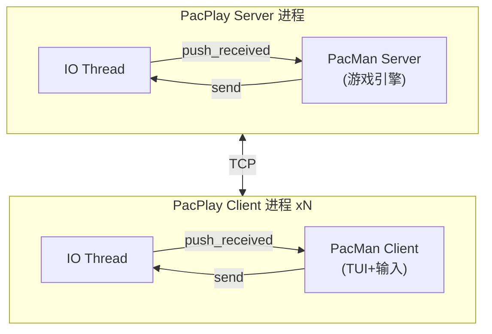

# PacMan 多人游戏 — 设计方案

> 日期: 2026-06-17
> 状态: 已确认

## 1. 概述

在 PacPlay 平台上实现一个支持多人对战的经典 PacMan（吃豆人）游戏。玩家在迷宫地图中竞速吃豆，同时躲避 AI 幽灵。游戏通过 PacPlay SDK 实现客户端-服务端通信。

## 2. 架构

PacMan 由两个独立可执行程序组成：

- **pacman_server** — 通过 `pacplay_srv_*` SDK 运行在 PacPlay Server 侧，是游戏权威状态机。负责地图生成、游戏循环、幽灵 AI、分数追踪。
- **pacman_client** — 通过 `pacplay_cli_*` SDK 运行在 PacPlay Client 侧，负责终端渲染和键盘输入捕获。

PacPlay IO Thread 负责 `MsgGamePayload`（type 37）的加密/解密和网络传输。游戏层只处理 Payload 内容，不关心网络细节。



## 3. 游戏规则

### 3.1 基本规则
- 地图: 40×20 迷宫网格
- 豆子: ~120个普通豆 (+10分) + 4个能量豆 (+50分，使幽灵恐惧 5秒)
- 生命: 每位玩家 3 条命，被幽灵碰到扣 1 命并短暂无敌
- 幽灵 AI: 4只幽灵，每只独立运行四状态机（巡逻/追击/恐惧/返回）

### 3.2 结束条件
- 3 分钟时间限制到达
- 或所有豆子被吃完
- 吃豆最多者获胜（同分时比较存活状态）

### 3.3 玩家交互
- 最大 4 名玩家同场竞技
- 玩家在 4 个角落随机出生
- 幽灵从地图中央巢穴出生
- 被幽灵碰到 → 扣命，短暂无敌期不扣命
- 能量豆生效期间，玩家碰到幽灵可吃掉幽灵 (+200分)

## 4. 通信协议

### 4.1 消息类型

| 消息 | 方向 | 结构体 | 说明 |
|------|------|--------|------|
| Join | C→S | `PacManJoinMsg` | 玩家加入游戏 |
| Move | C→S | `PacManMoveMsg` | 方向键输入 |
| Start | S→C | `PacManStartMsg` | 游戏开始，含完整地图 |
| State | S→C | `PacManStateMsg` | 每帧状态快照 |
| GameOver | S→C | `PacManGameOverMsg` | 游戏结束排名 |

### 4.2 设计原则
- 全量快照：每帧（~100ms）广播完整地图 + 所有玩家/幽灵状态，约 1KB/帧
- 二进制固定结构体，`#pragma pack(push, 1)`
- 所有结构体定义在 `pacman_common.h`

## 5. 地图设计

- 40×20 网格，外围墙壁包围
- 预设迷宫布局（参考经典 PacMan 地图改编）
- 路径格子随机分布约 120 个普通豆 + 4 个能量豆
- 4 个角落为玩家出生点
- 地图中央为幽灵巢穴（4格区域）

## 6. 幽灵 AI

每只幽灵独立运行四状态机：

| 状态 | 行为 | 算法 | 触发条件 |
|------|------|------|---------|
| 巡逻 | 随机游走 | 随机选可行方向 | 默认 |
| 追击 | 追最近玩家 | BFS 最短路径 | 定时切换 |
| 恐惧 | 随机逃跑 | 随机选方向，移速减半 | 能量豆激活 |
| 返回 | 回巢穴 | BFS 最短路径 | 被吃后复活 |

幽灵 AI 在服务端计算，客户端只做渲染。

## 7. 服务端游戏循环

每 100ms 一帧：
1. `pacplay_srv_poll()` — 收集所有客户端输入
2. 更新玩家位置（墙壁碰撞检测）
3. 更新幽灵 AI 状态机
4. 检测吃豆（玩家位置重合 → 加分、移除豆子）
5. 检测玩家-幽灵碰撞（扣命/吃鬼）
6. 广播 `PacManStateMsg` 给所有玩家
7. 检查结束条件并广播 `PacManGameOverMsg`

## 8. 客户端游戏循环

主循环：
1. `pacplay_cli_poll()` — 接收服务端状态
2. 非阻塞读取键盘输入 → 发送 `PacManMoveMsg`
3. 渲染：清屏 → 地图 → 豆子 → 玩家 → 幽灵 → HUD
4. 帧率控制匹配 100ms 周期

## 9. 文件结构

```
tests/test_games/PacMan/
├── common/
│   ├── pacman_common.h    # 常量、枚举、消息结构体
│   └── pacman_common.c    # 共享工具函数
├── server/
│   ├── pacman_server.h    # 服务端游戏引擎 API
│   └── pacman_server.c    # 地图生成、游戏循环、幽灵 AI
├── client/
│   ├── pacman_client.h    # 客户端 API
│   └── pacman_client.c    # TUI 渲染、键盘输入、SDK 交互
└── Makefile               # 独立构建
```

## 10. 构建

独立 Makefile，不修改项目主 Makefile：
- `pacman_server` — 链接 `libpacplay_server_sdk.so` + `libpthread`
- `pacman_client` — 链接 `libpacplay_client_sdk.so` + `libpthread`
- 编译器: clang, 标志: `-Wall -Wextra -Werror -g -Iinclude -Isrc -Isdk/include`

## 11. 测试策略

- `test_pacman_common.c` — 消息结构体布局验证、序列化/反序列化、边界条件
- `test_pacman_server.c` — 地图生成、碰撞检测、幽灵 AI 行为、游戏结束逻辑
- `test_pacman_client.c` — 渲染逻辑、输入解析、状态更新
- 所有测试遵循 PacPlay 测试哲学（对抗性、边界优先、属性不变式）
