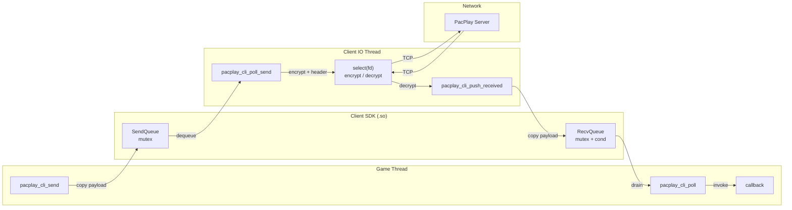
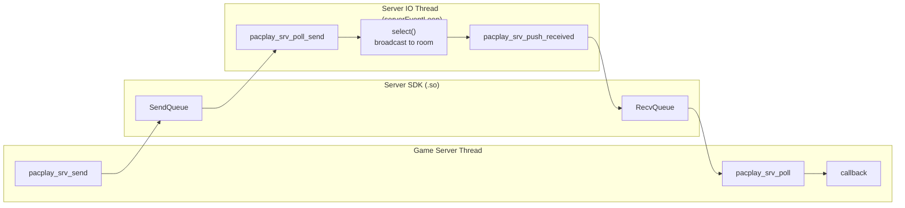

# PacPlay SDK 文档

---

## 1. 概述

PacPlay SDK（`libpacplay_client_sdk.so` / `libpacplay_server_sdk.so`）是面向游戏开发者的 C 语言动态链接库，用于在游戏线程与 PacPlay IO 线程之间提供**线程安全的 Payload 收发桥接**。

### 1.1 SDK 职责边界

| SDK 负责                           | SDK 不负责        |
| ---------------------------------- | ----------------- |
| 线程安全环形缓冲区（mutex + cond） | 网络 I/O          |
| 游戏 Payload 的拷贝与传递          | 协议封包/包头构造 |
| 回调注册与触发                     | AES-GCM 加密/解密 |
| 资源生命周期管理                   | Socket 管理       |

SDK 不持有 socket、不处理加密、不构造 `PacketHeader`。这些由 PacPlay Client/Server 本体的 IO Thread 完成。

### 1.2 两端 SDK

| SDK        | 输出文件                             | 运行位置            |
| ---------- | ------------------------------------ | ------------------- |
| Client SDK | `sdk/lib/libpacplay_client_sdk.so` | PacPlay Client 进程 |
| Server SDK | `sdk/lib/libpacplay_server_sdk.so` | PacPlay Server 进程 |

两端 API 完全对称，仅函数名前缀不同（`pacplay_cli_*` vs `pacplay_srv_*`）。

---

## 2. 架构

### 2.1 Client 端



### 2.2 Server 端



### 2.3 数据流

**发送路径**：

1. 游戏线程调用 `pacplay_*_send(data, len)`——SDK 内部 `malloc` + `memcpy` 拷贝 payload
2. IO Thread 调用 `pacplay_*_poll_send()` 取出——IO Thread 负责加密、打包、发送

**接收路径**：

1. IO Thread 收到游戏消息后调用 `pacplay_*_push_received(data, len)`——SDK 内部拷贝
2. 游戏线程每帧调用 `pacplay_*_poll()`——SDK 排空接收队列，对每条消息触发回调

---

## 3. 快速开始

### 3.1 编译 SDK

```bash
cd PacPlay
make sdk
```

输出：

```
sdk/lib/libpacplay_client_sdk.so
sdk/lib/libpacplay_server_sdk.so
```

### 3.2 链接到项目

```makefile
# 链接 Client SDK
LDFLAGS += -Lpath/to/sdk/lib -lpacplay_client_sdk
LDFLAGS += -Wl,-rpath,path/to/sdk/lib

# 链接 Server SDK
LDFLAGS += -Lpath/to/sdk/lib -lpacplay_server_sdk
LDFLAGS += -Wl,-rpath,path/to/sdk/lib
```

编译时需添加 SDK 头文件路径：

```makefile
CFLAGS += -Ipath/to/sdk/include
```

---

## 4. API 参考

### 4.1 公共类型

```c
/* 不透明句柄。由 pacplay_*_create() 分配，由 pacplay_*_destroy() 释放。 */
typedef struct PacPlaySDK PacPlaySDK;

/* 接收回调签名。
 *   payload  — 游戏 payload 数据（SDK 拥有, 回调内只读）
 *   len      — payload 字节长度
 *   userData — pacplay_*_on_receive() 注册的透传指针 */
typedef void (*PacPlayOnReceive)(const void *payload, size_t len,
                                 void *userData);
```

### 4.2 Client SDK API

#### 生命周期

**`PacPlaySDK *pacplay_cli_create(void)`**

创建 Client SDK 实例。内部分配队列和互斥锁。

- **返回**：新句柄，分配失败返回 `NULL`
- **线程**：任意

**`void pacplay_cli_destroy(PacPlaySDK *sdk)`**

销毁实例。排空并释放所有队列中的 payload，销毁互斥锁，释放内存。传入 `NULL` 安全（no-op）。

- **警告**：调用后调用者须将句柄置 `NULL`。重复传入同一已释放指针是未定义行为。
- **线程**：任意

---

#### 游戏线程 API

**`int pacplay_cli_send(PacPlaySDK *sdk, const void *data, size_t len)`**

将游戏 payload 推入发送队列。SDK 内部拷贝数据，调用者可立即释放 `data`。

- **返回**：`0` 成功，`-1` 失败（`sdk == NULL`、`data == NULL`、`len == 0`、`len > 65536`、分配失败）
- **阻塞**：否
- **线程**：游戏线程

**`void pacplay_cli_on_receive(PacPlaySDK *sdk, PacPlayOnReceive callback, void *userData)`**

注册接收回调。回调在 `pacplay_cli_poll()` 中被调用。传入 `callback = NULL` 可清除回调。

- **线程**：游戏线程

**`void pacplay_cli_poll(PacPlaySDK *sdk)`**

排空接收队列，对每条消息调用已注册的回调。应在游戏主循环每帧调用。回调执行期间不持有互斥锁（支持回调内再次调用 SDK 函数）。

- **线程**：游戏线程

---

#### Client IO Thread API

> 仅 PacPlay Client IO Thread 内部调用。游戏开发者不应直接使用。

**`bool pacplay_cli_poll_send(PacPlaySDK *sdk, uint8_t **outPayload, size_t *outLen)`**

从发送队列取出一条待发送的游戏 payload。

- **返回**：`true` 取出成功，`false` 队列空或参数非法
- **释放**：使用后必须调用 `pacplay_cli_free_payload()` 释放 `*outPayload`
- **线程**：Client IO Thread

**`void pacplay_cli_push_received(PacPlaySDK *sdk, const uint8_t *payload, size_t len)`**

将收到的游戏 payload 推入接收队列，供 `pacplay_cli_poll()` 消费。

- **线程**：Client IO Thread

**`void pacplay_cli_free_payload(PacPlaySDK *sdk, uint8_t *payload)`**

释放 `pacplay_cli_poll_send()` 返回的 payload 内存。`payload = NULL` 安全。

- **线程**：Client IO Thread

---

**`int pacplay_cli_request_start_server(PacPlaySDK *sdk, uint32_t gameId, const char *platform)`**

请求 Client IO 线程向 Server 发送 `MsgGameStartReq`，通知服务端加载并运行对应游戏的服务端动态链接库。

游戏在 `pacplayMain` 中调用此函数。函数将 `gameId` 和 `platform` 打包为内部控制消息推入 SDK 发送队列，Client IO 线程识别后发送对应协议包而非普通游戏 payload。

- **参数**：
  | 参数       | 说明                                                 |
  | ---------- | ---------------------------------------------------- |
  | `sdk`    | Client SDK 句柄                                      |
  | `gameId` | 服务端上注册的游戏唯一 ID                             |
  | `platform` | 目标服务端平台标识（如 `"linux-x86_64"`），NUL 结尾，最长 15 字符 |

- **返回**：`0` 成功入队，`-1` 失败（`sdk == NULL`、`platform == NULL`、分配失败、队列满）
- **阻塞**：否
- **线程**：游戏线程

---

### 4.3 Server SDK API

Server SDK 与 Client SDK API 完全对称，函数名前缀为 `pacplay_srv_`。`pacplay_cli_request_start_server` 为 Client 端独有功能，Server SDK 无需对应函数。

| Client SDK                      | Server SDK                      | 说明                      |
| ------------------------------- | ------------------------------- | ------------------------- |
| `pacplay_cli_create()`        | `pacplay_srv_create()`        | 创建实例                  |
| `pacplay_cli_destroy()`       | `pacplay_srv_destroy()`       | 销毁实例                  |
| `pacplay_cli_send()`          | `pacplay_srv_send()`          | 发送 payload              |
| `pacplay_cli_on_receive()`    | `pacplay_srv_on_receive()`    | 注册回调                  |
| `pacplay_cli_poll()`          | `pacplay_srv_poll()`          | 排空接收队列              |
| `pacplay_cli_poll_send()`     | `pacplay_srv_poll_send()`     | IO 线程取待发送数据       |
| `pacplay_cli_push_received()` | `pacplay_srv_push_received()` | IO 线程推入接收数据       |
| `pacplay_cli_free_payload()`  | `pacplay_srv_free_payload()`  | 释放 poll_send 返回的内存 |
| `pacplay_cli_request_start_server()` | —                         | 请求启动服务端游戏（仅Client） |

行为完全一致，仅前缀不同。

---

## 5. 使用示例

### 5.1 游戏客户端

```c
#include "pacplay_sdk.h"
#include <stdio.h>
#include <string.h>

/* 接收回调：服务器推送的游戏数据 */
static void onGameMessage(const void *payload, size_t len, void *userData) {
    (void)userData;
    printf("[Game] received %zu bytes from server\n", len);
}

int main(void) {
    /* 1. 创建 SDK 实例 */
    PacPlaySDK *sdk = pacplay_cli_create();
    if (sdk == NULL) {
        return 1;
    }

    /* 2. 注册接收回调 */
    pacplay_cli_on_receive(sdk, onGameMessage, NULL);

    /* 3. 游戏主循环 */
    int running = 1;
    while (running) {
        /* 3a. 处理接收到的消息 */
        pacplay_cli_poll(sdk);

        /* 3b. 发送游戏数据 */
        const char *msg = "player_move";
        pacplay_cli_send(sdk, msg, strlen(msg));

        /* 3c. 游戏逻辑 ... */
    }

    /* 4. 清理 */
    pacplay_cli_destroy(sdk);
    sdk = NULL;
    return 0;
}
```

### 5.2 游戏服务端

```c
#include "pacplay_sdk.h"
#include <stdio.h>
#include <string.h>

static void onGameServerMessage(const void *payload, size_t len,
                                void *userData) {
    (void)userData;
    printf("[Server] received %zu bytes from client\n", len);
}

int main(void) {
    PacPlaySDK *sdk = pacplay_srv_create();
    if (sdk == NULL) {
        return 1;
    }

    pacplay_srv_on_receive(sdk, onGameServerMessage, NULL);

    int running = 1;
    while (running) {
        pacplay_srv_poll(sdk);

        const char *state = "world_state";
        pacplay_srv_send(sdk, state, strlen(state));
    }

    pacplay_srv_destroy(sdk);
    sdk = NULL;
    return 0;
}
```

### 5.3 Client IO Thread 集成（PacPlay 内部）

```c
#include "pacplay_sdk.h"
#include "client.h"

/* 在 Client IO Thread 的事件循环中 */
static void *clientEventLoop(void *arg) {
    Client *c = (Client *)arg;
    while (c->running) {
        /* 1. 处理游戏线程提交的发送请求 */
        if (c->sdk != NULL) {
            uint8_t *payload = NULL;
            size_t len = 0;
            while (pacplay_cli_poll_send(c->sdk, &payload, &len)) {
                clientSendEncryptedPacket(c, MsgGamePayload, payload, len);
                pacplay_cli_free_payload(c->sdk, payload);
            }
        }

        /* 2. 接收服务器消息 */
        Packet pkt = {0};
        if (clientRecvEncryptedPacket(c, &pkt) == PROTOCOL_SUCC) {
            if (pkt.header.messageType == MsgGamePayload && c->sdk != NULL) {
                pacplay_cli_push_received(c->sdk, pkt.payload,
                                          pkt.header.payloadLength);
            }
        }
        packetClear(&pkt);
    }
    return NULL;
}
```

### 5.4 Server IO Thread 集成（PacPlay 内部）

```c
/* 在 serverEventLoop 中 */
while (s->running) {
    /* SDK 发送轮询 */
    if (s->sdk != NULL) {
        uint8_t *p = NULL; size_t n = 0;
        while (pacplay_srv_poll_send(s->sdk, &p, &n)) {
            for (int i = 0; i < s->clientCount; i++) {
                if (s->clients[i]->state == SessionChat)
                    serverSendEncryptedPacket(s->clients[i],
                                              MsgGamePayload, p, n);
            }
            pacplay_srv_free_payload(s->sdk, p);
        }
    }

    /* 在 processClient 中收到 MsgGamePayload 时 */
    if (s->sdk != NULL) {
        pacplay_srv_push_received(s->sdk, pkt.payload,
                                  pkt.header.payloadLength);
    }
}
```

---

## 6. 线程安全

### 6.1 调用线程约定

| 函数                        | 调用线程       |
| --------------------------- | -------------- |
| `pacplay_*_create`        | 任意           |
| `pacplay_*_destroy`       | 任意（仅一次） |
| `pacplay_*_send`          | 游戏线程       |
| `pacplay_*_on_receive`    | 游戏线程       |
| `pacplay_*_poll`          | 游戏线程       |
| `pacplay_cli_request_start_server` | 游戏线程 |
| `pacplay_*_poll_send`     | IO Thread      |
| `pacplay_*_push_received` | IO Thread      |
| `pacplay_*_free_payload`  | IO Thread      |

### 6.2 同步原语

| 数据           | 保护                          |
| -------------- | ----------------------------- |
| SendQueue      | `pthread_mutex_t sendMutex` |
| RecvQueue      | `pthread_mutex_t recvMutex` |
| RecvQueue 通知 | `pthread_cond_t recvCond`   |

### 6.3 安全保证

- **非阻塞**：`send`、`poll_send`、`push_received` 均不阻塞
- **回调重入安全**：`poll` 在回调执行前释放 `recvMutex`，回调内可安全调用 `send` 等函数
- **并发 send**：多线程同时 `send` 是安全的
- **并发 push_received**：多线程同时 `push_received` 是安全的

---

## 7. 错误处理

### 7.1 返回值

`pacplay_*_send` 返回 `0`（成功）或 `-1`（失败）。失败原因：

| 条件             | 返回值 |
| ---------------- | ------ |
| `sdk == NULL`  | `-1` |
| `data == NULL` | `-1` |
| `len == 0`     | `-1` |
| `len > 65536`  | `-1` |
| `malloc` 失败  | `-1` |

`pacplay_cli_request_start_server` 返回 `0`（成功入队）或 `-1`（失败）。失败原因：

| 条件                 | 返回值 |
| -------------------- | ------ |
| `sdk == NULL`      | `-1` |
| `platform == NULL` | `-1` |
| 队列满 / 分配失败    | `-1` |

`pacplay_*_poll_send` 返回 `false`（队列空或参数非法），`true`（成功取出一条）。

### 7.2 边界条件

| 边界                     | 行为                                                     |
| ------------------------ | -------------------------------------------------------- |
| `len = 1`              | 正常发送                                                 |
| `len = 65536`          | 正常发送（最大值）                                       |
| `len = 65537`          | 拒绝（`send` 返回 `-1`，`push_received` 静默丢弃） |
| `len = 0`              | 拒绝                                                     |
| 队列为空时 `poll_send` | 返回 `false`                                           |
| 队列为空时 `poll`      | no-op                                                    |
| 未注册回调时 `poll`    | 静默释放数据                                             |
| `destroy(NULL)`        | no-op                                                    |

---

## 8. 构建与集成

### 8.1 文件布局

```
sdk/
├── include/
│   └── pacplay_sdk.h         # 公开 C API 头文件
├── lib/                      # 编译输出
│   ├── libpacplay_client_sdk.so
│   └── libpacplay_server_sdk.so
└── src/
    ├── common/
    │   └── pacplay_sdk.c     # 共享实现
    ├── client/
    │   └── pacplay_client_sdk.c
    └── server/
        └── pacplay_server_sdk.c
```

### 8.2 编译命令

```bash
# 仅编译 SDK
make sdk

# 完整编译（含 SDK）
make all
```

### 8.3 依赖

SDK `.so` 仅依赖 `libpthread` 和项目内的 `container.h`（header-only 队列宏），不依赖 PacPlay 的协议/加密/网络模块。

---

## 9. 开发者封包规范

### 9.1 概述

PacPlay 支持游戏开发者将编译好的服务端/客户端动态库打包上传至平台，供其他玩家下载运行。一个封包可同时包含多平台的库文件。封包采用 `.tar.gz` 格式，按 C/S 分类，解压后包含一个元信息文件和两个子封包。

### 9.2 封包命名

```
{游戏名}_v{版本}.tar.gz
```

示例：

```
Pacman_v1.0.0.tar.gz
```

### 9.3 目录结构

```
Pacman_v1.0.0.tar.gz
├── metadata.json          # 游戏元信息（必需）
├── server.tar.gz          # 服务端动态库子封包（必需）
│   ├── linux/
│   │   └── pacmanServer.so
│   └── windows/
│       └── pacmanServer.dll
└── client.tar.gz          # 客户端动态库子封包（必需）
    ├── linux/
    │   └── pacmanClient.so
    └── windows/
        └── pacmanClient.dll
```

### 9.4 metadata.json

#### 9.4.1 Schema

```json
{
    "gameName": "Pacman",
    "version": "1.0.0",
    "description": "Pac-man game",
    "sdkVersion": "1.0.0",
    "server": {
        "archive": "server.tar.gz",
        "linux": {
            "libraryPath": "./linux/pacmanServer.so"
        },
        "windows": {
            "libraryPath": "./windows/pacmanServer.dll"
        }
    },
    "client": {
        "archive": "client.tar.gz",
        "linux": {
            "libraryPath": "./linux/pacmanClient.so"
        },
        "windows": {
            "libraryPath": "./windows/pacmanClient.dll"
        }
    }
}
```

#### 9.4.2 字段说明

| 字段                           | 类型   | 必需 | 说明                                                            |
| ------------------------------ | ------ | ---- | --------------------------------------------------------------- |
| `gameName`                   | string | 是   | 游戏标识名，用于匹配与展示                                      |
| `version`                    | string | 是   | 游戏版本号，推荐语义化版本（`MAJOR.MINOR.PATCH`）             |
| `description`                | string | 否   | 游戏简介文字                                                    |
| `sdkVersion`                 | string | 否   | 编译时链接的 PacPlay SDK 版本                                   |
| `server.archive`             | string | 是   | 服务端子封包文件名                                              |
| `server.linux.libraryPath`   | string | 否   | Linux 服务端动态库在 `server.tar.gz` 解压根目录下的相对路径   |
| `server.windows.libraryPath` | string | 否   | Windows 服务端动态库在 `server.tar.gz` 解压根目录下的相对路径 |
| `client.archive`             | string | 是   | 客户端子封包文件名                                              |
| `client.linux.libraryPath`   | string | 否   | Linux 客户端动态库在 `client.tar.gz` 解压根目录下的相对路径   |
| `client.windows.libraryPath` | string | 否   | Windows 客户端动态库在 `client.tar.gz` 解压根目录下的相对路径 |

> **注意**：每个子封包中，各平台的 `libraryPath` 均为可选字段。缺少某平台的路径即表示该游戏不提供该平台的对应端。

#### 9.4.3 路径规则

- `libraryPath` 为相对于子封包解压根目录的路径，以 `./` 开头。
- 路径中**不得**包含 `..` 父目录穿越。
- 库文件名由开发者自定义，不强制遵循 `libpacplay_*` 前缀。
- 平台支持列表见 [§9.5](#95-平台约定)。

### 9.5 平台约定

| 平台    | 键名        | 库文件后缀 | 示例                           |
| ------- | ----------- | ---------- | ------------------------------ |
| Linux   | `linux`   | `.so`    | `./linux/mygameServer.so`    |
| Windows | `windows` | `.dll`   | `./windows/mygameServer.dll` |

### 9.6 校验规则

在解析 `metadata.json` 时应校验以下条件，任一条不满足则拒绝加载：

| 规则                                         | 说明                 |
| -------------------------------------------- | -------------------- |
| `gameName` 非空且长度 ≤ 64                | 防止空名或过长名称   |
| `version` 非空                             | 版本号必须存在       |
| `server.archive` / `client.archive` 非空 | 两个子封包必须声明   |
| `archive` 文件名不含 `/`                 | 禁止包含目录分隔符   |
| 每个子封包至少声明一个平台                   | 避免全空无效封包     |
| `libraryPath` 以 `./` 开头且不含 `..`  | 防止路径穿越攻击     |
| 解压后实际文件与 `libraryPath` 匹配        | 声明的库文件必须存在 |
| 平台键名仅允许 `linux` / `windows`       | 仅允许已定义的平台值 |

### 9.7 入口函数

约定C/S端入口函数均为指定的动态链接库中的pacplayMain函数。

#### 9.7.1 服务端启动触发

客户端游戏启动后，应通过 `pacplay_cli_request_start_server()` 请求服务端加载对应游戏的服务端逻辑：

```c
#include "pacplay_sdk.h"

void pacplayMain(void) {
    PacPlaySDK *sdk = pacplay_cli_create();
    if (sdk == NULL) return;

    /* 告知 Client IO 线程向 Server 发送 MsgGameStartReq */
    pacplay_cli_request_start_server(sdk, 1, "linux-x86_64");

    /* 游戏主循环 */
    int running = 1;
    while (running) {
        pacplay_cli_poll(sdk);
        /* ... 游戏逻辑 ... */
    }

    pacplay_cli_destroy(sdk);
}
```

`gameId` 和 `platform` 参数由游戏开发者自行确定。推荐通过环境变量传递：
- `PACPLAY_GAME_ID` — 服务端游戏注册 ID
- `PACPLAY_SERVER_PLATFORM` — 目标服务端平台

### 9.8 完整生命周期流程

#### 9.8.1 上传：`gamectl update`

管理员将封包上传至 PacPlay Server 时，Server 执行以下流程：

```
gamectl update Pacman_v1.0.0.tar.gz
│
├─ 1. 解压外层 tar.gz
│     ├── metadata.json          # 游戏元信息（§9.4 格式）
│     ├── server.tar.gz          # 服务端子封包
│     └── client.tar.gz          # 客户端子封包
│
├─ 2. 解析 metadata.json
│     字段: gameName, version, description
│     server: { archive: "server.tar.gz", linux: { libraryPath: "..." }, ... }
│     client: { archive: "client.tar.gz", linux: { libraryPath: "..." }, ... }
│
├─ 3. 解压 server.tar.gz
│     └ 对每个平台（如 linux）:
│       读取 libraryPath → 计算 SHA-256 → 存盘
│       → ./gameLib/<gameId>/<version>/server/<platform>/<fileName>.so
│       → 写入 game_platforms: (gameId, platform, fileName, hash, fileSize, role="server")
│
├─ 4. 解压 client.tar.gz
│     └ 对每个平台:
│       → ./gameLib/<gameId>/<version>/client/<platform>/<fileName>.so
│       → 写入 game_platforms: (role="client")
│
└─ 5. 完成注册
```

**存储结构**：
```
./gameLib/
└── <gameId>/
    └── <version>/
        ├── server/
        │   ├── linux/
        │   │   └── pacmanServer.so
        │   └── windows/
        │       └── pacmanServer.dll
        └── client/
            ├── linux/
            │   └── pacmanClient.so
            └── windows/
                └── pacmanClient.dll
```

**game_platforms 表**（GameDB）：
| gameId | platform    | fileName         | role   | hash | fileSize |
|--------|-------------|------------------|--------|------|----------|
| 1      | linux       | pacmanServer.so  | server | abc  | 102400   |
| 1      | linux       | pacmanClient.so  | client | def  | 204800   |
| 1      | windows     | pacmanServer.dll | server | ghi  | 51200    |

#### 9.8.2 下载：Client 获取游戏

Client 下载游戏库的整体流程：

```
Client                                  Server
  │                                      │
  │ MsgGameListReq {range, platform}      │
  │ ────────────────────────────────────> │ 查 GameDB: game_platforms WHERE platform=?
  │                                      │   (不限 role, 只要有对应平台即列入)
  │ MsgGameListResp [{gameId, name, ..}] │
  │ <──────────────────────────────────── │
  │                                      │
  │ MsgGameDownloadReq {gameId, platform}│
  │ ────────────────────────────────────> │ 查: game_platforms WHERE gameId=? AND platform=? AND role='client'
  │                                      │ 读: ./gameLib/<id>/<ver>/client/<platform>/<file>
  │ MsgGameDownloadResp {token, port..}  │
  │ <──────────────────────────────────── │
  │                                      │
  │ === 数据通道 (port+1) ===             │
  │ ── DataAuth(token) ─────────────────> │ acceptThread: 验证 token → HKDF 派生会话密钥
  │ <─ DataAuthResp(OK) ───────────────── │
  │ <─ GameMetadata {name,ver,hash,plat}  │
  │ <─ GameChunk ×N ────────────────────> │ workerThread: readFilePlaintext → 分块发送
  │ <─ GameDownloadDone ───────────────── │
  │                                      │
  │ 存盘: ./gameLib/<gameId>_<file>      │
  │ 校验 SHA-256 → 写入本地 ClientDB       │
  └──────────────────────────────────────┘
```

Client 本地存储（`client.db`, gameList 表）记录 `gamePath` 指向下载的 `.so` 文件，后续 TUI 中点击"开始游戏"时通过 `clientRunGame()` → fork + exec `./loader <soPath>` → `dlopen` → `pacplayMain()` 启动。

#### 9.8.3 启动：服务端游戏逻辑

Client 端游戏启动后，通过 SDK 请求 Server 开启服务端游戏逻辑：

```
Game (pacplayMain)                  Client IO Thread               Server
     │                                    │                          │
     │ pacplay_cli_request_start_server   │                          │
     │  (gameId, platform)                │                          │
     │ ───→ SDK send queue                │                          │
     │                              poll_send() → 检测 0xFF tag      │
     │                              MsgGameStartReq ──────────────>  │
     │                                                         查 GameDB:
     │                                                           game_platforms WHERE
     │                                                           gameId=? AND platform=?
     │                                                           AND role='server'
     │                              MsgGameStartResp {OK} <────── │
     │ <── (可选: 回调查询结果)           │                     读: ./gameLib/<id>/<ver>/
     │                                    │                        server/<platform>/<file>
     │                                    │                     pthread_create
     │                                    │                       ├─ dlopen(soPath)
     │                                    │                       ├─ dlsym("pacplayMain")
     │                                    │                       └─ pacplayMain()
     │                                    │                          │
     │  MsgGamePayload {data}  ◄════ SDK 环缓冲区 ═════════════════► │
     │  (双向游戏数据, server.c 事件循环自动桥接)                    │
```

Server 端游戏线程通过 `pacplay_srv_create()` / `pacplay_srv_send()` / `pacplay_srv_poll()` 等 Server SDK API 收发游戏数据，Server 事件循环（`serverEventLoop`）自动将 `MsgGamePayload` 在房间成员之间广播，并路由至 SDK 接收队列。

#### 9.8.4 关闭：安全退出

Server 关闭时（`gamectl exit` 或 SIGTERM）：

```
serverShutdown()
├── server->running = false           # 事件循环停止
├── pthread_join(serverThread)
├── serverStopGame()
│   ├── s->running = false            # 游戏线程可检测退出
│   ├── pthread_join(gameThread)      # 等待 pacplayMain 返回
│   ├── dlclose(gameHandle)
│   └── pacplay_srv_destroy(sdk)
└── 其他资源清理
```
