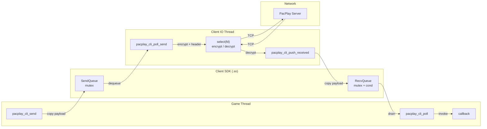
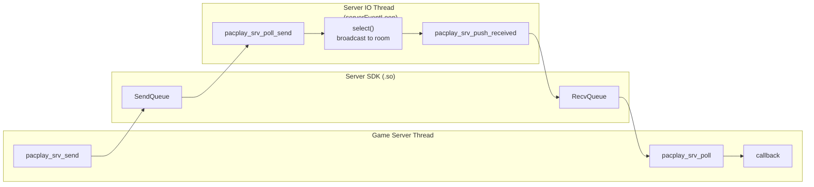

# PacPlay SDK 文档

---

## 1. 概述

PacPlay SDK（`libpacplay_client_sdk.so` / `libpacplay_server_sdk.so`）是面向游戏开发者的 C 语言动态链接库，用于在游戏线程与 PacPlay IO 线程之间提供**线程安全的 Payload 收发桥接**。

### 1.1 SDK 职责边界

| SDK 负责 | SDK 不负责 |
|---------|-----------|
| 线程安全环形缓冲区（mutex + cond） | 网络 I/O |
| 游戏 Payload 的拷贝与传递 | 协议封包/包头构造 |
| 回调注册与触发 | AES-GCM 加密/解密 |
| 资源生命周期管理 | Socket 管理 |

SDK 不持有 socket、不处理加密、不构造 `PacketHeader`。这些由 PacPlay Client/Server 本体的 IO Thread 完成。

### 1.2 两端 SDK

| SDK | 输出文件 | 运行位置 |
|-----|---------|---------|
| Client SDK | `sdk/lib/libpacplay_client_sdk.so` | PacPlay Client 进程 |
| Server SDK | `sdk/lib/libpacplay_server_sdk.so` | PacPlay Server 进程 |

两端 API 完全对称，仅函数名前缀不同（`pacplay_cli_*` vs `pacplay_srv_*`）。

---

## 2. 架构

### 2.1 Client 端



### 2.2 Server 端



### 2.3 数据流

**发送路径**：
1. 游戏线程调用 `pacplay_*_send(data, len)`——SDK 内部 `malloc` + `memcpy` 拷贝 payload
2. IO Thread 调用 `pacplay_*_poll_send()` 取出——IO Thread 负责加密、打包、发送

**接收路径**：
1. IO Thread 收到游戏消息后调用 `pacplay_*_push_received(data, len)`——SDK 内部拷贝
2. 游戏线程每帧调用 `pacplay_*_poll()`——SDK 排空接收队列，对每条消息触发回调

---

## 3. 快速开始

### 3.1 编译 SDK

```bash
cd PacPlay
make sdk
```

输出：
```
sdk/lib/libpacplay_client_sdk.so
sdk/lib/libpacplay_server_sdk.so
```

### 3.2 链接到项目

```makefile
# 链接 Client SDK
LDFLAGS += -Lpath/to/sdk/lib -lpacplay_client_sdk
LDFLAGS += -Wl,-rpath,path/to/sdk/lib

# 链接 Server SDK
LDFLAGS += -Lpath/to/sdk/lib -lpacplay_server_sdk
LDFLAGS += -Wl,-rpath,path/to/sdk/lib
```

编译时需添加 SDK 头文件路径：
```makefile
CFLAGS += -Ipath/to/sdk/include
```

---

## 4. API 参考

### 4.1 公共类型

```c
/* 不透明句柄。由 pacplay_*_create() 分配，由 pacplay_*_destroy() 释放。 */
typedef struct PacPlaySDK PacPlaySDK;

/* 接收回调签名。
 *   payload  — 游戏 payload 数据（SDK 拥有, 回调内只读）
 *   len      — payload 字节长度
 *   userData — pacplay_*_on_receive() 注册的透传指针 */
typedef void (*PacPlayOnReceive)(const void *payload, size_t len,
                                 void *userData);
```

### 4.2 Client SDK API

#### 生命周期

**`PacPlaySDK *pacplay_cli_create(void)`**

创建 Client SDK 实例。内部分配队列和互斥锁。

- **返回**：新句柄，分配失败返回 `NULL`
- **线程**：任意

**`void pacplay_cli_destroy(PacPlaySDK *sdk)`**

销毁实例。排空并释放所有队列中的 payload，销毁互斥锁，释放内存。传入 `NULL` 安全（no-op）。

- **警告**：调用后调用者须将句柄置 `NULL`。重复传入同一已释放指针是未定义行为。
- **线程**：任意

---

#### 游戏线程 API

**`int pacplay_cli_send(PacPlaySDK *sdk, const void *data, size_t len)`**

将游戏 payload 推入发送队列。SDK 内部拷贝数据，调用者可立即释放 `data`。

- **返回**：`0` 成功，`-1` 失败（`sdk == NULL`、`data == NULL`、`len == 0`、`len > 65536`、分配失败）
- **阻塞**：否
- **线程**：游戏线程

**`void pacplay_cli_on_receive(PacPlaySDK *sdk, PacPlayOnReceive callback, void *userData)`**

注册接收回调。回调在 `pacplay_cli_poll()` 中被调用。传入 `callback = NULL` 可清除回调。

- **线程**：游戏线程

**`void pacplay_cli_poll(PacPlaySDK *sdk)`**

排空接收队列，对每条消息调用已注册的回调。应在游戏主循环每帧调用。回调执行期间不持有互斥锁（支持回调内再次调用 SDK 函数）。

- **线程**：游戏线程

---

#### Client IO Thread API

> 仅 PacPlay Client IO Thread 内部调用。游戏开发者不应直接使用。

**`bool pacplay_cli_poll_send(PacPlaySDK *sdk, uint8_t **outPayload, size_t *outLen)`**

从发送队列取出一条待发送的游戏 payload。

- **返回**：`true` 取出成功，`false` 队列空或参数非法
- **释放**：使用后必须调用 `pacplay_cli_free_payload()` 释放 `*outPayload`
- **线程**：Client IO Thread

**`void pacplay_cli_push_received(PacPlaySDK *sdk, const uint8_t *payload, size_t len)`**

将收到的游戏 payload 推入接收队列，供 `pacplay_cli_poll()` 消费。

- **线程**：Client IO Thread

**`void pacplay_cli_free_payload(PacPlaySDK *sdk, uint8_t *payload)`**

释放 `pacplay_cli_poll_send()` 返回的 payload 内存。`payload = NULL` 安全。

- **线程**：Client IO Thread

---

### 4.3 Server SDK API

Server SDK 与 Client SDK API 完全对称，函数名前缀为 `pacplay_srv_`。

| Client SDK | Server SDK | 说明 |
|-----------|-----------|------|
| `pacplay_cli_create()` | `pacplay_srv_create()` | 创建实例 |
| `pacplay_cli_destroy()` | `pacplay_srv_destroy()` | 销毁实例 |
| `pacplay_cli_send()` | `pacplay_srv_send()` | 发送 payload |
| `pacplay_cli_on_receive()` | `pacplay_srv_on_receive()` | 注册回调 |
| `pacplay_cli_poll()` | `pacplay_srv_poll()` | 排空接收队列 |
| `pacplay_cli_poll_send()` | `pacplay_srv_poll_send()` | IO 线程取待发送数据 |
| `pacplay_cli_push_received()` | `pacplay_srv_push_received()` | IO 线程推入接收数据 |
| `pacplay_cli_free_payload()` | `pacplay_srv_free_payload()` | 释放 poll_send 返回的内存 |

行为完全一致，仅前缀不同。

---

## 5. 使用示例

### 5.1 游戏客户端

```c
#include "pacplay_sdk.h"
#include <stdio.h>
#include <string.h>

/* 接收回调：服务器推送的游戏数据 */
static void onGameMessage(const void *payload, size_t len, void *userData) {
    (void)userData;
    printf("[Game] received %zu bytes from server\n", len);
}

int main(void) {
    /* 1. 创建 SDK 实例 */
    PacPlaySDK *sdk = pacplay_cli_create();
    if (sdk == NULL) {
        return 1;
    }

    /* 2. 注册接收回调 */
    pacplay_cli_on_receive(sdk, onGameMessage, NULL);

    /* 3. 游戏主循环 */
    int running = 1;
    while (running) {
        /* 3a. 处理接收到的消息 */
        pacplay_cli_poll(sdk);

        /* 3b. 发送游戏数据 */
        const char *msg = "player_move";
        pacplay_cli_send(sdk, msg, strlen(msg));

        /* 3c. 游戏逻辑 ... */
    }

    /* 4. 清理 */
    pacplay_cli_destroy(sdk);
    sdk = NULL;
    return 0;
}
```

### 5.2 游戏服务端

```c
#include "pacplay_sdk.h"
#include <stdio.h>
#include <string.h>

static void onGameServerMessage(const void *payload, size_t len,
                                void *userData) {
    (void)userData;
    printf("[Server] received %zu bytes from client\n", len);
}

int main(void) {
    PacPlaySDK *sdk = pacplay_srv_create();
    if (sdk == NULL) {
        return 1;
    }

    pacplay_srv_on_receive(sdk, onGameServerMessage, NULL);

    int running = 1;
    while (running) {
        pacplay_srv_poll(sdk);

        const char *state = "world_state";
        pacplay_srv_send(sdk, state, strlen(state));
    }

    pacplay_srv_destroy(sdk);
    sdk = NULL;
    return 0;
}
```

### 5.3 Client IO Thread 集成（PacPlay 内部）

```c
#include "pacplay_sdk.h"
#include "client.h"

/* 在 Client IO Thread 的事件循环中 */
static void *clientEventLoop(void *arg) {
    Client *c = (Client *)arg;
    while (c->running) {
        /* 1. 处理游戏线程提交的发送请求 */
        if (c->sdk != NULL) {
            uint8_t *payload = NULL;
            size_t len = 0;
            while (pacplay_cli_poll_send(c->sdk, &payload, &len)) {
                clientSendEncryptedPacket(c, MsgGamePayload, payload, len);
                pacplay_cli_free_payload(c->sdk, payload);
            }
        }

        /* 2. 接收服务器消息 */
        Packet pkt = {0};
        if (clientRecvEncryptedPacket(c, &pkt) == PROTOCOL_SUCC) {
            if (pkt.header.messageType == MsgGamePayload && c->sdk != NULL) {
                pacplay_cli_push_received(c->sdk, pkt.payload,
                                          pkt.header.payloadLength);
            }
        }
        packetClear(&pkt);
    }
    return NULL;
}
```

### 5.4 Server IO Thread 集成（PacPlay 内部）

```c
/* 在 serverEventLoop 中 */
while (s->running) {
    /* SDK 发送轮询 */
    if (s->sdk != NULL) {
        uint8_t *p = NULL; size_t n = 0;
        while (pacplay_srv_poll_send(s->sdk, &p, &n)) {
            for (int i = 0; i < s->clientCount; i++) {
                if (s->clients[i]->state == SessionChat)
                    serverSendEncryptedPacket(s->clients[i],
                                              MsgGamePayload, p, n);
            }
            pacplay_srv_free_payload(s->sdk, p);
        }
    }

    /* 在 processClient 中收到 MsgGamePayload 时 */
    if (s->sdk != NULL) {
        pacplay_srv_push_received(s->sdk, pkt.payload,
                                  pkt.header.payloadLength);
    }
}
```

---

## 6. 线程安全

### 6.1 调用线程约定

| 函数 | 调用线程 |
|------|---------|
| `pacplay_*_create` | 任意 |
| `pacplay_*_destroy` | 任意（仅一次） |
| `pacplay_*_send` | 游戏线程 |
| `pacplay_*_on_receive` | 游戏线程 |
| `pacplay_*_poll` | 游戏线程 |
| `pacplay_*_poll_send` | IO Thread |
| `pacplay_*_push_received` | IO Thread |
| `pacplay_*_free_payload` | IO Thread |

### 6.2 同步原语

| 数据 | 保护 |
|------|------|
| SendQueue | `pthread_mutex_t sendMutex` |
| RecvQueue | `pthread_mutex_t recvMutex` |
| RecvQueue 通知 | `pthread_cond_t recvCond` |

### 6.3 安全保证

- **非阻塞**：`send`、`poll_send`、`push_received` 均不阻塞
- **回调重入安全**：`poll` 在回调执行前释放 `recvMutex`，回调内可安全调用 `send` 等函数
- **并发 send**：多线程同时 `send` 是安全的
- **并发 push_received**：多线程同时 `push_received` 是安全的

---

## 7. 错误处理

### 7.1 返回值

`pacplay_*_send` 返回 `0`（成功）或 `-1`（失败）。失败原因：

| 条件 | 返回值 |
|------|--------|
| `sdk == NULL` | `-1` |
| `data == NULL` | `-1` |
| `len == 0` | `-1` |
| `len > 65536` | `-1` |
| `malloc` 失败 | `-1` |

`pacplay_*_poll_send` 返回 `false`（队列空或参数非法），`true`（成功取出一条）。

### 7.2 边界条件

| 边界 | 行为 |
|------|------|
| `len = 1` | 正常发送 |
| `len = 65536` | 正常发送（最大值） |
| `len = 65537` | 拒绝（`send` 返回 `-1`，`push_received` 静默丢弃） |
| `len = 0` | 拒绝 |
| 队列为空时 `poll_send` | 返回 `false` |
| 队列为空时 `poll` | no-op |
| 未注册回调时 `poll` | 静默释放数据 |
| `destroy(NULL)` | no-op |

---

## 8. 构建与集成

### 8.1 文件布局

```
sdk/
├── include/
│   └── pacplay_sdk.h         # 公开 C API 头文件
├── lib/                      # 编译输出
│   ├── libpacplay_client_sdk.so
│   └── libpacplay_server_sdk.so
└── src/
    ├── common/
    │   └── pacplay_sdk.c     # 共享实现
    ├── client/
    │   └── pacplay_client_sdk.c
    └── server/
        └── pacplay_server_sdk.c
```

### 8.2 编译命令

```bash
# 仅编译 SDK
make sdk

# 完整编译（含 SDK）
make all
```

### 8.3 依赖

SDK `.so` 仅依赖 `libpthread` 和项目内的 `container.h`（header-only 队列宏），不依赖 PacPlay 的协议/加密/网络模块。
